# Análises Estatísticas Básicas

<div style="background-color: #e6f2ff; border: 1px solid #007acc; padding: 10px; border-radius: 5px;">
A **Estatística** é a ciência que fornece métodos para a coleta, organização,
descrição, análise e interpretação de dados e para a utilização dos mesmos na
tomada de decisões. A coleta, a organização e a descrição dos dados estão a cargo da **Estatística Descritiva**, enquanto que a análise e a interpretação desses dados ficam a cargo da **Estatística Indutiva ou Inferencial**.
</div>

<br> 

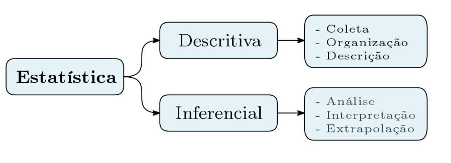

<br> 

O aspecto essencial da Estatística é o de proporcionar métodos inferenciais, que permitam conclusões que transcendam os dados obtidos inicialmente.


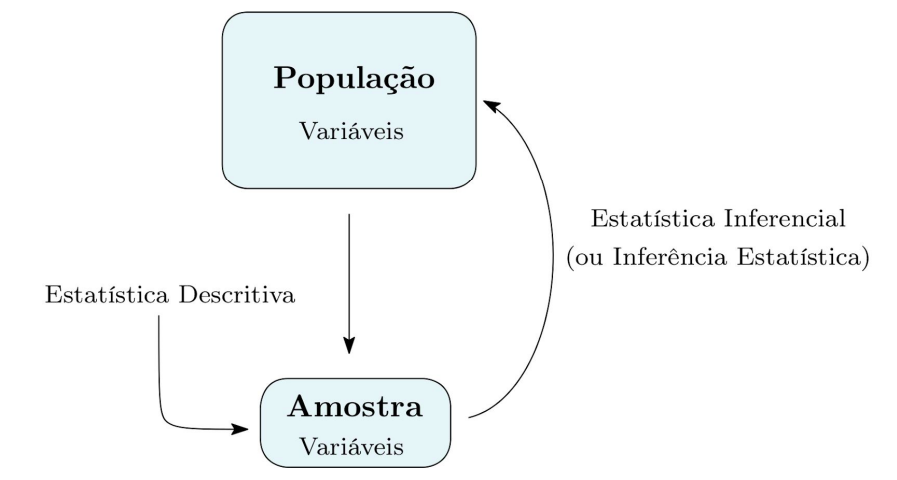

- População: É o conjunto de indivíduos, itens ou observações, portadores de pelo menos uma característica em comum. 
- Amostra: É qualquer subconjunto finito de uma população.
- Variável: São as características de interesse de uma população.

As variáveis se classificam por:

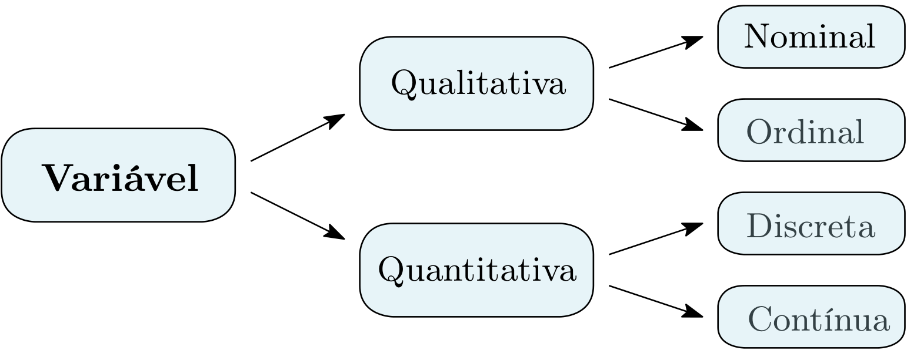

<!-- ```{r estatistica-diagrama, echo=FALSE} -->
<!-- library(DiagrammeR) -->

<!-- grViz(" -->
<!-- digraph estatistica { -->

<!--   graph [layout = dot, rankdir = LR] -->

<!--   node [shape = box, style = filled, fillcolor = '#E6F2F8', fontname = Helvetica] -->

<!--   Estatistica [label = 'Estatística', fontname = Helvetica, fontsize=14, fontcolor=black, style='filled,bold', fillcolor='#E6F2F8'] -->
<!--   Descritiva [label = 'Descritiva'] -->
<!--   Inferencial [label = 'Inferencial'] -->

<!--  DescritivaDetalhes [label = '- Coleta\\n - Organização\\n - Descrição', labeljust = 'l'] -->

<!--   InferencialDetalhes [label = '- Análise\\n- Interpretação\\n- Extrapolação', labeljust = 'l'] -->

<!--   Estatistica -> Descritiva -->
<!--   Estatistica -> Inferencial -->

<!--   Descritiva -> DescritivaDetalhes -->
<!--   Inferencial -> InferencialDetalhes -->
<!-- } -->
<!-- ") -->
<!-- ``` -->


## Análises Descritivas
 
### Tabelas de Frequência

#### Tabelas de Frequência Sem Classes {-}

Utilizadas em geral para representar variáveis qualitativas ou numéricas discretas transformadas em fator.


``` r
## Dados de filmes:
filmes <- tibble::tibble(
  titulo = c("A", "B", "C", "D", "E", "F", "G", "H", "I", "J"),
  ano = c(2020, 2021, 2020, 2021, 2021, 2022, 2022, 2020, 2022, 2021),
  genero = c("Ação", "Comédia", "Ação", "Comédia", "Drama", "Ação", 
             "Drama", "Ação", "Comédia", "Drama"),
  receita = c(100, 200, 150, 180, 90, 300, 120, 80, 220, 70),
  orcamento = c(50, 100, 60, 90, 40, 80, 50, 30, 100, 35),
  nota = c(7.5, 8.2, 7.0, 6.8, 7.9, 7.5, 7.2, 6.5, 8.0, 7.4)
)
```

``` r
## Frequências absolutas
table(filmes$genero)
```

```
## 
##    Ação Comédia   Drama 
##       4       3       3
```

``` r
## Frequências relativas
prop.table(table(filmes$genero))
```

```
## 
##    Ação Comédia   Drama 
##     0.4     0.3     0.3
```


``` r
### Com `dplyr`
## Frequências absolutas
freq_abs <- filmes %>% count(genero)
## Frequências relativas
freq_rel <- freq_abs %>% mutate(freq_relativa = n / sum(n))
```


#### Tabelas de Frequência Com Classes {-}

Utilizadas para representar variáveis contínuas.


``` r
# Definir as classes (intervalos) de notas
breaks <- seq(6, 8.5, by = 0.5)
# Quebrando os dados nas classes
filmes$nota_classes <- cut(filmes$nota, breaks = breaks,
include.lowest = FALSE, right = TRUE)
# include.lowest = FALSE e right = TRUE (default)
# para não incluir o limite inferior e incluir o limite superior.

# Tabela de frequências absolutas com classes
freq_abs_classe <- filmes %>% count(nota_classes) 

# Tabela de frequências relativas com classes
freq_rel_classes <- freq_abs_classe %>% mutate(freq_relativa = n/sum(n))
```

Podemos também calcular as frequências acumuladas:


``` r
## Calcular frequências acumuladas (absolutas e relativas)
freq_acumulada_classes <- freq_rel_classes %>%
  mutate(freq_abs_acum = cumsum(n),  # Frequência absoluta acumulada
  freq_rel_acum = cumsum(freq_relativa))  # Frequência relativa acumulada
# nomes em cumsum referentes aos nomes da tabela freq_rel_classes

# Resultado:
freq_acumulada_classes
```

```
## # A tibble: 5 × 5
##   nota_classes     n freq_relativa freq_abs_acum freq_rel_acum
##   <fct>        <int>         <dbl>         <int>         <dbl>
## 1 (6,6.5]          1           0.1             1           0.1
## 2 (6.5,7]          2           0.2             3           0.3
## 3 (7,7.5]          4           0.4             7           0.7
## 4 (7.5,8]          2           0.2             9           0.9
## 5 (8,8.5]          1           0.1            10           1
```

### Medidas Descritivas

Nos conceitos básicos a seguir, vamos considerar \(x_1, x_2, \dots, x_n\), um conjunto de valores.

#### Medidas de posição {-}

Principais Medidas de Posição:


| Medida          | Descrição                                       | Fórmula / Observações                                                                                         |
|------------------|--------------------------------------------------|---------------------------------------------------------------------------------------------------------------|
| **Média**         | Valor médio dos dados                            | $$ \bar{x} = \frac{1}{n} \sum_{i=1}^{n} x_i $$                                                                |
| **Mediana**       | Valor central de um conjunto ordenado            | Se \(n\) ímpar: \( \tilde{x} = x_{(\frac{n+1}{2})} \) <br> Se \(n\) par: \( \tilde{x} = \frac{x_{(n/2)} + x_{(n/2 + 1)}}{2} \) |
| **Moda**          | Valor mais frequente                             | A moda é o valor que ocorre com maior frequência.                                                            |
| **Quantis**       | Dividem os dados em partes iguais                | Quartis (4), Decis (10), Percentis (100).
| **Mínimo/Máximo** | Valores extremos do conjunto                     | Mínimo: \( \min(x) \), Máximo: \( \max(x) \)                                                                 |

Medidas de posição usando funções básicas do R:


``` r
## Média
mean(filmes$nota)
```

```
## [1] 7.4
```

``` r
## Mediana
median(filmes$nota)
```

```
## [1] 7.45
```

``` r
## Moda - não tem função básica no R
moda <- function(x) {
  tb <- table(x)
  as.numeric(names(tb)[tb == max(tb)])
}
moda(filmes$nota)
```

```
## [1] 7.5
```

``` r
## Mínimo
min(filmes$nota)
```

```
## [1] 6.5
```

``` r
## Máximo
max(filmes$nota)
```

```
## [1] 8.2
```

``` r
## Quantis
  # Quartis - 4 partes iguais
  quantile(filmes$nota)
```

```
##   0%  25%  50%  75% 100% 
## 6.50 7.05 7.45 7.80 8.20
```

``` r
  # Percentis - 100 partes iguais
  # Ex: 10º e 90º percentis
  quantile(filmes$nota, probs = c(0.10, 0.90))
```

```
##  10%  90% 
## 6.77 8.02
```

``` r
## Summary - resume várias medidas dos dados
summary(filmes$nota)
```

```
##    Min. 1st Qu.  Median    Mean 3rd Qu.    Max. 
##    6.50    7.05    7.45    7.40    7.80    8.20
```

Para calcular medidas de alguma variável por categorias de outra, podemos usar a função `aggregate`.
```r
## Sintaxe:
aggregate(formula, data, FUN)
- formula: do tipo variável ~ agrupador
- data: o nome do dataframe
- FUN: a função que será aplicada
```


``` r
## Média da nota por gênero:
aggregate(nota ~ genero, data = filmes, FUN = mean)
```

```
##    genero     nota
## 1    Ação 7.125000
## 2 Comédia 7.666667
## 3   Drama 7.500000
```

``` r
## Média da nota e da receita por gênero
aggregate(cbind(nota, receita) ~ genero, data = filmes, FUN = mean)
```

```
##    genero     nota   receita
## 1    Ação 7.125000 157.50000
## 2 Comédia 7.666667 200.00000
## 3   Drama 7.500000  93.33333
```

``` r
## Média da nota por ano e gênero
aggregate(nota ~ ano + genero, data = filmes, FUN = mean)
```

```
##    ano  genero nota
## 1 2020    Ação 7.00
## 2 2022    Ação 7.50
## 3 2021 Comédia 7.50
## 4 2022 Comédia 8.00
## 5 2021   Drama 7.65
## 6 2022   Drama 7.20
```

``` r
## Outras funções em FUN
aggregate(nota ~ ano + genero, data = filmes, 
          FUN = function(x) c(media = mean(x), n = length(x)))
```

```
##    ano  genero nota.media nota.n
## 1 2020    Ação       7.00   3.00
## 2 2022    Ação       7.50   1.00
## 3 2021 Comédia       7.50   2.00
## 4 2022 Comédia       8.00   1.00
## 5 2021   Drama       7.65   2.00
## 6 2022   Drama       7.20   1.00
```


Medidas de posição usando o pacote `dplyr`:

``` r
## Medidas de Posição das notas
filmes %>%
  summarise(
    media_nota = mean(nota),
    mediana_nota = median(nota),
    moda_nota = moda(nota),
    min_nota = min(nota),
    max_nota = max(nota)
  )
```

```
## # A tibble: 1 × 5
##   media_nota mediana_nota moda_nota min_nota max_nota
##        <dbl>        <dbl>     <dbl>    <dbl>    <dbl>
## 1        7.4         7.45       7.5      6.5      8.2
```

``` r
## Medidas de Posição das notas por categoria de genero
filmes %>%
  group_by(genero) %>%
  summarise(
    media_nota = mean(nota),
    mediana_nota = median(nota),
    min_nota = min(nota),
    max_nota = max(nota),
    n = n(), .groups = "drop")
```

```
## # A tibble: 3 × 6
##   genero  media_nota mediana_nota min_nota max_nota     n
##   <chr>        <dbl>        <dbl>    <dbl>    <dbl> <int>
## 1 Ação          7.12         7.25      6.5      7.5     4
## 2 Comédia       7.67         8         6.8      8.2     3
## 3 Drama         7.5          7.4       7.2      7.9     3
```

``` r
# .groups = "drop": Desfaz o agrupamento após o resumo. 
# Ou seja, você retorna a tabela sem a variável de Groups.
## Medidas de Posição das notas por categoria de ano e genero
filmes %>%
  group_by(ano, genero) %>%
  summarise(
    media_nota = mean(nota),
    mediana_nota = median(nota),
    min_nota = min(nota),
    max_nota = max(nota),
    n = n(), .groups = "drop")
```

```
## # A tibble: 6 × 7
##     ano genero  media_nota mediana_nota min_nota max_nota     n
##   <dbl> <chr>        <dbl>        <dbl>    <dbl>    <dbl> <int>
## 1  2020 Ação          7            7         6.5      7.5     3
## 2  2021 Comédia       7.5          7.5       6.8      8.2     2
## 3  2021 Drama         7.65         7.65      7.4      7.9     2
## 4  2022 Ação          7.5          7.5       7.5      7.5     1
## 5  2022 Comédia       8            8         8        8       1
## 6  2022 Drama         7.2          7.2       7.2      7.2     1
```


#### Medidas de Dispersão {-}

Principais Medidas de Dispersão:

| Medida       | Descrição      | Fórmula / Observações      |
|--------------|-------------------------------------------------|---------------------------------------------------------------------------------------------------|
| **Amplitude Total**            | Diferença entre o maior e o menor valor                | $$ A = \max(x) - \min(x) $$               |
| **Variância**                  | Média dos quadrados dos desvios em relação à média                                  | $$ s^2 = \frac{1}{n - 1} \sum_{i=1}^{n} (x_i - \bar{x})^2 $$ |
| **Desvio-Padrão**             | Raiz quadrada da variância                                                                        | $$ s = \sqrt{s^2} $$                                              |
| **Coeficiente de Variação (CV)** | Dispersão relativa em relação à média, expressa em porcentagem         | $$ CV = \frac{s}{\bar{x}} \times 100\% $$                                                                                 |

Medidas de dispersão usando funções básicas do R:


``` r
## Amplitude Total
diff(range(filmes$nota))
```

```
## [1] 1.7
```

``` r
## Variância
var(filmes$nota)
```

```
## [1] 0.2933333
```

``` r
## Desvio-Padrão
sd(filmes$nota)
```

```
## [1] 0.5416026
```

``` r
## Coeficiente de Variação (CV)
cv <- function(x) sd(x)/mean(x) * 100
cv(filmes$nota)  # Coeficiente de variação (%)
```

```
## [1] 7.318954
```


Medidas de dispersão usando o pacote `dplyr`:

``` r
## Medidas de Posição das notas
filmes %>%
  summarise(
    at_nota = diff(range(filmes$nota)),
    var_nota = var(filmes$nota),
    sd_nota = sd(nota),
    cv_nota = cv(nota)
  )
```

```
## # A tibble: 1 × 4
##   at_nota var_nota sd_nota cv_nota
##     <dbl>    <dbl>   <dbl>   <dbl>
## 1     1.7    0.293   0.542    7.32
```


### Gráficos

#### Gráficos para Variáveis Qualitativas {-}

##### 1. Gráfico de Barras {-}

O gráfico de barras pode ser usado para representar a frequência absoluta de variáveis qualitativas (nominais ou ordinais).


``` r
# Contando as frequências dos generos
freq_genero <- table(filmes$genero)
barplot(freq_genero, 
        main = "Frequência dos generos dos filmes", 
        xlab = "genero", ylab = "frequencias",
        col = "lightblue")
```

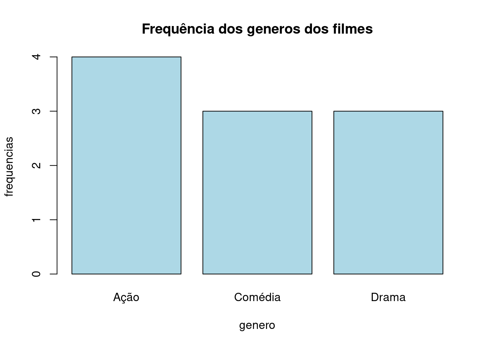

##### 2. Gráfico de Setores {-}

Este gráfico é ideal para representar a distribuição percentual de categorias de uma variável qualitativa. Ele é especialmente útil para mostrar a proporção de cada categoria em relação ao todo.


``` r
pie(freq_genero,
    main = "Distribuição dos generos dos filmes", 
    col = rainbow(length(freq_genero)),
    labels = paste(names(freq_genero), "\n", 
             round(100*freq_genero/sum(freq_genero), 1), "%"))
```

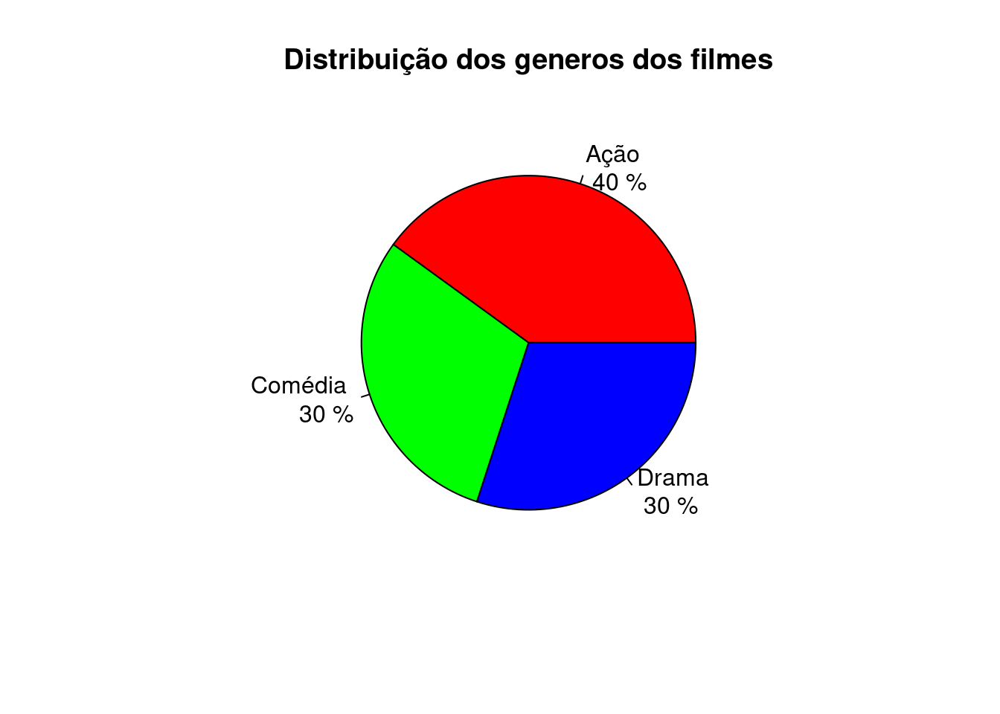

##### 3. Gráfico de Barras Empilhadas {-}

Se você quiser empilhar barras para visualizar a distribuição de uma variável qualitativa em função de outra.


``` r
barplot(table(filmes$genero, filmes$ano), beside = FALSE, 
        col = rainbow(3),
        legend = names(freq_genero), 
        main = "Distribuição do genero por ano",
        xlab = "genero", ylab = "ano")
```

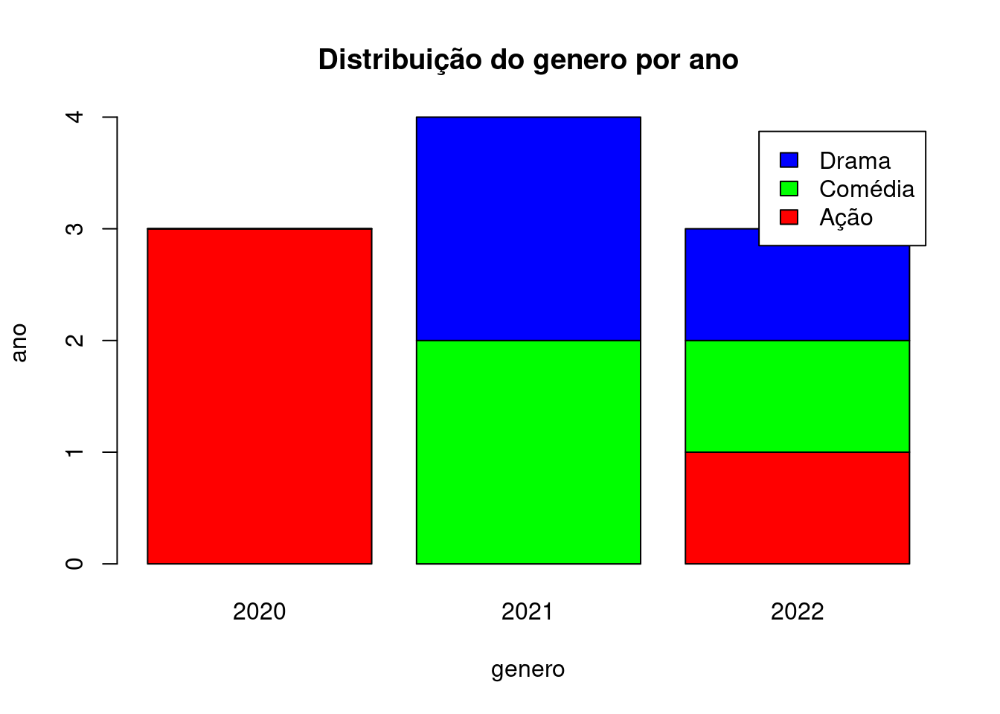


#### Gráficos para Variáveis Quantitativas {-}

##### 1. Gráfico de Dispersão {-}

É utilizado para verificar a relação entre duas variáveis quantitativas.


``` r
plot(filmes$orcamento, filmes$receita, 
     main = "Gráfico de Dispersão para o orçamento", 
     xlab = "Orçamento", ylab = "Receita", 
     col = "blue", pch = 19) # pch = 19 faz os pontos aparecerem como círculos sólidos
```

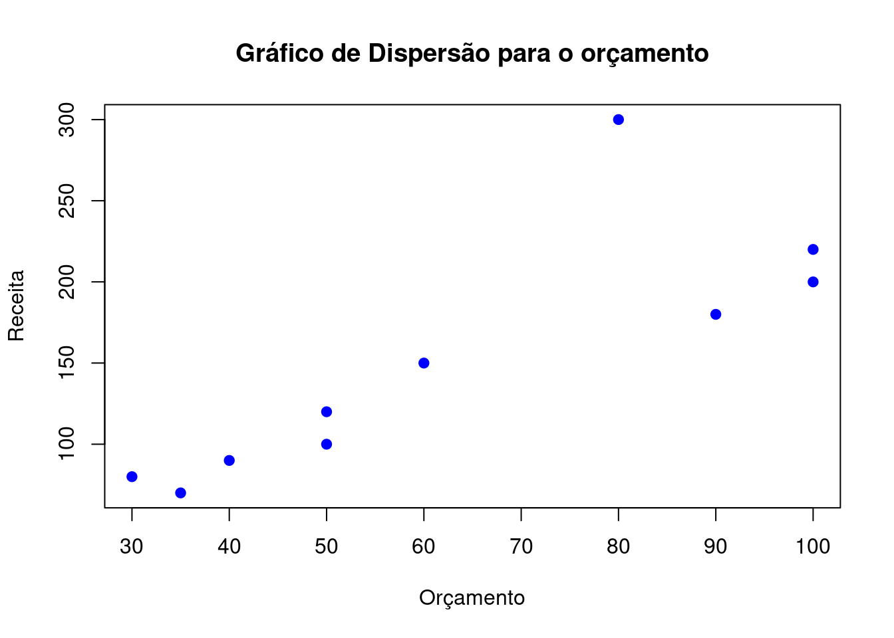


##### 2. Histograma {-}

O histograma é útil para visualizar a distribuição de variáveis quantitativas contínuas.

``` r
# usando breaks, criado anteriormente:
breaks <- seq(6, 8.5, by = 0.5)

hist(filmes$nota, 
     col = "orange", 
     main = "Histograma das notas", 
     xlab = "Classes de notas", ylab = "Frequência", 
     breaks = breaks) # O argumento breaks define o número de intervalos
```

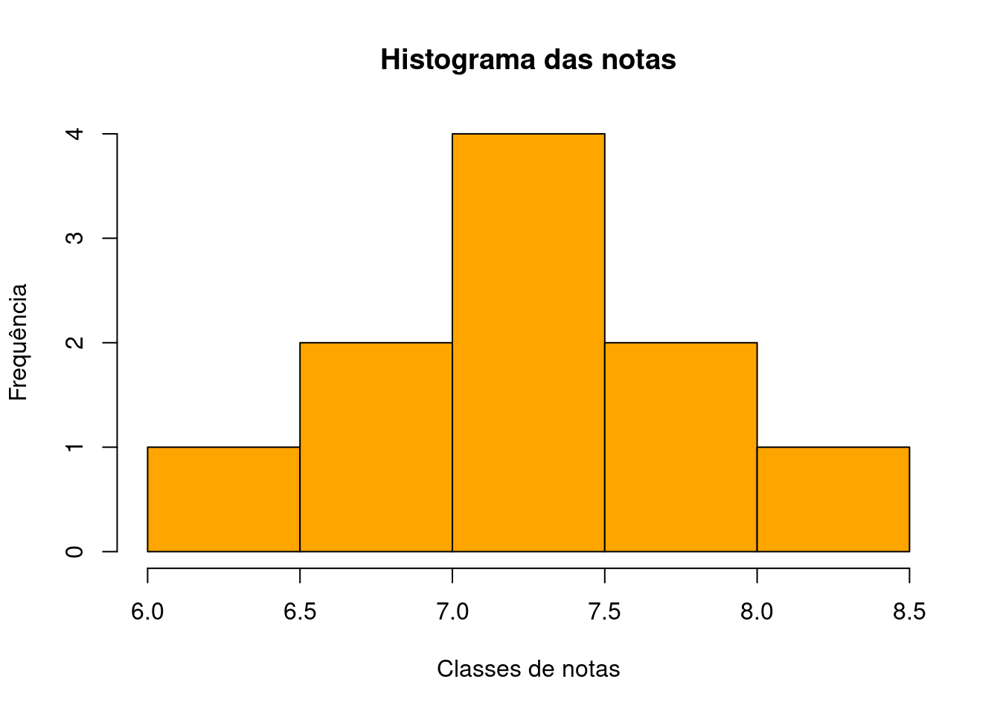


##### 3. Boxplot {-}
O boxplot é útil para visualizar a distribuição de uma variável quantitativa e identificar outliers.


``` r
boxplot(filmes$nota, 
        main = "Boxplot das notas",
        ylab = "Notas", 
        col = "lightgreen")
```

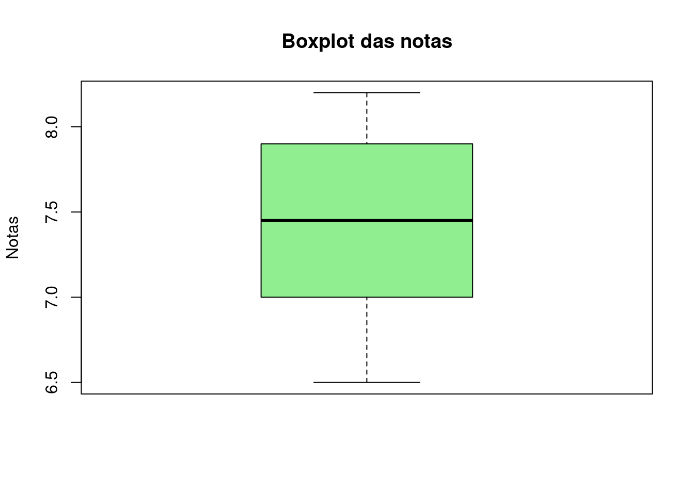

O boxplot também pode ser usado para ver o comportamento de uma variável quantitativa por categorias de outra variável.

``` r
boxplot(nota ~ genero, data = filmes, 
        xlab = "Genero", 
        ylab = "Notas", 
        col = "lightgreen")
```


Adicionando as informações das médias também no gráfico:

``` r
boxplot(nota ~ genero, data = filmes, 
        xlab = "Genero", 
        ylab = "Notas", 
        col = "lightgreen")
# Calculando as médias por genero
medias <- tapply(filmes$nota, filmes$genero, mean, na.rm = TRUE)
# Adicionando as médias no gráfico
points(x = 1:length(medias), y = medias, 
       col = "black", pch = 19, cex = 1) 
```

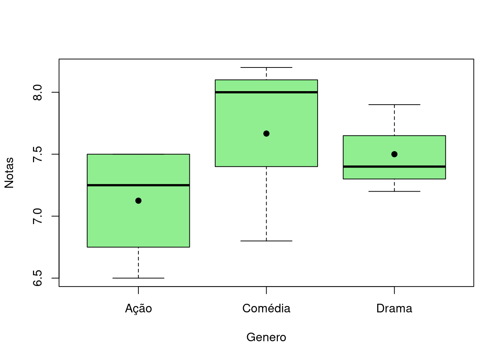

``` r
# pch -> formato do objeto
# cex -> tamanho do objeto
```


#### Exercícios {-}

**1.** Considere a variável a seguir representando o número de filhos de 30 famílias:


``` r
filhos <- c(0, 1, 2, 2, 3, 1, 0, 2, 1, 3, 2, 2, 0, 1, 2, 3, 2, 4, 1, 2, 1, 0, 
            2, 2, 3, 1, 2, 0, 1, 2)
```

a. Usando o pacote `dplyr`, construa uma tabela com as frequências absolutas, relativas e acumuladas.
b. Calcule, com `dplyr`, as medidas de posição e dispersão: média, mediana, moda, mínimo, máximo, quartis, amplitude total, variância, desvio padrão e coeficiente de variação.
c. Construa um gráfico de dispersão que mostre a frequência absoluta de cada valor distinto de filhos.
d. Personalize o gráfico: altere o título, os nomes dos eixos e a cor dos pontos.


**2.** Considere o vetor a seguir com salários mensais (em mil R$) de um grupo de pessoas:


``` r
salarios <- c(2.5, 3.2, 2.8, 4.1, 5.5, 6.0, 7.3, 3.0, 2.7, 6.5, 5.9, 2.6, 
              3.4, 4.0, 6.2, 4.5, 3.6, 5.0)
```

a. Agrupe os salários em intervalos de classe iniciando em 2, com amplitude 1 (aberto à esquerda e fechado à direita) usando `cut()` e construa uma tabela com as frequências absolutas, relativas e acumuladas com `dplyr`.
b. Calcule as medidas de posição e dispersão dos salários usando `dplyr`.
c. Construa um histograma dos salários.
d. Personalize o histograma: modifique as cores, o título e os nomes dos eixos.

**3.** Utilize o conjunto de dados `mtcars`, já disponível no R:


``` r
data(mtcars)
```

a. Para a variável `mpg` (milhas por galão), construa uma tabela com as frequências absolutas, relativas e acumuladas agrupando os dados em intervalor de classe de amplitude 5.
b. Calcule as medidas de posição e dispersão da variável `mpg`.
c. Construa um boxplot de `mpg` por número de cilindros (`cyl`).
d. Personalize o gráfico: modifique cores, título, nomes dos eixos e adicione bordas aos boxplots.

**4.** Considere os dados agrupados para a variável X: Nº de atendimentos diários:

Table: (\#tab:unnamed-chunk-26)Tabela de Frequência para a variável X: nº de atendimentos diários

|  X| Frequência|
|--:|----------:|
| 10|          2|
| 12|          5|
| 14|          7|
| 16|          9|
| 18|          4|
| 20|          3|

Com base nessa tabela:

a. Calcule as seguintes medidas: média, mediana, mínimo e máximo,
amplitude total, desvio padrão e coeficiente de variação (CV).
b. Construa o gráfico de dispersão da frequência de atendimentos.
c. Personalize o gráfico anterior com título, nomes nos eixos e cor dos pontos.

<div id="protectedContent1" style="display:none;">

### Respostas {-}
```r
## 1. Número de filhos
filhos <- c(0, 1, 2, 2, 3, 1, 0, 2, 1, 3, 2, 2, 0, 1, 2, 3, 2, 4, 1, 2, 1, 0, 
            2, 2, 3, 1, 2, 0, 1, 2)
# a. Tabela de frequências
tabela_freq <- data.frame(
  filhos = sort(unique(filhos))
) %>%
  mutate(
    freq_abs = as.numeric(table(filhos)),
    freq_rel = freq_abs / sum(freq_abs),
    freq_acum = cumsum(freq_abs)
  )
# b. Medidas de posição e dispersão
summary_stats <- tibble::tibble(filhos = filhos) %>%
  summarise(
    media = mean(filhos),
    mediana = median(filhos),
    moda = as.numeric(names(table(filhos))[table(filhos) == max(table(filhos))]),
    minimo = min(filhos),
    maximo = max(filhos),
    Q1 = quantile(filhos, 0.25),
    Q3 = quantile(filhos, 0.75),
    amplitude = max(filhos) - min(filhos),
    variancia = var(filhos),
    desvio_padrao = sd(filhos),
    cv = sd(filhos) / mean(filhos) * 100
  )
# c. Gráfico de dispersão das frequências
plot(tabela_freq$filhos, tabela_freq$freq_abs,
     main = "Frequência de número de filhos",
     xlab = "Número de filhos",
     ylab = "Frequência absoluta",
     col = "blue", pch = 19)
# d. Personalização do gráfico
plot(tabela_freq$filhos, tabela_freq$freq_abs,
     main = "Distribuição de Filhos por Família",
     xlab = "Filhos",
     ylab = "Frequência Absoluta",
     col = "darkred", pch = 17)
## 2. Salários
salarios <- c(2.5, 3.2, 2.8, 4.1, 5.5, 6.0, 7.3, 3.0, 2.7, 6.5, 5.9, 2.6, 
              3.4, 4.0, 6.2, 4.5, 3.6, 5.0)
# a. Tabela de frequência com classes
breaks = seq(2, 8, by = 1)
classes <- cut(salarios, breaks = breaks, right = TRUE)
tabela_sal <- data.frame(classe = levels(classes)) %>%
  mutate(
    freq_abs = as.numeric(table(classes)),
    freq_rel = freq_abs / sum(freq_abs),
    freq_acum = cumsum(freq_abs)
  )
# b. Medidas de posição e dispersão
moda_sal <- as.numeric(names(sort(table(salarios), decreasing = TRUE)[1]))
tibble(salarios) %>%
  summarise(
    media = mean(salarios),
    mediana = median(salarios),
    moda = moda_sal,
    minimo = min(salarios),
    maximo = max(salarios),
    Q1 = quantile(salarios, 0.25),
    Q3 = quantile(salarios, 0.75),
    amplitude = max(salarios) - min(salarios),
    variancia = var(salarios),
    desvio_padrao = sd(salarios),
    cv = sd(salarios) / mean(salarios) * 100
  )
# c. Histograma
hist(salarios, col = "lightblue", main = "Histograma dos Salários", 
xlab = "Salário (mil R$), breaks = breaks))
# d. Personalização do histograma
hist(salarios, col = "darkgreen", border = "white",
     main = "Distribuição de Salários", xlab = "Salário (R$ mil)",
     breaks = breaks))
## 3. mtcars – Consumo (mpg)
data(mtcars)
# a. Frequência de mpg por classes de largura 5
classes_mpg <- cut(mtcars$mpg, breaks = seq(10, 35, by = 5), right = FALSE)
tabela_mpg <- data.frame(classe = levels(classes_mpg)) %>%
  mutate(
    freq_abs = as.numeric(table(classes_mpg)),
    freq_rel = freq_abs / sum(freq_abs),
    freq_acum = cumsum(freq_abs)
  )
tabela_mpg
# b. Medidas de posição e dispersão de mpg
tibble(mpg = mtcars$mpg) %>%
  summarise(
    media = mean(mpg),
    mediana = median(mpg),
    minimo = min(mpg),
    maximo = max(mpg),
    Q1 = quantile(mpg, 0.25),
    Q3 = quantile(mpg, 0.75),
    amplitude = max(mpg) - min(mpg),
    variancia = var(mpg),
    desvio_padrao = sd(mpg),
    cv = sd(mpg) / mean(mpg) * 100
  )
# c. Boxplot por número de cilindros
boxplot(mpg ~ cyl, data = mtcars)
# d. Personalização do boxplot
boxplot(mpg ~ cyl, data = mtcars,
        col = c("lightblue", "lightgreen", "tomato"),
        main = "Consumo por Nº de Cilindros",
        xlab = "Cilindros", ylab = "Milhas por Galão",
        border = "black")
```

</div>

<input type="password" id="passwordInput1" placeholder="Digite a senha">
<button id="submitButton1">Acesso Professor</button>


<script>

document.getElementById("submitButton1").addEventListener("click", function()
{
  var password = document.getElementById("passwordInput1").value;
  var correctPassword = "0987";

  if (password === correctPassword)
  {
    document.getElementById("protectedContent1").style.display = "block";
  }else
  {
    alert("Senha incorreta! Tente novamente.");
  }
});
</script>

----

## Probabilidade

<div class="alert alert-info"> <strong>O que são Probabilidades em Modelos Estatísticos?</strong> Probabilidades em modelos estatísticos nos permitem calcular a chance de ocorrência de eventos em distribuições teóricas. Esses modelos são fundamentais para inferência estatística e testes de hipóteses.</div>

### Principais Modelos Discretos

#### 1. Distribuição Binomial {-}

**Notação:** $X \sim B(n,p)$

**Função de Probabilidade:** 
$$
P(X = k) = \binom{n}{k} p^k (1 - p)^{n - k}, \quad \text{para} \quad k = 0, 1, \dots, n
$$
**Média e Variância:** $E(X)=np$ e $Var(X)=np(1-p)$


**Parâmetros no R:** `size = n` (número de tentativas), `prob = p` (probabilidade de sucesso em cada tentativa)

**Funções no R:**
```r
## Probabilidades
# P(X = k): Probabilidade do valor X=k
dbinom(k, size, prob)

# P(X ≤ k): Probabilidade acumulada até o valor X=k
pbinom(k, size, prob, lower.tail = TRUE) # equialente a sum(dbinom(0:k, size, prob))

# P(X > k): Probabilidade maior do que o valor X=k
1 - pbinom(k, size, prob)

## Geração de números aleatórios
rbinom(n, size, prob)
```
**Exemplos:**

``` r
# Seja X ~ B(n=5, p=0.2). Então,
# 1. P(X=2)
dbinom(2, size = 5, prob = 0.2)
```

```
## [1] 0.2048
```

``` r
# 2. P(X ≤ 1) = P(X=0) + P(X=1) 
dbinom(0, size = 5, prob = 0.2) + dbinom(1, size = 5, prob = 0.2)
```

```
## [1] 0.73728
```

``` r
# ou
pbinom(1, size = 5, prob = 0.2)
```

```
## [1] 0.73728
```

``` r
# 3. P(X>1)
1-pbinom(1, size = 5, prob = 0.2)
```

```
## [1] 0.26272
```

``` r
# ou
pbinom(1, size = 5, prob = 0.2, lower.tail = F)
```

```
## [1] 0.26272
```


**Gráfico:**

``` r
x <- 0:20
plot(x, dbinom(x, size=20, prob=0.5), type="h", lwd=2, 
     main="Distribuição Binomial (n=20, p=0.5)",
     xlab="Número de sucessos", ylab="Probabilidade")
```

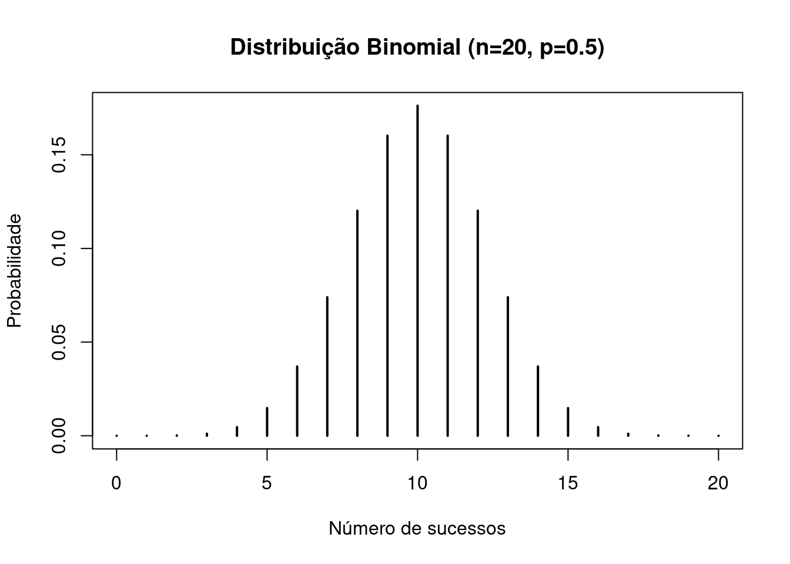


#### 2. Distribuição Poisson {-}

**Notação:** $X \sim Poisson(\lambda)$

**Função de Probabilidade:** 
$$
P(X = k) = \frac{e^{-\lambda}\lambda^x}{x!}, \quad \text{para} \quad x \ge 0
$$

**Média e Variância:** $E(X)=\lambda$ e $Var(X)=\lambda$

**Parâmetros no R:** `lambda` = $\lambda$

**Funções no R:**
```r
## Probabilidades
# P(X = k): Probabilidade do valor X=k
dpois(k, lambda, log = FALSE)

# P(X ≤ k): Probabilidade acumulada até o valor X=k
ppois(k, lambda, lower.tail = TRUE) # equialente a sum(dpois(0:k, lambda))

# P(X > k): Probabilidade maior do que o valor X=k
1 - ppois(k, lambda)

## Geração de números aleatórios
rpois(n, lambda)
```
**Exemplos:**

``` r
# Seja X ~ Poisson(λ = 3). Então,
# 1. P(X=1)
dpois(1, lambda = 3)
```

```
## [1] 0.1493612
```

``` r
# 2. P(X > 1) = 1 - P(X ≤ 1) = 1 - [P(X=0) + P(X=1)]
1 - (dpois(0, lambda = 3) + dpois(1, lambda = 3))
```

```
## [1] 0.8008517
```

``` r
# ou
ppois(1, lambda = 3, lower.tail = F)
```

```
## [1] 0.8008517
```


**Gráfico:**

``` r
x <- 0:10
plot(x, dpois(x, lambda = 3), type="h", lwd=2, 
     main="Distribuição Poisson (lambda = 3)",
     xlab="Valores de X", ylab="Probabilidade")
```

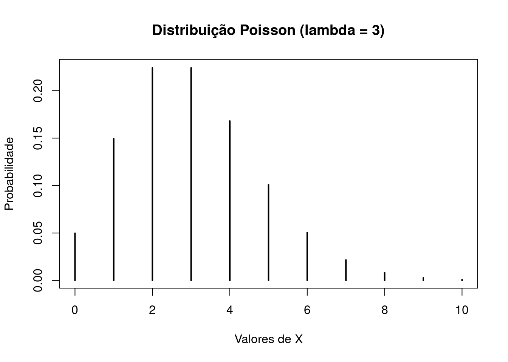


### Principais Modelos Contínuos

#### 1. Distribuição Uniforme Contínua {-}

**Notação:** $X \sim U_c(a,b)$

**Função de Densidade de Probabilidade:**
$$
f(x)=\frac{1}{b-a}, \quad \text{para} \quad x\in [a,b]
$$

**Média e Variância:** $E(X)=\frac{(a+b)}{2}$ e $Var(X)=\frac{(b-a)^2}{12}$

**Parâmetros no R:** `min` = $a$ e `max` = $b$ 

**Funções no R:**
```r
## Probabilidades
# f(x): Valor da função densidade em x
dunif(x, min, max, log = FALSE)

# P(X ≤ x): Probabilidade acumulada até o valor x
punif(x, min, max, lower.tail = TRUE)

# P(X > k): Probabilidade maior do que o valor x
1 - punif(x, min, max)

## Geração de números aleatórios
runif(n, min, max)

## Quantis
qunif(p, min, max, lower.tail = TRUE)
```
**Exemplos:**

``` r
# Seja X ~ Uc(1,5). Então,
# 1. P(X ≤ 2)
punif(2, min = 1, max = 5)
```

```
## [1] 0.25
```

``` r
# 2. P(X > 3)
punif(3, min = 1, max = 5, lower.tail = FALSE)
```

```
## [1] 0.5
```

``` r
# 3. Gerando 10 valores desta distribuição:
runif(10, min = 1, max = 5)
```

```
##  [1] 3.172445 4.140052 1.238825 2.394911 2.442272 4.477338 2.734282 2.830490
##  [9] 3.396331 2.945658
```

``` r
# 4. O valor x tal que P(X ≤ x) = 0,25
qunif(0.25, min = 1, max = 5)
```

```
## [1] 2
```

**Gráfico:**

``` r
curve(dunif(x, 1, 5), from = 1, to = 5,
      col = "blue", lwd = 2,
      ylab = "Densidade", xlab = "x")
```

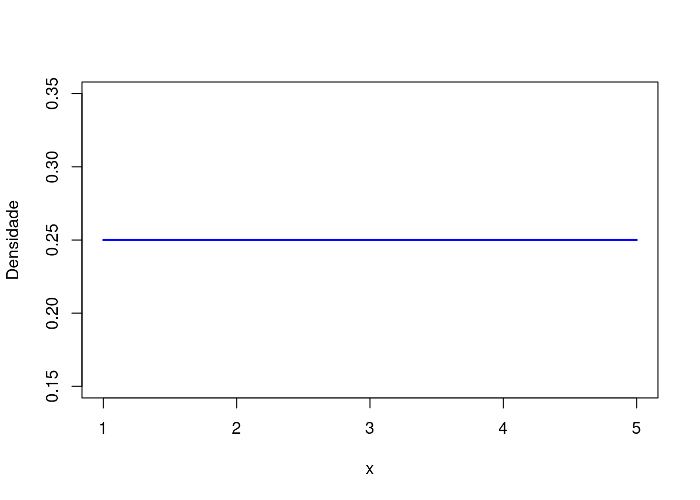


#### 2. Distribuição Normal {-}

**Notação:** $X \sim N(\mu, \sigma^2)$

**Função de Densidade de Probabilidade:**
$$
f(x) = \frac{1}{\sqrt{2\pi\sigma^2}} e^{-\frac{1}{2}\left(\frac{x - \mu}{\sigma} \right)^2}
$$


**Média e Variância:** $E(X)=\mu$ e $Var(X)=\sigma^2$, desvio-padrão: $\sigma = \sqrt{\sigma^2}$

**Parâmetros no R:** `mean` = $\mu$ (média), `sd` = $\sigma$ (desvio-padrão)

**Funções no R:**
```r
## Probabilidades
# f(x): Valor da função densidade em x
dnorm(x, mean, sd, log = FALSE)

# P(X ≤ x): Probabilidade acumulada até o valor x
pnorm(x, mean, sd, lower.tail = TRUE) 

# P(X > k): Probabilidade maior do que o valor x
1 - pnorm(x, mean, sd) # equivalente a
pnorm(x, mean, sd, lower.tail = FALSE) 

## Geração de números aleatórios
rnorm(n, mean, sd)

## Quantis
qnorm(p, mean = 0, sd = 1, lower.tail = TRUE)
```
**Exemplos:**

``` r
# Seja X ~ N(μ=10, σ²=4). Então,
# 1. P(X ≤ 8)
pnorm(8, mean = 10, sd = 2)
```

```
## [1] 0.1586553
```

``` r
# 2. P(X > 10)
pnorm(10, mean = 10, sd = 2, lower.tail = FALSE)
```

```
## [1] 0.5
```

``` r
# 3. Gerando 10 valores desta distribuição:
rnorm(10, mean = 10, sd = 2)
```

```
##  [1] 16.319764 10.756069  8.309122 13.541884 12.372114  9.234301  9.054929
##  [8]  8.949988 11.632288  9.261122
```

``` r
# 4. O valor x tal que P(X ≤ x) = 0,25
qnorm(0.25, mean = 10, sd = 2)
```

```
## [1] 8.65102
```

Um caso particular da distribuição Normal é quando $\mu=0$ e $\sigma = 1$. Neste caso, dizemos que $Z \sim N(0,1)$ e a chamamos de distribuição Normal Padrão.

**Gráfico:**


``` r
curve(dnorm(x, mean = 10, sd = 2), from = -5, to = 15, 
      col = "blue", lwd = 2, ylim = c(0,0.5), ylab = "Distribuições Normais")
curve(dnorm(x), from = -5, to = 5, add = TRUE, lwd = 2, 
      col = "red")
legend("topright", legend = c("Normal padrão: N(0,1)", "N(10,4)"),
       col = c("red", "blue"), lty = c(1, 1), lwd = 2)
```

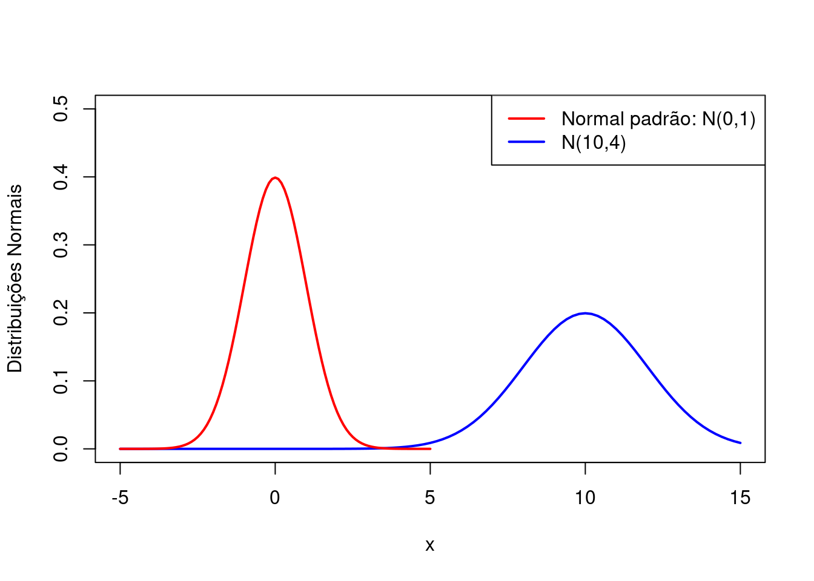


Podemos transformar uma variável $X \sim N(\mu, \sigma^2)$ em uma Normal Padrão, fazendo:
$$
Z = \frac{X-\mu}{\sigma} \sim N(0,1) 
$$


#### 3. Distribuição t-Student {-}

**Notação:** $X \sim t_v$

**Média e Variância:** $E(X)=0$ e $Var(X)=\frac{v}{v-2}$, se $v > 2$.

**Parâmetros no R:** `df` = $v$ (graus de liberdade)

**Funções no R:**
```r
## Probabilidades
# f(x): Valor da função densidade em x
dt(x, df, log = FALSE)

# P(X ≤ x): Probabilidade acumulada até o valor x
pt(x, df, lower.tail = TRUE)

# P(X > k): Probabilidade maior do que o valor x
1 - pt(x, df)

## Geração de números aleatórios
rt(n, df)

## Quantis
qt(p, df, lower.tail = TRUE)
```
**Exemplos:**

``` r
# Seja X ~ t(5). Então,
# 1. P(X ≤ 4)
pt(4, df = 5)
```

```
## [1] 0.9948383
```

``` r
# 2. P(X > 4.5)
pt(4.5, df = 5, lower.tail = FALSE)
```

```
## [1] 0.003199768
```

``` r
# 3. Gerando 10 valores desta distribuição:
rt(10,  df = 5)
```

```
##  [1] -0.18976740 -0.75734103  0.59444170 -0.78430969 -1.02580205  0.66903545
##  [7] -0.56771799  1.30611665  0.05472948 -0.80836038
```

``` r
# 4. O valor x tal que P(X ≤ x) = 0,25
qt(0.25,  df = 5)
```

```
## [1] -0.7266868
```

**Obs.:** Quando `df` aumenta, a distribuição t-student se aproxima da distribuição N(0,1).

**Gráfico:**

``` r
curve(dt(x, df = 3), from = -5, to = 5,
      col = "blue", lwd = 2, ylim = c(0,0.4),
      ylab = "Densidade", xlab = "t")
curve(dt(x, df = 7), from = -5, to = 5,
      col = "purple", lwd = 2, add = TRUE)
curve(dt(x, df = 30), from = -5, to = 5,
      col = "green", lwd = 2, add = TRUE)
curve(dnorm(x), from = -5, to = 5, col = "red", lwd = 2, add = TRUE)

legend("topright", legend = c("t (df = 3)", "t (df = 7)", 
                              "t (df = 30)", "N(0,1)"),
       col = c("blue", "purple", "green", "red"), lwd = 2)
```

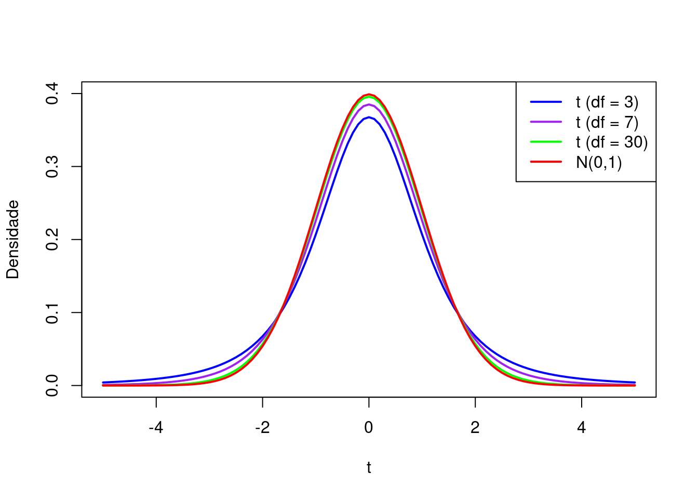

**Tabela de Referência Rápida**

| Distribuição| Probabilidades | Quantil  | Números Aleatórios|	
|--------------|---------------|----------|----------------|
|   Binomial  | dbinom() ou pbinom() | qbinom() |	rbinom()    |  
|   Poisson  | dpois() ou ppois() | qpois() |	rpois()    |   
|   Uniforme  | punif()  | qunif()  |	runif()     |  
|    Normal   | pnorm()  | qnorm()  |	rnorm()     | 
|   t-Student | pt()	   | qt()     | rt()        |  

#### Exercícios {-}

**1.** Numa distribuição $B(n=15, p=0,4)$, calcule:

a. P(X = 7)
b. P(X ≤ 5)
c. P(X > 10)

**2.** Para $X \sim N(100, 10)$, calcule:

a. P(X ≤ 110)
b. P(90 < X ≤ 105)
c. O valor x, tal que P(X ≤ x) = 0,95

**3.** Gere 20 valores das seguintes distribuições:

a. $B(n=20, p=0,25)$
b. $N(\mu=50, \sigma^2=25)$
c. $U_c(0,1)$
t. $t_{(7)}$

**4.** Para as distribuições a seguir, encontre os quartis (Q1 e Q3):

a. $N(\mu=10, \sigma^2=25)$
c. $U_c(2,10)$
t. $t_{(20)}$


<div id="protectedContent2" style="display:none;">

### Respostas {-}
```r
## 1.
# Parâmetros
n <- 15; p <- 0.4
# a) P(X = 7)
dbinom(7, size=n, prob=p)
# b) P(X ≤ 5)
pbinom(5, size=n, prob=p)
# c) P(X > 10) = 1 - P(X ≤ 10)
1 - pbinom(10, size=n, prob=p)
## 2. 
# a) P(X ≤ 110)
media <- 100; desvio <- 10
pnorm(110, mean=media, sd=desvio)
# b) P(90 < X ≤ 105) = P(X ≤ 105) - P(X ≤ 90)
pnorm(105, mean=media, sd=desvio) - pnorm(90, mean=media, sd=desvio)
# c) Valor de x tal que P(X ≤ x) = 0.95
qnorm(0.95, mean=media, sd=desvio)
## 3.
set.seed(123) # Para reprodutibilidade
# a) Binomial (n=20, p=0.25)
rbinom(20, size=20, prob=0.25)
# b) Normal (μ=50, σ=5)
rnorm(20, mean=50, sd=5)
# c) Uniforme (0,1)
runif(20, min=0, max=1)
# d) t-student(7)
rt(20, df=7)
## 4.
# a) Normal (μ=10, σ=5)
q1_normal <- qnorm(0.25, mean=10, sd=5)
q3_normal <- qnorm(0.75, mean=10, sd=5)
# b) Uniforme (2,10)
q1_uniforme <- qunif(0.25, min=2, max=10)
q3_uniforme <- qunif(0.75, min=2, max=10)
# c) t-student(20)
q1_t <- qt(0.25, df=20)
q3_t <- qt(0.75, df=20)
```

</div>

<input type="password" id="passwordInput2" placeholder="Digite a senha">
<button id="submitButton2">Acesso Professor</button>


<script>

document.getElementById("submitButton2").addEventListener("click", function()
{
  var password = document.getElementById("passwordInput2").value;
  var correctPassword = "0987";

  if (password === correctPassword)
  {
    document.getElementById("protectedContent2").style.display = "block";
  }else
  {
    alert("Senha incorreta! Tente novamente.");
  }
});
</script>

----


## Análises Inferenciais


<div class="alert alert-info"> <strong>Inferência Estatística</strong> Conjunto de técnicas utilizadas para tirar conclusões sobre determinada(s) característica(s) da população, a partir de informações colhidas de uma amostra.</div>

<div style="display: flex; justify-content: center;">
  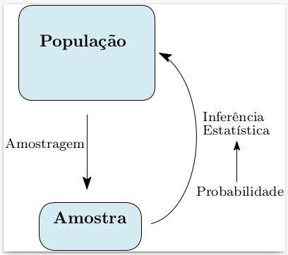
  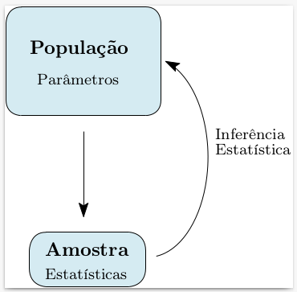
</div>

Para a distribuição Normal:

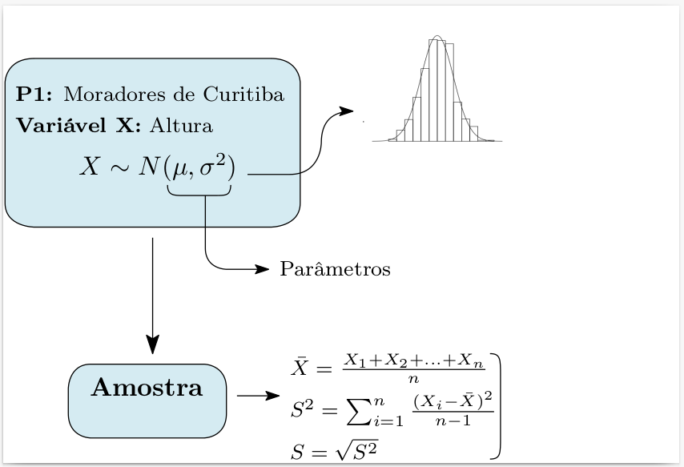


### Intervalo de Confiança

<div class="alert alert-info"> <strong>Intervalo de Confiança</strong> São utilizados na estatística para encontrar limites que contenham alguma probabilidade conhecida de conter o valor do parâmetro</div>

De modo geral, seja $\theta$ o parâmetro de interesse, então o intervalo de confiança para $\theta$ com probabilidade $1 − \alpha$ (nível de confiança) é:
$$
IC(θ,(1 − α)) = [Li; Ls]
$$
onde:

- $P(Li ≤ θ ≤ Ls) = 1 − α$
- Li → limite inferior do intervalo;
- Ls → limite superior do intervalo;

#### Intervalo de Confiança: média $µ$ de uma população Normal {-}
$$
IC(µ,(1 − α)) = [\bar{X} − e; \bar{X} + e]
$$

**Se $σ^2$ conhecida:** 

- $e = z\frac{s}{\sqrt{n}}$
- $z$ é tal que $P(Z ≥ z) = \frac{\alpha}{2}$. no R: `qnorm(1-α/2)`


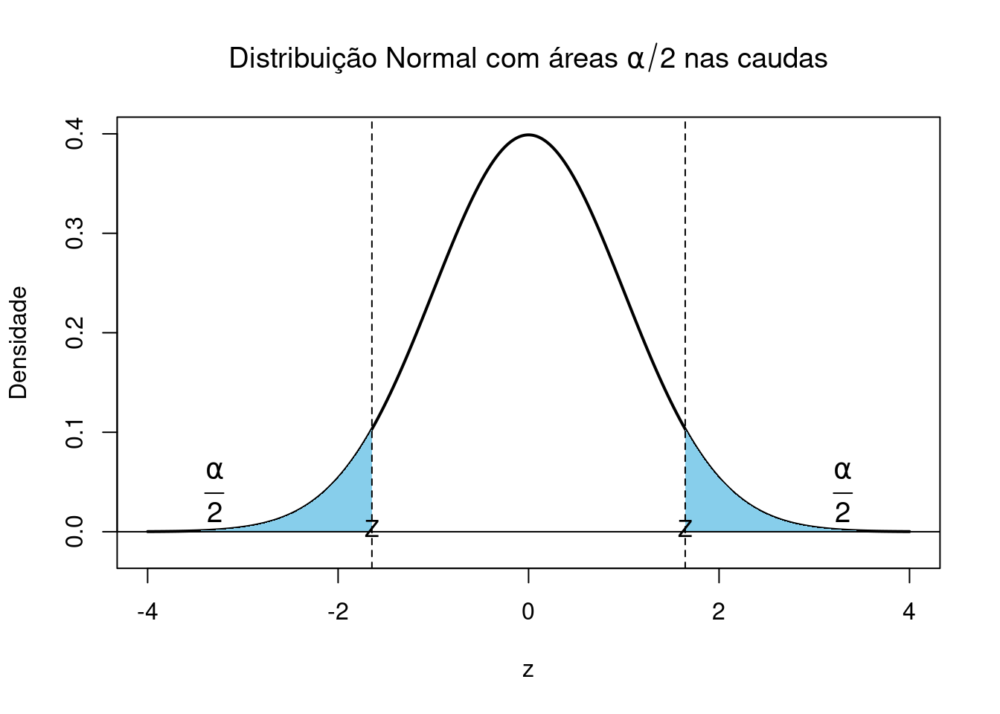


**Se $σ^2$ desconhecida:** 

- $e = t_{(n-1)}\frac{s}{\sqrt{n}}$
- $t$ é tal que $P(t ≥ t_{(n-1)}) = \frac{\alpha}{2}$. no R: `qt(1-α/2, df = n-1)`


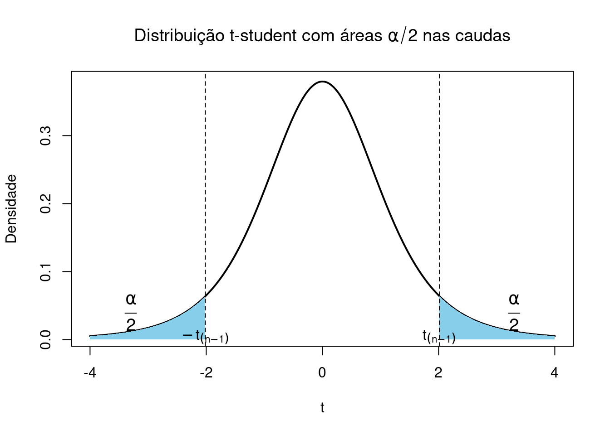

**Exemplo:**

Uma amostra de 8 clientes de um banco apresentou os seguintes tempos (em minutos) para completar um atendimento: 12, 15, 14, 13, 16, 14, 15, 13
Assumindo que o tempo de atendimento tem distribuição normal, construa um intervalo de confiança de 95% para a média populacional.

``` r
## Dados
x <- c(12, 15, 14, 13, 16, 14, 15, 13)
## Nivel de confiança
# 1-alpha = 0.95
alpha = 1-0.95
## Informações da Amostra
n <- length(x)       # Tamanho da amostra
media <- mean(x)     # Média amostral
desvio <- sd(x)      # Desvio padrão amostral
erro <- desvio / sqrt(n)   # Erro padrão da média

## Valor crítico da t com n - 1 graus de liberdade
t_critico <- qt(1-alpha/2, df = n - 1)  

## Limites do intervalo de confiança
limite_inferior <- media - t_critico * erro
limite_superior <- media + t_critico * erro
cbind(limite_inferior, limite_superior)
```

```
##      limite_inferior limite_superior
## [1,]        12.90539        15.09461
```

Usando o pacote `DescTools`:

``` r
# Instalar se ainda não tiver
# install.packages("DescTools")
# Carregar
library(DescTools)

x <- c(12, 15, 14, 13, 16, 14, 15, 13)

# Intervalo de confiança de 95%
MeanCI(x, conf.level = 0.95)
```

```
##     mean   lwr.ci   upr.ci 
## 14.00000 12.90539 15.09461
```

### Testes de Hipóteses


<div class="alert alert-info"> <strong>Testes de Hipóteses</strong> Ferramenta usada na estatística para verificar alguma informação sobre um parâmetro.</div>

Etapas básicas num teste de hipóteses:

- Formulação das hipóteses
- Cálculo da Estatística Teste
- Região Crítica ou p-valor
- Conclusão

Seja $\mu$ a altura média de uma população (parâmetro) sobre o qual
queremos verificar uma afirmação (testar uma hipótese). Queremos verificar se $\mu$ é igual a uma quantidade fixada, por exemplo,
se $\mu$ é igual a 180. Então, formulamos as hipóteses:

- Hipótese nula (H0): é a hipótese que estamos colocando à prova.
- Hipótese alternativa (H1): é a hipótese que será considerada aceitável, caso a hipótese nula seja rejeitada.

Neste caso,

- H₀: µ = 180 
- H₁: µ ≠ 180


Qualquer que seja a decisão tomada, estamos sujeitos a cometer erros:

- Erro de tipo I: Rejeitar a hipótese nula quando essa é verdadeira.
$$
α = P(\text{Erro Tipo I}) = P(\text{Rejeitar } H_0|H_0 \text{ é verdadeira})
$$
- Erro de tipo II: Não rejeitar a hipótese nula quando essa é falsa.
$$
β = P(\text{Erro Tipo II}) = P(\text{Não rejeitar } H_0|H_0 \text{ é falsa})
$$

A probabilidade α é também chamada de **nível de significância** e é geralmente fixada em 10%, 5% ou 1%.


#### Tipos de Hipóteses para µ: {-}
Comparando µ com algum valor hipotético µ₀:

| Hipótese  | Bilateral  | Unilateral esquerda | Unilateral direita |
|----------------|----------------|------------------------|-----------------------|
| H₀               | µ = µ₀        | µ ≥ µ₀                | µ ≤ µ₀               |
| H₁               | µ ≠ µ₀        | µ < µ₀                | µ > µ₀               |


#### Teste de Hipótese para µ (com σ² desconhecida) {-}

**Estatística Teste:**
$$
T_0 = \frac{\bar{X}-\mu_0}{S/\sqrt{n}}
$$

**Usando a Região Crítica:**

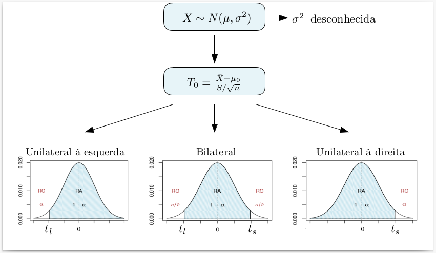

**Usando o p-valor:**

O p-valor é a probabilidade de obter um resultado tão extremo (ou mais extremo) quanto o observado nos dados, assumindo que a hipótese nula (H₀) é verdadeira. Em outras palavras, mede quão compatíveis os dados estão com H₀.

- Teste unilateral à direita: p-valor = $P(T > T_0)$.
- Teste unilateral à esquerda: p-valor = $P(T < T_0)$.
- Teste bilateral: p-valor = $2P(T > |T_0|)$.

<!-- ```{r valor-p-grafico, echo=FALSE, fig.align="center", fig.width=10, fig.height=4, warning=FALSE, message=FALSE} -->
<!-- # library(ggplot2) -->
<!-- # library(gridExtra) -->
<!-- #  -->
<!-- # # Função para gerar o gráfico de valor-p -->
<!-- # plot_pvalor <- function(tipo = "bilateral", t_obs = 2.2, df = 20) { -->
<!-- #   x <- seq(-4, 4, length.out = 500) -->
<!-- #   y <- dt(x, df) -->
<!-- #   data <- data.frame(x = x, y = y) -->
<!-- #  -->
<!-- #   p <- ggplot(data, aes(x, y)) + -->
<!-- #     geom_line(color = "black") + -->
<!-- #     theme_minimal() + -->
<!-- #     theme(axis.text = element_blank(), -->
<!-- #           axis.title = element_blank(), -->
<!-- #           axis.ticks = element_blank()) + -->
<!-- #     geom_hline(yintercept = 0) -->
<!-- #  -->
<!-- #   if (tipo == "bilateral") { -->
<!-- #     p <- p + -->
<!-- #       geom_area(data = subset(data, x <= -abs(t_obs)), aes(y = y), fill = "red", alpha = 0.3) + -->
<!-- #       geom_area(data = subset(data, x >= abs(t_obs)), aes(y = y), fill = "red", alpha = 0.3) + -->
<!-- #       geom_vline(xintercept = c(-abs(t_obs), abs(t_obs)), linetype = "dashed", color = "red") + -->
<!-- #       ggtitle("Bilateral") -->
<!-- #   } else if (tipo == "direita") { -->
<!-- #     p <- p + -->
<!-- #       geom_area(data = subset(data, x >= abs(t_obs)), aes(y = y), fill = "red", alpha = 0.3) + -->
<!-- #       geom_vline(xintercept = abs(t_obs), linetype = "dashed", color = "red") + -->
<!-- #       ggtitle("Unilateral à direita") -->
<!-- #   } else if (tipo == "esquerda") { -->
<!-- #     p <- p + -->
<!-- #       geom_area(data = subset(data, x <= -abs(t_obs)), aes(y = y), fill = "red", alpha = 0.3) + -->
<!-- #       geom_vline(xintercept = -abs(t_obs), linetype = "dashed", color = "red") + -->
<!-- #       ggtitle("Unilateral à esquerda") -->
<!-- #   } -->
<!-- #  -->
<!-- #   return(p) -->
<!-- # } -->
<!-- #  -->
<!-- # g1 <- plot_pvalor("esquerda") -->
<!-- # g2 <- plot_pvalor("bilateral") -->
<!-- # g3 <- plot_pvalor("direita") -->
<!-- #  -->
<!-- # grid.arrange(g1, g2, g3, nrow = 1) -->
<!-- ``` -->

**Conclusão:**
Se $T_0 \in RC$ ou $p-valor \le \alpha$, rejeitamos a hipótese nula. Ou seja, existem evidências amostrais de que a média é diferente de $\mu_0$ (ou maior/menor, dependendo do teste).


**Exemplo: Tempo de Resposta de um Servidor** 

Um provedor afirma que seu servidor responde, em média, em até 200 ms. Um analista de desempenho quer verificar se o tempo de resposta médio real é maior que isso. Ele coleta uma amostra de 12 requisições, obtendo os tempos de resposta em milissegundos:


``` r
tempos <- c(210, 198, 203, 215, 220, 205, 199, 211, 208, 202, 219, 217)
```

**Hipóteses:**

- H₀: μ ≤ 200 ms (o tempo de resposta está dentro do prometido)
- H₁: μ > 200 ms (o tempo de resposta é maior que o prometido)

**No R:**

``` r
### Teste t unilateral à direita
# Considerando alpha = 5%
tempos <- c(210, 198, 203, 215, 220, 205, 199, 211, 208, 202, 219, 217)

## Estatística Teste
n <- length(tempos)
t0 <- (mean(tempos) - 200)/(sd(tempos)/sqrt(n))

## Região crítica
alpha = 0.05
ts=qt(1-alpha, df = n-1)
t0 > ts # rejeita H0
```

```
## [1] TRUE
```

``` r
## p-valor
p_valor <- pt(t0, df = n-1, lower.tail = F)

## No R:
t.test(tempos, mu = 200, alternative = "greater",
       conf.level = 1-alpha)
```

```
## 
## 	One Sample t-test
## 
## data:  tempos
## t = 4.0216, df = 11, p-value = 0.001005
## alternative hypothesis: true mean is greater than 200
## 95 percent confidence interval:
##  204.9348      Inf
## sample estimates:
## mean of x 
##  208.9167
```

**Conclusão:** Como p-valor < 5%, rejeitamos H₀. Existem evidências amostrais de que o tempo de resposta médio do servidor é maior que 200 ms.


**Exemplo: Tempo Médio Diário em Redes Sociais entre Universitários**

Pesquisas indicam que jovens universitários passam, em média, 3 horas por dia em redes sociais. Um pesquisador suspeita que esse valor mudou recentemente, devido ao aumento de conteúdo acadêmico e profissional nas plataformas.

Ele coleta dados de 10 estudantes de uma universidade local:


``` r
tempos <- c(3.5, 3.8, 2.9, 3.3, 4.0, 2.7, 3.2, 3.6, 2.8, 3.1)
```

**Hipóteses:**

- H₀: μ = 3.0 horas
- H₁: μ ≠ 3.0 horas (teste bilateral, para verificar se houve mudança)


``` r
### Teste t bilateral
# Considerando alpha = 5%
tempos <- c(3.5, 3.8, 2.9, 3.3, 4.0, 2.7, 3.2, 3.6, 2.8, 3.1)

## Estatística Teste
n <- length(tempos)
t0 <- (mean(tempos) - 3)/(sd(tempos)/sqrt(n))

## Região crítica
alpha <- 0.05
ti <- qt(alpha/2, df = n-1)
ts <- -ti
t0 < ti || t0 > ts # Não rejeita H0
```

```
## [1] FALSE
```

``` r
## p-valor
p_valor <- 2*pt(abs(t0), df = n-1, lower.tail = F)

## No R:
t.test(tempos, mu = 3, alternative = "two.sided",
       conf.level = 1-alpha)
```

```
## 
## 	One Sample t-test
## 
## data:  tempos
## t = 2.1169, df = 9, p-value = 0.06335
## alternative hypothesis: true mean is not equal to 3
## 95 percent confidence interval:
##  2.980104 3.599896
## sample estimates:
## mean of x 
##      3.29
```


**Conclusão:** Como p-valor > 5%, não rejeitamos H₀. Existem evidências amostrais de que o tempo médio diário gasto em redes sociais pelos estudantes é de 3h.


#### Exercícios {-}

**1.** Um estudo afirma que o escore médio de ansiedade de jovens universitários (medido por um questionário validado) é 40 pontos. Um psicólogo deseja verificar se, em sua universidade, os estudantes apresentam um nível diferente de ansiedade.


``` r
scores <- c(43, 39, 45, 41, 38, 42, 46, 40, 44, 43, 47, 41)
```

**a.** Calcule o intervalo de confiança de 95% para a média do escore de ansiedade.

**b.** Teste as hipóteses (Use α = 0,05):

  - H₀: μ = 40
  - H₁: μ ≠ 40

**2.** Estudos indicam que jovens usam o celular por cerca de 5 horas diárias. Um pesquisador quer saber se esse valor aumentou com a popularização dos vídeos curtos.


``` r
horas <- c(5.2, 5.5, 6.1, 5.8, 6.4, 6.0, 5.7, 5.9, 6.3, 5.6)
```

**a.** Calcule o intervalo de confiança de 95% para o tempo médio diário de uso.

**b.** Teste as hipóteses (Use α = 0,05):

- H₀: μ ≤ 5
- H₁: μ > 5

**3.** Em uma escala de 0 a 10, a média nacional de satisfação com o ensino remoto foi 6. Um professor quer saber se seus alunos estão mais satisfeitos que a média nacional.

``` r
notas <- c(6.5, 7.2, 7.0, 6.8, 7.5, 7.1, 6.9, 7.3)
```

**a.** Estime o IC de 90% para a média de satisfação dos alunos.

**b.** Teste as hipóteses (Use α = 0,10):

  - H₀: μ ≤ 6
  - H₁: μ > 6


<div id="protectedContent3" style="display:none;">

### Respostas {-}
```r
library(DescTools)
## 1. 
# a.
scores <- c(43, 39, 45, 41, 38, 42, 46, 40, 44, 43, 47, 41)
alpha = 0.05
n <- length(scores)
# Intervalo de confiança de 95%
MeanCI(scores, conf.level = 1-alpha)
# ou
Li <- mean(scores) - qt(1-alpha/2, df = n-1)*sd(scores)/sqrt(n)
Ls <- mean(scores) + qt(1-alpha/2, df = n-1)*sd(scores)/sqrt(n)
# b. 
# Estatística Teste
mu0 <- 40
t0 <- (mean(scores) - mu0)/(sd(scores)/sqrt(n))
# p-valor
p_valor <- 2*pt(abs(t0), df = n-1, lower.tail = F)
# No R:
t.test(scores, mu = mu0, alternative = "two.sided",
       conf.level = 1-alpha)
## 2. 
# a.
horas <- c(5.2, 5.5, 6.1, 5.8, 6.4, 6.0, 5.7, 5.9, 6.3, 5.6)
alpha = 0.05
n <- length(horas)
# Intervalo de confiança de 95%
MeanCI(horas, conf.level = 1-alpha)
# ou
Li <- mean(horas) - qt(1-alpha/2, df = n-1)*sd(horas)/sqrt(n)
Ls <- mean(horas) + qt(1-alpha/2, df = n-1)*sd(horas)/sqrt(n)
# b. 
# Estatística Teste
mu0 <- 5
t0 <- (mean(horas) - mu0)/(sd(horas)/sqrt(n))
# p-valor
p_valor <- pt(t0, df = n-1, lower.tail = F)
# No R:
t.test(horas, mu = mu0, alternative = "greater",
       conf.level = 1-alpha)
## 3. 
# a.
notas <- c(6.5, 7.2, 7.0, 6.8, 7.5, 7.1, 6.9, 7.3)
alpha = 0.10
n <- length(notas)
# Intervalo de confiança de 95%
MeanCI(notas, conf.level = 1-alpha)
# ou
Li <- mean(notas) - qt(1-alpha/2, df = n-1)*sd(notas)/sqrt(n)
Ls <- mean(notas) + qt(1-alpha/2, df = n-1)*sd(notas)/sqrt(n)
c(Li,Ls)
# b. 
# Estatística Teste
mu0 <- 5
t0 <- (mean(notas) - mu0)/(sd(notas)/sqrt(n))
# p-valor
p_valor <- pt(t0, df = n-1, lower.tail = F)
# No R:
t.test(notas, mu = mu0, alternative = "greater",
       conf.level = 1-alpha)
```

</div>

<input type="password" id="passwordInput3" placeholder="Digite a senha">
<button id="submitButton3">Acesso Professor</button>


<script>

document.getElementById("submitButton3").addEventListener("click", function()
{
  var password = document.getElementById("passwordInput3").value;
  var correctPassword = "0987";

  if (password === correctPassword)
  {
    document.getElementById("protectedContent3").style.display = "block";
  }else
  {
    alert("Senha incorreta! Tente novamente.");
  }
});
</script>


#### Exercícios do Capítulo 5 <span style="color:red">(Entregar na lista 1)</span>  {-}

Considerando o conjunto de dados a seguir, apresente as funções no R necessárias para os cálculos dos itens solicitados:

**a.** Transforme as variáveis Curso e Genero em fatores cujos níveis são ordenados (em ordem decrescente) pela frequência.

**b.** Construa uma tabela de frequências absoluta, relativa e absoluta acumulada para a variável Curso. Faça o mesmo para a variável Gênero.

**c.** Construa uma tabela de frequências absoluta, relativa e absoluta acumulada (com classes) para a variável Tempo_Estudo. Considere classes iniciando em 6, com amplitude intervalar 4.

**d.** Calcule: média, mediana, variância, desvio padrão e coeficiente de variação para as variáveis Tempo_Estudo e Nota_Final.

**e.** Construa os gráficos a seguir (coloridos e com nomes nos eixos):

  - Histograma (com densidades no eixo das ordenadas e amplitude do item (c)) para a variável Tempo_Estudo.
  - Boxplot para a variável Tempo_Estudo por Curso.
  - Gráficos de barras para as variáveis Curso e Genero.
  - Diagrama de dispersão entre as variáveis Tempo_Estudo e Nota_Final.
  
**f.** Estime os intervalos de confiança de 95% para as médias de: Tempo_Estudo e Nota_Final.

**g.** Teste as hipóteses (com conclusão) para o tempo médio de estudo (Use α = 0.05):

  - H₀: μ = 12
  - H₁: μ ≠ 12
  
**h.** Teste as hipóteses (com conclusão) para o nota média final (Use α = 0.05):

  - H₀: μ ≤ 6.5
  - H₁: μ > 6.5

**i.** Interprete os principais resultados observados nas analises anteriores.


Table: (\#tab:unnamed-chunk-54)Conjunto de Dados Simulado

| ID|Curso |Genero | Tempo_Estudo| Nota_Final|
|--:|:-----|:------|------------:|----------:|
|  1|FI    |M      |           12|        7.5|
|  2|SI    |M      |           10|        6.8|
|  3|FI    |F      |           15|        8.0|
|  4|SI    |M      |            8|        6.2|
|  5|EC    |M      |           20|        9.1|
|  6|EC    |M      |           11|        7.2|
|  7|EC    |M      |            7|        5.5|
|  8|SI    |F      |           18|        8.8|
|  9|EC    |M      |           13|        7.0|
| 10|FI    |F      |            9|        6.4|
| 11|SI    |M      |           16|        8.0|
| 12|SI    |F      |           17|        8.5|
Legenda:

- SI = Sistemas de Informação
- EC = Engenharia da Computação
- FI = Física

