# Gráficos e visualização de dados 

A visualização de dados é fundamental na análise estatística, permite visualizar relações e padrões que podem ser relevantes para o conjunto de dados.

## Gráficos básicos com graphics

Considere os dados `mtcars`.

**1.** plot(): Dispersão, linhas, etc.

``` r
plot(x = mtcars$wt, y = mtcars$mpg,        # dados
     main = "Consumo vs Peso",             # título principal
     xlab = "Peso do carro", ylab = "MPG", # rótulos dos eixos
     col = "blue", pch = 19, cex = 1.2)    # cor, tipo e tamanho dos pontos
```

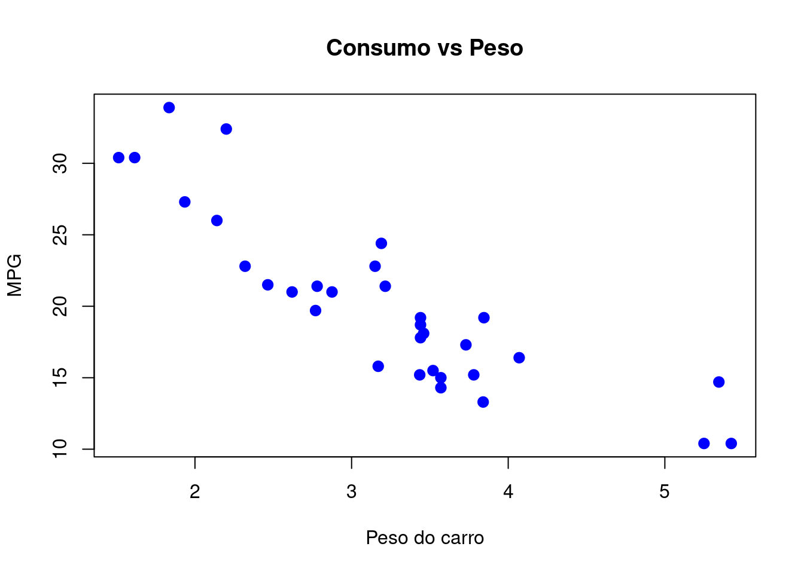

- type = "p" (pontos), "l" (linhas), "b" (pontos + linhas), "n" (nada)
- pch = símbolo do ponto (1 a 25 ou letras, ex: "*"), cex = tamanho
- col = cor, aceita nomes ou códigos hexadecimais


**2.** hist(): Histograma

``` r
hist(mtcars$mpg,
     main = "Distribuição de MPG",
     xlab = "MPG",
     col = "lightblue", border = "white",
     breaks = 10)
```


- breaks: número de bins
- freq = FALSE: mostra densidade em vez de contagem

**3.** boxplot(): Boxplots

``` r
boxplot(mpg ~ cyl, data = mtcars,
        main = "MPG por número de cilindros",
        xlab = "Cilindros", ylab = "MPG",
        col = c("lightgreen", "lightblue", "pink"))
```

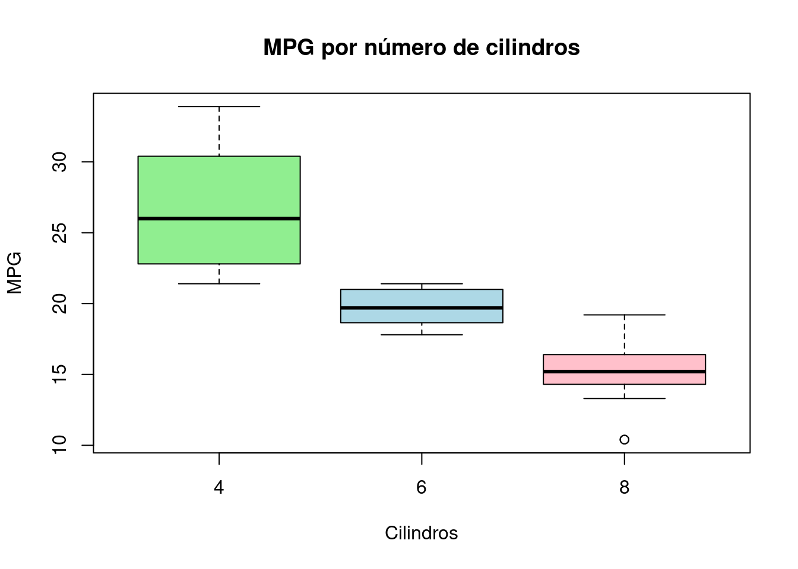

- Fórmulas permitem separar por grupos
- Pode usar horizontal = TRUE

**4.** barplot(): Barras

``` r
counts <- table(mtcars$cyl)
barplot(counts,
        main = "Frequência de Cilindros",
        col = "orange", border = NA)
```


- Também aceita valores contínuos
- Pode usar horiz = TRUE para barras horizontais

#### Personalizações gerais: {-}

**Títulos e eixos**

- main, sub, xlab, ylab: título principal, subtítulo, rótulos dos eixos
- xlim, ylim: limites dos eixos, ex: xlim = c(0, 10)
- axes = FALSE: remove eixos (útil para desenhar personalizados com axis())

**Cores e símbolos**

- col: cor dos pontos, barras, etc.
- pch: tipo de ponto (0 a 25), também pode usar "*" ou "+"
- cex: tamanho do símbolo
- lty, lwd: tipo e espessura de linha

**Funções auxiliares úteis**

- abline(h = ...) ou abline(v = ...): adiciona linhas horizontais/verticais
- text(x, y, labels): adiciona texto manualmente
- legend("topright", legend = ..., col = ..., pch = ...): adiciona legenda
- par(mfrow = c(2,2)): permite múltiplos gráficos em uma janela

**Exemplo:**

``` r
par(mfrow = c(2, 2))  # 2x2 gráficos
plot(mtcars$wt, mtcars$mpg,
     main = "MPG vs Peso", xlab = "Peso", ylab = "MPG",
     col = "darkgreen", pch = 16)
hist(mtcars$mpg, main = "Histograma de MPG", 
     freq = F, breaks = 5, col = "lightblue")
boxplot(mpg ~ cyl, data = mtcars, 
        main = "MPG por cilindros", 
        col = "lightgreen", horizontal = T)
barplot(table(mtcars$gear), main = "Contagem de marchas", 
        col = "salmon", horiz = T)
```


**Exemplo:**

``` r
# Dados de exemplo
x <- mtcars$wt     # peso
y <- mtcars$mpg    # milhas por galão

# Gráfico básico com várias personalizações
plot(x, y,
     type = "p",                        # tipo de gráfico: pontos
     main = "MPG vs Peso do carro",     # título principal
     sub = "Dados do conjunto mtcars",  # subtítulo
     xlab = "Peso (1000 lbs)",          # rótulo do eixo x
     ylab = "Milhas por galão (MPG)",   # rótulo do eixo y
     xlim = c(1.5, 5.5),                # limites do eixo x
     ylim = c(10, 35),                  # limites do eixo y
     col = "blue", pch = 19, cex = 1.2, # cor, tipo e tamanho dos pontos
     axes = FALSE                       # remove eixos para desenhar manualmente
)

# Adicionando eixos personalizados
axis(1, at = seq(2, 5, by = 0.5)) # eixo x com marcações
axis(2, las = 1)                  # eixo y com rótulos na horizontal
# O eixo é colocado da seguinte forma: 
# 1=abaixo, 2=esquerda, 3=acima e 4=direita.
box()                                   
# desenha a caixa ao redor do gráfico

# Adicionando linhas de referência
abline(h = 20, col = "red", lty = 2, lwd = 2)  
# linha horizontal em y = 20
abline(v = 3.5, col = "darkgreen", lty = 3, lwd = 2)  
# linha vertical

# Adicionando texto no gráfico
text(x = 3.8, y = 33, labels = "Alto consumo", 
     col = "purple", cex = 0.9)

# Adicionando legenda
legend("topright",
       legend = c("Carros", "MPG = 20", "Peso = 3.5"),
       col = c("blue", "red", "darkgreen"),
       pch = c(19, NA, NA),
       lty = c(NA, 2, 3),
       lwd = c(NA, 2, 2),
       bty = "n")  # sem borda na legenda
```


#### Exercícios {-}

**1.** Considerando o conjunto de dados `mtcars` disponível no R, crie um gráfico de dispersão entre wt (peso) e mpg (milhas por galão) do dataset mtcars, com os seguintes elementos:

- Título: "Relação entre peso e consumo"
- Eixo X: "Peso (1000 lbs)"
- Eixo Y: "Consumo (milhas/galão)"

**2.** Utilize o mesmo gráfico do exercício anterior, mas agora:

- Defina os limites do eixo X entre 1 e 6
- Defina os limites do eixo Y entre 10 e 35
- Use pch = 16 para pontos preenchidos
- Desative os eixos automáticos e crie eixos personalizados com axis()

**3.** Usando o mesmo gráfico do exercício anterior, mas agora:

- Adicione uma linha horizontal em mpg = 20
- Adicione uma linha vertical em wt = 3

**4.** Ainda no gráfico anterior:

- Adicione o nome dos carros ao lado dos pontos com text()
- Use pos = 4 para colocar o texto à direita dos pontos

**5.** Crie um gráfico de dispersão entre hp (potência) e mpg, com:

- Cores diferentes para carros com 4, 6 e 8 cilindros (use cyl)
- Uma legenda explicando as cores
- Título: "Consumo vs Potência por número de cilindros"

**6.** Crie uma visualização com 4 gráficos diferentes em uma janela 2x2:

- plot(mpg ~ wt)
- hist(mtcars$mpg)
- boxplot(mpg ~ cyl)
- plot(density(mtcars$mpg))


<div id="protectedContent1" style="display:none;">

### Respostas {-}

```r
## 1.
plot(mtcars$wt, mtcars$mpg,
     main = "Relação entre peso e consumo",
     xlab = "Peso (1000 lbs)",
     ylab = "Consumo (milhas/galão)")
## 2.
plot(mtcars$wt, mtcars$mpg,
     xlim = c(1, 6),
     ylim = c(10, 35), pch = 16,
     axes = FALSE,  # remove eixos automáticos
     xlab = "Peso", ylab = "Consumo",
     main = "Eixos personalizados")
# Eixo inferior (x)
axis(1, at = seq(1, 6, by = 1))
# Eixo esquerdo (y)
axis(2, at = seq(10, 35, by = 5))
# Caixa ao redor do gráfico
box()
## 3.
plot(mtcars$wt, mtcars$mpg,
     pch = 16,
     xlab = "Peso",
     ylab = "Consumo",
     main = "Linhas de referência")
# Linha horizontal em mpg = 20
abline(h = 20, col = "red", lty = 2)
# Linha vertical em wt = 3
abline(v = 3, col = "darkgreen", lty = 2)
## 4. 
plot(mtcars$wt, mtcars$mpg,
     pch = 16,
     xlab = "Peso",
     ylab = "Consumo",
     main = "Identificando os carros")
text(mtcars$wt, mtcars$mpg, 
     labels = rownames(mtcars), 
     pos = 4, cex = 0.7)  # pos = 4 coloca à direita
## 5.
# Criar vetor de cores com base nos cilindros
cores <- ifelse(mtcars$cyl == 4, "blue",
         ifelse(mtcars$cyl == 6, "green", "red"))
plot(mtcars$hp, mtcars$mpg,
     col = cores, pch = 16,
     xlab = "Potência (hp)",
     ylab = "Consumo (mpg)",
     main = "Consumo vs Potência por número de cilindros")
legend("topright", legend = c("4 cilindros", "6 cilindros",
                              "8 cilindros"),
       col = c("blue", "green", "red"),
       pch = 16)
## 6. 
par(mfrow = c(2, 2))  # layout 2x2
plot(mtcars$wt, mtcars$mpg)
hist(mtcars$mpg)
boxplot(mpg ~ cyl, data = mtcars)
plot(density(mtcars$mpg))
```

</div>

<input type="password" id="passwordInput1" placeholder="Digite a senha">
<button id="submitButton1">Acesso Professor</button>


<script>

document.getElementById("submitButton1").addEventListener("click", function()
{
  var password = document.getElementById("passwordInput1").value;
  var correctPassword = "0987";

  if (password === correctPassword)
  {
    document.getElementById("protectedContent1").style.display = "block";
  }else
  {
    alert("Senha incorreta! Tente novamente.");
  }
});
</script>


## Gráficos com ggplot2

É um pacote muito usado em visualizações gráficas em estatística. Possibilita construir os gráficos de maneira modular, combinando diferentes camadas e componentes.

**Conceitos básicos do ggplot2:**

**1. Camadas (layers):** o gráfico é feito em camadas — primeiro define os dados e os eixos, depois adiciona geometrias, escalas, temas, entre outros.

**2. Gramática dos Gráficos:**

- Dados (data)

- Mapeamentos estéticos (aes, de aesthetics): relacionam variáveis aos elementos visuais do gráfico (eixo x, y, cor, tamanho, etc.)

- Geometrias (geom_*): definem o tipo de gráfico, como pontos, barras, linhas, boxplots, etc.

- Opcionais: Temas (theme): ajustam a aparência visual; Rótulos (labs): define títulos, rótulos e legendas; Facetas (facet_*): permitem dividir os dados em subgráficos.

Estrutura geral:

```r
ggplot(data, aes(...)) + → base e mapeamento
  geom_*() + → tipo de gráfico
  theme_*() ou + labs() → (opcional) ajustes de estilo
```


Para carregar o pacote:

``` r
library(ggplot2)
```

Exemplo de gráficos com diferentes geometrias:

``` r
## Gráfico de dispersão:
ggplot(data = mtcars, aes(x = wt, y = mpg)) +
  geom_point()
```


``` r
# aes() define os eixos x e y (aqui: wt e mpg)
# geom_point() desenha os pontos

## Gráfico de linhas:
ggplot(data = mtcars, aes(x = wt, y = mpg)) +
  geom_line()
```

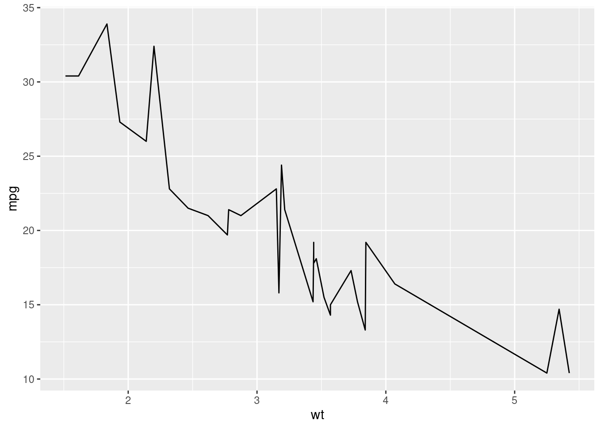

``` r
# geom_line() conecta os pontos com uma linha

## Histograma:
ggplot(data = mtcars, aes(x = mpg)) +
  geom_histogram()
```

```
## `stat_bin()` using `bins = 30`. Pick better value with `binwidth`.
```


``` r
# geom_histogram() faz um histograma

## Gráfico de barras:
ggplot(data = mtcars, aes(x = as.factor(cyl))) + 
  geom_bar()
```

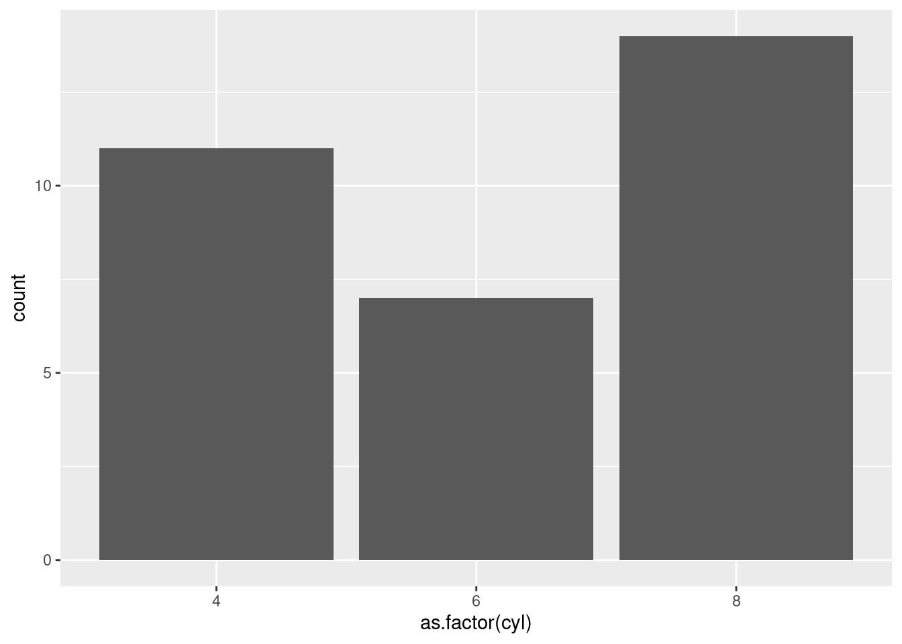

``` r
# x = as.factor(cyl): transforma os números de cilindros em categorias
# geom_bar(): conta quantas vezes cada valor aparece 
# (por padrão, usa stat = "count")

## Boxplot:
# para uma variável
ggplot(data = mtcars, aes(y = mpg)) + 
  geom_boxplot()
```

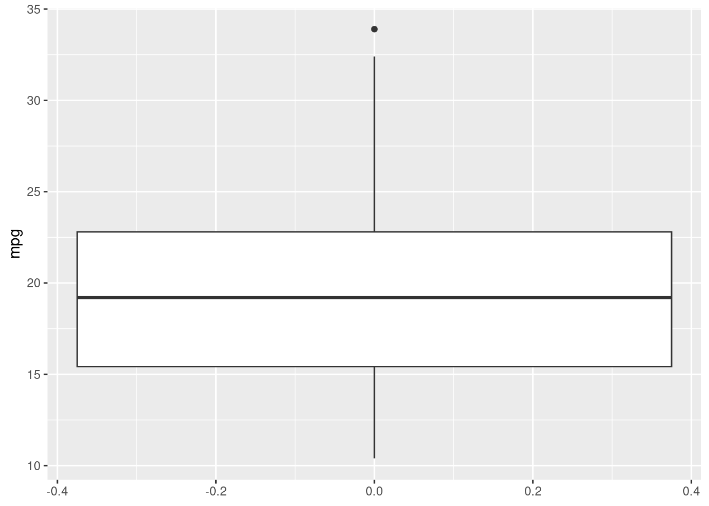

``` r
# considerando grupos
ggplot(data = mtcars, aes(x = as.factor(cyl), y = mpg)) + 
  geom_boxplot()
```

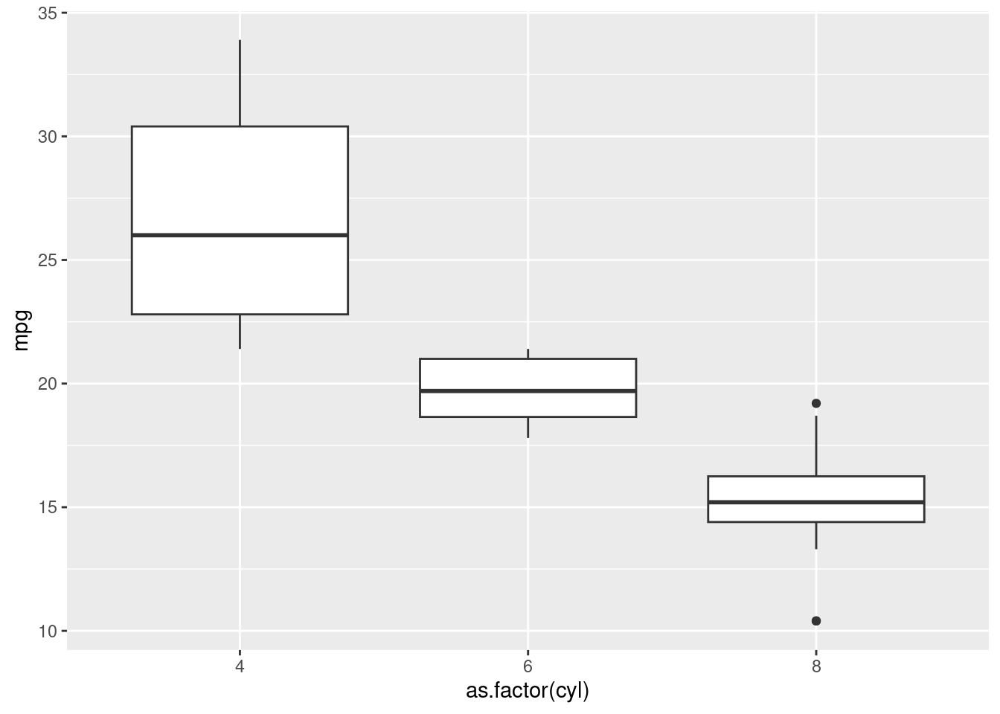

``` r
# as.factor(cyl) transforma o número de cilindros em categorias
# geom_boxplot() mostra distribuição de valores
```

Personalizações adicionais:


**1. Cores, formato, tamanho, transparência**

``` r
## Gráfico de dispersão: 
ggplot(data = mtcars, aes(x = wt, y = mpg)) + 
  geom_point(alpha = 0.8, shape = 22, color = "red", 
             fill = "blue", size = 4)
```

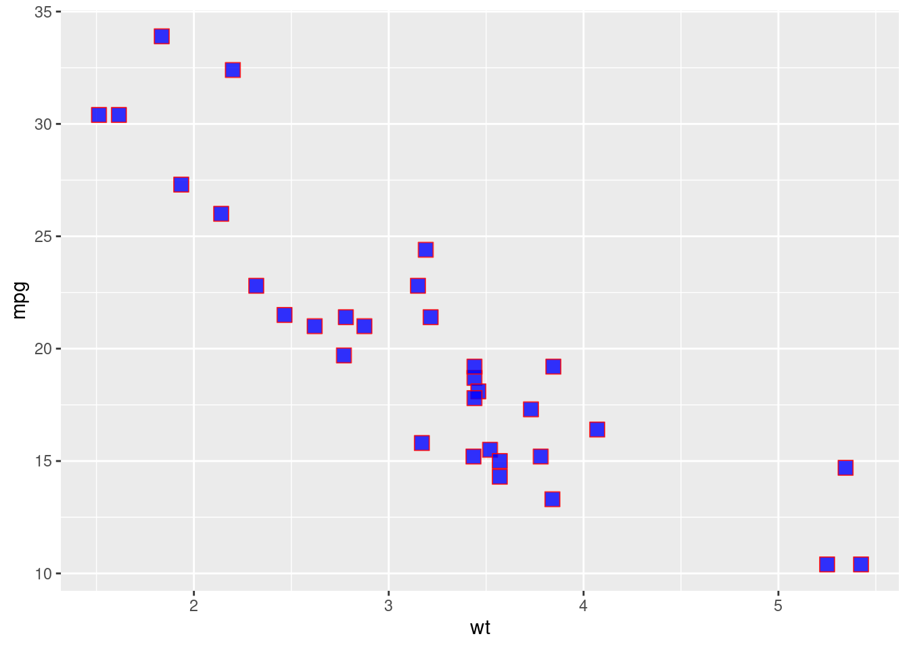

``` r
# alpha -> transparencia: valor de 0 a 1
# shape -> formato do ponto: valor de 0 a 25
# color -> cor dos pontos (ou borda, se for o caso)
# fill -> cor do interior do ponto. Formas que aceitam fill: shape 21 a 25
# size -> tamanho dos pontos

# Gráfico de linhas: 
ggplot(mtcars, aes(x = wt, y = mpg)) +
  geom_line(color = "blue", size = 1.2, linetype = "dashed")
```

```
## Warning: Using `size` aesthetic for lines was deprecated in ggplot2 3.4.0.
## ℹ Please use `linewidth` instead.
## This warning is displayed once every 8 hours.
## Call `lifecycle::last_lifecycle_warnings()` to see where this warning was
## generated.
```


``` r
# color: cor da linha ("blue", "red", etc.)
# size: espessura da linha
# linetype: tipo da linha ("solid", "dashed", "dotted", 
#                          "dotdash", "longdash", etc.)

# Gráfico de histograma: 
ggplot(mtcars, aes(x = mpg)) +
  geom_histogram(fill = "skyblue", color = "black", 
                 alpha = 0.7, binwidth = 5)
```

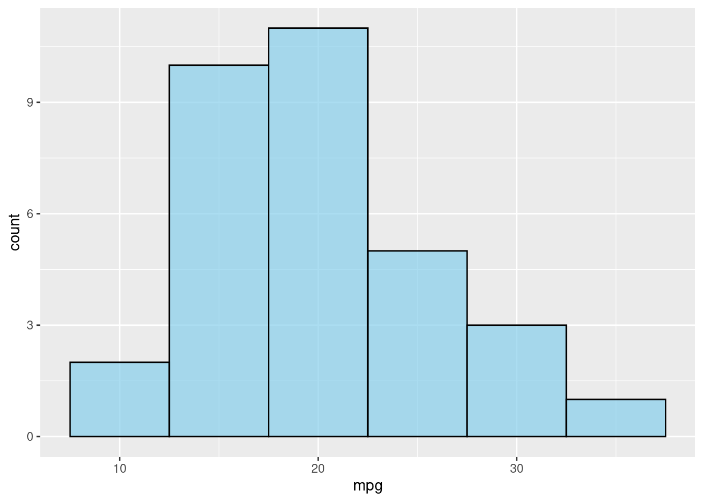

``` r
# fill: cor de preenchimento das barras
# color: cor da borda das barras
# alpha: transparência (0 a 1)
# binwidth: largura de cada barra

# Gráfico de barras: 
ggplot(mtcars, aes(x = as.factor(cyl))) +
  geom_bar(fill = "lightsalmon", color = "black", width = 0.7)
```


``` r
# fill: cor do interior das barras
# color: borda das barras
# width: largura das barras

# Gráfico Boxplot:
ggplot(data = mtcars, aes(x = as.factor(cyl), y = mpg)) + 
  geom_boxplot(alpha = 0.7, size = 1,
               fill = "skyblue", color = "darkblue", 
               outlier.color = "red", outlier.shape = 21,
               outlier.fill = "yellow", outlier.size = 3,
               outlier.stroke = 1.5)
```


``` r
# alpha -> transparencia: valor de 0 a 1 (0 = transparente, 1 = opaco).
# size -> espessura das bordas
# fill = "skyblue" ->	Cor de preenchimento da caixa.
# color = "darkblue" ->	Cor da borda do boxplot.
# outlier.color = "red"	-> Cor da borda dos outliers.
# outlier.shape = 21 ->	Formato dos pontos outliers. 
# Formas de 21 a 25 aceitam fill.
# outlier.fill = "yellow" -> Cor do interior dos outliers 
# (se outlier.shape permite fill).
# outlier.size = 3	Tamanho dos pontos outliers.
# outlier.stroke = espessura das bordas dos outliers

## Outros tipos de cores podem ser encontradas em colors().
```

Cores variando conforme os grupos:

``` r
## Cores do preenchimento variando conforme os grupos: fill
ggplot(mtcars, aes(x = wt, y = mpg, fill = as.factor(cyl))) +
  geom_boxplot(alpha = 0.7, size = 1, color = "darkblue")
```

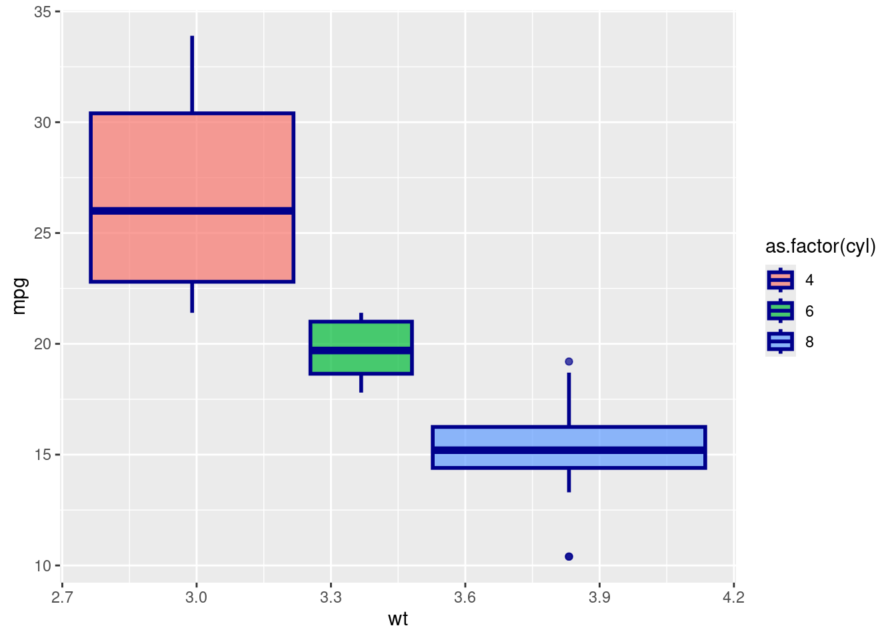

``` r
# fill = as.factor(cyl): cores do interior das caixas
# variam conforme as categorias de cilindros

## Cores das bordas variando conforme os grupos: color
ggplot(mtcars, aes(x = factor(cyl), y = mpg, color = as.factor(cyl))) +
  geom_boxplot(alpha = 0.7, size = 1, fill = "white")
```


``` r
# color = as.factor(cyl): cores das bordas das caixas
# variam conforme as categorias de cilindros
```

Para controlar manualmente as cores associadas aos grupos (categorias), podemos usar `scale_fill_manual()` para o `fill` e `scale_color_manual()` para o `color.` Isso vale para formas preenchíveis, como boxplots, barras, pontos com shape 21–25, etc.


``` r
## Cores do preenchimento manuais variando conforme os grupos: fill
ggplot(mtcars, aes(x = wt, y = mpg, fill = as.factor(cyl))) +
  geom_boxplot(alpha = 0.7, size = 1, color = "darkblue") +
  scale_fill_manual(values = c("4" = "lightgreen", "6" = "lightblue",
                               "8" = "pink")) 
```


``` r
# scale_fill_manual() → define manualmente as cores do interior.

## Cores das bordas manuais variando conforme os grupos: color
ggplot(mtcars, aes(x = factor(cyl), y = mpg, color = as.factor(cyl))) +
  geom_boxplot(alpha = 0.7, size = 1, fill = "white") +
  scale_color_manual(values = c("4" = "darkgreen", "6" = "steelblue", 
                                "8" = "darkred")) 
```

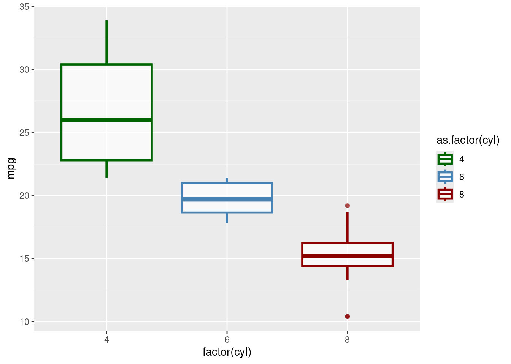

``` r
# scale_color_manual() → define manualmente as cores das bordas.
```


**2. Legendas, rótulos e limites**

Com o `scale_fill_manual()` e o `scale_color_manual()`, podemos modificar também as informações das legendas.


``` r
ggplot(mtcars, aes(x = wt, y = mpg, fill = as.factor(cyl))) +
  geom_boxplot(alpha = 0.7, size = 1, color = "darkblue") +
  scale_fill_manual(
    values = c("4" = "lightgreen", "6" = "lightblue", "8" = "pink"),
    labels = c("4 cilindros", "6 cilindros", "8 cilindros"),
    name = "Categorias de cilindros"
    )
```

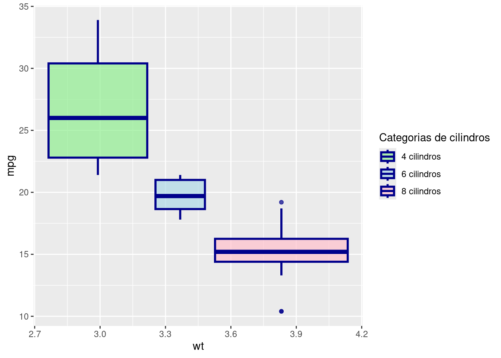

``` r
ggplot(mtcars, aes(x = factor(cyl), y = mpg, color = as.factor(cyl))) +
  geom_boxplot(alpha = 0.7, size = 1, fill = "white") +
  scale_color_manual(
    values = c("4" = "lightgreen", "6" = "lightblue", "8" = "pink"),
    labels = c("4 cilindros", "6 cilindros", "8 cilindros"),
    name = "Categorias de cilindros"
    )
```


Para modificar rótulos, nomes de títulos e nomes dos eixos, podemos utilizar a função `labs()`. Já para modificar valores minimos e maximos dos eixos, usamos `xlim()` e `ylim()`.


``` r
## Gráfico de dispersão: 
ggplot(data = mtcars, aes(x = wt, y = mpg)) + 
  geom_point(alpha = 0.8, shape = 22, color = "red", 
             fill = "blue", size = 4) + 
  labs(
    title = "Relação entre peso e consumo de combustível",
    subtitle = "Dados do dataset mtcars",
    x = "Peso do carro (1000 lbs)",
    y = "Milhas por galão (mpg)",
    caption = "Fonte: Motor Trend US magazine (1974)"
  ) +
  xlim(1, 6) +
  ylim(10, 35)
```

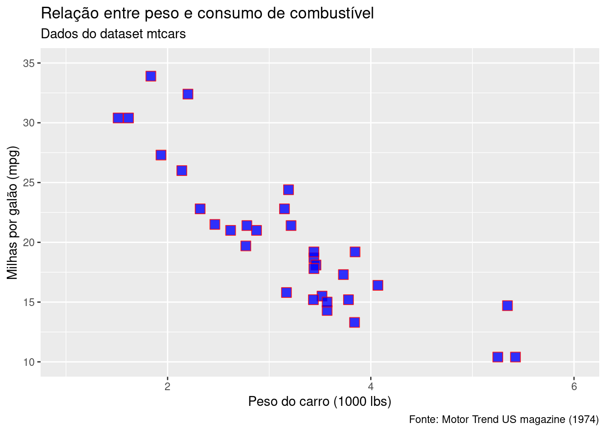

``` r
# labs() possibilita adicionar:
# - title: título do gráfico
# - subtitle: subtítulo
# - x, y: rótulos dos eixos
# - caption: legenda inferior (útil para fonte ou nota)
# xlim() e ylim() -> Definem os limites visuais dos eixos x e y. 
# Dados fora desses limites são cortados
```

**3. Temas:**

Para persoalizar temas, podemos usar `theme_*()` ou `theme()`.

- `theme_*()`: Funções predefinidas para aplicar temas específicos, com ajustes padrão. Você escolhe um tema e aplica com um único comando. Aplicam um conjunto pré-definido de estilos para o gráfico, como fundo, eixos, grid, etc.

- `theme()`: Permite personalizações detalhadas e específicas, configurando cada elemento do gráfico individualmente.


**Exemplo: Usando `theme_*()`**


``` r
ggplot(data = mtcars, aes(x = wt, y = mpg)) + 
  geom_point(alpha = 0.8, shape = 22, color = "red", 
             fill = "blue", size = 4) +
  labs(
    title = "Relação entre peso e consumo de combustível",
    subtitle = "Dados do dataset mtcars",
    x = "Peso do carro (1000 lbs)",
    y = "Milhas por galão (mpg)",
    caption = "Fonte: Motor Trend US magazine (1974)"
  ) +
  xlim(1, 6) +
  ylim(10, 35) +
  theme_minimal()
```

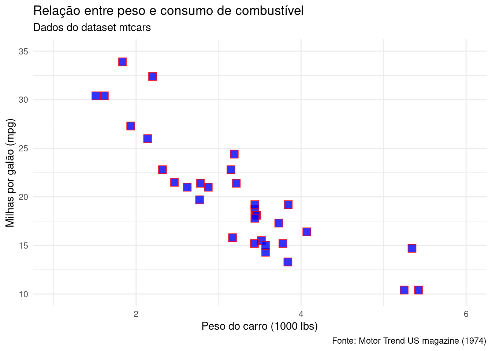


Você pode substituir `theme_minimal()` por qualquer uma destas funções para estilos diferentes:

| Tema             | Estilo                                                     |
|------------------|------------------------------------------------------------|
| `theme_gray()`   | Padrão do ggplot2 (cinza claro com grade branca)           |
| `theme_bw()`     | Fundo branco com linhas de grade                           |
| `theme_minimal()`| Visual leve, sem bordas e poucas linhas                    |
| `theme_classic()`| Fundo branco com eixos e borda, sem grade                  |
| `theme_void()`   | Quase tudo removido (bom para mapas, logos, etc.)          |
| `theme_light()`  | Semelhante ao `bw()`, mas mais suave                       |
| `theme_dark()`   | Fundo escuro com texto claro                               |

**Exemplo: Usando `theme()`**


``` r
ggplot(mtcars, aes(x = factor(cyl), y = mpg, color = as.factor(cyl))) +
  geom_boxplot(alpha = 0.7, size = 1, fill = "white") +
    labs(
    title = "Boxplot do mpg por valor de cyl",
    x = "cyl",
    y = "Milhas por galão (mpg)"
  ) +
  scale_color_manual(
    values = c("4" = "lightgreen", "6" = "lightblue", "8" = "pink"),
    labels = c("4 cilindros", "6 cilindros", "8 cilindros"),
    name = "Categorias de cilindros"
    ) +
  theme_minimal() + 
  theme(
  plot.title = element_text(size = 16, face = "bold", color = "darkblue"),
  axis.title = element_text(size = 12, color = "darkblue"),
  axis.text = element_text(size = 12, color = "darkblue")
)
```

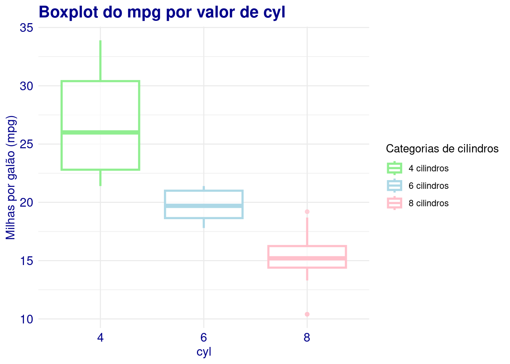

``` r
# - plot.title = element_text(size = 16, face = "bold"):
# Altera o título do gráfico: tamanho da fonte (size = 16) 
# e o estilo como negrito (face = "bold").
# - axis.text = element_text(size = 14, color = "darkblue"):
# Muda o tamanho e a cor dos números dos eixos (x e y).
# panel.grid.major = element_line(color = "gray90")	
# Altera a cor das linhas principais da grade (linhas de referência horizontais e verticais).
```

Outras personalizações podem ser encontradas em: `help(theme)`.

**Exemplo:** Gráfico ggplot com várias personalizações


``` r
# Dados base
dados <- mtcars
# Gráfico ggplot 
ggplot(dados, aes(x = wt, y = mpg)) +
  # Pontos
  geom_point(color = "blue", size = 3) +
  # Linha horizontal de referência (y = 20)
  geom_hline(yintercept = 20, color = "red", linetype = "dashed",
             linewidth = 1) +
  # Linha vertical de referência (x = 3.5)
  geom_vline(xintercept = 3.5, color = "darkgreen", 
             linetype = "dotted", linewidth = 1) +
  # Texto anotativo
  annotate("text", x = 3.8, y = 33, label = "Alto consumo", 
           color = "purple", size = 4) +
  # Limites dos eixos
  xlim(1.5, 5.5) +
  ylim(10, 35) +
  # Títulos e rótulos
  labs(
    title = "MPG vs Peso do carro",
    subtitle = "Dados do conjunto mtcars",
    x = "Peso (1000 lbs)",
    y = "Milhas por galão (MPG)",
    caption = "Fonte: mtcars"
  ) +
  # Tema para ajustar aparência geral
  theme_minimal() +
  theme(
    plot.title = element_text(face = "bold", size = 14),
    axis.title = element_text(size = 12)
  )
```


#### Exercícios {-}

Considere o conjunto de dados `mpg` do pacote `ggplot2`.

**1.** Crie um gráfico de dispersão com geom_point() mostrando a relação entre displ (cilindrada) e hwy (consumo em estrada).

- Adicione título e rótulos aos eixos.
- Use tamanho 3 e cor azul para os pontos.
- Use o tema theme_minimal().

**2.** Considerando novamente o gráfico de dispersão anterior:

- Faça com que a cor dos pontos varie conforme a variável class.
- Aumente o tamanho dos pontos para 4 e reduza a sua opacidade para 0.5 (alpha)

**3.** Considerando novamente o gráfico de dispersão anterior:

- Faça com que a cor dos pontos varie conforme a variável class.
- Use uma paleta manual de cores com scale_color_manual() com pelo menos 3 cores distintas.

**4.** Considerando novamente o gráfico de dispersão anterior:

- Adicione uma linha horizontal em hwy = 25 e uma linha vertical em displ = 4 (ambas devem ser tracejadas e vermelhas)
- Um texto no canto superior direito dizendo "Meta de eficiência"
- Limite o eixo X entre 2 e 6
- Limite o eixo Y entre 15 e 40

**5.** Crie um gráfico de barras com a contagem de carros por `class`.

- Use fill = `class` para mudar a cor de preenchimento das barras.
- Mude manualmente as cores de preenchimento com scale_fill_manual().
- Remova a legenda e use o tema theme_bw().

**6.** Crie um boxplot de hwy por class.

- Use fill = class e color = drv para mostrar grupos diferentes.
- Personalize com scale_fill_manual() e scale_color_manual().


<div id="protectedContent2" style="display:none;">

### Respostas {-}
```r
library(ggplot2)
## 1. 
ggplot(mpg, aes(x = displ, y = hwy)) +
  geom_point(color = "blue", size = 3) +
  labs(
    title = "Relação entre Cilindrada e Consumo",
    x = "Cilindrada (litros)",
    y = "Consumo na estrada (mpg)"
  ) +
  theme_minimal()
## 2.
ggplot(mpg, aes(x = displ, y = hwy, color = class)) +
  geom_point(size = 4, alpha = 0.5) +
  theme_light()
## 3.
cl <- colors() # vetor de cores
ggplot(mpg, aes(x = displ, y = hwy, color = class)) +
  geom_point(size = 3) +
  scale_color_manual(values = cl[2:8]) +
  # scale_color_manual(values = c("suv" = "red", "compact" = "blue", "midsize" = "green")) +
  theme_minimal()
## 4.
ggplot(mpg, aes(x = displ, y = hwy)) +
  geom_point() +
  geom_hline(yintercept = 25, linetype = "dashed",
             color = "red") +
  geom_vline(xintercept = 4, linetype = "dashed", 
             color = "red") +
  annotate("text", x = 5.5, y = 40, label = "Meta de eficiência",
           size = 4, fontface = "bold") +
  # annotate("segment", x = 5.5, y = 38, xend = 3, yend = 35, arrow = arrow(length = unit(0.2, "cm")), color = "blue") +
  xlim(2, 6) +
  ylim(15, 40) +
  theme_classic()
## 5.
ggplot(mpg, aes(x = class, fill = class)) +
  geom_bar() +
  scale_fill_manual(values = c("suv" = "darkred", "compact" = "skyblue", "midsize" = "darkgreen", "pickup" = "orange", "subcompact" = "purple", "2seater" = "pink")) +
  guides(fill = "none")  + # Remove legenda
  theme_bw() 
## 6.
ggplot(mpg, aes(x = class, y = hwy, fill = class, color = drv)) +
  geom_boxplot() +
  scale_fill_manual(values = c("suv" = "darkred", "compact" = "skyblue", "midsize" = "darkgreen", "pickup" = "orange", "subcompact" = "purple", "2seater" = "pink")) +
  scale_color_manual(values = c("f" = "black", "r" = "red", "4" = "blue")) +
  theme_minimal()
```

</div>

<input type="password" id="passwordInput2" placeholder="Digite a senha">
<button id="submitButton2">Acesso Professor</button>


<script>

document.getElementById("submitButton2").addEventListener("click", function()
{
  var password = document.getElementById("passwordInput2").value;
  var correctPassword = "0987";

  if (password === correctPassword)
  {
    document.getElementById("protectedContent2").style.display = "block";
  }else
  {
    alert("Senha incorreta! Tente novamente.");
  }
});
</script>


## Gráficos Interativos com plotly

O plotly é um pacote que transforma gráficos em interativos. Ele possibilita:

- transformar gráficos ggplot em interativos
- criar gráficos interativos
- Alguns de seus recursos: observar os valores do gráfico com o mouse, dar zoom, arrastar, girar imagens 3D, exportar.

Primeiramente instalar e carregar o pacote:


``` r
# install.packages("plotly")  
library(plotly)     
```


#### Transformar um gráfico ggplot2 em interativo {-}

``` r
library(ggplot2)
library(plotly)

# Gráfico com ggplot2
p <- ggplot(mpg, aes(x = displ, y = hwy, color = class)) +
  geom_point()

# Tornar interativo
ggplotly(p)
```

```{=html}
<div class="plotly html-widget html-fill-item" id="htmlwidget-ff3b454336f2a9e4cd80" style="width:672px;height:480px;"></div>
<script type="application/json" data-for="htmlwidget-ff3b454336f2a9e4cd80">{"x":{"data":[{"x":[5.7000000000000002,5.7000000000000002,6.2000000000000002,6.2000000000000002,7],"y":[26,23,26,25,24],"text":["displ: 5.7<br />hwy: 26<br />class: 2seater","displ: 5.7<br />hwy: 23<br />class: 2seater","displ: 6.2<br />hwy: 26<br />class: 2seater","displ: 6.2<br />hwy: 25<br />class: 2seater","displ: 7.0<br />hwy: 24<br />class: 2seater"],"type":"scatter","mode":"markers","marker":{"autocolorscale":false,"color":"rgba(248,118,109,1)","opacity":1,"size":5.6692913385826778,"symbol":"circle","line":{"width":1.8897637795275593,"color":"rgba(248,118,109,1)"}},"hoveron":"points","name":"2seater","legendgroup":"2seater","showlegend":true,"xaxis":"x","yaxis":"y","hoverinfo":"text","frame":null},{"x":[1.8,1.8,2,2,2.7999999999999998,2.7999999999999998,3.1000000000000001,1.8,1.8,2,2,2.7999999999999998,2.7999999999999998,3.1000000000000001,3.1000000000000001,2.3999999999999999,2.3999999999999999,2.5,2.5,2.5,2.5,2.2000000000000002,2.2000000000000002,2.3999999999999999,2.3999999999999999,3,3,3.2999999999999998,1.8,1.8,1.8,1.8,1.8,2,2,2,2,2.7999999999999998,1.8999999999999999,2,2,2,2,2.5,2.5,2.7999999999999998,2.7999999999999998],"y":[29,29,31,30,26,26,27,26,25,28,27,25,25,25,25,29,27,25,27,25,27,27,29,31,31,26,26,27,30,33,35,37,35,29,26,29,29,24,44,29,26,29,29,29,29,23,24],"text":["displ: 1.8<br />hwy: 29<br />class: compact","displ: 1.8<br />hwy: 29<br />class: compact","displ: 2.0<br />hwy: 31<br />class: compact","displ: 2.0<br />hwy: 30<br />class: compact","displ: 2.8<br />hwy: 26<br />class: compact","displ: 2.8<br />hwy: 26<br />class: compact","displ: 3.1<br />hwy: 27<br />class: compact","displ: 1.8<br />hwy: 26<br />class: compact","displ: 1.8<br />hwy: 25<br />class: compact","displ: 2.0<br />hwy: 28<br />class: compact","displ: 2.0<br />hwy: 27<br />class: compact","displ: 2.8<br />hwy: 25<br />class: compact","displ: 2.8<br />hwy: 25<br />class: compact","displ: 3.1<br />hwy: 25<br />class: compact","displ: 3.1<br />hwy: 25<br />class: compact","displ: 2.4<br />hwy: 29<br />class: compact","displ: 2.4<br />hwy: 27<br />class: compact","displ: 2.5<br />hwy: 25<br />class: compact","displ: 2.5<br />hwy: 27<br />class: compact","displ: 2.5<br />hwy: 25<br />class: compact","displ: 2.5<br />hwy: 27<br />class: compact","displ: 2.2<br />hwy: 27<br />class: compact","displ: 2.2<br />hwy: 29<br />class: compact","displ: 2.4<br />hwy: 31<br />class: compact","displ: 2.4<br />hwy: 31<br />class: compact","displ: 3.0<br />hwy: 26<br />class: compact","displ: 3.0<br />hwy: 26<br />class: compact","displ: 3.3<br />hwy: 27<br />class: compact","displ: 1.8<br />hwy: 30<br />class: compact","displ: 1.8<br />hwy: 33<br />class: compact","displ: 1.8<br />hwy: 35<br />class: compact","displ: 1.8<br />hwy: 37<br />class: compact","displ: 1.8<br />hwy: 35<br />class: compact","displ: 2.0<br />hwy: 29<br />class: compact","displ: 2.0<br />hwy: 26<br />class: compact","displ: 2.0<br />hwy: 29<br />class: compact","displ: 2.0<br />hwy: 29<br />class: compact","displ: 2.8<br />hwy: 24<br />class: compact","displ: 1.9<br />hwy: 44<br />class: compact","displ: 2.0<br />hwy: 29<br />class: compact","displ: 2.0<br />hwy: 26<br />class: compact","displ: 2.0<br />hwy: 29<br />class: compact","displ: 2.0<br />hwy: 29<br />class: compact","displ: 2.5<br />hwy: 29<br />class: compact","displ: 2.5<br />hwy: 29<br />class: compact","displ: 2.8<br />hwy: 23<br />class: compact","displ: 2.8<br />hwy: 24<br />class: compact"],"type":"scatter","mode":"markers","marker":{"autocolorscale":false,"color":"rgba(196,154,0,1)","opacity":1,"size":5.6692913385826778,"symbol":"circle","line":{"width":1.8897637795275593,"color":"rgba(196,154,0,1)"}},"hoveron":"points","name":"compact","legendgroup":"compact","showlegend":true,"xaxis":"x","yaxis":"y","hoverinfo":"text","frame":null},{"x":[2.7999999999999998,3.1000000000000001,4.2000000000000002,2.3999999999999999,2.3999999999999999,3.1000000000000001,3.5,3.6000000000000001,2.3999999999999999,2.3999999999999999,2.3999999999999999,2.3999999999999999,2.5,2.5,3.2999999999999998,2.5,2.5,3.5,3.5,3,3,3.5,3.1000000000000001,3.7999999999999998,3.7999999999999998,3.7999999999999998,5.2999999999999998,2.2000000000000002,2.2000000000000002,2.3999999999999999,2.3999999999999999,3,3,3.5,1.8,1.8,2,2,2.7999999999999998,2.7999999999999998,3.6000000000000001],"y":[24,25,23,27,30,26,29,26,26,27,30,31,26,26,28,31,32,27,26,26,25,25,26,26,27,28,25,29,27,31,31,26,26,28,29,29,28,29,26,26,26],"text":["displ: 2.8<br />hwy: 24<br />class: midsize","displ: 3.1<br />hwy: 25<br />class: midsize","displ: 4.2<br />hwy: 23<br />class: midsize","displ: 2.4<br />hwy: 27<br />class: midsize","displ: 2.4<br />hwy: 30<br />class: midsize","displ: 3.1<br />hwy: 26<br />class: midsize","displ: 3.5<br />hwy: 29<br />class: midsize","displ: 3.6<br />hwy: 26<br />class: midsize","displ: 2.4<br />hwy: 26<br />class: midsize","displ: 2.4<br />hwy: 27<br />class: midsize","displ: 2.4<br />hwy: 30<br />class: midsize","displ: 2.4<br />hwy: 31<br />class: midsize","displ: 2.5<br />hwy: 26<br />class: midsize","displ: 2.5<br />hwy: 26<br />class: midsize","displ: 3.3<br />hwy: 28<br />class: midsize","displ: 2.5<br />hwy: 31<br />class: midsize","displ: 2.5<br />hwy: 32<br />class: midsize","displ: 3.5<br />hwy: 27<br />class: midsize","displ: 3.5<br />hwy: 26<br />class: midsize","displ: 3.0<br />hwy: 26<br />class: midsize","displ: 3.0<br />hwy: 25<br />class: midsize","displ: 3.5<br />hwy: 25<br />class: midsize","displ: 3.1<br />hwy: 26<br />class: midsize","displ: 3.8<br />hwy: 26<br />class: midsize","displ: 3.8<br />hwy: 27<br />class: midsize","displ: 3.8<br />hwy: 28<br />class: midsize","displ: 5.3<br />hwy: 25<br />class: midsize","displ: 2.2<br />hwy: 29<br />class: midsize","displ: 2.2<br />hwy: 27<br />class: midsize","displ: 2.4<br />hwy: 31<br />class: midsize","displ: 2.4<br />hwy: 31<br />class: midsize","displ: 3.0<br />hwy: 26<br />class: midsize","displ: 3.0<br />hwy: 26<br />class: midsize","displ: 3.5<br />hwy: 28<br />class: midsize","displ: 1.8<br />hwy: 29<br />class: midsize","displ: 1.8<br />hwy: 29<br />class: midsize","displ: 2.0<br />hwy: 28<br />class: midsize","displ: 2.0<br />hwy: 29<br />class: midsize","displ: 2.8<br />hwy: 26<br />class: midsize","displ: 2.8<br />hwy: 26<br />class: midsize","displ: 3.6<br />hwy: 26<br />class: midsize"],"type":"scatter","mode":"markers","marker":{"autocolorscale":false,"color":"rgba(83,180,0,1)","opacity":1,"size":5.6692913385826778,"symbol":"circle","line":{"width":1.8897637795275593,"color":"rgba(83,180,0,1)"}},"hoveron":"points","name":"midsize","legendgroup":"midsize","showlegend":true,"xaxis":"x","yaxis":"y","hoverinfo":"text","frame":null},{"x":[2.3999999999999999,3,3.2999999999999998,3.2999999999999998,3.2999999999999998,3.2999999999999998,3.2999999999999998,3.7999999999999998,3.7999999999999998,3.7999999999999998,4],"y":[24,24,22,22,24,24,17,22,21,23,23],"text":["displ: 2.4<br />hwy: 24<br />class: minivan","displ: 3.0<br />hwy: 24<br />class: minivan","displ: 3.3<br />hwy: 22<br />class: minivan","displ: 3.3<br />hwy: 22<br />class: minivan","displ: 3.3<br />hwy: 24<br />class: minivan","displ: 3.3<br />hwy: 24<br />class: minivan","displ: 3.3<br />hwy: 17<br />class: minivan","displ: 3.8<br />hwy: 22<br />class: minivan","displ: 3.8<br />hwy: 21<br />class: minivan","displ: 3.8<br />hwy: 23<br />class: minivan","displ: 4.0<br />hwy: 23<br />class: minivan"],"type":"scatter","mode":"markers","marker":{"autocolorscale":false,"color":"rgba(0,192,148,1)","opacity":1,"size":5.6692913385826778,"symbol":"circle","line":{"width":1.8897637795275593,"color":"rgba(0,192,148,1)"}},"hoveron":"points","name":"minivan","legendgroup":"minivan","showlegend":true,"xaxis":"x","yaxis":"y","hoverinfo":"text","frame":null},{"x":[3.7000000000000002,3.7000000000000002,3.8999999999999999,3.8999999999999999,4.7000000000000002,4.7000000000000002,4.7000000000000002,5.2000000000000002,5.2000000000000002,4.7000000000000002,4.7000000000000002,4.7000000000000002,4.7000000000000002,4.7000000000000002,4.7000000000000002,5.2000000000000002,5.2000000000000002,5.7000000000000002,5.9000000000000004,4.2000000000000002,4.2000000000000002,4.5999999999999996,4.5999999999999996,4.5999999999999996,5.4000000000000004,5.4000000000000004,2.7000000000000002,2.7000000000000002,2.7000000000000002,3.3999999999999999,3.3999999999999999,4,4],"y":[19,18,17,17,19,19,12,17,15,16,12,17,17,16,12,15,16,17,15,17,17,16,16,17,15,17,20,20,22,17,19,18,20],"text":["displ: 3.7<br />hwy: 19<br />class: pickup","displ: 3.7<br />hwy: 18<br />class: pickup","displ: 3.9<br />hwy: 17<br />class: pickup","displ: 3.9<br />hwy: 17<br />class: pickup","displ: 4.7<br />hwy: 19<br />class: pickup","displ: 4.7<br />hwy: 19<br />class: pickup","displ: 4.7<br />hwy: 12<br />class: pickup","displ: 5.2<br />hwy: 17<br />class: pickup","displ: 5.2<br />hwy: 15<br />class: pickup","displ: 4.7<br />hwy: 16<br />class: pickup","displ: 4.7<br />hwy: 12<br />class: pickup","displ: 4.7<br />hwy: 17<br />class: pickup","displ: 4.7<br />hwy: 17<br />class: pickup","displ: 4.7<br />hwy: 16<br />class: pickup","displ: 4.7<br />hwy: 12<br />class: pickup","displ: 5.2<br />hwy: 15<br />class: pickup","displ: 5.2<br />hwy: 16<br />class: pickup","displ: 5.7<br />hwy: 17<br />class: pickup","displ: 5.9<br />hwy: 15<br />class: pickup","displ: 4.2<br />hwy: 17<br />class: pickup","displ: 4.2<br />hwy: 17<br />class: pickup","displ: 4.6<br />hwy: 16<br />class: pickup","displ: 4.6<br />hwy: 16<br />class: pickup","displ: 4.6<br />hwy: 17<br />class: pickup","displ: 5.4<br />hwy: 15<br />class: pickup","displ: 5.4<br />hwy: 17<br />class: pickup","displ: 2.7<br />hwy: 20<br />class: pickup","displ: 2.7<br />hwy: 20<br />class: pickup","displ: 2.7<br />hwy: 22<br />class: pickup","displ: 3.4<br />hwy: 17<br />class: pickup","displ: 3.4<br />hwy: 19<br />class: pickup","displ: 4.0<br />hwy: 18<br />class: pickup","displ: 4.0<br />hwy: 20<br />class: pickup"],"type":"scatter","mode":"markers","marker":{"autocolorscale":false,"color":"rgba(0,182,235,1)","opacity":1,"size":5.6692913385826778,"symbol":"circle","line":{"width":1.8897637795275593,"color":"rgba(0,182,235,1)"}},"hoveron":"points","name":"pickup","legendgroup":"pickup","showlegend":true,"xaxis":"x","yaxis":"y","hoverinfo":"text","frame":null},{"x":[3.7999999999999998,3.7999999999999998,4,4,4.5999999999999996,4.5999999999999996,4.5999999999999996,4.5999999999999996,5.4000000000000004,1.6000000000000001,1.6000000000000001,1.6000000000000001,1.6000000000000001,1.6000000000000001,1.8,1.8,1.8,2,2,2,2,2,2.7000000000000002,2.7000000000000002,2.7000000000000002,2.2000000000000002,2.2000000000000002,2.5,2.5,1.8999999999999999,1.8999999999999999,2,2,2.5,2.5],"y":[26,25,26,24,21,22,23,22,20,33,32,32,29,32,34,36,36,29,26,29,28,27,24,24,24,26,26,26,26,44,41,29,26,28,29],"text":["displ: 3.8<br />hwy: 26<br />class: subcompact","displ: 3.8<br />hwy: 25<br />class: subcompact","displ: 4.0<br />hwy: 26<br />class: subcompact","displ: 4.0<br />hwy: 24<br />class: subcompact","displ: 4.6<br />hwy: 21<br />class: subcompact","displ: 4.6<br />hwy: 22<br />class: subcompact","displ: 4.6<br />hwy: 23<br />class: subcompact","displ: 4.6<br />hwy: 22<br />class: subcompact","displ: 5.4<br />hwy: 20<br />class: subcompact","displ: 1.6<br />hwy: 33<br />class: subcompact","displ: 1.6<br />hwy: 32<br />class: subcompact","displ: 1.6<br />hwy: 32<br />class: subcompact","displ: 1.6<br />hwy: 29<br />class: subcompact","displ: 1.6<br />hwy: 32<br />class: subcompact","displ: 1.8<br />hwy: 34<br />class: subcompact","displ: 1.8<br />hwy: 36<br />class: subcompact","displ: 1.8<br />hwy: 36<br />class: subcompact","displ: 2.0<br />hwy: 29<br />class: subcompact","displ: 2.0<br />hwy: 26<br />class: subcompact","displ: 2.0<br />hwy: 29<br />class: subcompact","displ: 2.0<br />hwy: 28<br />class: subcompact","displ: 2.0<br />hwy: 27<br />class: subcompact","displ: 2.7<br />hwy: 24<br />class: subcompact","displ: 2.7<br />hwy: 24<br />class: subcompact","displ: 2.7<br />hwy: 24<br />class: subcompact","displ: 2.2<br />hwy: 26<br />class: subcompact","displ: 2.2<br />hwy: 26<br />class: subcompact","displ: 2.5<br />hwy: 26<br />class: subcompact","displ: 2.5<br />hwy: 26<br />class: subcompact","displ: 1.9<br />hwy: 44<br />class: subcompact","displ: 1.9<br />hwy: 41<br />class: subcompact","displ: 2.0<br />hwy: 29<br />class: subcompact","displ: 2.0<br />hwy: 26<br />class: subcompact","displ: 2.5<br />hwy: 28<br />class: subcompact","displ: 2.5<br />hwy: 29<br />class: subcompact"],"type":"scatter","mode":"markers","marker":{"autocolorscale":false,"color":"rgba(165,138,255,1)","opacity":1,"size":5.6692913385826778,"symbol":"circle","line":{"width":1.8897637795275593,"color":"rgba(165,138,255,1)"}},"hoveron":"points","name":"subcompact","legendgroup":"subcompact","showlegend":true,"xaxis":"x","yaxis":"y","hoverinfo":"text","frame":null},{"x":[5.2999999999999998,5.2999999999999998,5.2999999999999998,5.7000000000000002,6,5.2999999999999998,5.2999999999999998,5.7000000000000002,6.5,3.8999999999999999,4.7000000000000002,4.7000000000000002,4.7000000000000002,5.2000000000000002,5.7000000000000002,5.9000000000000004,4.5999999999999996,5.4000000000000004,5.4000000000000004,4,4,4,4,4.5999999999999996,5,3,3.7000000000000002,4,4.7000000000000002,4.7000000000000002,4.7000000000000002,5.7000000000000002,6.0999999999999996,4,4.2000000000000002,4.4000000000000004,4.5999999999999996,5.4000000000000004,5.4000000000000004,5.4000000000000004,4,4,4.5999999999999996,5,3.2999999999999998,3.2999999999999998,4,5.5999999999999996,2.5,2.5,2.5,2.5,2.5,2.5,2.7000000000000002,2.7000000000000002,3.3999999999999999,3.3999999999999999,4,4.7000000000000002,4.7000000000000002,5.7000000000000002],"y":[20,15,20,17,17,19,14,15,17,17,17,12,17,16,18,15,17,17,18,17,19,17,19,19,17,22,19,20,17,12,19,18,14,15,18,18,15,17,16,18,17,19,19,17,17,17,20,18,25,24,27,25,26,23,20,20,19,17,20,17,15,18],"text":["displ: 5.3<br />hwy: 20<br />class: suv","displ: 5.3<br />hwy: 15<br />class: suv","displ: 5.3<br />hwy: 20<br />class: suv","displ: 5.7<br />hwy: 17<br />class: suv","displ: 6.0<br />hwy: 17<br />class: suv","displ: 5.3<br />hwy: 19<br />class: suv","displ: 5.3<br />hwy: 14<br />class: suv","displ: 5.7<br />hwy: 15<br />class: suv","displ: 6.5<br />hwy: 17<br />class: suv","displ: 3.9<br />hwy: 17<br />class: suv","displ: 4.7<br />hwy: 17<br />class: suv","displ: 4.7<br />hwy: 12<br />class: suv","displ: 4.7<br />hwy: 17<br />class: suv","displ: 5.2<br />hwy: 16<br />class: suv","displ: 5.7<br />hwy: 18<br />class: suv","displ: 5.9<br />hwy: 15<br />class: suv","displ: 4.6<br />hwy: 17<br />class: suv","displ: 5.4<br />hwy: 17<br />class: suv","displ: 5.4<br />hwy: 18<br />class: suv","displ: 4.0<br />hwy: 17<br />class: suv","displ: 4.0<br />hwy: 19<br />class: suv","displ: 4.0<br />hwy: 17<br />class: suv","displ: 4.0<br />hwy: 19<br />class: suv","displ: 4.6<br />hwy: 19<br />class: suv","displ: 5.0<br />hwy: 17<br />class: suv","displ: 3.0<br />hwy: 22<br />class: suv","displ: 3.7<br />hwy: 19<br />class: suv","displ: 4.0<br />hwy: 20<br />class: suv","displ: 4.7<br />hwy: 17<br />class: suv","displ: 4.7<br />hwy: 12<br />class: suv","displ: 4.7<br />hwy: 19<br />class: suv","displ: 5.7<br />hwy: 18<br />class: suv","displ: 6.1<br />hwy: 14<br />class: suv","displ: 4.0<br />hwy: 15<br />class: suv","displ: 4.2<br />hwy: 18<br />class: suv","displ: 4.4<br />hwy: 18<br />class: suv","displ: 4.6<br />hwy: 15<br />class: suv","displ: 5.4<br />hwy: 17<br />class: suv","displ: 5.4<br />hwy: 16<br />class: suv","displ: 5.4<br />hwy: 18<br />class: suv","displ: 4.0<br />hwy: 17<br />class: suv","displ: 4.0<br />hwy: 19<br />class: suv","displ: 4.6<br />hwy: 19<br />class: suv","displ: 5.0<br />hwy: 17<br />class: suv","displ: 3.3<br />hwy: 17<br />class: suv","displ: 3.3<br />hwy: 17<br />class: suv","displ: 4.0<br />hwy: 20<br />class: suv","displ: 5.6<br />hwy: 18<br />class: suv","displ: 2.5<br />hwy: 25<br />class: suv","displ: 2.5<br />hwy: 24<br />class: suv","displ: 2.5<br />hwy: 27<br />class: suv","displ: 2.5<br />hwy: 25<br />class: suv","displ: 2.5<br />hwy: 26<br />class: suv","displ: 2.5<br />hwy: 23<br />class: suv","displ: 2.7<br />hwy: 20<br />class: suv","displ: 2.7<br />hwy: 20<br />class: suv","displ: 3.4<br />hwy: 19<br />class: suv","displ: 3.4<br />hwy: 17<br />class: suv","displ: 4.0<br />hwy: 20<br />class: suv","displ: 4.7<br />hwy: 17<br />class: suv","displ: 4.7<br />hwy: 15<br />class: suv","displ: 5.7<br />hwy: 18<br />class: suv"],"type":"scatter","mode":"markers","marker":{"autocolorscale":false,"color":"rgba(251,97,215,1)","opacity":1,"size":5.6692913385826778,"symbol":"circle","line":{"width":1.8897637795275593,"color":"rgba(251,97,215,1)"}},"hoveron":"points","name":"suv","legendgroup":"suv","showlegend":true,"xaxis":"x","yaxis":"y","hoverinfo":"text","frame":null}],"layout":{"margin":{"t":26.228310502283104,"r":7.3059360730593621,"b":40.182648401826491,"l":37.260273972602747},"plot_bgcolor":"rgba(235,235,235,1)","paper_bgcolor":"rgba(255,255,255,1)","font":{"color":"rgba(0,0,0,1)","family":"","size":14.611872146118724},"xaxis":{"domain":[0,1],"automargin":true,"type":"linear","autorange":false,"range":[1.3300000000000001,7.2699999999999996],"tickmode":"array","ticktext":["2","3","4","5","6","7"],"tickvals":[2,3,4,5,6,7],"categoryorder":"array","categoryarray":["2","3","4","5","6","7"],"nticks":null,"ticks":"outside","tickcolor":"rgba(51,51,51,1)","ticklen":3.6529680365296811,"tickwidth":0.66417600664176002,"showticklabels":true,"tickfont":{"color":"rgba(77,77,77,1)","family":"","size":11.68949771689498},"tickangle":-0,"showline":false,"linecolor":null,"linewidth":0,"showgrid":true,"gridcolor":"rgba(255,255,255,1)","gridwidth":0.66417600664176002,"zeroline":false,"anchor":"y","title":{"text":"displ","font":{"color":"rgba(0,0,0,1)","family":"","size":14.611872146118724}},"hoverformat":".2f"},"yaxis":{"domain":[0,1],"automargin":true,"type":"linear","autorange":false,"range":[10.4,45.600000000000001],"tickmode":"array","ticktext":["20","30","40"],"tickvals":[20,30,40],"categoryorder":"array","categoryarray":["20","30","40"],"nticks":null,"ticks":"outside","tickcolor":"rgba(51,51,51,1)","ticklen":3.6529680365296811,"tickwidth":0.66417600664176002,"showticklabels":true,"tickfont":{"color":"rgba(77,77,77,1)","family":"","size":11.68949771689498},"tickangle":-0,"showline":false,"linecolor":null,"linewidth":0,"showgrid":true,"gridcolor":"rgba(255,255,255,1)","gridwidth":0.66417600664176002,"zeroline":false,"anchor":"x","title":{"text":"hwy","font":{"color":"rgba(0,0,0,1)","family":"","size":14.611872146118724}},"hoverformat":".2f"},"shapes":[{"type":"rect","fillcolor":null,"line":{"color":null,"width":0,"linetype":[]},"yref":"paper","xref":"paper","x0":0,"x1":1,"y0":0,"y1":1}],"showlegend":true,"legend":{"bgcolor":"rgba(255,255,255,1)","bordercolor":"transparent","borderwidth":1.8897637795275593,"font":{"color":"rgba(0,0,0,1)","family":"","size":11.68949771689498},"title":{"text":"class","font":{"color":"rgba(0,0,0,1)","family":"","size":14.611872146118724}}},"hovermode":"closest","barmode":"relative"},"config":{"doubleClick":"reset","modeBarButtonsToAdd":["hoverclosest","hovercompare"],"showSendToCloud":false},"source":"A","attrs":{"34c2155f12311":{"x":{},"y":{},"colour":{},"type":"scatter"}},"cur_data":"34c2155f12311","visdat":{"34c2155f12311":["function (y) ","x"]},"highlight":{"on":"plotly_click","persistent":false,"dynamic":false,"selectize":false,"opacityDim":0.20000000000000001,"selected":{"opacity":1},"debounce":0},"shinyEvents":["plotly_hover","plotly_click","plotly_selected","plotly_relayout","plotly_brushed","plotly_brushing","plotly_clickannotation","plotly_doubleclick","plotly_deselect","plotly_afterplot","plotly_sunburstclick"],"base_url":"https://plot.ly"},"evals":[],"jsHooks":[]}</script>
```

Recursos:

- desmarcar itens da legenda
- download do gráfico
- zoom em uma região específica
- arrastar o gráfico
- caixa de seleção
- laço de seleção
- resetar eixos 
- mostrar os dados mais próximos ao passar o mouse
- comparar dados ao passar o mouse


#### Criando gráficos diretamente com plot_ly() {-}


``` r
## Gráfico de dispersão:
plot_ly(data = mtcars, 
        x = ~wt, 
        y = ~mpg, 
        type = "scatter", 
        mode = "markers")
```

```{=html}
<div class="plotly html-widget html-fill-item" id="htmlwidget-ef436b3da97d7b9d2eb5" style="width:672px;height:480px;"></div>
<script type="application/json" data-for="htmlwidget-ef436b3da97d7b9d2eb5">{"x":{"visdat":{"34c21990ef4":["function () ","plotlyVisDat"]},"cur_data":"34c21990ef4","attrs":{"34c21990ef4":{"x":{},"y":{},"mode":"markers","alpha_stroke":1,"sizes":[10,100],"spans":[1,20],"type":"scatter"}},"layout":{"margin":{"b":40,"l":60,"t":25,"r":10},"xaxis":{"domain":[0,1],"automargin":true,"title":"wt"},"yaxis":{"domain":[0,1],"automargin":true,"title":"mpg"},"hovermode":"closest","showlegend":false},"source":"A","config":{"modeBarButtonsToAdd":["hoverclosest","hovercompare"],"showSendToCloud":false},"data":[{"x":[2.6200000000000001,2.875,2.3199999999999998,3.2149999999999999,3.4399999999999999,3.46,3.5699999999999998,3.1899999999999999,3.1499999999999999,3.4399999999999999,3.4399999999999999,4.0700000000000003,3.73,3.7799999999999998,5.25,5.4240000000000004,5.3449999999999998,2.2000000000000002,1.615,1.835,2.4649999999999999,3.52,3.4350000000000001,3.8399999999999999,3.8450000000000002,1.9350000000000001,2.1400000000000001,1.5129999999999999,3.1699999999999999,2.77,3.5699999999999998,2.7799999999999998],"y":[21,21,22.800000000000001,21.399999999999999,18.699999999999999,18.100000000000001,14.300000000000001,24.399999999999999,22.800000000000001,19.199999999999999,17.800000000000001,16.399999999999999,17.300000000000001,15.199999999999999,10.4,10.4,14.699999999999999,32.399999999999999,30.399999999999999,33.899999999999999,21.5,15.5,15.199999999999999,13.300000000000001,19.199999999999999,27.300000000000001,26,30.399999999999999,15.800000000000001,19.699999999999999,15,21.399999999999999],"mode":"markers","type":"scatter","marker":{"color":"rgba(31,119,180,1)","line":{"color":"rgba(31,119,180,1)"}},"error_y":{"color":"rgba(31,119,180,1)"},"error_x":{"color":"rgba(31,119,180,1)"},"line":{"color":"rgba(31,119,180,1)"},"xaxis":"x","yaxis":"y","frame":null}],"highlight":{"on":"plotly_click","persistent":false,"dynamic":false,"selectize":false,"opacityDim":0.20000000000000001,"selected":{"opacity":1},"debounce":0},"shinyEvents":["plotly_hover","plotly_click","plotly_selected","plotly_relayout","plotly_brushed","plotly_brushing","plotly_clickannotation","plotly_doubleclick","plotly_deselect","plotly_afterplot","plotly_sunburstclick"],"base_url":"https://plot.ly"},"evals":[],"jsHooks":[]}</script>
```

``` r
# type = "scatter" → gráfico de dispersão
# mode = "markers" → só pontos (sem linhas)

## Gráfico de linhas
plot_ly(data = economics, 
        x = ~date, 
        y = ~unemploy, 
        type = "scatter", 
        mode = "lines")
```

```{=html}
<div class="plotly html-widget html-fill-item" id="htmlwidget-a0dda0dca177c1b864c1" style="width:672px;height:480px;"></div>
<script type="application/json" data-for="htmlwidget-a0dda0dca177c1b864c1">{"x":{"visdat":{"34c2141737d11":["function () ","plotlyVisDat"]},"cur_data":"34c2141737d11","attrs":{"34c2141737d11":{"x":{},"y":{},"mode":"lines","alpha_stroke":1,"sizes":[10,100],"spans":[1,20],"type":"scatter"}},"layout":{"margin":{"b":40,"l":60,"t":25,"r":10},"xaxis":{"domain":[0,1],"automargin":true,"title":"date"},"yaxis":{"domain":[0,1],"automargin":true,"title":"unemploy"},"hovermode":"closest","showlegend":false},"source":"A","config":{"modeBarButtonsToAdd":["hoverclosest","hovercompare"],"showSendToCloud":false},"data":[{"x":["1967-07-01","1967-08-01","1967-09-01","1967-10-01","1967-11-01","1967-12-01","1968-01-01","1968-02-01","1968-03-01","1968-04-01","1968-05-01","1968-06-01","1968-07-01","1968-08-01","1968-09-01","1968-10-01","1968-11-01","1968-12-01","1969-01-01","1969-02-01","1969-03-01","1969-04-01","1969-05-01","1969-06-01","1969-07-01","1969-08-01","1969-09-01","1969-10-01","1969-11-01","1969-12-01","1970-01-01","1970-02-01","1970-03-01","1970-04-01","1970-05-01","1970-06-01","1970-07-01","1970-08-01","1970-09-01","1970-10-01","1970-11-01","1970-12-01","1971-01-01","1971-02-01","1971-03-01","1971-04-01","1971-05-01","1971-06-01","1971-07-01","1971-08-01","1971-09-01","1971-10-01","1971-11-01","1971-12-01","1972-01-01","1972-02-01","1972-03-01","1972-04-01","1972-05-01","1972-06-01","1972-07-01","1972-08-01","1972-09-01","1972-10-01","1972-11-01","1972-12-01","1973-01-01","1973-02-01","1973-03-01","1973-04-01","1973-05-01","1973-06-01","1973-07-01","1973-08-01","1973-09-01","1973-10-01","1973-11-01","1973-12-01","1974-01-01","1974-02-01","1974-03-01","1974-04-01","1974-05-01","1974-06-01","1974-07-01","1974-08-01","1974-09-01","1974-10-01","1974-11-01","1974-12-01","1975-01-01","1975-02-01","1975-03-01","1975-04-01","1975-05-01","1975-06-01","1975-07-01","1975-08-01","1975-09-01","1975-10-01","1975-11-01","1975-12-01","1976-01-01","1976-02-01","1976-03-01","1976-04-01","1976-05-01","1976-06-01","1976-07-01","1976-08-01","1976-09-01","1976-10-01","1976-11-01","1976-12-01","1977-01-01","1977-02-01","1977-03-01","1977-04-01","1977-05-01","1977-06-01","1977-07-01","1977-08-01","1977-09-01","1977-10-01","1977-11-01","1977-12-01","1978-01-01","1978-02-01","1978-03-01","1978-04-01","1978-05-01","1978-06-01","1978-07-01","1978-08-01","1978-09-01","1978-10-01","1978-11-01","1978-12-01","1979-01-01","1979-02-01","1979-03-01","1979-04-01","1979-05-01","1979-06-01","1979-07-01","1979-08-01","1979-09-01","1979-10-01","1979-11-01","1979-12-01","1980-01-01","1980-02-01","1980-03-01","1980-04-01","1980-05-01","1980-06-01","1980-07-01","1980-08-01","1980-09-01","1980-10-01","1980-11-01","1980-12-01","1981-01-01","1981-02-01","1981-03-01","1981-04-01","1981-05-01","1981-06-01","1981-07-01","1981-08-01","1981-09-01","1981-10-01","1981-11-01","1981-12-01","1982-01-01","1982-02-01","1982-03-01","1982-04-01","1982-05-01","1982-06-01","1982-07-01","1982-08-01","1982-09-01","1982-10-01","1982-11-01","1982-12-01","1983-01-01","1983-02-01","1983-03-01","1983-04-01","1983-05-01","1983-06-01","1983-07-01","1983-08-01","1983-09-01","1983-10-01","1983-11-01","1983-12-01","1984-01-01","1984-02-01","1984-03-01","1984-04-01","1984-05-01","1984-06-01","1984-07-01","1984-08-01","1984-09-01","1984-10-01","1984-11-01","1984-12-01","1985-01-01","1985-02-01","1985-03-01","1985-04-01","1985-05-01","1985-06-01","1985-07-01","1985-08-01","1985-09-01","1985-10-01","1985-11-01","1985-12-01","1986-01-01","1986-02-01","1986-03-01","1986-04-01","1986-05-01","1986-06-01","1986-07-01","1986-08-01","1986-09-01","1986-10-01","1986-11-01","1986-12-01","1987-01-01","1987-02-01","1987-03-01","1987-04-01","1987-05-01","1987-06-01","1987-07-01","1987-08-01","1987-09-01","1987-10-01","1987-11-01","1987-12-01","1988-01-01","1988-02-01","1988-03-01","1988-04-01","1988-05-01","1988-06-01","1988-07-01","1988-08-01","1988-09-01","1988-10-01","1988-11-01","1988-12-01","1989-01-01","1989-02-01","1989-03-01","1989-04-01","1989-05-01","1989-06-01","1989-07-01","1989-08-01","1989-09-01","1989-10-01","1989-11-01","1989-12-01","1990-01-01","1990-02-01","1990-03-01","1990-04-01","1990-05-01","1990-06-01","1990-07-01","1990-08-01","1990-09-01","1990-10-01","1990-11-01","1990-12-01","1991-01-01","1991-02-01","1991-03-01","1991-04-01","1991-05-01","1991-06-01","1991-07-01","1991-08-01","1991-09-01","1991-10-01","1991-11-01","1991-12-01","1992-01-01","1992-02-01","1992-03-01","1992-04-01","1992-05-01","1992-06-01","1992-07-01","1992-08-01","1992-09-01","1992-10-01","1992-11-01","1992-12-01","1993-01-01","1993-02-01","1993-03-01","1993-04-01","1993-05-01","1993-06-01","1993-07-01","1993-08-01","1993-09-01","1993-10-01","1993-11-01","1993-12-01","1994-01-01","1994-02-01","1994-03-01","1994-04-01","1994-05-01","1994-06-01","1994-07-01","1994-08-01","1994-09-01","1994-10-01","1994-11-01","1994-12-01","1995-01-01","1995-02-01","1995-03-01","1995-04-01","1995-05-01","1995-06-01","1995-07-01","1995-08-01","1995-09-01","1995-10-01","1995-11-01","1995-12-01","1996-01-01","1996-02-01","1996-03-01","1996-04-01","1996-05-01","1996-06-01","1996-07-01","1996-08-01","1996-09-01","1996-10-01","1996-11-01","1996-12-01","1997-01-01","1997-02-01","1997-03-01","1997-04-01","1997-05-01","1997-06-01","1997-07-01","1997-08-01","1997-09-01","1997-10-01","1997-11-01","1997-12-01","1998-01-01","1998-02-01","1998-03-01","1998-04-01","1998-05-01","1998-06-01","1998-07-01","1998-08-01","1998-09-01","1998-10-01","1998-11-01","1998-12-01","1999-01-01","1999-02-01","1999-03-01","1999-04-01","1999-05-01","1999-06-01","1999-07-01","1999-08-01","1999-09-01","1999-10-01","1999-11-01","1999-12-01","2000-01-01","2000-02-01","2000-03-01","2000-04-01","2000-05-01","2000-06-01","2000-07-01","2000-08-01","2000-09-01","2000-10-01","2000-11-01","2000-12-01","2001-01-01","2001-02-01","2001-03-01","2001-04-01","2001-05-01","2001-06-01","2001-07-01","2001-08-01","2001-09-01","2001-10-01","2001-11-01","2001-12-01","2002-01-01","2002-02-01","2002-03-01","2002-04-01","2002-05-01","2002-06-01","2002-07-01","2002-08-01","2002-09-01","2002-10-01","2002-11-01","2002-12-01","2003-01-01","2003-02-01","2003-03-01","2003-04-01","2003-05-01","2003-06-01","2003-07-01","2003-08-01","2003-09-01","2003-10-01","2003-11-01","2003-12-01","2004-01-01","2004-02-01","2004-03-01","2004-04-01","2004-05-01","2004-06-01","2004-07-01","2004-08-01","2004-09-01","2004-10-01","2004-11-01","2004-12-01","2005-01-01","2005-02-01","2005-03-01","2005-04-01","2005-05-01","2005-06-01","2005-07-01","2005-08-01","2005-09-01","2005-10-01","2005-11-01","2005-12-01","2006-01-01","2006-02-01","2006-03-01","2006-04-01","2006-05-01","2006-06-01","2006-07-01","2006-08-01","2006-09-01","2006-10-01","2006-11-01","2006-12-01","2007-01-01","2007-02-01","2007-03-01","2007-04-01","2007-05-01","2007-06-01","2007-07-01","2007-08-01","2007-09-01","2007-10-01","2007-11-01","2007-12-01","2008-01-01","2008-02-01","2008-03-01","2008-04-01","2008-05-01","2008-06-01","2008-07-01","2008-08-01","2008-09-01","2008-10-01","2008-11-01","2008-12-01","2009-01-01","2009-02-01","2009-03-01","2009-04-01","2009-05-01","2009-06-01","2009-07-01","2009-08-01","2009-09-01","2009-10-01","2009-11-01","2009-12-01","2010-01-01","2010-02-01","2010-03-01","2010-04-01","2010-05-01","2010-06-01","2010-07-01","2010-08-01","2010-09-01","2010-10-01","2010-11-01","2010-12-01","2011-01-01","2011-02-01","2011-03-01","2011-04-01","2011-05-01","2011-06-01","2011-07-01","2011-08-01","2011-09-01","2011-10-01","2011-11-01","2011-12-01","2012-01-01","2012-02-01","2012-03-01","2012-04-01","2012-05-01","2012-06-01","2012-07-01","2012-08-01","2012-09-01","2012-10-01","2012-11-01","2012-12-01","2013-01-01","2013-02-01","2013-03-01","2013-04-01","2013-05-01","2013-06-01","2013-07-01","2013-08-01","2013-09-01","2013-10-01","2013-11-01","2013-12-01","2014-01-01","2014-02-01","2014-03-01","2014-04-01","2014-05-01","2014-06-01","2014-07-01","2014-08-01","2014-09-01","2014-10-01","2014-11-01","2014-12-01","2015-01-01","2015-02-01","2015-03-01","2015-04-01"],"y":[2944,2945,2958,3143,3066,3018,2878,3001,2877,2709,2740,2938,2883,2768,2686,2689,2715,2685,2718,2692,2712,2758,2713,2816,2868,2856,3040,3049,2856,2884,3201,3453,3635,3797,3919,4071,4175,4256,4456,4591,4898,5076,4986,4903,4987,4959,4996,4949,5035,5134,5042,4954,5161,5154,5019,4928,5038,4959,4922,4923,4913,4939,4849,4875,4602,4543,4326,4452,4394,4459,4329,4363,4305,4305,4350,4144,4396,4489,4644,4731,4634,4618,4705,4927,5063,5022,5437,5523,6140,6636,7501,7520,7978,8210,8433,8220,8127,7928,7923,7897,7794,7744,7534,7326,7230,7330,7053,7322,7490,7518,7380,7430,7620,7545,7280,7443,7307,7059,6911,7134,6829,6925,6751,6763,6815,6386,6489,6318,6337,6180,6127,6028,6309,6080,6125,5947,6077,6228,6109,6173,6109,6069,5840,5959,5996,6320,6190,6296,6238,6325,6683,6702,6729,7358,7984,8098,8363,8281,8021,8088,8023,7718,8071,8051,7982,7869,8174,8098,7863,8036,8230,8646,9029,9267,9397,9705,9895,10244,10335,10538,10849,10881,11217,11529,11938,12051,11534,11545,11408,11268,11154,11246,10548,10623,10282,9887,9499,9331,9008,8791,8746,8762,8456,8226,8537,8519,8367,8381,8198,8358,8423,8321,8339,8395,8302,8460,8513,8196,8248,8298,8128,8138,7795,8402,8383,8364,8439,8508,8319,8135,8310,8243,8159,7883,7892,7865,7862,7542,7574,7398,7268,7261,7102,7227,7035,6936,6953,6929,6876,6601,6779,6546,6605,6843,6604,6568,6537,6518,6682,6359,6205,6468,6375,6577,6495,6511,6590,6630,6725,6667,6752,6651,6598,6797,6742,6590,6922,7188,7368,7459,7764,7901,8015,8265,8586,8439,8736,8692,8586,8666,8722,8842,8931,9198,9283,9454,9460,9415,9744,10040,9850,9787,9781,9398,9565,9557,9325,9183,9056,9110,9149,9121,8930,8763,8714,8750,8542,8477,8630,8583,8470,8331,7915,7927,7946,7933,7734,7632,7375,7230,7375,7187,7153,7645,7430,7427,7527,7484,7478,7328,7426,7423,7491,7313,7318,7415,7423,7095,7337,6882,6979,7031,7236,7253,7158,7102,7000,6873,6655,6799,6655,6608,6656,6454,6308,6476,6368,6306,6422,5941,6047,6212,6259,6179,6300,6280,6100,6032,5976,6111,5783,6004,5796,5951,6025,5838,5915,5778,5716,5653,5708,5858,5733,5481,5758,5651,5747,5853,5625,5534,5639,5634,6023,6089,6141,6271,6226,6484,6583,7042,7142,7694,8003,8258,8182,8215,8304,8599,8399,8393,8390,8304,8251,8307,8520,8640,8520,8618,8588,8842,8957,9266,9011,8896,8921,8732,8576,8317,8370,8167,8491,8170,8212,8286,8136,7990,7927,8061,7932,7934,7784,7980,7737,7672,7651,7524,7406,7345,7553,7453,7566,7279,7064,7184,7072,7120,6980,7001,7175,7091,6847,6727,6872,6762,7116,6927,6731,6850,6766,6979,7149,7067,7170,7237,7240,7645,7685,7497,7822,7637,8395,8575,8937,9438,9494,10074,10538,11286,12058,12898,13426,13853,14499,14707,14601,14814,15009,15352,15219,15098,15046,15113,15202,15325,14849,14474,14512,14648,14579,14516,15081,14348,14013,13820,13737,13957,13855,13962,13763,13818,13948,13594,13302,13093,12797,12813,12713,12646,12660,12692,12656,12471,12115,12124,12005,12298,12471,11950,11689,11760,11654,11751,11335,11279,11270,11136,10787,10404,10202,10349,10380,9702,9859,9460,9608,9599,9262,8990,9090,8717,8903,8610,8504,8526],"mode":"lines","type":"scatter","marker":{"color":"rgba(31,119,180,1)","line":{"color":"rgba(31,119,180,1)"}},"error_y":{"color":"rgba(31,119,180,1)"},"error_x":{"color":"rgba(31,119,180,1)"},"line":{"color":"rgba(31,119,180,1)"},"xaxis":"x","yaxis":"y","frame":null}],"highlight":{"on":"plotly_click","persistent":false,"dynamic":false,"selectize":false,"opacityDim":0.20000000000000001,"selected":{"opacity":1},"debounce":0},"shinyEvents":["plotly_hover","plotly_click","plotly_selected","plotly_relayout","plotly_brushed","plotly_brushing","plotly_clickannotation","plotly_doubleclick","plotly_deselect","plotly_afterplot","plotly_sunburstclick"],"base_url":"https://plot.ly"},"evals":[],"jsHooks":[]}</script>
```

``` r
# mode = "lines": só linhas

## Gráfico de linhas + pontos
plot_ly(data = economics, 
        x = ~date, 
        y = ~unemploy, 
        type = "scatter", 
        mode = "lines+markers")
```

```{=html}
<div class="plotly html-widget html-fill-item" id="htmlwidget-5815ce5b01adef99be88" style="width:672px;height:480px;"></div>
<script type="application/json" data-for="htmlwidget-5815ce5b01adef99be88">{"x":{"visdat":{"34c214c735ccc":["function () ","plotlyVisDat"]},"cur_data":"34c214c735ccc","attrs":{"34c214c735ccc":{"x":{},"y":{},"mode":"lines+markers","alpha_stroke":1,"sizes":[10,100],"spans":[1,20],"type":"scatter"}},"layout":{"margin":{"b":40,"l":60,"t":25,"r":10},"xaxis":{"domain":[0,1],"automargin":true,"title":"date"},"yaxis":{"domain":[0,1],"automargin":true,"title":"unemploy"},"hovermode":"closest","showlegend":false},"source":"A","config":{"modeBarButtonsToAdd":["hoverclosest","hovercompare"],"showSendToCloud":false},"data":[{"x":["1967-07-01","1967-08-01","1967-09-01","1967-10-01","1967-11-01","1967-12-01","1968-01-01","1968-02-01","1968-03-01","1968-04-01","1968-05-01","1968-06-01","1968-07-01","1968-08-01","1968-09-01","1968-10-01","1968-11-01","1968-12-01","1969-01-01","1969-02-01","1969-03-01","1969-04-01","1969-05-01","1969-06-01","1969-07-01","1969-08-01","1969-09-01","1969-10-01","1969-11-01","1969-12-01","1970-01-01","1970-02-01","1970-03-01","1970-04-01","1970-05-01","1970-06-01","1970-07-01","1970-08-01","1970-09-01","1970-10-01","1970-11-01","1970-12-01","1971-01-01","1971-02-01","1971-03-01","1971-04-01","1971-05-01","1971-06-01","1971-07-01","1971-08-01","1971-09-01","1971-10-01","1971-11-01","1971-12-01","1972-01-01","1972-02-01","1972-03-01","1972-04-01","1972-05-01","1972-06-01","1972-07-01","1972-08-01","1972-09-01","1972-10-01","1972-11-01","1972-12-01","1973-01-01","1973-02-01","1973-03-01","1973-04-01","1973-05-01","1973-06-01","1973-07-01","1973-08-01","1973-09-01","1973-10-01","1973-11-01","1973-12-01","1974-01-01","1974-02-01","1974-03-01","1974-04-01","1974-05-01","1974-06-01","1974-07-01","1974-08-01","1974-09-01","1974-10-01","1974-11-01","1974-12-01","1975-01-01","1975-02-01","1975-03-01","1975-04-01","1975-05-01","1975-06-01","1975-07-01","1975-08-01","1975-09-01","1975-10-01","1975-11-01","1975-12-01","1976-01-01","1976-02-01","1976-03-01","1976-04-01","1976-05-01","1976-06-01","1976-07-01","1976-08-01","1976-09-01","1976-10-01","1976-11-01","1976-12-01","1977-01-01","1977-02-01","1977-03-01","1977-04-01","1977-05-01","1977-06-01","1977-07-01","1977-08-01","1977-09-01","1977-10-01","1977-11-01","1977-12-01","1978-01-01","1978-02-01","1978-03-01","1978-04-01","1978-05-01","1978-06-01","1978-07-01","1978-08-01","1978-09-01","1978-10-01","1978-11-01","1978-12-01","1979-01-01","1979-02-01","1979-03-01","1979-04-01","1979-05-01","1979-06-01","1979-07-01","1979-08-01","1979-09-01","1979-10-01","1979-11-01","1979-12-01","1980-01-01","1980-02-01","1980-03-01","1980-04-01","1980-05-01","1980-06-01","1980-07-01","1980-08-01","1980-09-01","1980-10-01","1980-11-01","1980-12-01","1981-01-01","1981-02-01","1981-03-01","1981-04-01","1981-05-01","1981-06-01","1981-07-01","1981-08-01","1981-09-01","1981-10-01","1981-11-01","1981-12-01","1982-01-01","1982-02-01","1982-03-01","1982-04-01","1982-05-01","1982-06-01","1982-07-01","1982-08-01","1982-09-01","1982-10-01","1982-11-01","1982-12-01","1983-01-01","1983-02-01","1983-03-01","1983-04-01","1983-05-01","1983-06-01","1983-07-01","1983-08-01","1983-09-01","1983-10-01","1983-11-01","1983-12-01","1984-01-01","1984-02-01","1984-03-01","1984-04-01","1984-05-01","1984-06-01","1984-07-01","1984-08-01","1984-09-01","1984-10-01","1984-11-01","1984-12-01","1985-01-01","1985-02-01","1985-03-01","1985-04-01","1985-05-01","1985-06-01","1985-07-01","1985-08-01","1985-09-01","1985-10-01","1985-11-01","1985-12-01","1986-01-01","1986-02-01","1986-03-01","1986-04-01","1986-05-01","1986-06-01","1986-07-01","1986-08-01","1986-09-01","1986-10-01","1986-11-01","1986-12-01","1987-01-01","1987-02-01","1987-03-01","1987-04-01","1987-05-01","1987-06-01","1987-07-01","1987-08-01","1987-09-01","1987-10-01","1987-11-01","1987-12-01","1988-01-01","1988-02-01","1988-03-01","1988-04-01","1988-05-01","1988-06-01","1988-07-01","1988-08-01","1988-09-01","1988-10-01","1988-11-01","1988-12-01","1989-01-01","1989-02-01","1989-03-01","1989-04-01","1989-05-01","1989-06-01","1989-07-01","1989-08-01","1989-09-01","1989-10-01","1989-11-01","1989-12-01","1990-01-01","1990-02-01","1990-03-01","1990-04-01","1990-05-01","1990-06-01","1990-07-01","1990-08-01","1990-09-01","1990-10-01","1990-11-01","1990-12-01","1991-01-01","1991-02-01","1991-03-01","1991-04-01","1991-05-01","1991-06-01","1991-07-01","1991-08-01","1991-09-01","1991-10-01","1991-11-01","1991-12-01","1992-01-01","1992-02-01","1992-03-01","1992-04-01","1992-05-01","1992-06-01","1992-07-01","1992-08-01","1992-09-01","1992-10-01","1992-11-01","1992-12-01","1993-01-01","1993-02-01","1993-03-01","1993-04-01","1993-05-01","1993-06-01","1993-07-01","1993-08-01","1993-09-01","1993-10-01","1993-11-01","1993-12-01","1994-01-01","1994-02-01","1994-03-01","1994-04-01","1994-05-01","1994-06-01","1994-07-01","1994-08-01","1994-09-01","1994-10-01","1994-11-01","1994-12-01","1995-01-01","1995-02-01","1995-03-01","1995-04-01","1995-05-01","1995-06-01","1995-07-01","1995-08-01","1995-09-01","1995-10-01","1995-11-01","1995-12-01","1996-01-01","1996-02-01","1996-03-01","1996-04-01","1996-05-01","1996-06-01","1996-07-01","1996-08-01","1996-09-01","1996-10-01","1996-11-01","1996-12-01","1997-01-01","1997-02-01","1997-03-01","1997-04-01","1997-05-01","1997-06-01","1997-07-01","1997-08-01","1997-09-01","1997-10-01","1997-11-01","1997-12-01","1998-01-01","1998-02-01","1998-03-01","1998-04-01","1998-05-01","1998-06-01","1998-07-01","1998-08-01","1998-09-01","1998-10-01","1998-11-01","1998-12-01","1999-01-01","1999-02-01","1999-03-01","1999-04-01","1999-05-01","1999-06-01","1999-07-01","1999-08-01","1999-09-01","1999-10-01","1999-11-01","1999-12-01","2000-01-01","2000-02-01","2000-03-01","2000-04-01","2000-05-01","2000-06-01","2000-07-01","2000-08-01","2000-09-01","2000-10-01","2000-11-01","2000-12-01","2001-01-01","2001-02-01","2001-03-01","2001-04-01","2001-05-01","2001-06-01","2001-07-01","2001-08-01","2001-09-01","2001-10-01","2001-11-01","2001-12-01","2002-01-01","2002-02-01","2002-03-01","2002-04-01","2002-05-01","2002-06-01","2002-07-01","2002-08-01","2002-09-01","2002-10-01","2002-11-01","2002-12-01","2003-01-01","2003-02-01","2003-03-01","2003-04-01","2003-05-01","2003-06-01","2003-07-01","2003-08-01","2003-09-01","2003-10-01","2003-11-01","2003-12-01","2004-01-01","2004-02-01","2004-03-01","2004-04-01","2004-05-01","2004-06-01","2004-07-01","2004-08-01","2004-09-01","2004-10-01","2004-11-01","2004-12-01","2005-01-01","2005-02-01","2005-03-01","2005-04-01","2005-05-01","2005-06-01","2005-07-01","2005-08-01","2005-09-01","2005-10-01","2005-11-01","2005-12-01","2006-01-01","2006-02-01","2006-03-01","2006-04-01","2006-05-01","2006-06-01","2006-07-01","2006-08-01","2006-09-01","2006-10-01","2006-11-01","2006-12-01","2007-01-01","2007-02-01","2007-03-01","2007-04-01","2007-05-01","2007-06-01","2007-07-01","2007-08-01","2007-09-01","2007-10-01","2007-11-01","2007-12-01","2008-01-01","2008-02-01","2008-03-01","2008-04-01","2008-05-01","2008-06-01","2008-07-01","2008-08-01","2008-09-01","2008-10-01","2008-11-01","2008-12-01","2009-01-01","2009-02-01","2009-03-01","2009-04-01","2009-05-01","2009-06-01","2009-07-01","2009-08-01","2009-09-01","2009-10-01","2009-11-01","2009-12-01","2010-01-01","2010-02-01","2010-03-01","2010-04-01","2010-05-01","2010-06-01","2010-07-01","2010-08-01","2010-09-01","2010-10-01","2010-11-01","2010-12-01","2011-01-01","2011-02-01","2011-03-01","2011-04-01","2011-05-01","2011-06-01","2011-07-01","2011-08-01","2011-09-01","2011-10-01","2011-11-01","2011-12-01","2012-01-01","2012-02-01","2012-03-01","2012-04-01","2012-05-01","2012-06-01","2012-07-01","2012-08-01","2012-09-01","2012-10-01","2012-11-01","2012-12-01","2013-01-01","2013-02-01","2013-03-01","2013-04-01","2013-05-01","2013-06-01","2013-07-01","2013-08-01","2013-09-01","2013-10-01","2013-11-01","2013-12-01","2014-01-01","2014-02-01","2014-03-01","2014-04-01","2014-05-01","2014-06-01","2014-07-01","2014-08-01","2014-09-01","2014-10-01","2014-11-01","2014-12-01","2015-01-01","2015-02-01","2015-03-01","2015-04-01"],"y":[2944,2945,2958,3143,3066,3018,2878,3001,2877,2709,2740,2938,2883,2768,2686,2689,2715,2685,2718,2692,2712,2758,2713,2816,2868,2856,3040,3049,2856,2884,3201,3453,3635,3797,3919,4071,4175,4256,4456,4591,4898,5076,4986,4903,4987,4959,4996,4949,5035,5134,5042,4954,5161,5154,5019,4928,5038,4959,4922,4923,4913,4939,4849,4875,4602,4543,4326,4452,4394,4459,4329,4363,4305,4305,4350,4144,4396,4489,4644,4731,4634,4618,4705,4927,5063,5022,5437,5523,6140,6636,7501,7520,7978,8210,8433,8220,8127,7928,7923,7897,7794,7744,7534,7326,7230,7330,7053,7322,7490,7518,7380,7430,7620,7545,7280,7443,7307,7059,6911,7134,6829,6925,6751,6763,6815,6386,6489,6318,6337,6180,6127,6028,6309,6080,6125,5947,6077,6228,6109,6173,6109,6069,5840,5959,5996,6320,6190,6296,6238,6325,6683,6702,6729,7358,7984,8098,8363,8281,8021,8088,8023,7718,8071,8051,7982,7869,8174,8098,7863,8036,8230,8646,9029,9267,9397,9705,9895,10244,10335,10538,10849,10881,11217,11529,11938,12051,11534,11545,11408,11268,11154,11246,10548,10623,10282,9887,9499,9331,9008,8791,8746,8762,8456,8226,8537,8519,8367,8381,8198,8358,8423,8321,8339,8395,8302,8460,8513,8196,8248,8298,8128,8138,7795,8402,8383,8364,8439,8508,8319,8135,8310,8243,8159,7883,7892,7865,7862,7542,7574,7398,7268,7261,7102,7227,7035,6936,6953,6929,6876,6601,6779,6546,6605,6843,6604,6568,6537,6518,6682,6359,6205,6468,6375,6577,6495,6511,6590,6630,6725,6667,6752,6651,6598,6797,6742,6590,6922,7188,7368,7459,7764,7901,8015,8265,8586,8439,8736,8692,8586,8666,8722,8842,8931,9198,9283,9454,9460,9415,9744,10040,9850,9787,9781,9398,9565,9557,9325,9183,9056,9110,9149,9121,8930,8763,8714,8750,8542,8477,8630,8583,8470,8331,7915,7927,7946,7933,7734,7632,7375,7230,7375,7187,7153,7645,7430,7427,7527,7484,7478,7328,7426,7423,7491,7313,7318,7415,7423,7095,7337,6882,6979,7031,7236,7253,7158,7102,7000,6873,6655,6799,6655,6608,6656,6454,6308,6476,6368,6306,6422,5941,6047,6212,6259,6179,6300,6280,6100,6032,5976,6111,5783,6004,5796,5951,6025,5838,5915,5778,5716,5653,5708,5858,5733,5481,5758,5651,5747,5853,5625,5534,5639,5634,6023,6089,6141,6271,6226,6484,6583,7042,7142,7694,8003,8258,8182,8215,8304,8599,8399,8393,8390,8304,8251,8307,8520,8640,8520,8618,8588,8842,8957,9266,9011,8896,8921,8732,8576,8317,8370,8167,8491,8170,8212,8286,8136,7990,7927,8061,7932,7934,7784,7980,7737,7672,7651,7524,7406,7345,7553,7453,7566,7279,7064,7184,7072,7120,6980,7001,7175,7091,6847,6727,6872,6762,7116,6927,6731,6850,6766,6979,7149,7067,7170,7237,7240,7645,7685,7497,7822,7637,8395,8575,8937,9438,9494,10074,10538,11286,12058,12898,13426,13853,14499,14707,14601,14814,15009,15352,15219,15098,15046,15113,15202,15325,14849,14474,14512,14648,14579,14516,15081,14348,14013,13820,13737,13957,13855,13962,13763,13818,13948,13594,13302,13093,12797,12813,12713,12646,12660,12692,12656,12471,12115,12124,12005,12298,12471,11950,11689,11760,11654,11751,11335,11279,11270,11136,10787,10404,10202,10349,10380,9702,9859,9460,9608,9599,9262,8990,9090,8717,8903,8610,8504,8526],"mode":"lines+markers","type":"scatter","marker":{"color":"rgba(31,119,180,1)","line":{"color":"rgba(31,119,180,1)"}},"error_y":{"color":"rgba(31,119,180,1)"},"error_x":{"color":"rgba(31,119,180,1)"},"line":{"color":"rgba(31,119,180,1)"},"xaxis":"x","yaxis":"y","frame":null}],"highlight":{"on":"plotly_click","persistent":false,"dynamic":false,"selectize":false,"opacityDim":0.20000000000000001,"selected":{"opacity":1},"debounce":0},"shinyEvents":["plotly_hover","plotly_click","plotly_selected","plotly_relayout","plotly_brushed","plotly_brushing","plotly_clickannotation","plotly_doubleclick","plotly_deselect","plotly_afterplot","plotly_sunburstclick"],"base_url":"https://plot.ly"},"evals":[],"jsHooks":[]}</script>
```

``` r
## Gráfico de barras
# Contagem das frequencias
# library(dplyr)
df_contagem <- mpg %>%
  count(class)
# Gráfico com as contagens
plot_ly(data = df_contagem,
        x = ~class,
        y = ~n,
        type = "bar") 
```

```{=html}
<div class="plotly html-widget html-fill-item" id="htmlwidget-be9b2c8425486e2e84a1" style="width:672px;height:480px;"></div>
<script type="application/json" data-for="htmlwidget-be9b2c8425486e2e84a1">{"x":{"visdat":{"34c21555d0022":["function () ","plotlyVisDat"]},"cur_data":"34c21555d0022","attrs":{"34c21555d0022":{"x":{},"y":{},"alpha_stroke":1,"sizes":[10,100],"spans":[1,20],"type":"bar"}},"layout":{"margin":{"b":40,"l":60,"t":25,"r":10},"xaxis":{"domain":[0,1],"automargin":true,"title":"class","type":"category","categoryorder":"array","categoryarray":["2seater","compact","midsize","minivan","pickup","subcompact","suv"]},"yaxis":{"domain":[0,1],"automargin":true,"title":"n"},"hovermode":"closest","showlegend":false},"source":"A","config":{"modeBarButtonsToAdd":["hoverclosest","hovercompare"],"showSendToCloud":false},"data":[{"x":["2seater","compact","midsize","minivan","pickup","subcompact","suv"],"y":[5,47,41,11,33,35,62],"type":"bar","marker":{"color":"rgba(31,119,180,1)","line":{"color":"rgba(31,119,180,1)"}},"error_y":{"color":"rgba(31,119,180,1)"},"error_x":{"color":"rgba(31,119,180,1)"},"xaxis":"x","yaxis":"y","frame":null}],"highlight":{"on":"plotly_click","persistent":false,"dynamic":false,"selectize":false,"opacityDim":0.20000000000000001,"selected":{"opacity":1},"debounce":0},"shinyEvents":["plotly_hover","plotly_click","plotly_selected","plotly_relayout","plotly_brushed","plotly_brushing","plotly_clickannotation","plotly_doubleclick","plotly_deselect","plotly_afterplot","plotly_sunburstclick"],"base_url":"https://plot.ly"},"evals":[],"jsHooks":[]}</script>
```

``` r
# type = "bar": gráfico de barras verticais
# x = ~class: mostra a frequência de cada tipo de carro

## Histograma - com frequencias
plot_ly(data = mpg, 
        x = ~hwy, 
        type = "histogram")
```

```{=html}
<div class="plotly html-widget html-fill-item" id="htmlwidget-33bca63df8de5b30c1b9" style="width:672px;height:480px;"></div>
<script type="application/json" data-for="htmlwidget-33bca63df8de5b30c1b9">{"x":{"visdat":{"34c211de1a6fd":["function () ","plotlyVisDat"]},"cur_data":"34c211de1a6fd","attrs":{"34c211de1a6fd":{"x":{},"alpha_stroke":1,"sizes":[10,100],"spans":[1,20],"type":"histogram"}},"layout":{"margin":{"b":40,"l":60,"t":25,"r":10},"xaxis":{"domain":[0,1],"automargin":true,"title":"hwy"},"yaxis":{"domain":[0,1],"automargin":true},"hovermode":"closest","showlegend":false},"source":"A","config":{"modeBarButtonsToAdd":["hoverclosest","hovercompare"],"showSendToCloud":false},"data":[{"x":[29,29,31,30,26,26,27,26,25,28,27,25,25,25,25,24,25,23,20,15,20,17,17,26,23,26,25,24,19,14,15,17,27,30,26,29,26,24,24,22,22,24,24,17,22,21,23,23,19,18,17,17,19,19,12,17,15,17,17,12,17,16,18,15,16,12,17,17,16,12,15,16,17,15,17,17,18,17,19,17,19,19,17,17,17,16,16,17,15,17,26,25,26,24,21,22,23,22,20,33,32,32,29,32,34,36,36,29,26,27,30,31,26,26,28,26,29,28,27,24,24,24,22,19,20,17,12,19,18,14,15,18,18,15,17,16,18,17,19,19,17,29,27,31,32,27,26,26,25,25,17,17,20,18,26,26,27,28,25,25,24,27,25,26,23,26,26,26,26,25,27,25,27,20,20,19,17,20,17,29,27,31,31,26,26,28,27,29,31,31,26,26,27,30,33,35,37,35,15,18,20,20,22,17,19,18,20,29,26,29,29,24,44,29,26,29,29,29,29,23,24,44,41,29,26,28,29,29,29,28,29,26,26,26],"type":"histogram","marker":{"color":"rgba(31,119,180,1)","line":{"color":"rgba(31,119,180,1)"}},"error_y":{"color":"rgba(31,119,180,1)"},"error_x":{"color":"rgba(31,119,180,1)"},"xaxis":"x","yaxis":"y","frame":null}],"highlight":{"on":"plotly_click","persistent":false,"dynamic":false,"selectize":false,"opacityDim":0.20000000000000001,"selected":{"opacity":1},"debounce":0},"shinyEvents":["plotly_hover","plotly_click","plotly_selected","plotly_relayout","plotly_brushed","plotly_brushing","plotly_clickannotation","plotly_doubleclick","plotly_deselect","plotly_afterplot","plotly_sunburstclick"],"base_url":"https://plot.ly"},"evals":[],"jsHooks":[]}</script>
```

``` r
# type = "histogram": conta quantos valores caem em cada faixa de hwy
# x = ~hwy: cria histograma da variável hwy (consumo em estrada)

## Histograma - com densidades
plot_ly(data = mpg,
        x = ~hwy,    
        type = "histogram",
        histnorm = "probability density", 
        xbins = list(size = 5))         
```

```{=html}
<div class="plotly html-widget html-fill-item" id="htmlwidget-ca2aa081da237f7ecd33" style="width:672px;height:480px;"></div>
<script type="application/json" data-for="htmlwidget-ca2aa081da237f7ecd33">{"x":{"visdat":{"34c21481308f7":["function () ","plotlyVisDat"]},"cur_data":"34c21481308f7","attrs":{"34c21481308f7":{"x":{},"histnorm":"probability density","xbins":{"size":5},"alpha_stroke":1,"sizes":[10,100],"spans":[1,20],"type":"histogram"}},"layout":{"margin":{"b":40,"l":60,"t":25,"r":10},"xaxis":{"domain":[0,1],"automargin":true,"title":"hwy"},"yaxis":{"domain":[0,1],"automargin":true},"hovermode":"closest","showlegend":false},"source":"A","config":{"modeBarButtonsToAdd":["hoverclosest","hovercompare"],"showSendToCloud":false},"data":[{"x":[29,29,31,30,26,26,27,26,25,28,27,25,25,25,25,24,25,23,20,15,20,17,17,26,23,26,25,24,19,14,15,17,27,30,26,29,26,24,24,22,22,24,24,17,22,21,23,23,19,18,17,17,19,19,12,17,15,17,17,12,17,16,18,15,16,12,17,17,16,12,15,16,17,15,17,17,18,17,19,17,19,19,17,17,17,16,16,17,15,17,26,25,26,24,21,22,23,22,20,33,32,32,29,32,34,36,36,29,26,27,30,31,26,26,28,26,29,28,27,24,24,24,22,19,20,17,12,19,18,14,15,18,18,15,17,16,18,17,19,19,17,29,27,31,32,27,26,26,25,25,17,17,20,18,26,26,27,28,25,25,24,27,25,26,23,26,26,26,26,25,27,25,27,20,20,19,17,20,17,29,27,31,31,26,26,28,27,29,31,31,26,26,27,30,33,35,37,35,15,18,20,20,22,17,19,18,20,29,26,29,29,24,44,29,26,29,29,29,29,23,24,44,41,29,26,28,29,29,29,28,29,26,26,26],"histnorm":"probability density","xbins":{"size":5},"type":"histogram","marker":{"color":"rgba(31,119,180,1)","line":{"color":"rgba(31,119,180,1)"}},"error_y":{"color":"rgba(31,119,180,1)"},"error_x":{"color":"rgba(31,119,180,1)"},"xaxis":"x","yaxis":"y","frame":null}],"highlight":{"on":"plotly_click","persistent":false,"dynamic":false,"selectize":false,"opacityDim":0.20000000000000001,"selected":{"opacity":1},"debounce":0},"shinyEvents":["plotly_hover","plotly_click","plotly_selected","plotly_relayout","plotly_brushed","plotly_brushing","plotly_clickannotation","plotly_doubleclick","plotly_deselect","plotly_afterplot","plotly_sunburstclick"],"base_url":"https://plot.ly"},"evals":[],"jsHooks":[]}</script>
```

``` r
# histnorm = "probability density"	Normaliza a altura das barras para representar densidade (área = 1)
# xbins = list(size = 2)	Define a amplitude dos intervalos (ex: de 2 em 2 unidades)

## Boxplot
plot_ly(data = mpg, 
        x = ~class, 
        y = ~hwy, 
        type = "box")
```

```{=html}
<div class="plotly html-widget html-fill-item" id="htmlwidget-b42e48bdef7bdbb5980e" style="width:672px;height:480px;"></div>
<script type="application/json" data-for="htmlwidget-b42e48bdef7bdbb5980e">{"x":{"visdat":{"34c214ae6db81":["function () ","plotlyVisDat"]},"cur_data":"34c214ae6db81","attrs":{"34c214ae6db81":{"x":{},"y":{},"alpha_stroke":1,"sizes":[10,100],"spans":[1,20],"type":"box"}},"layout":{"margin":{"b":40,"l":60,"t":25,"r":10},"xaxis":{"domain":[0,1],"automargin":true,"title":"class","type":"category","categoryorder":"array","categoryarray":["2seater","compact","midsize","minivan","pickup","subcompact","suv"]},"yaxis":{"domain":[0,1],"automargin":true,"title":"hwy"},"hovermode":"closest","showlegend":false},"source":"A","config":{"modeBarButtonsToAdd":["hoverclosest","hovercompare"],"showSendToCloud":false},"data":[{"fillcolor":"rgba(31,119,180,0.5)","x":["compact","compact","compact","compact","compact","compact","compact","compact","compact","compact","compact","compact","compact","compact","compact","midsize","midsize","midsize","suv","suv","suv","suv","suv","2seater","2seater","2seater","2seater","2seater","suv","suv","suv","suv","midsize","midsize","midsize","midsize","midsize","minivan","minivan","minivan","minivan","minivan","minivan","minivan","minivan","minivan","minivan","minivan","pickup","pickup","pickup","pickup","pickup","pickup","pickup","pickup","pickup","suv","suv","suv","suv","suv","suv","suv","pickup","pickup","pickup","pickup","pickup","pickup","pickup","pickup","pickup","pickup","suv","suv","suv","suv","suv","suv","suv","suv","suv","pickup","pickup","pickup","pickup","pickup","pickup","pickup","subcompact","subcompact","subcompact","subcompact","subcompact","subcompact","subcompact","subcompact","subcompact","subcompact","subcompact","subcompact","subcompact","subcompact","subcompact","subcompact","subcompact","subcompact","midsize","midsize","midsize","midsize","midsize","midsize","midsize","subcompact","subcompact","subcompact","subcompact","subcompact","subcompact","subcompact","suv","suv","suv","suv","suv","suv","suv","suv","suv","suv","suv","suv","suv","suv","suv","suv","suv","suv","suv","compact","compact","midsize","midsize","midsize","midsize","midsize","midsize","midsize","suv","suv","suv","suv","midsize","midsize","midsize","midsize","midsize","suv","suv","suv","suv","suv","suv","subcompact","subcompact","subcompact","subcompact","compact","compact","compact","compact","suv","suv","suv","suv","suv","suv","midsize","midsize","midsize","midsize","midsize","midsize","midsize","compact","compact","compact","compact","compact","compact","compact","compact","compact","compact","compact","compact","suv","suv","pickup","pickup","pickup","pickup","pickup","pickup","pickup","compact","compact","compact","compact","compact","compact","compact","compact","compact","compact","compact","compact","compact","compact","subcompact","subcompact","subcompact","subcompact","subcompact","subcompact","midsize","midsize","midsize","midsize","midsize","midsize","midsize"],"y":[29,29,31,30,26,26,27,26,25,28,27,25,25,25,25,24,25,23,20,15,20,17,17,26,23,26,25,24,19,14,15,17,27,30,26,29,26,24,24,22,22,24,24,17,22,21,23,23,19,18,17,17,19,19,12,17,15,17,17,12,17,16,18,15,16,12,17,17,16,12,15,16,17,15,17,17,18,17,19,17,19,19,17,17,17,16,16,17,15,17,26,25,26,24,21,22,23,22,20,33,32,32,29,32,34,36,36,29,26,27,30,31,26,26,28,26,29,28,27,24,24,24,22,19,20,17,12,19,18,14,15,18,18,15,17,16,18,17,19,19,17,29,27,31,32,27,26,26,25,25,17,17,20,18,26,26,27,28,25,25,24,27,25,26,23,26,26,26,26,25,27,25,27,20,20,19,17,20,17,29,27,31,31,26,26,28,27,29,31,31,26,26,27,30,33,35,37,35,15,18,20,20,22,17,19,18,20,29,26,29,29,24,44,29,26,29,29,29,29,23,24,44,41,29,26,28,29,29,29,28,29,26,26,26],"type":"box","marker":{"color":"rgba(31,119,180,1)","line":{"color":"rgba(31,119,180,1)"}},"line":{"color":"rgba(31,119,180,1)"},"xaxis":"x","yaxis":"y","frame":null}],"highlight":{"on":"plotly_click","persistent":false,"dynamic":false,"selectize":false,"opacityDim":0.20000000000000001,"selected":{"opacity":1},"debounce":0},"shinyEvents":["plotly_hover","plotly_click","plotly_selected","plotly_relayout","plotly_brushed","plotly_brushing","plotly_clickannotation","plotly_doubleclick","plotly_deselect","plotly_afterplot","plotly_sunburstclick"],"base_url":"https://plot.ly"},"evals":[],"jsHooks":[]}</script>
```

``` r
# type = "box": boxplot (mediana, quartis, outliers)
```

Personalizações comuns:
```r
# Cores automáticas por grupo:
color = ~class
# Título e rótulos:
layout(title = "Meu gráfico", 
       xaxis = list(title = "Eixo X"), 
       yaxis = list(title = "Eixo Y"))
# Texto ao passar o mouse:
text = ~paste("MPG:", mpg), hoverinfo = "text"
```

**Exemplo: gráfico de dispersão com personalizações**

``` r
library(plotly)

# Usando o dataset mpg
plot_ly(data = mpg,
    x = ~displ, # eixo X: cilindrada
    y = ~hwy,   # eixo Y: consumo na estrada
    type = "scatter", # gráfico de dispersão
    mode = "markers", # só pontos
    color = ~class,   # cor por tipo de carro
    text = ~paste("Classe:", class,
                  "<br>Cilindrada:", displ,
                  "<br>Consumo (hwy):", hwy),  # texto ao passar o mouse
    hoverinfo = "text"  # mostra só o texto definido
) %>%
layout(title = "Cilindrada vs Consumo (Estrada)",
       xaxis = list(title = "Cilindrada (litros)"),
       yaxis = list(title = "Consumo na estrada (MPG)"))
```

```{=html}
<div class="plotly html-widget html-fill-item" id="htmlwidget-328d0585fbfc57466cf4" style="width:672px;height:480px;"></div>
<script type="application/json" data-for="htmlwidget-328d0585fbfc57466cf4">{"x":{"visdat":{"34c2149502e78":["function () ","plotlyVisDat"]},"cur_data":"34c2149502e78","attrs":{"34c2149502e78":{"x":{},"y":{},"mode":"markers","text":{},"hoverinfo":"text","color":{},"alpha_stroke":1,"sizes":[10,100],"spans":[1,20],"type":"scatter"}},"layout":{"margin":{"b":40,"l":60,"t":25,"r":10},"title":"Cilindrada vs Consumo (Estrada)","xaxis":{"domain":[0,1],"automargin":true,"title":"Cilindrada (litros)"},"yaxis":{"domain":[0,1],"automargin":true,"title":"Consumo na estrada (MPG)"},"hovermode":"closest","showlegend":true},"source":"A","config":{"modeBarButtonsToAdd":["hoverclosest","hovercompare"],"showSendToCloud":false},"data":[{"x":[5.7000000000000002,5.7000000000000002,6.2000000000000002,6.2000000000000002,7],"y":[26,23,26,25,24],"mode":"markers","text":["Classe: 2seater <br>Cilindrada: 5.7 <br>Consumo (hwy): 26","Classe: 2seater <br>Cilindrada: 5.7 <br>Consumo (hwy): 23","Classe: 2seater <br>Cilindrada: 6.2 <br>Consumo (hwy): 26","Classe: 2seater <br>Cilindrada: 6.2 <br>Consumo (hwy): 25","Classe: 2seater <br>Cilindrada: 7 <br>Consumo (hwy): 24"],"hoverinfo":["text","text","text","text","text"],"type":"scatter","name":"2seater","marker":{"color":"rgba(102,194,165,1)","line":{"color":"rgba(102,194,165,1)"}},"textfont":{"color":"rgba(102,194,165,1)"},"error_y":{"color":"rgba(102,194,165,1)"},"error_x":{"color":"rgba(102,194,165,1)"},"line":{"color":"rgba(102,194,165,1)"},"xaxis":"x","yaxis":"y","frame":null},{"x":[1.8,1.8,2,2,2.7999999999999998,2.7999999999999998,3.1000000000000001,1.8,1.8,2,2,2.7999999999999998,2.7999999999999998,3.1000000000000001,3.1000000000000001,2.3999999999999999,2.3999999999999999,2.5,2.5,2.5,2.5,2.2000000000000002,2.2000000000000002,2.3999999999999999,2.3999999999999999,3,3,3.2999999999999998,1.8,1.8,1.8,1.8,1.8,2,2,2,2,2.7999999999999998,1.8999999999999999,2,2,2,2,2.5,2.5,2.7999999999999998,2.7999999999999998],"y":[29,29,31,30,26,26,27,26,25,28,27,25,25,25,25,29,27,25,27,25,27,27,29,31,31,26,26,27,30,33,35,37,35,29,26,29,29,24,44,29,26,29,29,29,29,23,24],"mode":"markers","text":["Classe: compact <br>Cilindrada: 1.8 <br>Consumo (hwy): 29","Classe: compact <br>Cilindrada: 1.8 <br>Consumo (hwy): 29","Classe: compact <br>Cilindrada: 2 <br>Consumo (hwy): 31","Classe: compact <br>Cilindrada: 2 <br>Consumo (hwy): 30","Classe: compact <br>Cilindrada: 2.8 <br>Consumo (hwy): 26","Classe: compact <br>Cilindrada: 2.8 <br>Consumo (hwy): 26","Classe: compact <br>Cilindrada: 3.1 <br>Consumo (hwy): 27","Classe: compact <br>Cilindrada: 1.8 <br>Consumo (hwy): 26","Classe: compact <br>Cilindrada: 1.8 <br>Consumo (hwy): 25","Classe: compact <br>Cilindrada: 2 <br>Consumo (hwy): 28","Classe: compact <br>Cilindrada: 2 <br>Consumo (hwy): 27","Classe: compact <br>Cilindrada: 2.8 <br>Consumo (hwy): 25","Classe: compact <br>Cilindrada: 2.8 <br>Consumo (hwy): 25","Classe: compact <br>Cilindrada: 3.1 <br>Consumo (hwy): 25","Classe: compact <br>Cilindrada: 3.1 <br>Consumo (hwy): 25","Classe: compact <br>Cilindrada: 2.4 <br>Consumo (hwy): 29","Classe: compact <br>Cilindrada: 2.4 <br>Consumo (hwy): 27","Classe: compact <br>Cilindrada: 2.5 <br>Consumo (hwy): 25","Classe: compact <br>Cilindrada: 2.5 <br>Consumo (hwy): 27","Classe: compact <br>Cilindrada: 2.5 <br>Consumo (hwy): 25","Classe: compact <br>Cilindrada: 2.5 <br>Consumo (hwy): 27","Classe: compact <br>Cilindrada: 2.2 <br>Consumo (hwy): 27","Classe: compact <br>Cilindrada: 2.2 <br>Consumo (hwy): 29","Classe: compact <br>Cilindrada: 2.4 <br>Consumo (hwy): 31","Classe: compact <br>Cilindrada: 2.4 <br>Consumo (hwy): 31","Classe: compact <br>Cilindrada: 3 <br>Consumo (hwy): 26","Classe: compact <br>Cilindrada: 3 <br>Consumo (hwy): 26","Classe: compact <br>Cilindrada: 3.3 <br>Consumo (hwy): 27","Classe: compact <br>Cilindrada: 1.8 <br>Consumo (hwy): 30","Classe: compact <br>Cilindrada: 1.8 <br>Consumo (hwy): 33","Classe: compact <br>Cilindrada: 1.8 <br>Consumo (hwy): 35","Classe: compact <br>Cilindrada: 1.8 <br>Consumo (hwy): 37","Classe: compact <br>Cilindrada: 1.8 <br>Consumo (hwy): 35","Classe: compact <br>Cilindrada: 2 <br>Consumo (hwy): 29","Classe: compact <br>Cilindrada: 2 <br>Consumo (hwy): 26","Classe: compact <br>Cilindrada: 2 <br>Consumo (hwy): 29","Classe: compact <br>Cilindrada: 2 <br>Consumo (hwy): 29","Classe: compact <br>Cilindrada: 2.8 <br>Consumo (hwy): 24","Classe: compact <br>Cilindrada: 1.9 <br>Consumo (hwy): 44","Classe: compact <br>Cilindrada: 2 <br>Consumo (hwy): 29","Classe: compact <br>Cilindrada: 2 <br>Consumo (hwy): 26","Classe: compact <br>Cilindrada: 2 <br>Consumo (hwy): 29","Classe: compact <br>Cilindrada: 2 <br>Consumo (hwy): 29","Classe: compact <br>Cilindrada: 2.5 <br>Consumo (hwy): 29","Classe: compact <br>Cilindrada: 2.5 <br>Consumo (hwy): 29","Classe: compact <br>Cilindrada: 2.8 <br>Consumo (hwy): 23","Classe: compact <br>Cilindrada: 2.8 <br>Consumo (hwy): 24"],"hoverinfo":["text","text","text","text","text","text","text","text","text","text","text","text","text","text","text","text","text","text","text","text","text","text","text","text","text","text","text","text","text","text","text","text","text","text","text","text","text","text","text","text","text","text","text","text","text","text","text"],"type":"scatter","name":"compact","marker":{"color":"rgba(252,141,98,1)","line":{"color":"rgba(252,141,98,1)"}},"textfont":{"color":"rgba(252,141,98,1)"},"error_y":{"color":"rgba(252,141,98,1)"},"error_x":{"color":"rgba(252,141,98,1)"},"line":{"color":"rgba(252,141,98,1)"},"xaxis":"x","yaxis":"y","frame":null},{"x":[2.7999999999999998,3.1000000000000001,4.2000000000000002,2.3999999999999999,2.3999999999999999,3.1000000000000001,3.5,3.6000000000000001,2.3999999999999999,2.3999999999999999,2.3999999999999999,2.3999999999999999,2.5,2.5,3.2999999999999998,2.5,2.5,3.5,3.5,3,3,3.5,3.1000000000000001,3.7999999999999998,3.7999999999999998,3.7999999999999998,5.2999999999999998,2.2000000000000002,2.2000000000000002,2.3999999999999999,2.3999999999999999,3,3,3.5,1.8,1.8,2,2,2.7999999999999998,2.7999999999999998,3.6000000000000001],"y":[24,25,23,27,30,26,29,26,26,27,30,31,26,26,28,31,32,27,26,26,25,25,26,26,27,28,25,29,27,31,31,26,26,28,29,29,28,29,26,26,26],"mode":"markers","text":["Classe: midsize <br>Cilindrada: 2.8 <br>Consumo (hwy): 24","Classe: midsize <br>Cilindrada: 3.1 <br>Consumo (hwy): 25","Classe: midsize <br>Cilindrada: 4.2 <br>Consumo (hwy): 23","Classe: midsize <br>Cilindrada: 2.4 <br>Consumo (hwy): 27","Classe: midsize <br>Cilindrada: 2.4 <br>Consumo (hwy): 30","Classe: midsize <br>Cilindrada: 3.1 <br>Consumo (hwy): 26","Classe: midsize <br>Cilindrada: 3.5 <br>Consumo (hwy): 29","Classe: midsize <br>Cilindrada: 3.6 <br>Consumo (hwy): 26","Classe: midsize <br>Cilindrada: 2.4 <br>Consumo (hwy): 26","Classe: midsize <br>Cilindrada: 2.4 <br>Consumo (hwy): 27","Classe: midsize <br>Cilindrada: 2.4 <br>Consumo (hwy): 30","Classe: midsize <br>Cilindrada: 2.4 <br>Consumo (hwy): 31","Classe: midsize <br>Cilindrada: 2.5 <br>Consumo (hwy): 26","Classe: midsize <br>Cilindrada: 2.5 <br>Consumo (hwy): 26","Classe: midsize <br>Cilindrada: 3.3 <br>Consumo (hwy): 28","Classe: midsize <br>Cilindrada: 2.5 <br>Consumo (hwy): 31","Classe: midsize <br>Cilindrada: 2.5 <br>Consumo (hwy): 32","Classe: midsize <br>Cilindrada: 3.5 <br>Consumo (hwy): 27","Classe: midsize <br>Cilindrada: 3.5 <br>Consumo (hwy): 26","Classe: midsize <br>Cilindrada: 3 <br>Consumo (hwy): 26","Classe: midsize <br>Cilindrada: 3 <br>Consumo (hwy): 25","Classe: midsize <br>Cilindrada: 3.5 <br>Consumo (hwy): 25","Classe: midsize <br>Cilindrada: 3.1 <br>Consumo (hwy): 26","Classe: midsize <br>Cilindrada: 3.8 <br>Consumo (hwy): 26","Classe: midsize <br>Cilindrada: 3.8 <br>Consumo (hwy): 27","Classe: midsize <br>Cilindrada: 3.8 <br>Consumo (hwy): 28","Classe: midsize <br>Cilindrada: 5.3 <br>Consumo (hwy): 25","Classe: midsize <br>Cilindrada: 2.2 <br>Consumo (hwy): 29","Classe: midsize <br>Cilindrada: 2.2 <br>Consumo (hwy): 27","Classe: midsize <br>Cilindrada: 2.4 <br>Consumo (hwy): 31","Classe: midsize <br>Cilindrada: 2.4 <br>Consumo (hwy): 31","Classe: midsize <br>Cilindrada: 3 <br>Consumo (hwy): 26","Classe: midsize <br>Cilindrada: 3 <br>Consumo (hwy): 26","Classe: midsize <br>Cilindrada: 3.5 <br>Consumo (hwy): 28","Classe: midsize <br>Cilindrada: 1.8 <br>Consumo (hwy): 29","Classe: midsize <br>Cilindrada: 1.8 <br>Consumo (hwy): 29","Classe: midsize <br>Cilindrada: 2 <br>Consumo (hwy): 28","Classe: midsize <br>Cilindrada: 2 <br>Consumo (hwy): 29","Classe: midsize <br>Cilindrada: 2.8 <br>Consumo (hwy): 26","Classe: midsize <br>Cilindrada: 2.8 <br>Consumo (hwy): 26","Classe: midsize <br>Cilindrada: 3.6 <br>Consumo (hwy): 26"],"hoverinfo":["text","text","text","text","text","text","text","text","text","text","text","text","text","text","text","text","text","text","text","text","text","text","text","text","text","text","text","text","text","text","text","text","text","text","text","text","text","text","text","text","text"],"type":"scatter","name":"midsize","marker":{"color":"rgba(141,160,203,1)","line":{"color":"rgba(141,160,203,1)"}},"textfont":{"color":"rgba(141,160,203,1)"},"error_y":{"color":"rgba(141,160,203,1)"},"error_x":{"color":"rgba(141,160,203,1)"},"line":{"color":"rgba(141,160,203,1)"},"xaxis":"x","yaxis":"y","frame":null},{"x":[2.3999999999999999,3,3.2999999999999998,3.2999999999999998,3.2999999999999998,3.2999999999999998,3.2999999999999998,3.7999999999999998,3.7999999999999998,3.7999999999999998,4],"y":[24,24,22,22,24,24,17,22,21,23,23],"mode":"markers","text":["Classe: minivan <br>Cilindrada: 2.4 <br>Consumo (hwy): 24","Classe: minivan <br>Cilindrada: 3 <br>Consumo (hwy): 24","Classe: minivan <br>Cilindrada: 3.3 <br>Consumo (hwy): 22","Classe: minivan <br>Cilindrada: 3.3 <br>Consumo (hwy): 22","Classe: minivan <br>Cilindrada: 3.3 <br>Consumo (hwy): 24","Classe: minivan <br>Cilindrada: 3.3 <br>Consumo (hwy): 24","Classe: minivan <br>Cilindrada: 3.3 <br>Consumo (hwy): 17","Classe: minivan <br>Cilindrada: 3.8 <br>Consumo (hwy): 22","Classe: minivan <br>Cilindrada: 3.8 <br>Consumo (hwy): 21","Classe: minivan <br>Cilindrada: 3.8 <br>Consumo (hwy): 23","Classe: minivan <br>Cilindrada: 4 <br>Consumo (hwy): 23"],"hoverinfo":["text","text","text","text","text","text","text","text","text","text","text"],"type":"scatter","name":"minivan","marker":{"color":"rgba(231,138,195,1)","line":{"color":"rgba(231,138,195,1)"}},"textfont":{"color":"rgba(231,138,195,1)"},"error_y":{"color":"rgba(231,138,195,1)"},"error_x":{"color":"rgba(231,138,195,1)"},"line":{"color":"rgba(231,138,195,1)"},"xaxis":"x","yaxis":"y","frame":null},{"x":[3.7000000000000002,3.7000000000000002,3.8999999999999999,3.8999999999999999,4.7000000000000002,4.7000000000000002,4.7000000000000002,5.2000000000000002,5.2000000000000002,4.7000000000000002,4.7000000000000002,4.7000000000000002,4.7000000000000002,4.7000000000000002,4.7000000000000002,5.2000000000000002,5.2000000000000002,5.7000000000000002,5.9000000000000004,4.2000000000000002,4.2000000000000002,4.5999999999999996,4.5999999999999996,4.5999999999999996,5.4000000000000004,5.4000000000000004,2.7000000000000002,2.7000000000000002,2.7000000000000002,3.3999999999999999,3.3999999999999999,4,4],"y":[19,18,17,17,19,19,12,17,15,16,12,17,17,16,12,15,16,17,15,17,17,16,16,17,15,17,20,20,22,17,19,18,20],"mode":"markers","text":["Classe: pickup <br>Cilindrada: 3.7 <br>Consumo (hwy): 19","Classe: pickup <br>Cilindrada: 3.7 <br>Consumo (hwy): 18","Classe: pickup <br>Cilindrada: 3.9 <br>Consumo (hwy): 17","Classe: pickup <br>Cilindrada: 3.9 <br>Consumo (hwy): 17","Classe: pickup <br>Cilindrada: 4.7 <br>Consumo (hwy): 19","Classe: pickup <br>Cilindrada: 4.7 <br>Consumo (hwy): 19","Classe: pickup <br>Cilindrada: 4.7 <br>Consumo (hwy): 12","Classe: pickup <br>Cilindrada: 5.2 <br>Consumo (hwy): 17","Classe: pickup <br>Cilindrada: 5.2 <br>Consumo (hwy): 15","Classe: pickup <br>Cilindrada: 4.7 <br>Consumo (hwy): 16","Classe: pickup <br>Cilindrada: 4.7 <br>Consumo (hwy): 12","Classe: pickup <br>Cilindrada: 4.7 <br>Consumo (hwy): 17","Classe: pickup <br>Cilindrada: 4.7 <br>Consumo (hwy): 17","Classe: pickup <br>Cilindrada: 4.7 <br>Consumo (hwy): 16","Classe: pickup <br>Cilindrada: 4.7 <br>Consumo (hwy): 12","Classe: pickup <br>Cilindrada: 5.2 <br>Consumo (hwy): 15","Classe: pickup <br>Cilindrada: 5.2 <br>Consumo (hwy): 16","Classe: pickup <br>Cilindrada: 5.7 <br>Consumo (hwy): 17","Classe: pickup <br>Cilindrada: 5.9 <br>Consumo (hwy): 15","Classe: pickup <br>Cilindrada: 4.2 <br>Consumo (hwy): 17","Classe: pickup <br>Cilindrada: 4.2 <br>Consumo (hwy): 17","Classe: pickup <br>Cilindrada: 4.6 <br>Consumo (hwy): 16","Classe: pickup <br>Cilindrada: 4.6 <br>Consumo (hwy): 16","Classe: pickup <br>Cilindrada: 4.6 <br>Consumo (hwy): 17","Classe: pickup <br>Cilindrada: 5.4 <br>Consumo (hwy): 15","Classe: pickup <br>Cilindrada: 5.4 <br>Consumo (hwy): 17","Classe: pickup <br>Cilindrada: 2.7 <br>Consumo (hwy): 20","Classe: pickup <br>Cilindrada: 2.7 <br>Consumo (hwy): 20","Classe: pickup <br>Cilindrada: 2.7 <br>Consumo (hwy): 22","Classe: pickup <br>Cilindrada: 3.4 <br>Consumo (hwy): 17","Classe: pickup <br>Cilindrada: 3.4 <br>Consumo (hwy): 19","Classe: pickup <br>Cilindrada: 4 <br>Consumo (hwy): 18","Classe: pickup <br>Cilindrada: 4 <br>Consumo (hwy): 20"],"hoverinfo":["text","text","text","text","text","text","text","text","text","text","text","text","text","text","text","text","text","text","text","text","text","text","text","text","text","text","text","text","text","text","text","text","text"],"type":"scatter","name":"pickup","marker":{"color":"rgba(166,216,84,1)","line":{"color":"rgba(166,216,84,1)"}},"textfont":{"color":"rgba(166,216,84,1)"},"error_y":{"color":"rgba(166,216,84,1)"},"error_x":{"color":"rgba(166,216,84,1)"},"line":{"color":"rgba(166,216,84,1)"},"xaxis":"x","yaxis":"y","frame":null},{"x":[3.7999999999999998,3.7999999999999998,4,4,4.5999999999999996,4.5999999999999996,4.5999999999999996,4.5999999999999996,5.4000000000000004,1.6000000000000001,1.6000000000000001,1.6000000000000001,1.6000000000000001,1.6000000000000001,1.8,1.8,1.8,2,2,2,2,2,2.7000000000000002,2.7000000000000002,2.7000000000000002,2.2000000000000002,2.2000000000000002,2.5,2.5,1.8999999999999999,1.8999999999999999,2,2,2.5,2.5],"y":[26,25,26,24,21,22,23,22,20,33,32,32,29,32,34,36,36,29,26,29,28,27,24,24,24,26,26,26,26,44,41,29,26,28,29],"mode":"markers","text":["Classe: subcompact <br>Cilindrada: 3.8 <br>Consumo (hwy): 26","Classe: subcompact <br>Cilindrada: 3.8 <br>Consumo (hwy): 25","Classe: subcompact <br>Cilindrada: 4 <br>Consumo (hwy): 26","Classe: subcompact <br>Cilindrada: 4 <br>Consumo (hwy): 24","Classe: subcompact <br>Cilindrada: 4.6 <br>Consumo (hwy): 21","Classe: subcompact <br>Cilindrada: 4.6 <br>Consumo (hwy): 22","Classe: subcompact <br>Cilindrada: 4.6 <br>Consumo (hwy): 23","Classe: subcompact <br>Cilindrada: 4.6 <br>Consumo (hwy): 22","Classe: subcompact <br>Cilindrada: 5.4 <br>Consumo (hwy): 20","Classe: subcompact <br>Cilindrada: 1.6 <br>Consumo (hwy): 33","Classe: subcompact <br>Cilindrada: 1.6 <br>Consumo (hwy): 32","Classe: subcompact <br>Cilindrada: 1.6 <br>Consumo (hwy): 32","Classe: subcompact <br>Cilindrada: 1.6 <br>Consumo (hwy): 29","Classe: subcompact <br>Cilindrada: 1.6 <br>Consumo (hwy): 32","Classe: subcompact <br>Cilindrada: 1.8 <br>Consumo (hwy): 34","Classe: subcompact <br>Cilindrada: 1.8 <br>Consumo (hwy): 36","Classe: subcompact <br>Cilindrada: 1.8 <br>Consumo (hwy): 36","Classe: subcompact <br>Cilindrada: 2 <br>Consumo (hwy): 29","Classe: subcompact <br>Cilindrada: 2 <br>Consumo (hwy): 26","Classe: subcompact <br>Cilindrada: 2 <br>Consumo (hwy): 29","Classe: subcompact <br>Cilindrada: 2 <br>Consumo (hwy): 28","Classe: subcompact <br>Cilindrada: 2 <br>Consumo (hwy): 27","Classe: subcompact <br>Cilindrada: 2.7 <br>Consumo (hwy): 24","Classe: subcompact <br>Cilindrada: 2.7 <br>Consumo (hwy): 24","Classe: subcompact <br>Cilindrada: 2.7 <br>Consumo (hwy): 24","Classe: subcompact <br>Cilindrada: 2.2 <br>Consumo (hwy): 26","Classe: subcompact <br>Cilindrada: 2.2 <br>Consumo (hwy): 26","Classe: subcompact <br>Cilindrada: 2.5 <br>Consumo (hwy): 26","Classe: subcompact <br>Cilindrada: 2.5 <br>Consumo (hwy): 26","Classe: subcompact <br>Cilindrada: 1.9 <br>Consumo (hwy): 44","Classe: subcompact <br>Cilindrada: 1.9 <br>Consumo (hwy): 41","Classe: subcompact <br>Cilindrada: 2 <br>Consumo (hwy): 29","Classe: subcompact <br>Cilindrada: 2 <br>Consumo (hwy): 26","Classe: subcompact <br>Cilindrada: 2.5 <br>Consumo (hwy): 28","Classe: subcompact <br>Cilindrada: 2.5 <br>Consumo (hwy): 29"],"hoverinfo":["text","text","text","text","text","text","text","text","text","text","text","text","text","text","text","text","text","text","text","text","text","text","text","text","text","text","text","text","text","text","text","text","text","text","text"],"type":"scatter","name":"subcompact","marker":{"color":"rgba(255,217,47,1)","line":{"color":"rgba(255,217,47,1)"}},"textfont":{"color":"rgba(255,217,47,1)"},"error_y":{"color":"rgba(255,217,47,1)"},"error_x":{"color":"rgba(255,217,47,1)"},"line":{"color":"rgba(255,217,47,1)"},"xaxis":"x","yaxis":"y","frame":null},{"x":[5.2999999999999998,5.2999999999999998,5.2999999999999998,5.7000000000000002,6,5.2999999999999998,5.2999999999999998,5.7000000000000002,6.5,3.8999999999999999,4.7000000000000002,4.7000000000000002,4.7000000000000002,5.2000000000000002,5.7000000000000002,5.9000000000000004,4.5999999999999996,5.4000000000000004,5.4000000000000004,4,4,4,4,4.5999999999999996,5,3,3.7000000000000002,4,4.7000000000000002,4.7000000000000002,4.7000000000000002,5.7000000000000002,6.0999999999999996,4,4.2000000000000002,4.4000000000000004,4.5999999999999996,5.4000000000000004,5.4000000000000004,5.4000000000000004,4,4,4.5999999999999996,5,3.2999999999999998,3.2999999999999998,4,5.5999999999999996,2.5,2.5,2.5,2.5,2.5,2.5,2.7000000000000002,2.7000000000000002,3.3999999999999999,3.3999999999999999,4,4.7000000000000002,4.7000000000000002,5.7000000000000002],"y":[20,15,20,17,17,19,14,15,17,17,17,12,17,16,18,15,17,17,18,17,19,17,19,19,17,22,19,20,17,12,19,18,14,15,18,18,15,17,16,18,17,19,19,17,17,17,20,18,25,24,27,25,26,23,20,20,19,17,20,17,15,18],"mode":"markers","text":["Classe: suv <br>Cilindrada: 5.3 <br>Consumo (hwy): 20","Classe: suv <br>Cilindrada: 5.3 <br>Consumo (hwy): 15","Classe: suv <br>Cilindrada: 5.3 <br>Consumo (hwy): 20","Classe: suv <br>Cilindrada: 5.7 <br>Consumo (hwy): 17","Classe: suv <br>Cilindrada: 6 <br>Consumo (hwy): 17","Classe: suv <br>Cilindrada: 5.3 <br>Consumo (hwy): 19","Classe: suv <br>Cilindrada: 5.3 <br>Consumo (hwy): 14","Classe: suv <br>Cilindrada: 5.7 <br>Consumo (hwy): 15","Classe: suv <br>Cilindrada: 6.5 <br>Consumo (hwy): 17","Classe: suv <br>Cilindrada: 3.9 <br>Consumo (hwy): 17","Classe: suv <br>Cilindrada: 4.7 <br>Consumo (hwy): 17","Classe: suv <br>Cilindrada: 4.7 <br>Consumo (hwy): 12","Classe: suv <br>Cilindrada: 4.7 <br>Consumo (hwy): 17","Classe: suv <br>Cilindrada: 5.2 <br>Consumo (hwy): 16","Classe: suv <br>Cilindrada: 5.7 <br>Consumo (hwy): 18","Classe: suv <br>Cilindrada: 5.9 <br>Consumo (hwy): 15","Classe: suv <br>Cilindrada: 4.6 <br>Consumo (hwy): 17","Classe: suv <br>Cilindrada: 5.4 <br>Consumo (hwy): 17","Classe: suv <br>Cilindrada: 5.4 <br>Consumo (hwy): 18","Classe: suv <br>Cilindrada: 4 <br>Consumo (hwy): 17","Classe: suv <br>Cilindrada: 4 <br>Consumo (hwy): 19","Classe: suv <br>Cilindrada: 4 <br>Consumo (hwy): 17","Classe: suv <br>Cilindrada: 4 <br>Consumo (hwy): 19","Classe: suv <br>Cilindrada: 4.6 <br>Consumo (hwy): 19","Classe: suv <br>Cilindrada: 5 <br>Consumo (hwy): 17","Classe: suv <br>Cilindrada: 3 <br>Consumo (hwy): 22","Classe: suv <br>Cilindrada: 3.7 <br>Consumo (hwy): 19","Classe: suv <br>Cilindrada: 4 <br>Consumo (hwy): 20","Classe: suv <br>Cilindrada: 4.7 <br>Consumo (hwy): 17","Classe: suv <br>Cilindrada: 4.7 <br>Consumo (hwy): 12","Classe: suv <br>Cilindrada: 4.7 <br>Consumo (hwy): 19","Classe: suv <br>Cilindrada: 5.7 <br>Consumo (hwy): 18","Classe: suv <br>Cilindrada: 6.1 <br>Consumo (hwy): 14","Classe: suv <br>Cilindrada: 4 <br>Consumo (hwy): 15","Classe: suv <br>Cilindrada: 4.2 <br>Consumo (hwy): 18","Classe: suv <br>Cilindrada: 4.4 <br>Consumo (hwy): 18","Classe: suv <br>Cilindrada: 4.6 <br>Consumo (hwy): 15","Classe: suv <br>Cilindrada: 5.4 <br>Consumo (hwy): 17","Classe: suv <br>Cilindrada: 5.4 <br>Consumo (hwy): 16","Classe: suv <br>Cilindrada: 5.4 <br>Consumo (hwy): 18","Classe: suv <br>Cilindrada: 4 <br>Consumo (hwy): 17","Classe: suv <br>Cilindrada: 4 <br>Consumo (hwy): 19","Classe: suv <br>Cilindrada: 4.6 <br>Consumo (hwy): 19","Classe: suv <br>Cilindrada: 5 <br>Consumo (hwy): 17","Classe: suv <br>Cilindrada: 3.3 <br>Consumo (hwy): 17","Classe: suv <br>Cilindrada: 3.3 <br>Consumo (hwy): 17","Classe: suv <br>Cilindrada: 4 <br>Consumo (hwy): 20","Classe: suv <br>Cilindrada: 5.6 <br>Consumo (hwy): 18","Classe: suv <br>Cilindrada: 2.5 <br>Consumo (hwy): 25","Classe: suv <br>Cilindrada: 2.5 <br>Consumo (hwy): 24","Classe: suv <br>Cilindrada: 2.5 <br>Consumo (hwy): 27","Classe: suv <br>Cilindrada: 2.5 <br>Consumo (hwy): 25","Classe: suv <br>Cilindrada: 2.5 <br>Consumo (hwy): 26","Classe: suv <br>Cilindrada: 2.5 <br>Consumo (hwy): 23","Classe: suv <br>Cilindrada: 2.7 <br>Consumo (hwy): 20","Classe: suv <br>Cilindrada: 2.7 <br>Consumo (hwy): 20","Classe: suv <br>Cilindrada: 3.4 <br>Consumo (hwy): 19","Classe: suv <br>Cilindrada: 3.4 <br>Consumo (hwy): 17","Classe: suv <br>Cilindrada: 4 <br>Consumo (hwy): 20","Classe: suv <br>Cilindrada: 4.7 <br>Consumo (hwy): 17","Classe: suv <br>Cilindrada: 4.7 <br>Consumo (hwy): 15","Classe: suv <br>Cilindrada: 5.7 <br>Consumo (hwy): 18"],"hoverinfo":["text","text","text","text","text","text","text","text","text","text","text","text","text","text","text","text","text","text","text","text","text","text","text","text","text","text","text","text","text","text","text","text","text","text","text","text","text","text","text","text","text","text","text","text","text","text","text","text","text","text","text","text","text","text","text","text","text","text","text","text","text","text"],"type":"scatter","name":"suv","marker":{"color":"rgba(229,196,148,1)","line":{"color":"rgba(229,196,148,1)"}},"textfont":{"color":"rgba(229,196,148,1)"},"error_y":{"color":"rgba(229,196,148,1)"},"error_x":{"color":"rgba(229,196,148,1)"},"line":{"color":"rgba(229,196,148,1)"},"xaxis":"x","yaxis":"y","frame":null}],"highlight":{"on":"plotly_click","persistent":false,"dynamic":false,"selectize":false,"opacityDim":0.20000000000000001,"selected":{"opacity":1},"debounce":0},"shinyEvents":["plotly_hover","plotly_click","plotly_selected","plotly_relayout","plotly_brushed","plotly_brushing","plotly_clickannotation","plotly_doubleclick","plotly_deselect","plotly_afterplot","plotly_sunburstclick"],"base_url":"https://plot.ly"},"evals":[],"jsHooks":[]}</script>
```

``` r
# color = ~class → as cores dos pontos mudam conforme o tipo de carro
# text = ~paste(...) + hoverinfo = "text" → personaliza o texto exibido no tooltip
# layout() → define o título do gráfico e os nomes dos eixos
```


#### Exercícios {-}

**1.** Usando o pacote `plotly` e o dataset `iris`, crie:

  a. Um gráfico de dispersão entre `Sepal.Length` e `Petal.Length`. Personalize com: (1) Cores dos pontos por Species; (2) Texto ao passar o mouse nos pontos com valores de todas as variáveis; (3) Título e rótulos dos eixos.
  b. Um gráfico de barras das frequências de `Species`. Personalize com: (1) Cores por `Species`; (2) Rótulos e título.
  c. Um histograma da variável `Sepal.Width`. Personalize com: (1) Densidades no eixo das ordenadas; (2) Amplitude dos intervalos de 0.5; (3) Rótulos nos eixos.
  d. Boxplots da variável `Sepal.Width` por `Species`. Personalize com: (1) Cores por `Species`; (2) Rótulos e título.

**2.** Usando o pacote `plotly` e o dataset `airquality`, plote o gráfico de linhas da variação da temperatura (Temp) ao longo dos dias (Day) no mês de maio. Personalize com: (1) Modo = "lines+markers"; (2) Título: "Temperatura em maio"; (3) Rótulos dos eixos.


<div id="protectedContent3" style="display:none;">

### Respostas {-}
```r
## 1. Dataset iris
# a. Gráfico de dispersão entre `Sepal.Length` e `Petal.Length`
library(plotly)
plot_ly(data = iris,
        x = ~Sepal.Length,
        y = ~Petal.Length,
        type = "scatter",
        mode = "markers",
        color = ~Species,
        text = ~paste("Espécie:", Species,
                      "<br>Sépala (comp.):", Sepal.Length,
                      "<br>Sépala (larg.):", Sepal.Width,
                      "<br>Pétala (comp.):", Petal.Length,
                      "<br>Pétala (larg.):", Petal.Width),
        hoverinfo = "text") %>%
  layout(title = "Dispersão: Sépala vs. Pétala",
         xaxis = list(title = "Comprimento da Sépala"),
         yaxis = list(title = "Comprimento da Pétala"))
# b. Gráfico de barras das frequências de Species
df_barras <- iris %>%
  count(Species)
plot_ly(data = df_barras,
        x = ~Species,
        y = ~n,
        type = "bar",
        color = ~Species) %>%
  layout(title = "Frequência das Espécies de Íris",
         xaxis = list(title = "Espécie"),
         yaxis = list(title = "Contagem"))
# c. Histograma de Sepal.Width com densidade e amplitude de 0.2
plot_ly(data = iris,
        x = ~Sepal.Width,
        type = "histogram",
        histnorm = "probability density",
        xbins = list(size = 0.5)) %>%
  layout(title = "Distribuição da Largura da Sépala",
         xaxis = list(title = "Largura da Sépala"),
         yaxis = list(title = "Densidade"))
# d. Boxplots de Sepal.Width por Species
plot_ly(data = iris,
        x = ~Species,
        y = ~Sepal.Width,
        type = "box",
        color = ~Species) %>%
  layout(title = "Boxplots da Largura da Sépala por Espécie",
         xaxis = list(title = "Espécie"),
         yaxis = list(title = "Largura da Sépala"))
## 2.
library(dplyr)
dados_maio <- airquality %>% filter(Month == 5)
plot_ly(data = dados_maio,
        x = ~Day,
        y = ~Temp,
        type = "scatter",
        mode = "lines+markers") %>%
  layout(title = "Temperatura em maio (NY, 1973)",
         xaxis = list(title = "Dia"),
         yaxis = list(title = "Temperatura (°F)"))
```

</div>

<input type="password" id="passwordInput3" placeholder="Digite a senha">
<button id="submitButton3">Acesso Professor</button>


<script>

document.getElementById("submitButton3").addEventListener("click", function()
{
  var password = document.getElementById("passwordInput3").value;
  var correctPassword = "0987";

  if (password === correctPassword)
  {
    document.getElementById("protectedContent3").style.display = "block";
  }else
  {
    alert("Senha incorreta! Tente novamente.");
  }
});
</script>
