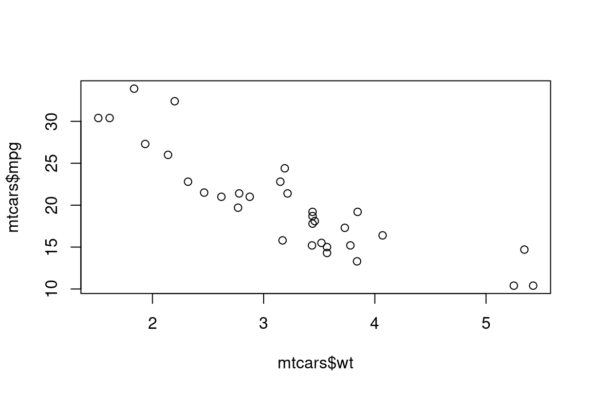
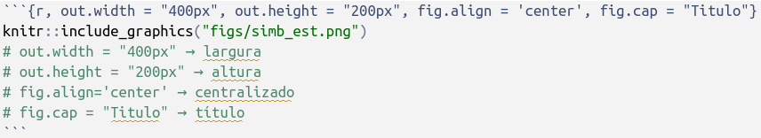

# R Markdown

## Conceitos Básicos

<div style="background-color: #e6f2ff; border: 1px solid #007acc; padding: 10px; border-radius: 5px;">
<details open>
<summary><strong> O que é R Markdown? </strong></summary>
 É uma linguagem de texto simples que permite combinar código R, resultados de análises e texto explicativo em um único documento. É uma ferramenta poderosa para criar relatórios, apresentações, livros e páginas web de forma automatizada e reproduzível. 

</details>
</div>

Ele permite:

- Combinar texto, código R e resultados de análises em um único arquivo.
- Gerar relatórios de forma automatizada e, se necessário, reproduzir os resultados com as mesmas configurações.
- Vários formatos de saída como PDF, HTML, Word, PowerPoint, entre outros.

Os arquivos R Markdown têm a extensão .Rmd e são compostos por:

- Texto: Formatação de texto utilizando a linguagem Markdown (negrito, itálico, títulos, etc.). 
- Blocos de código: Pedaços de código R que são executados e os resultados são incorporados ao documento. 
- Resultados: Inclui tabelas, gráficos, textos e outros outputs gerados pela execução do código. 

Para criar um novo arquivo .Rmd: **File > New File > R Markdown**. Após salvar este arquivo, e clicar no botão `Knit`, é possível compilar e visualizar a saída do exemplo de referência.

Os arquivos em R Markdown têm a seguinte estrutura:

1. YAML: cabeçalho
YAML (Yet Another Markup Language) é o cabeçalho do documento RMarkdown, delimitado por três tracinhos `---` no início e no fim. Ele serve para configurar metadados e o formato de saída do documento.


``` r
  ---
  title: "Meu Primeiro Relatório"
  author: "Seu Nome"
  date: "`r Sys.Date()`"
  output: html_document
  ---
```

2. Corpo do documento:
    - Chunks: blocos de código
    - Texto: Markdown
    -	Elementos especiais (imagens e figuras, tabelas, equações)


## Corpo do documento 

#### (i) Chunks {-}

São blocos de código que você insere no meio do texto para executar comandos. Em geral, utilizam-se códigos em R, mas também é possível adicionar chunks de outras linhuagens, como Python, SQL, etc. A estrutura geral do chunk é:

```` ```{linguagem nome_do_chunk, opções} ````

```` código````

```` ``` ````

Exemplo de um chunk com código em R:

```` ```{r}  ````

````summary(mtcars[,1:3]) ````

```` ``` ````


```
##       mpg             cyl             disp      
##  Min.   :10.40   Min.   :4.000   Min.   : 71.1  
##  1st Qu.:15.43   1st Qu.:4.000   1st Qu.:120.8  
##  Median :19.20   Median :6.000   Median :196.3  
##  Mean   :20.09   Mean   :6.188   Mean   :230.7  
##  3rd Qu.:22.80   3rd Qu.:8.000   3rd Qu.:326.0  
##  Max.   :33.90   Max.   :8.000   Max.   :472.0
```

**Opções de Chunk:**


Table: (\#tab:chunk-opcoes)Principais opções de chunk em R Markdown

|Opção      |Descrição                                         |Valor Padrão |
|:----------|:-------------------------------------------------|:------------|
|echo       |Mostra ou oculta o código no documento            |TRUE         |
|eval       |Executa ou ignora o código                        |TRUE         |
|message    |Mostra mensagens geradas pelo código              |TRUE         |
|warning    |Mostra avisos gerados pelo código                 |TRUE         |
|include    |Inclui ou não o código e resultado no documento   |TRUE         |
|results    |Controla como os resultados de texto aparecem     |'markup'     |
|fig.width  |Define a largura do gráfico (em polegadas)        |7            |
|fig.height |Define a altura do gráfico (em polegadas)         |7            |
|fig.align  |Alinhamento do gráfico no documento               |'default'    |
|cache      |Armazena resultados em cache para acelerar o knit |FALSE        |

**Exemplos:**

1. Oculta o código, mas mostra o resultado:

Código:

```` ```{r, echo=FALSE} ````

```` summary(mtcars[,1:3]) ````

```` ``` ````

Saída:

```
##       mpg             cyl             disp      
##  Min.   :10.40   Min.   :4.000   Min.   : 71.1  
##  1st Qu.:15.43   1st Qu.:4.000   1st Qu.:120.8  
##  Median :19.20   Median :6.000   Median :196.3  
##  Mean   :20.09   Mean   :6.188   Mean   :230.7  
##  3rd Qu.:22.80   3rd Qu.:8.000   3rd Qu.:326.0  
##  Max.   :33.90   Max.   :8.000   Max.   :472.0
```

2. Mostra o código, mas não executa (útil para exemplos):

Código:

```` ```{r, eval=FALSE}````

```` hist(mtcars$mpg) ````

```` ``` ````

Saída:

``` r
hist(mtcars$mpg)
```

3. Executa, mas não mostra resultado nem código:

Código:

```` ```{r, include=FALSE} ````

```` set.seed(123) ````

```` ``` ````

4. Oculta mensagens e avisos:

Código:

```` ```{r, message=FALSE, warning=FALSE} ````

```` library(dplyr) ````

```` ``` ````

Saída:

``` r
library(dplyr)
```

5. Personaliza tamanho e alinhamento do gráfico:

Código:

```` ```{r, fig.width=6, fig.height=4, fig.align='center'} ````

```` plot(mtcars$wt, mtcars$mpg) ````

```` ``` ````

Saída:


``` r
plot(mtcars$wt, mtcars$mpg)
```



6. Opções globais: Podemos definir opções que se aplicam a todos os chunks do documento usando:


```` ```{r setup, include=FALSE} ````

```` knitr::opts_chunk$set(echo = TRUE, warning = FALSE, message = FALSE) ````

```` ``` ````


#### Exercícios {-}

**1.** Crie um relatório no R Markdown. Modifique o título e nome do autor e adicione, para cada item, um chunk em R que:

a. Mostre um gráfico de dispersão entre `Sepal.Length` e `Sepal.Width` do dataset `iris`, mas não mostre o código-fonte no relatório.
b. Mostre o código `boxplot(len ~ supp, data = ToothGrowth)`, mas não execute o código.
c. Carregue os pacotes `dplyr` e `ggplot2` e suprima as mensagens e avisos.
d. Crie um histograma da variável `hwy` do dataset `mpg` (pacote `ggplot2`), com as seguintes configurações:   
- Largura: 5 polegadas
- Altura: 3 polegadas
- Alinhamento: esquerda


<div id="protectedContent1" style="display:none;">

### Respostas {-}

```r
---
title: "Relatório"
author: "Nome"
date: "2025-05-26"
output: html_document
---

# a.
Gráfico de dispersão entre `Sepal.Length` e `Sepal.Width`, sem exibir o código:
<!-- ```{r, echo=FALSE} -->
<!-- plot(iris$Sepal.Length, iris$Sepal.Width) -->
<!-- ``` -->
# b.
Mostrar o código, mas não executá-lo:
<!-- ```{r, eval=FALSE} -->
<!-- boxplot(len ~ supp, data = ToothGrowth) -->
<!-- ``` -->
# c.
Carregar pacotes suprimindo mensagens e avisos:
<!-- ```{r, message=FALSE, warning=FALSE} -->
<!-- library(dplyr) -->
<!-- library(ggplot2) -->
<!-- ``` -->
# d.
Histograma da variável `hwy` com dimensões personalizadas:
<!-- ```{r, fig.width=5, fig.height=3, fig.align='left'} -->
<!-- library(ggplot2) -->
<!-- ggplot(mpg, aes(x = hwy)) + -->
<!--   geom_histogram(binwidth = 2, fill = "steelblue", color = "white") + -->
<!--   labs(title = "Histograma de hwy", x = "hwy", y = "Frequência") -->
<!-- ``` -->
```

</div>

<input type="password" id="passwordInput1" placeholder="Digite a senha">
<button id="submitButton1">Acesso Professor</button>


<script>

document.getElementById("submitButton1").addEventListener("click", function()
{
  var password = document.getElementById("passwordInput1").value;
  var correctPassword = "0987";

  if (password === correctPassword)
  {
    document.getElementById("protectedContent1").style.display = "block";
  }else
  {
    alert("Senha incorreta! Tente novamente.");
  }
});
</script>


#### (ii) Texto: Markdown {-}

São escritos usando a sintaxe Markdown.


- **Títulos e Subtítulos:** Use # para definir hierarquia:

  - `# Título (nível 1)`
  - `## Seção (nível 2)`
  - `### Subseção (nível 3)`
  
Eles aparecem com estilos diferentes e também podem gerar sumário automático (toc: true no YAML).

Exemplo:

``` r
---
title: "Relatório"
author: "nome"
date: "2025-05-26"
output:
  html_document:
    toc: true # ativa o sumário automático
    toc_depth: 2 # mostra até 2 niveis no sumário # e ##
    number_sections: true # enumera as seções
---
```


- **Formatação de textos:**
  - Negrito: `**texto**` ou `__texto__` → __texto__
  - Itálico: `*texto*` ou `_texto_` → *texto*
  - Negrito e itálico:	`***Texto***` → ***Texto***
  - Riscado: `~~Texto~~` → ~~Texto~~

- **Listas:**

```r
# Não ordenadas:
- Item A
- Item B
  - Subitem B.1
* Outro item

# Ordenadas:
1. Primeiro
2. Segundo
   1. Subitem
```
    
- **Código embutido ou inline:**

``` r
`mean()` # mostra a sintaxe de código
`r mean(mtcars$mpg)` # mostra o resultado do código compilado
```

**Exemplo:** A frase: 

A média da variável `speed` no dataset `cars` é 15.4.

foi escrita como:


``` r
A média da variável `speed` no dataset `cars` é `r mean(cars$speed)`.
```

-  **Separadores e Linhas:** `---` cria uma linha horizontal para dividir seções.

- **Links:**

```r
[Texto do link](https://exemplo.com)
# ou em html:
<a href="https://exemplo.com" target="_blank">Clique aqui</a>
```


#### Exercícios {-}

Reproduza, com as configurações adequadas, o seguinte relatório em RMarkdown: [Relatório RMarkdown](https://angelicamariatortola.github.io/academic/figs/exercicio_RMarkdown.html)


#### (iii) Elementos especiais {-}

##### Imagens e Figuras {-}

- Imagens em Markdown (fora do chunk):
```r
# Inserir uma imagem local:


# Inserir uma imagem da internet:


# Controlando o tamanho da imagem:
{width=50%}
```

- Imagens com o `knitr::include_graphics()` (dentro do chunk):

```r
knitr::include_graphics("caminho/para/imagem.png")

# Opções úteis:
# out.width="300px" ou "50%"
# fig.align = 'center' | 'left' | 'right'
# fig.cap = "Legenda da imagem"
```

**Exemplo:** Imagem com personalizações:



<div class="figure" style="text-align: center">

<p class="caption">(\#fig:unnamed-chunk-12)Titulo</p>
</div>

<br>

##### Tabelas {-}

- Tabela em Markdown (fora do chunk):

Código:
```latex
| Nome   | Idade | Cidade      |
|--------|-------|-------------|
| João   | 25    | São Paulo   |
| Maria  | 30    | Rio de Janeiro |
```

Saída:

| Nome   | Idade | Cidade      |
|--------|-------|-------------|
| João   | 25    | São Paulo   |
| Maria  | 30    | Rio de Janeiro |


- Tabela com `knitr::kable()` (dentro do chunk):


``` r
knitr::kable(head(mtcars[,1:3]), caption = "Tabela com kable")
```


Table: (\#tab:unnamed-chunk-13)Tabela com kable

|                  |  mpg| cyl| disp|
|:-----------------|----:|---:|----:|
|Mazda RX4         | 21.0|   6|  160|
|Mazda RX4 Wag     | 21.0|   6|  160|
|Datsun 710        | 22.8|   4|  108|
|Hornet 4 Drive    | 21.4|   6|  258|
|Hornet Sportabout | 18.7|   8|  360|
|Valiant           | 18.1|   6|  225|

Considerando dados simulados:


``` r
set.seed(1234)
dados <- data.frame(
  Aluno = paste("Aluno", 1:5),
  Curso = c(rep("Engenharia", 2), rep("Informática",2), "Física"),
  Idade = round(runif(5, 18, 25), 0),
  Periodo = round(runif(5, 2, 9), 0),
  Nota = round(runif(5, 5, 10), 1)
)

dados %>%
  knitr::kable(caption = "Notas dos alunos") 
```


Table: (\#tab:unnamed-chunk-14)Notas dos alunos

|Aluno   |Curso       | Idade| Periodo| Nota|
|:-------|:-----------|-----:|-------:|----:|
|Aluno 1 |Engenharia  |    19|       6|  8.5|
|Aluno 2 |Engenharia  |    22|       2|  7.7|
|Aluno 3 |Informática |    22|       4|  6.4|
|Aluno 4 |Informática |    22|       7|  9.6|
|Aluno 5 |Física      |    24|       6|  6.5|

<br>

##### Equações {-}


- Fórmula em linha `$...$` ou `\(...\)`: `\(E = mc^2\)` → \(E = mc^2\)
- Fórmula em bloco `$$...$$` ou `\[...\]`:

Código:
```latex
$$
x = \frac{2a}{b}
$$
```

Saída:
$$
x = \frac{2a}{b}
$$

**Operações Básicas:**

| Descrição      | Código                     | Renderização           |
|----------------|----------------------------|-------------------------|
| Soma           | `\sum_{i=1}^{n} x_i`  | \(\sum_{i=1}^{n} x_i\) |
| Produto        | `\prod_{i=1}^{n} x_i` | \(\prod_{i=1}^{n} x_i\) |
| Exponencial | `\exp{(a)}` | $\exp{(a)}$ |
| Integral       | `\int_a^b f(x)\,dx`      | \(\int_a^b f(x)\,dx\)     |
| Fração         | `\frac{a}{b}`         | \(\frac{a}{b}\)        |
| Raiz           | `\sqrt{x}`              | \(\sqrt{x}\)       |
| Potência       | `x^2`                      | \(x^2\)       |
| Índice         | `x_i`                      | \(x_i\)       |

**Operadores e Símbolos:**

| Código     | Renderização    |
|------------|------------------|
| `\pm`     | \(\pm\)       |
| `\cdot`   | \(\cdot\)     |
| `\times`  | \(\times\)    |
| `\div`    | \(\div\)      |
| `\leq`    | \(\leq\)      |
| `\geq`    | \(\geq\)      |
| `\neq`    | \(\neq\)      |
| `\approx` | \(\approx\)   |
| `\infty`  | \(\infty\)    |
| `(\frac{a}{b})` ou `\left(\frac{a}{b}\right)` | $(\frac{a}{b})$ ou $\left(\frac{a}{b}\right)$ |
`[\frac{2a}{b}]` ou `\left[\frac{2a}{b}\right]` | $[\frac{2a}{b}]$ ou $\left[\frac{2a}{b}\right]$ |
`\{\frac{2a}{b}\}` ou `\left\{\frac{2a}{b}\right\}` | $\{\frac{2a}{b}\}$ ou $\left\{\frac{2a}{b}\right\}$ |

**Letras Gregas:**

| Nome    | Código        | Renderização   |
|---------|---------------|----------------|
| Alfa    | `\alpha`     | \(\alpha\)  |
| Beta    | `\beta`      | \(\beta\)   |
| Gama    | `\gamma`     | \(\gamma\)  |
| Delta   | `\delta`     | \(\delta\)  |
| Lambda  | `\lambda`    | \(\lambda\) |
| Mi    | `\mu`     | \(\mu\)  |
| Pi      | `\pi`        | \(\pi\)     |
| Sigma   | `\sigma`     | \(\sigma\)  |
| Teta    | `\theta`     | \(\theta\)  |
| Ômega   | `\omega`     | \(\omega\)  |


**Matrizes:**

Código:
```latex
$$
A = \begin{bmatrix}
1 & 2 \\
3 & 4
\end{bmatrix}
$$
```
Saída:

$$
A = \begin{bmatrix}
1 & 2 \\
3 & 4
\end{bmatrix}
$$
Código:

```latex
$$
A = \begin{pmatrix}
1 & 2 \\
3 & 4
\end{pmatrix}
$$
```

Saída:

$$
A = \begin{pmatrix}
1 & 2 \\
3 & 4
\end{pmatrix}
$$

**Exemplos:**

1. Fórmula de Bhaskara

Código:
```latex
$$
x = \frac{-b \pm \sqrt{b^2 - 4ac}}{2a}
$$
```

Saída:
$$
x = \frac{-b \pm \sqrt{b^2 - 4ac}}{2a}
$$

2. Média amostral


Código:
```latex
$$
\bar{x} = \frac{1}{n} \left(\sum_{i=1}^{n} x_i \right)
$$
```

Saída:
$$
\bar{x} = \frac{1}{n} \left(\sum_{i=1}^{n} x_i \right)
$$


#### Exercícios {-}

**1.** Adicione uma imagem da internet em seu arquivo de Rmarkdown usando: (1) Markdown puro (fora do chunk) e (2) `knitr::include_graphics()` (dentro do chunk).

**2.** Crie a tabela a seguir usando: (1) Markdown puro (fora do chunk) e (2) `knitr::kable()` (dentro do chunk). Explore outros argumentos da função `knitr::kable`.

| Aluno | Nota |
|-------|------|
| Ana   | 9.0  |
| Beto  | 7.5  |
| Carla | 8.0  |

**3.** Reproduza o texto a seguir em RMarkdown:

<div style="background-color:#f0f8ff; padding:15px; border-left:5px solid #4682b4;">

Em estatística a distribuição **Normal** é um modelo muito utilizado. Dizemos que uma variável se comporta de acordo com o modelo Normal com média \(\mu\) e variância $\sigma^2$ se a sua função densidade de probabilidade for dada por:
 
\[
f(x) = \dfrac{1}{\sqrt{2\pi \sigma^2}} 
              \exp{\left\{-\frac{1}{2}\left(\frac{x-\mu}{\sigma}\right)^2\right\}}
\]
para $-\infty < x < \infty$, onde $E(X) = \mu$ e $\sigma^2 > 0$.

Ao coletarmos uma amostra de uma população, podemos calcular a **média amostral**, representada por $\bar{x}$, que é uma estimativa para a **média populacional** $\mu$. A média amostral é dada por:

$$
\bar{x} = \frac{1}{n} \sum_{i=1}^n x_i
$$

A **variância amostral** é uma estimativa para a variância da população $\sigma^2$, e é calculada por:

$$
s^2 = \frac{1}{n - 1} \sum_{i=1}^n (x_i - \bar{x})^2
$$
</div>


<div id="protectedContent2" style="display:none;">

### Respostas {-}
```r
## 1.
# Imagem (1) - Markdown puro

# Imagem (2) - Usando `knitr::include_graphics()`
# knitr::include_graphics("https://www.rstudio.com/wp-content/uploads/2018/10/RStudio-Logo-Flat.png")
## 2.
# Tabela (1) - Markdown puro
| Aluno | Nota |
|-------|------|
| Ana   | 9.0  |
| Beto  | 7.5  |
| Carla | 8.0  |
# Tabela (2) - Usando knitr::kable()
library(knitr)
# Dados da tabela
dados <- data.frame(
  Aluno = c("Ana", "Beto", "Carla"),
  Nota = c(9.0, 7.5, 8.0)
)
# Tabela com kable e alguns argumentos extras
kable(dados, format = "html", caption = "Notas dos Alunos", align = "c")
## 3. Texto
Em estatística a distribuição **Normal** é um modelo muito utilizado. Dizemos que uma variável se comporta de acordo com o modelo Normal com média \(\mu\) e variância $\sigma^2$ se a sua função densidade de probabilidade for dada por:
\[
f(x) = \dfrac{1}{\sqrt{2\pi \sigma^2}} 
              \exp{\left\{-\frac{1}{2}\left(\frac{x-\mu}{\sigma}\right)^2\right\}}
\]
para $-\infty < x < \infty$, onde $E(X) = \mu$ e $\sigma^2 > 0$.
Ao coletarmos uma amostra de uma população, podemos calcular a **média amostral**, representada por $\bar{x}$, que é uma estimativa para a **média populacional** $\mu$. A média amostral é dada por:
$$
\bar{x} = \frac{1}{n} \sum_{i=1}^n x_i
$$
A **variância amostral** é uma estimativa para a variância da população $\sigma^2$, e é calculada por:
$$
s^2 = \frac{1}{n - 1} \sum_{i=1}^n (x_i - \bar{x})^2
$$
```

</div>

<input type="password" id="passwordInput2" placeholder="Digite a senha">
<button id="submitButton2">Acesso Professor</button>


<script>

document.getElementById("submitButton2").addEventListener("click", function()
{
  var password = document.getElementById("passwordInput2").value;
  var correctPassword = "0987";

  if (password === correctPassword)
  {
    document.getElementById("protectedContent2").style.display = "block";
  }else
  {
    alert("Senha incorreta! Tente novamente.");
  }
});
</script>

 
## Slides e Apresentações

- Para criar apresentações: **File > New File > Quarto Presentation...**
- Opções de visualização: *source* e *visual*
- O arquivo salvo tem a extensão .qmd

#### Criando Slides {-}

- Os slides são delimitados por títulos ou por `---`. 

**Exemplo:** apresentação com dois slides.

```qmd
# Divisão de slides feita por títulos de nível 2 ( ##)
---
title: "Hábitos"
author: "John Doe"
format: revealjs
---

## Levantar

- Desligar o alarme
- Sair da cama

## Dormir

- Deitar na cama
- Contar carneirinhos
```

```qmd
# Divisão de slides feita por ---
---
title: "Hábitos"
author: "John Doe"
format: revealjs
---

---

- Desligar o alarme
- Sair da cama
---

- Deitar na cama
- Contar carneirinhos
```

Também é possível dividir as apresentações em seções com slides de título usando um título de nível 1 ( #). Por exemplo:
```qmd
---
title: "Hábitos"
author: "John Doe"
format: revealjs
---

# De manhã

## Levantar

- Desligar o alarme
- Sair da cama

## Café da manhã

- Comer ovos
- Tomar café

# À noite

## Jantar

- Comer espaguete
- Beber vinho

## Dormir

- Deitar na cama
- Contar carneirinhos
```

#### Listas incrementais {-}

Por padrão, as listas de números e marcadores dentro dos slides são exibidas todas de uma vez. Você pode substituir isso globalmente usando:

```qmd
title: "Minha Apresentação"
format:
  revealjs:
    incremental: true   
```

Para tornar as listas incrementais individualmente:
```qmd
::: {.incremental}
- Comer espaguete
- Beber vinho
:::  
```

Para tornar as listas **não** incrementais individualmente:
```qmd
::: {.nonincremental}
- Comer espaguete
- Beber vinho
:::
```


#### Colunas múltiplas {-}

Para colocar material em colunas lado a lado, podemos usar o contêiner `.columns`, contendo dois ou mais contêineres `.column` e com atributo `width`:

```qmd
:::: {.columns}

::: {.column width="40%"}
conteudo...
:::

::: {.column width="60%"}
conteudo...
:::

::::
```

Poderia usar também:
```qmd
::: columns

::: column
conteudo
:::

::: column
conteudo
:::
  
:::
```

#### Notas pessoais {-}

```qmd
## Slide com notas do palestrante

Conteúdo do slide

::: {.notes}
As notas do palestrante vão aqui.
:::
```

#### Temas {-}

Há 11 temas integrados disponíveis para apresentações. O tema default é usado automaticamente. Para mudar o tema, deve-se usar a opção `theme`:
```qmd
---
title: "Apresentação"
format:
  revealjs: 
    theme: dark
---
```

Outros temas disponíveis:
Aqui está a lista completa de temas disponíveis:

- beige
- blood
- dark
- default
- league
- moon
- night
- serif
- simple
- sky
- solarized


<!-- #### Rodapé e logotipo {-} -->

<!-- #### Destaque de linhas de código {-} -->


Outras informações em: https://quarto.org/docs/presentations/revealjs/


#### Exercícios {-}

Reproduza a seguinte apresentação usando `Quarto Presentation` do R Markdown: [Apresentação de Slides com RMarkdown](https://angelicamariatortola.github.io/academic/figs/aula-estatistica.html)

#### Exercícios do Capítulo 7 <span style="color:red">(Entregar na lista 2)</span>  {-}

**1.** Criar um relatório no RMarkdown que inclua:

- Chunks de código
- Gráficos com ggplot2
- Gráficos interativos com plotly
- Personalizações de texto (negrito, itálico, títulos)
- Códigos inline
- Imagens
- Tabelas (Markdown e kable)
- Símbolos e equações matemáticas 

**2.** Criar uma apresentação de slides no RMarkdown que inclua todos os itens do exercício anterior e adicionalmente contemple:

- Listas incrementais
- Colunas múltiplas
- Tema personalizado
- Rodapé e logotipo
<!-- - Destaque de linhas de código -->

