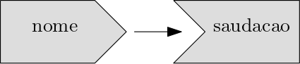

# Shiny


## Introdução ao Shiny

<div class="alert alert-info"> <strong>Definição:</strong> Shiny é um framework para R que permite criar aplicações web interativas diretamente a partir do código R, sem necessidade de conhecimentos em HTML, CSS ou JavaScript. </div>

Para começar a trabalhar com Shiny, primeiro instale o pacote:


``` r
# Instalação do pacote Shiny
# install.packages("shiny")
# Carregando o pacote
library(shiny)
```

Para criar um novo app, salvar um script com a extensão .R, exemplo **app.R**. A partir disso, pode adicionar rapidamente o modelo do aplicativo digitando "shinyapp" e pressionando Shift+Tab.


A estrutura de um App Shiny, é composta de:

**1. Interface do Usuário (UI):** A UI define a aparência do aplicativo - o que o usuário vê e com o que interage.

**2. Servidor (Server):** O servidor contém a lógica do aplicativo - como ele responde às interações do usuário.

**3. Função que combina ambos UI e Server:** Para criar o aplicativo, combinamos a UI e o servidor com a função `shinyApp(ui = ui, server = server)`

- RunApp: executa o aplicativo

- Stop (no RStudio) ou fechar a janela do app: encerra o aplicativo

### Adicionando controles de UI

```r
library(shiny)

ui <- fluidPage(
  selectInput("dataset", label = "Conjunto de Dados", 
  choices = ls("package:datasets")),
  verbatimTextOutput("resumo"),
  tableOutput("tabela")
)

server <- function(input, output, session) {

}

shinyApp(ui, server)
```

  - `fluidPage()`: função de layout que define a estrutura visual básica da página.
  - `selectInput()`: controle de entrada que permite ao usuário interagir com o aplicativo fornecendo um valor. Neste caso, é uma caixa de seleção com o rótulo "Conjunto de Dados" e permite escolher um dos conjuntos de dados que vêm com o R.
  - `verbatimTextOutput()` e `tableOutput()`: controles de saída que informam ao Shiny onde colocar a saída renderizada. `verbatimTextOutput()` exibe código e `tableOutput()` tabelas.
  - Vemos apenas a entrada, não as duas saídas, porque ainda não informamos ao Shiny como a entrada e as saídas estão relacionadas.


### Adicionando comportamento ao Server


```r
library(shiny)

ui <- fluidPage(
  selectInput("dataset", label = "Conjunto de Dados", 
  choices = ls("package:datasets")),
  verbatimTextOutput("resumo"),
  tableOutput("tabela")
)

server <- function(input, output, session) {
  output$resumo <- renderPrint({
    dataset <- get(input$dataset, "package:datasets")
    summary(dataset)
  })
  
  output$tabela <- renderTable({
    dataset <- get(input$dataset, "package:datasets")
    dataset
  })
}

shinyApp(ui, server)
```

- Cada input e output na UI tem identificarodes (IDs). Chamando `input$ID` e `output$ID` no servidor é a forma de identificar no shiny uma entrada e uma saída específica, com base no seu ID.
- `output$ID`: indica que você está fornecendo a receita para a saída do Shiny com esse ID.
- Funções de renderização (**render{Type}**): encapsulam o código fornecido e conectam inputs e outputs.
- Cada função **render{Type}** é projetada para produzir um tipo específico de saída (texto, tabelas e gráficos) e geralmente é pareada com uma função **{type}Output**. Exemplo, `renderPrint()` é pareado com `verbatimTextOutput()` e `renderTable()` é pareado com `tableOutput()`.


**Observações:**

- O resumo e a tabela são atualizados sempre que você altera o conjunto de dados de entrada. 
- Essa dependência é criada implicitamente, pois utilizamos `input$dataset` nas funções de saída. 
- `input$dataset` é preenchido com o valor atual do componente de interface do usuário com id `dataset` e fará com que as saídas sejam atualizadas automaticamente sempre que esse valor for alterado.
- Essa é a essência da reatividade: as saídas reagem (recalculam) automaticamente quando suas entradas são alteradas.

### Expressões Reativas

São usadas para evitar códigos duplicados. No exemplo anterior, o código a seguir é repetido 2 vezes.

```r
dataset <- get(input$dataset, "package:datasets")
```

Para criar uma expressão reativa:
```r
expressao_reativa <- reactive({...})
```

Para chamar o seu valor, usamos: `expressao_reativa()`.

A expressão reativa só é executada na primeira vez que é chamada e, em seguida, armazena o resultado em cache até que ele precise ser atualizado, deixando o código mais eficiente.

Atualizando o app com a expressão reativa:

```r
library(shiny)

ui <- fluidPage(
  selectInput("dataset", label = "Conjunto de Dados", 
  choices = ls("package:datasets")),
  verbatimTextOutput("resumo"),
  tableOutput("tabela")
)

server <- function(input, output, session) {
  # Criando uma expressão reativa
  dataset <- reactive({
    get(input$dataset, "package:datasets")
  })

  output$resumo <- renderPrint({
    # Chamando-a como uma função
    summary(dataset())
  })
  
  output$tabela <- renderTable({
    dataset()
  })
}

shinyApp(ui, server)
```

O aplicativo se comporta de forma idêntica, mas funciona um pouco mais eficientemente, pois só precisa recuperar o conjunto de dados uma vez, e não duas.


### Exercícios - Seção 8.1 {-}

**1.** Crie um aplicativo que cumprimente o usuário pelo nome. Considerando as funções abaixo, organize e identifique quais delas serão necessárias para esta finalidade.

```r
tableOutput("mortgage")
output$greeting <- renderText({
  paste0("Hello ", input$name)
})
numericInput("age", "How old are you?", value = NA)
textInput("name", "What's your name?")
textOutput("greeting")
output$histogram <- renderPlot({
  hist(rnorm(1000))
}, res = 96)
```

**2.** Suponha que seu amigo queira criar um aplicativo que permita ao usuário definir um número (x) entre 1 e 50 e exiba o resultado da multiplicação desse número por 5. Esta é a primeira tentativa dele:


``` r
library(shiny)

ui <- fluidPage(
  sliderInput("x", label = "If x is", min = 1, max = 50, value = 30),
  "then x times 5 is",
  textOutput("product")
)

server <- function(input, output, session) {
  output$product <- renderText({ 
    x * 5
  })
}

shinyApp(ui, server)
```

Mas infelizmente tem um erro. Você pode ajudá-lo a encontrar e corrigir o erro?

**3.** Expanda o aplicativo do exercício anterior para permitir que o usuário defina o valor do multiplicador, y, para que o aplicativo produza o valor de x * y. O resultado final deve ser semelhante a este:


**4.** Considere o aplicativo a seguir, que adiciona algumas funcionalidades adicionais ao aplicativo descrito no exercício anterior. O que há de novo? Como você poderia reduzir a quantidade de código duplicado no aplicativo usando uma expressão reativa?

```r
library(shiny)

ui <- fluidPage(
  sliderInput("x", "If x is", min = 1, max = 50, value = 30),
  sliderInput("y", "and y is", min = 1, max = 50, value = 5),
  "then, (x * y) is", textOutput("product"),
  "and, (x * y) + 5 is", textOutput("product_plus5"),
  "and (x * y) + 10 is", textOutput("product_plus10")
)

server <- function(input, output, session) {
  output$product <- renderText({ 
    product <- input$x * input$y
    product
  })
  output$product_plus5 <- renderText({ 
    product <- input$x * input$y
    product + 5
  })
  output$product_plus10 <- renderText({ 
    product <- input$x * input$y
    product + 10
  })
}

shinyApp(ui, server)
```

**5.** No aplicativo a seguir, você seleciona um conjunto de dados de um pacote (usando o pacote ggplot2) e o aplicativo imprime um resumo e um gráfico dos dados. Ele também segue boas práticas e utiliza expressões reativas para evitar redundância de código. No entanto, há três bugs no código fornecido abaixo. Você consegue encontrá-los e corrigi-los?

```r
library(shiny)
library(ggplot2)

datasets <- c("economics", "faithfuld", "seals")
ui <- fluidPage(
  selectInput("dataset", "Dataset", choices = datasets),
  verbatimTextOutput("summary"),
  tableOutput("plot")
)

server <- function(input, output, session) {
  dataset <- reactive({
    get(input$dataset, "package:ggplot2")
  })
  output$summmry <- renderPrint({
    summary(dataset())
  })
  output$plot <- renderPlot({
    plot(dataset)
  }, res = 96)
}

shinyApp(ui, server)
```


<div id="protectedContent1" style="display:none;">

### Respostas {-}


``` r
## 1.
library(shiny)
ui <- fluidPage(
  textInput("name", "What's your name?"),
  textOutput("greeting")
)
server <- function(input, output, session) {
  output$greeting <- renderText({
    paste0("Hello ", input$name)
  })
}
shinyApp(ui, server)
## 2.
O erro aqui surge porque, no lado do servidor, precisamos escrever 
input$x em vez de x.
## 3.
Vamos adicionar outro sliderInput com ID y e usar ambos input$x e input$y 
para calcular output$product.
library(shiny)
ui <- fluidPage(
  sliderInput("x", label = "If x is", min = 1, max = 50, value = 30),
  sliderInput("y", label = "and y is", min = 1, max = 50, value = 30),
  "then x multiplied by y is",
  textOutput("product")
)
server <- function(input, output, session) {
  output$product <- renderText({ 
    input$x * input$y
  })
}
shinyApp(ui, server)
## 4.
# A novidade é o cálculo adicional em que 5 e 10 foram adicionados
# ao produto e as saídas renderizadas como texto.
library(shiny)
ui <- fluidPage(
    sliderInput("x", "If x is", min = 1, max = 50, value = 30),
    sliderInput("y", "and y is", min = 1, max = 50, value = 5),
    "then, (x * y) is", textOutput("product"),
    "and, (x * y) + 5 is", textOutput("product_plus5"),
    "and (x * y) + 10 is", textOutput("product_plus10")
)
server <- function(input, output, session) {
    # Add this reactive expression to reduce 
    # amount of duplicated code
    product <- reactive({
        input$x * input$y
    })
    output$product <- renderText({ 
        product()
    })
    output$product_plus5 <- renderText({ 
        product() + 5
    })
    output$product_plus10 <- renderText({ 
        product() + 10
    })
}
shinyApp(ui, server)
## 5.
# Erros:
# 1º erro:
# trocar tableOutput("plot") por plotOutput("plot") -> renderPlot
# 2º erro:
# summary esta escrito errado em output$summmry
# 3º erro:
# trocar plot(dataset) por plot(dataset()) para usar a expressão reativa
```

</div>

<input type="password" id="passwordInput1" placeholder="Digite a senha">
<button id="submitButton1">Acesso Professor</button>


<script>

document.getElementById("submitButton1").addEventListener("click", function()
{
  var password = document.getElementById("passwordInput1").value;
  var correctPassword = "09878";

  if (password === correctPassword)
  {
    document.getElementById("protectedContent1").style.display = "block";
  }else
  {
    alert("Senha incorreta! Tente novamente.");
  }
});
</script>


## UI básica

A estrutura do UI (front-end) do shiny possibilita diferentes tipos de funções de entrada e saída que permitem capturar diversos tipos de dados e exibir diversos tipos de saída em R. 

### Entradas

Argumentos das funções de entrada:

- `inputId` (primeiro argumento presente em todas as funções): Este é o identificador usado para conectar o front-end com o back-end. Se sua interface de usuário tiver uma entrada com ID "name", a função do servidor a acessará com `input$name`. O `inputId` tem duas restrições:
  - Deve ser uma string simples contendo apenas letras, números e sublinhados. Deve ser nomeada como uma variável em R.
  - Deve ser único. 

- `label` (segundo argumento presente na maioria das funções): usado para criar um rótulo legível para o controle.

- `value` (terceiro argumento): quando pesente, permite definir o valor padrão. 

#### Principais funções de entrada do Shiny {-}

**1. Texto livre** 

Permite coletar pequenas quantidades de texto com `textInput()`, senhas com `passwordInput()` e parágrafos de texto com `textAreaInput()`.

```r
ui <- fluidPage(
  textInput("name", "Qual é o seu nome?"),
  passwordInput("password", "Qual é a sua senha?"),
  textAreaInput("story", "Fale sobre você", rows = 3)
)
```


**2. Entradas numéricas** 

Para valores numéricos: caixa de texto restrita com `numericInput()` ou um controle deslizante com `sliderInput()`.

```r
ui <- fluidPage(
  numericInput("num", "Número um", value = 0, min = 0, max = 100),
  sliderInput("num2", "Número dois", value = 50, min = 0, max = 100),
  sliderInput("rng", "Intervalo", value = c(10, 20), min = 0, max = 100)
)
```


**3. Datas** 

Para coletar um único dia: `dateInput()`; ou um intervalo de dias: `dateRangeInput()`.

```r
ui <- fluidPage(
  dateInput("dob", "Quando você nasceu?"),
  dateRangeInput("holiday", "Quando você quer tirar as próximas férias?")
)
```


**4. Escolhas limitadas**

Existem duas abordagens diferentes para permitir que o usuário escolha entre um conjunto pré-especificado de opções: `selectInput()` e `radioButtons()`.

```r
animais <- c("cachorro", "gato", "rato", "pássaro", "outro", "nenhum")
estados <- c("PR", "SC", "SP", "RJ")

ui <- fluidPage(
  selectInput("estado", "Qual é o seu estado favorito?", estados),
  radioButtons("animal", "Qual é o seu animal favorito?", animais)
)
```


- Os botões de opção (`radioButtons()`) têm dois recursos interessantes: eles mostram todas as opções possíveis, tornando-os adequados para listas curtas.

- Os menus suspensos (`selectInput()`) ocupam a mesma quantidade de espaço, independentemente do número de opções, tornando-os mais adequados para opções mais longas.

Você também pode configurar `multiple = TRUE`para permitir que o usuário selecione vários elementos.

```r
ui <- fluidPage(
  selectInput("estado", "Qual é o seu estado favorito?", estados,
              multiple = TRUE)
)
```


**5. Botões de ação**

Para executar ações: `actionButton()` ou `actionLink()`.

```r
ui <- fluidPage(
  actionButton("click", "Clique aqui!"),
  actionButton("drink", "Beba-me!", icon = icon("cocktail"))
)
```


- Links e botões de ação são mais naturalmente pareados com `observeEvent()` ou `eventReactive()` na sua função de servidor. 

- Você pode personalizar a aparência usando o argumento `class` "btn-primary", "btn-success", "btn-info", "btn-warning", ou "btn-danger". 

- Você também pode alterar o tamanho com "btn-lg", "btn-sm", "btn-xs".

- Por fim, você pode fazer com que os botões ocupem toda a largura do elemento em que estão incorporados usando "btn-block".

```r
ui <- fluidPage(
  fluidRow(
    actionButton("click", "Clique aqui!", class = "btn-danger"),
    actionButton("drink", "Beba-me!", class = "btn-lg btn-success")
  ),
  fluidRow(
    actionButton("resp", "Respostas!", class = "btn-block")
  )
)
```


### Exercícios - Seção 8.2.1 {-}


**1.** Quando o espaço é limitado, é útil rotular as caixas de texto com um espaço reservado que aparece dentro da área de entrada de texto. Como você chamaria `textInput()` para gerar a IU abaixo?
<div>
  <input type="text" placeholder="Your name" style="padding: 8px; width: 200px;">
</div>

**2.** Leia atentamente a documentação de `sliderInput()` e tente descobrir como criar um controle deslizante de data, conforme mostrado abaixo.


**3.** No seu aplicativo Shiny, crie um controle deslizante que permita ao usuário escolher um número entre 0 e 100, variando de 5 em 5. Em seguida, adicione uma funcionalidade de animação, de forma que, ao clicar em um botão de "play", o controle avance automaticamente pelos valores disponíveis, como se estivesse passando por eles em sequência. **Dica:** existe um argumento do controle deslizante que permite ativar esse tipo de animação automaticamente.

**4.** Quando uma lista de opções em um menu suspenso (`selectInput()`) é muito longa, pode ser útil organizá-la em grupos com rótulos — como se fossem seções ou categorias dentro da lista. Explore como criar esse tipo de organização usando `selectInput()` no Shiny. Crie um exemplo com pelo menos dois grupos e algumas opções dentro de cada grupo (como o exemplo a seguir).


<div id="protectedContent2" style="display:none;">

### Respostas {-}


``` r
##1
textInput(inputId = "text", label = "", placeholder = "Your name")
##2
# ?sliderInput -> ?Date -> as.Date
sliderInput(
  "dates",
  "Quando devemos entregar?",
  min = as.Date("2025-03-10"),
  max = as.Date("2025-03-20"),
  value = as.Date("2025-03-12")
)
##3
sliderInput("number", "Selecione um número:",
              min = 0, max = 100, value = 0, 
              step = 5, animate = TRUE)
##4
selectInput(
  "raca",
  "Selecione sua raça animal favorita:",
  choices =
    list("Cães" = list('Pastor Alemão', 'Bulldog', 'Labrador Retriever'),
         "Gatos" = list('Gato Persa', 'Gato de Bengala', 'Gato Siamês'))
)
```


</div>

<input type="password" id="passwordInput2" placeholder="Digite a senha">
<button id="submitButton2">Acesso Professor</button>


<script>

document.getElementById("submitButton2").addEventListener("click", function()
{
  var password = document.getElementById("passwordInput2").value;
  var correctPassword = "09878";

  if (password === correctPassword)
  {
    document.getElementById("protectedContent2").style.display = "block";
  }else
  {
    alert("Senha incorreta! Tente novamente.");
  }
});
</script>


### Saídas

- As saídas na UI criam espaços reservados que são posteriormente preenchidos pela função do servidor. 

- Assim como as entradas, as saídas recebem um ID exclusivo como primeiro argumento. Se a sua especificação de UI criar uma saída com ID "plot", você a acessará na função do servidor com `output$plot.`

- Cada função de output no front-end (UI) é acoplada a uma função de renderização no back-end (server).

**1. Texto**

Produza texto com `textOutput()` e código fixo com `verbatimTextOutput()`.

```r
library(shiny)

ui <- fluidPage(
  textOutput("texto"),
  verbatimTextOutput("code")
)
server <- function(input, output, session) {
  output$texto <- renderText({ 
    "Olá, bem vindo! A seguir um resumo de dados:" 
  })
  output$code <- renderPrint({ 
    summary(1:10) 
  })
}

shinyApp(ui, server)
```


Observe que há duas funções de renderização que se comportam de maneira ligeiramente diferente:

- `renderText()` combina o resultado em uma única string e geralmente é emparelhado com `textOutput()`.
- `renderPrint()` imprime o resultado, como se você estivesse em um console R, e geralmente é pareado com `verbatimTextOutput()`.


```r
ui <- fluidPage(
  textOutput("texto"),
  verbatimTextOutput("print")
)
server <- function(input, output, session) {
  output$texto <- renderText("Texto com renderText.")
  output$print <- renderPrint(cat("Texto com renderPrint."))
}
```

**2. Tabelas**

Há duas opções para exibir quadros de dados em tabelas:

- `tableOutput()` e `renderTable()` renderizam uma tabela estática de dados, mostrando todos os dados de uma só vez. Útil para resumos pequenos e fixos.

- `dataTableOutput()` e `renderDataTable()` renderizam uma tabela dinâmica. É mais apropriado se você deseja expor um quadro de dados completo ao usuário. 

```r
ui <- fluidPage(
  tableOutput("statica"),
  dataTableOutput("dinamica")
)

server <- function(input, output, session) {
  output$statica <- renderTable(head(mtcars))
  output$dinamica <- renderDataTable(mtcars, 
                                     options = list(pageLength = 5))
}
```

Versões mais recentes sugerem usar `DTOutput` e `renderDT` do pacote `DT` para tabelas dinâmicas.

```r
library(shiny)
library(DT)

ui <- fluidPage(
  tableOutput("statica"),
  DTOutput("dinamica")
)

server <- function(input, output, session) {
  output$statica <- renderTable(head(mtcars))
  output$dinamica <- renderDT(mtcars, 
                              options = list(pageLength = 5))
}
shinyApp(ui, server)
```


**3. Gráficos**

Você pode exibir qualquer tipo de gráfico R (basico, ggplot2, etc) com `plotOutput()` e `renderPlot()`.
```r
ui <- fluidPage(
  plotOutput("plot", width = "400px")
)
server <- function(input, output, session) {
  output$plot <- renderPlot(plot(1:5), res = 96)
}
```
 
- Por padrão, `plotOutput()` ocupará toda a largura do contêiner e terá 400 pixels de altura. Você pode substituir esses padrões com os argumentos height e width.

- Recomenda-se sempre definir `res = 96`, pois isso fará com que seus gráficos correspondam o máximo possível ao que você vê no RStudio.

- Os gráficos são especiais porque são saídas que também podem atuar como entradas. `plotOutput()` possui vários argumentos como `click`, `dblclick` e `hover`. Se passar uma string para eles, como `click = "plot_click"`, eles criarão uma entrada reativa (`input$plot_click`) que você pode usar para manipular a interação do usuário no gráfico, por exemplo, clicando no gráfico. 


### Exercícios - Seção 8.2.2 {-}

**1.** As funções `textOutput()` e `verbatimTextOutput()` devem ser pareadas com qual(is) função(ões) de renderização abaixo:

a. `renderPrint(summary(mtcars))`
b. `renderText("Good morning!")`
c. `renderPrint(t.test(1:5, 2:6))`
d. `renderText(str(lm(mpg ~ wt, data = mtcars)))`

**2.** Recrie o aplicativo a seguir, definindo a altura como 300px e a largura como 700px.
```r
library(shiny)
ui <- fluidPage(
  plotOutput("plot", width = "400px")
)
server <- function(input, output, session) {
  output$plot <- renderPlot(plot(1:5), res = 96)
}
shinyApp(ui, server)
```

**3.** Atualize o código abaixo para que a tabela exiba apenas os dados e o controle de paginação, removendo os controles de busca e ordenação por colunas. Para isso, use os argumentos adequados para `options` da função `renderDataTable()`. Consulte a ajuda da função renderDataTable (?renderDataTable) e a documentação oficial do DataTables para entender como desativar esses controles:
https://datatables.net/reference/option/

```r
ui <- fluidPage(
  dataTableOutput("table")
)
server <- function(input, output, session) {
  output$table <- renderDataTable(mtcars, 
                  options = list(pageLength = 5))
}
```

<div id="protectedContent3" style="display:none;">

### Respostas {-}

``` r
## 1.
# a. 
renderPrint(summary(mtcars)) -> verbatimTextOutput (console)
# b. 
renderText("Good morning!") -> textOutput
# c. 
renderPrint(t.test(1:5, 2:6)) -> verbatimTextOutput (console)
# d.
renderText(str(lm(mpg ~ wt, data = mtcars))) -> verbatimTextOutput (console)
## 2.
library(shiny)
ui <- fluidPage(
    plotOutput("plot", width = "700px", height = "300px")
)
server <- function(input, output, session) {
    output$plot <- renderPlot(plot(1:5), res = 96)
}
shinyApp(ui, server)
## 3.
library(shiny)
ui <- fluidPage(
  dataTableOutput("table")
)
server <- function(input, output, session) {
  output$table <- renderDataTable(mtcars, 
                  options = list(ordering = FALSE, 
                                 searching = FALSE))
}
shinyApp(ui, server)
```

</div>

<input type="password" id="passwordInput3" placeholder="Digite a senha">
<button id="submitButton3">Acesso Professor</button>


<script>

document.getElementById("submitButton3").addEventListener("click", function()
{
  var password = document.getElementById("passwordInput3").value;
  var correctPassword = "09878";

  if (password === correctPassword)
  {
    document.getElementById("protectedContent3").style.display = "block";
  }else
  {
    alert("Senha incorreta! Tente novamente.");
  }
});
</script>


## Reatividade básica

### A função do servidor

As funções de servidor recebem três parâmetros: `input`, `output` e `session.` Como você nunca chama a função de servidor, nunca criará esses objetos. Em vez disso, eles são criados pelo Shiny quando a sessão inicia, conectando-se a uma sessão específica. Vamos ver algumas formas de evitar erros envolvendo inputs e outputs.

#### Entradas (input) {-}

O input é um objeto em forma de lista que contém todos os dados de entrada enviados pelo navegador, nomeados de acordo com o ID de entrada. Por exemplo, se sua interface contiver um controle de entrada numérico com um ID `count`, então você pode acessar o valor dessa entrada com `input$count`.

```r
ui <- fluidPage(
  numericInput("count", label = "Number of values", value = 100)
)
```
Inicialmente, ele conterá o valor 100 e será atualizado automaticamente conforme o usuário altera o valor no navegador.

Ao contrário de uma lista típica, objetos de input são somente leitura. Se você tentar modificar uma entrada dentro da função do servidor, receberá um erro:
```r
server <- function(input, output, session) {
  input$count <- 10
}
shinyApp(ui, server)
#> Error: Can't modify read-only reactive value 'count'
```


Este erro ocorre porque input reflete o que está acontecendo no navegador, e o navegador é a "única fonte de verdade" do Shiny.

Além disso, para ler um input no servidor é necessário estar em um contexto reativo criado por uma função como `renderText()` ou `reactive()`. Isso permite que as saídas sejam atualizadas automaticamente quando uma entrada muda. Este código ilustra o erro que você verá se cometer este erro:

```r
server <- function(input, output, session) {
  message("The value of input$count is ", input$count)
}
shinyApp(ui, server)
#> Error: Can't access reactive value 'count' outside of reactive consumer.
#> ℹ Do you need to wrap inside reactive() or observer()?
```

#### Saídas (output) {-}

A saída (`output`) também é um objeto do tipo lista, nomeado de acordo com o ID de saída. A principal diferença é que você o usa para enviar saída em vez de receber entrada. Você sempre usa o objeto `output` em conjunto com uma função `render.`

```r
ui <- fluidPage(
  textOutput("greeting")
)

server <- function(input, output, session) {
  output$greeting <- renderText("Hello human!")
}
```

Assim como o `input`, o `output` é exigente quanto à forma como você o utiliza. Você receberá um erro se:

- Esquecer a função `render`.
```r
server <- function(input, output, session) {
  output$greeting <- "Hello human"
}
shinyApp(ui, server)
#> Error: Unexpected character object for output$greeting
#> ℹ Did you forget to use a render function?
```

- Tentar ler uma saída.

```r
server <- function(input, output, session) {
  message("The greeting is ", output$greeting)
}
shinyApp(ui, server)
#> Error: Reading from shinyoutput object is not allowed.
```


### Programação reativa

Um aplicativo será bem chato se tiver apenas entradas ou apenas saídas. A verdadeira magia do Shiny acontece quando você tem um aplicativo com ambos.

```r
library(shiny)
ui <- fluidPage(
  textInput("name", "What's your name?"),
  textOutput("greeting")
)

server <- function(input, output, session) {
  output$greeting <- renderText({
    paste0("Hello ", input$name, "!")
  })
}
shinyApp(ui, server)
```

Se você executar o aplicativo verá que a saudação é atualizada automaticamente conforme você digita. Esta é a grande ideia do Shiny: você não precisa informar a saída quando atualizar, porque o Shiny descobre isso automaticamente para você. 

Um dos pontos fortes da programação em Shiny é que ela permite que os aplicativos sejam extremamente preguiçosos. Um aplicativo Shiny só fará o mínimo de trabalho necessário para atualizar os controles de saída. Essa preguiça, no entanto, tem uma desvantagem importante. O que há de errado com o código abaixo?

```r
library(shiny)
ui <- fluidPage(
  textInput("name", "What's your name?"),
  textOutput("greeting")
)
server <- function(input, output, session) {
  output$greting <- renderText({
    paste0("Hello ", input$name, "!")
  })
}
shinyApp(ui, server)
```

<br> 

Se você observar atentamente, poderá notar que está escrito `greting` em vez de `greeting.` Isso não gerará um erro no Shiny, mas não fará o que você deseja. A saída `greting` não existe, então o código em `renderText()` nunca será executado.

**Importante:** Verificar se sua interface de usuário e funções de servidor estão usando os mesmos nomes de identificadores.


#### O Gráfico Reativo {-}

O gráfico reativo é uma representação gráfica que descreve como as entradas e saídas estão conectadas. Ele define a ordem de execução do aplicativo.

Para o exemplo:
```r
library(shiny)
ui <- fluidPage(
  textInput("name", "What's your name?"),
  textOutput("greeting")
)

server <- function(input, output, session) {
  output$greeting <- renderText({
    paste0("Hello ", input$name, "!")
  })
}
shinyApp(ui, server)
```
O gráfico reativo fica:




O gráfico reativo contém um símbolo para cada entrada e saída, e conectamos uma entrada a uma saída sempre que a saída acessa a entrada. Este gráfico informa que `greeting` precisará ser recomputado sempre que `name` for alterado. Frequentemente descreveremos essa relação como `greeting` tendo uma dependência reativa em `name`.


O gráfico reativo é uma ferramenta poderosa para entender como seu aplicativo funciona. À medida que seu aplicativo se torna mais complexo, muitas vezes é útil fazer um esboço rápido e detalhado do gráfico reativo para lembrar como todas as peças se encaixam. 

No caso do código envolver expressões reativas, esta informação também deve ser adicionada ao gráfico reativo.

Exemplo:
```r
library(shiny)
ui <- fluidPage(
  textInput("name", "What's your name?"),
  textOutput("greeting")
)
server <- function(input, output, session) {
  string <- reactive(paste0("Hello ", input$name, "!"))
  output$greeting <- renderText(string())
}
shinyApp(ui, server)
```

Neste caso, o gráfico reativo fica:


Uma expressão reativa é desenhada com ângulos em ambos os lados porque conecta entradas a saídas.

### Exercícios - Seção 8.3.2 {-}

**1.** Dada esta UI:
```r
ui <- fluidPage(
  textInput("name", "What's your name?"),
  textOutput("greeting")
)
```
Corrija os erros encontrados em cada uma das três funções de servidor abaixo. Primeiro, tente identificar o problema apenas lendo o código; depois, execute o código para garantir que o corrigiu.
```r
server1 <- function(input, output, server) {
  input$greeting <- renderText(paste0("Hello ", name))
}

server2 <- function(input, output, server) {
  greeting <- paste0("Hello ", input$name)
  output$greeting <- renderText(greeting)
}

server3 <- function(input, output, server) {
  output$greting <- paste0("Hello", input$name)
}
```

**2.** Desenhe o gráfico reativo para cada função de servidor a seguir:
```r
server1 <- function(input, output, session) {
  c <- reactive(input$a + input$b)
  e <- reactive(c() + input$d)
  output$f <- renderText(e())
}
server2 <- function(input, output, session) {
  x <- reactive(input$x1 + input$x2 + input$x3)
  y <- reactive(input$y1 + input$y2)
  output$z <- renderText(x() / y())
}
server3 <- function(input, output, session) {
  d <- reactive(c() ^ input$d)
  a <- reactive(input$a * 10)
  c <- reactive(b() / input$c)
  b <- reactive(a() + input$b)
}
```

**3.** Por que esse código falhará? 
```r
library(shiny)

df <- mtcars
ui <- fluidPage(
  selectInput("var", NULL, choices = colnames(df)),
  verbatimTextOutput("debug")
)
server <- function(input, output, session) {
  var <- reactive(df[[input$var]])
  range <- reactive(range(var(), na.rm = TRUE))
  output$debug <- renderPrint({ range() })
}
shinyApp(ui = ui, server = server)
```
Por que `range()` e `var()` são nomes ruins para reativos? Apresente o código corrigido.


<div id="protectedContent4" style="display:none;">
  
### Respostas {-}

**1.**
```r
# Servidor 1:
- input$greeting –> output$greeting
- Dentro renderText, name –> input$name
Código corrigido:
server1 <- function(input, output, server) {
  output$greeting <- renderText(paste0("Hello ", input$name))
}
# Servidor 2:
- Faça greeting um reativo: greeting <- reactive(paste0("Hello ", input$name))
- Como greeting agora é reativo, adicione parênteses ao redor dele:
output$greeting <- renderText(greeting())
Código corrigido:
server2 <- function(input, output, server) {
  greeting <- reactive(paste0("Hello ", input$name))
  output$greeting <- renderText(greeting())
}
# Servidor 3:
- Erro de ortografia: output$greting –> output$greeting
- renderText() ausente.
Código corrigido:
server3 <- function(input, output, server) {
  output$greeting <- renderText(paste0("Hello ", input$name))
}
```

**2.**
Para criar o grafico reativo, precisamos considerar as entradas, expressões reativas e saídas.

- Server1:

  - entradas: `input$a`, `input$b` e `input$d`
  - reativos: `c()` e `e()`
  - saídas: `output$f`


- Server2:

  - entradas: `input$x1`, `input$x2`, `input$x3`, `input$y1`, `input$y2`
  - reativos: `y()` e `x()`
  - saídas: `output$z`


- Server3

  - entradas: `input$a`, `input$b`, `input$c`, `input$d`
  - reativos: `a()`, `b()`, `c()`, `d()`


**3.**
Este código não funciona porque chamamos nosso reativo de `range`, então, quando chamamos a função `range`, estamos, na verdade, chamando nosso novo reativo. Se mudarmos o nome do reativo de `range` para `col_range`, o código funcionará. Da mesma forma, `var()` não é um bom nome para um reativo porque já é uma função para calcular a variância de x!
Código corrigido:
```r
library(shiny)
df <- mtcars
ui <- fluidPage(
  selectInput("var", NULL, choices = colnames(df)),
  verbatimTextOutput("debug")
)
server <- function(input, output, session) {
  col_var <- reactive(df[[input$var]])
  col_range <- reactive({ range(col_var(), na.rm = TRUE ) })
  output$debug <- renderPrint({ col_range() })
}
shinyApp(ui = ui, server = server)
```
</div>
  
<input type="password" id="passwordInput4" placeholder="Digite a senha">
<button id="submitButton4">Acesso Professor</button>
  
  
<script>

document.getElementById("submitButton4").addEventListener("click", function() 
{
  var password = document.getElementById("passwordInput4").value;
  var correctPassword = "09878";
  
  if (password === correctPassword) 
  {
    document.getElementById("protectedContent4").style.display = "block";
  }else 
  {
    alert("Senha incorreta! Tente novamente.");
  }
});
</script>


### observeEvent() e eventReactive()

No Shiny, `observeEvent()` e `eventReactive()` são funções essenciais para controlar a reatividade com base em eventos específicos (como cliques em botões, mudanças em inputs, etc.). Elas têm finalidades diferentes, embora ambas respondam a eventos.

- `observeEvent()`: Executa código sem retorno de valor reativo e é útil para efeitos colaterais (ex: atualizar valores, mostrar mensagens, salvar arquivos).

**Sintaxe:**
```r
observeEvent(evento, {
  # código que será executado quando 'evento' mudar
})
```
**Exemplo:**

```r
library(shiny)
ui <- fluidPage(
  actionButton("meu_botao", "Clique aqui")
)
server <- function(input, output, session) {
  observeEvent(input$meu_botao, {
    print("O botão foi clicado!")
  })
}
shinyApp(ui, server)
```

- `eventReactive()`: Cria um objeto reativo que só é atualizado quando um evento ocorre. Ideal para realizar cálculos pesados ou demorados apenas quando necessário (como ao clicar num botão).

**Sintaxe:**
```r
reactivo <- eventReactive(evento, {
  # código que gera e retorna o valor
})
```

**Exemplo:**
```r
library(shiny)
ui <- fluidPage(
  numericInput("n", "Número:", value = 5),
  actionButton("calc", "Calcular quadrado"),
  verbatimTextOutput("resultado")
)
server <- function(input, output, session) {
  quadrado <- eventReactive(input$calc, {
    input$n^2
  })
  output$resultado <- renderText({
    paste("Resultado:", quadrado())
  })
}
shinyApp(ui, server)
```


### Exercícios - Seções 8.1 a 8.3{-}


**1.** Encontre e corrija o(s) erro(s) dos códigos a seguir:

**a.**
```r
library(shiny)
ui <- fluidPage(
  textInput("nome", "Seu nome:"),
  textOutput("mensagem") 
)
server <- function(input, output, session) {
  output$frase <- renderText({  
    paste("Olá", input$nome)
  })
}
shinyApp(ui, server)
```

**b.**
```r
library(shiny)
ui <- fluidPage(
  numericInput("x", "Número:", value = 1),
  textOutput("mensagem")
)
server <- function(input, output, session) {
  output$mensagem <- renderPlot({
    paste("O valor é", input$x)
  })
}
shinyApp(ui, server)
```

**c.**
```r
library(shiny)
ui <- fluidPage(
  numericInput("x", "Número:", value = 5)
)
server <- function(input, output, session) {
  output$resultado <- renderText({
    paste("Dobro:", 2 * input$x)
  })
}
shinyApp(ui, server)
```


**d.**
```r
library(shiny)
ui <- fluidPage(
  numericInput("a", "Número A", value = 0),
  numericInput("b", "Número B", value = 0),
  textOutput("soma")
)
server <- function(input, output, session) {
  soma <- reactive({
    input$a + input$b
  })
  output$soma <- renderText({
    paste("A soma é:", soma)
  })
}
shinyApp(ui, server)
```

**e.**
```r
library(shiny)
ui <- fluidPage(
  numericInput("a", "Número A", value = 0),
  numericInput("b", "Número B", value = 0),
  textOutput("soma")
)
server <- function(input, output, session) {
  soma <- reactive({
    input$a + input$b
  })
  renderText({
    paste("A soma é:", soma())
  })
}
shinyApp(ui, server)
```

**2.** Crie um app com:

- `textInput()` para um nome,
- `selectInput()` para escolher uma comida favorita,
- Um `textOutput()` que exibe algo como: "Olá [nome], sua comida favorita é [comida]."


**3.** Crie um app com:

- Dois `numericInput()` (números a e b),
- Um botão (`actionButton`("calcular")),
- Um `textOutput()` com a soma de a + b, somente após clicar.

**Dica:** Use `eventReactive()`.


**4.** Crie um app com:

- Um `sliderInput()` para escolher o número de bins (ex: de 5 a 50),
- Um `plotOutput()` com um histograma da distribuição `rnorm(100)`,
- O gráfico deve atualizar automaticamente conforme o slider muda.

**Dica:** Use `renderPlot()`.


**5.** Crie um app com:

- Um botão `(actionButton())` para gerar, quando clicado, 100 números aleatórios `(rnorm(100))`,
- Um `plotOutput()` com o histograma desses números,
- O gráfico só deve mudar quando o botão for clicado.

**Dica:** Use `eventReactive()`.


<div id="protectedContent5" style="display:none;">
  
### Respostas {-}


```r
## 1.
# a.
 output$frase <- renderText({  # ID do output diferente na UI
    paste("Olá", input$nome)
  })
# b.
# renderPlot() está sendo usado para gerar texto (erro de função)
# c.
# faltando textOutput() no UI!
# d.
# paste("A soma é:", soma)  # BUG AQUI: está faltando ()
# e.
# BUG: renderText() está sendo chamado sem ser atrtribuído a output$soma

## 2.
library(shiny)
ui <- fluidPage(
  textInput("nome", "Seu nome:"),
  selectInput("comida", "Escolha sua comida favorita:",
              choices = c("Pizza", "Sushi", "Lasanha", "Hambúrguer")),
  textOutput("mensagem")
)
server <- function(input, output, session) {
  output$mensagem <- renderText({
    paste("Olá", input$nome, "- sua comida favorita é", input$comida)
  })
}
shinyApp(ui, server)

## 3.
library(shiny)
ui <- fluidPage(
  numericInput("a", "Número A:", value = 0),
  numericInput("b", "Número B:", value = 0),
  actionButton("calcular", "Calcular soma"),
  textOutput("resultado")
)
server <- function(input, output, session) {
  soma <- eventReactive(input$calcular, {
    input$a + input$b
  })
  output$resultado <- renderText({
    paste("Resultado da soma:", soma())
  })
}
shinyApp(ui, server)

## 4.
library(shiny)
ui <- fluidPage(
  sliderInput("bins", "Número de bins:", min = 5, max = 50, value = 10),
  plotOutput("histograma")
)
server <- function(input, output, session) {
  output$histograma <- renderPlot({
    x <- rnorm(100)
    hist(x, breaks = input$bins, col = "steelblue", border = "white")
  })
}
shinyApp(ui, server)

## 5. 
library(shiny)
ui <- fluidPage(
  actionButton("gerar", "Gerar histograma"),
  plotOutput("histograma")
)
server <- function(input, output, session) {
  dados <- eventReactive(input$gerar, {
    rnorm(100)
  })
  output$histograma <- renderPlot({
    hist(dados(), col = "darkgreen")
  })
}
shinyApp(ui, server)
```

</div>
  
  <input type="password" id="passwordInput5" placeholder="Digite a senha">
  <button id="submitButton5">Acesso Professor</button>
  
  
<script>

document.getElementById("submitButton5").addEventListener("click", function() 
{
  var password = document.getElementById("passwordInput5").value;
  var correctPassword = "09878";
  
  if (password === correctPassword) 
  {
    document.getElementById("protectedContent5").style.display = "block";
  }else 
  {
    alert("Senha incorreta! Tente novamente.");
  }
});
</script>


## Layout, temas, HTML

O Shiny fornece diversas funções para organizar a aparência dos aplicativos.


### Layouts 


##### Funções de página {-}

- O `fluidPage()` configura todo o HTML, CSS e JavaScript que o Shiny precisa.
- Além de `fluidPage()`, o Shiny oferece outras funções de página que podem ser úteis em situações mais especializadas: `fixedPage()` e `fillPage()`.
- `fixedPage()` funciona como fluidPage(), mas tem uma largura máxima fixa, o que impede que seus aplicativos fiquem excessivamente largos em telas maiores.
- `fillPage()` Preenche toda a altura do navegador e é útil se você quiser criar um gráfico que ocupe a tela inteira.

#### 1. Layouts de página única {-}

##### Página com barra lateral {-}

- Para criar layouts mais complexos, você precisará chamar funções de layout dentro de `fluidPage()`
- Para criar um layout de duas colunas com entradas à esquerda e saídas à direita, você pode usar `sidebarLayout()` junto com `titlePanel()`, `sidebarPanel()` e `mainPanel()`.
```r
ui <- fluidPage(
  titlePanel(
    # Titulo do app
  ),
  sidebarLayout(
    sidebarPanel(
      # inputs
    ),
    mainPanel(
      # outputs
    )
  )
)
```


**Exemplo: Teorema do Limite Central**

```r
ui <- fluidPage(
  titlePanel("Teorema do Limite Central"),
  sidebarLayout(
    sidebarPanel(
      numericInput("m", "Número de amostras:", 2, min = 1, max = 100)
    ),
    mainPanel(
      plotOutput("hist")
    )
  )
)
server <- function(input, output, session) {
  output$hist <- renderPlot({
    means <- replicate(1e4, mean(runif(input$m)))
    hist(means, breaks = 20)
  }, res = 96)
}
```


##### Multi-linhas {-}

Podemos adicionar linhas ou colunas ao aplicativo com `fluidRow()` e `column()`.

```r
ui <- fluidPage(
  fluidRow(
    column(4, 
      ...
    ),
    column(8, 
      ...
    )
  ),
  fluidRow(
    column(6, 
      ...
    ),
    column(6, 
      ...
    )
  )
)
```

Cada linha é composta por 12 colunas e o primeiro argumento de `column()` indica quantas dessas colunas ocupar. 


### Exercícios {-}

**1.** Leia a documentação de `sidebarLayout()` e identifique os valores padrão da largura (em colunas) da barra lateral (sidebarPanel) e do painel principal (mainPanel). Recrie a aparência do aplicativo Teorema do Limite Central usando `fluidRow()` e `column()`? 

**2.** Modifique o aplicativo Teorema do Limite Central (usando `sidebarLayout()`) para colocar a barra lateral à direita em vez de à esquerda.

**3.** Para  conjunto de dados `mtcars` e usando as funções `fluidRow()` e `column()`, construa um app Shiny que mostre:

- Titulo do Aplicativo
- Na primeira linha: Dois botões de seleção (selectInput) para escolher duas variáveis numéricas (em colunas lado a lado).
- Na segunda linha: Dois gráficos correspondentes - um histograma da primeira variável e um boxplot da segunda variável, exibidos lado a lado.


<div id="protectedContent6" style="display:none;">
  
### Respostas {-}

**1.** Por padrão, a barra lateral ocupa 1/3 da largura (width = 4), e o painel principal, 2/3 (width = 8).

```r
# É possivel recriar, embora o layout fique um pouco diferente
# Recriando sidebarLayout()
fluidRow(
  # sidebar (4 columns)
  column(4, 
         ...
  ),
  # # main panel (8 columns)
  column(8, 
         ...
  )
)
# Para o exemplo anterior:
library(shiny)
ui <- fluidPage(
  titlePanel("Teorema do Limite Central"),
  # sidebar (4 columns)
    fluidRow(
      column(4, 
             numericInput("m", "Número de amostras:", 2, 
             min = 1, max = 100)
    ),
    # main panel (8 columns)
    column(8, 
             plotOutput("hist")
    )
  )
)
server <- function(input, output, session) {
  output$hist <- renderPlot({
    means <- replicate(1e4, mean(runif(input$m)))
    hist(means, breaks = 20)
  }, res = 96)
}
shinyApp(ui = ui, server = server)
```
**2.**

```r
library(shiny)
ui <- fluidPage(
  titlePanel("Teorema do Limite Central"),
  sidebarLayout(
    sidebarPanel(
      numericInput("m", "Número de amostras:", 2, min = 1, max = 100)
    ),
    mainPanel(
      plotOutput("hist")
    ),
    # Modificado para colocar a posição da barra lateral à direita
    position = "right"
  )
)
server <- function(input, output, session) {
  output$hist <- renderPlot({
    means <- replicate(1e4, mean(runif(input$m)))
    hist(means, breaks = 20)
  }, res = 96)
}
shinyApp(ui, server)
```

**3.**
```r
library(shiny)

# Selecionar apenas variáveis numéricas de mtcars
numeric_vars <- names(mtcars)[sapply(mtcars, is.numeric)]

# ou usando dplyr
library(dplyr)
numeric_vars <- mtcars %>%
  select(where(is.numeric)) %>%
  names()

ui <- fluidPage(
  titlePanel("Histograma e Boxplot"),
  
  # Linha de seleção das variáveis
  fluidRow(
    column(6,
           selectInput("var1", "Variável para histograma:",
                       choices = numeric_vars, selected = "mpg")
    ),
    column(6,
           selectInput("var2", "Variável para boxplot:",
                       choices = numeric_vars, selected = "hp")
    )
  ),
  
  # Linha com os dois gráficos lado a lado
  fluidRow(
    column(6,
           plotOutput("histPlot")
    ),
    column(6,
           plotOutput("boxPlot")
    )
  )
)

server <- function(input, output, session) {
  
  output$histPlot <- renderPlot({
    var <- mtcars[[input$var1]]
    hist(var,
         main = paste("Histograma de", input$var1),
         xlab = input$var1,
         col = "skyblue")
  })
  
  output$boxPlot <- renderPlot({
    var <- mtcars[[input$var2]]
    boxplot(var,
            main = paste("Boxplot de", input$var2),
            ylab = input$var2,
            col = "orange")
  })
}

shinyApp(ui, server)
```

</div>
  
  <input type="password" id="passwordInput6" placeholder="Digite a senha">
  <button id="submitButton6">Acesso Professor</button>
  
  
<script>

document.getElementById("submitButton6").addEventListener("click", function() 
{
  var password = document.getElementById("passwordInput6").value;
  var correctPassword = "09878";
  
  if (password === correctPassword) 
  {
    document.getElementById("protectedContent6").style.display = "block";
  }else 
  {
    alert("Senha incorreta! Tente novamente.");
  }
});
</script>


#### 2. Layouts de várias páginas {-}

##### Conjuntos de guias {-}

- A maneira mais simples de dividir uma página em partes é usar `tabsetPanel()` junto com `tabPanel()`.
- `tabsetPanel()` cria um contêiner para qualquer número de `tabPanels()`, que por sua vez pode conter quaisquer outros componentes.

**Exemplo:**

```r
ui <- fluidPage(
  tabsetPanel(
    tabPanel(title = "Importar dados", 
             fileInput("file", "Dados", buttonLabel = "Upload..."),
             textInput("delim", "Delimitador", ""),
             numericInput("skip", "Linhas para pular", 0, min = 0),
             numericInput("rows", "Linhas para visualizar", 10, min = 1)
    ),
    tabPanel("Conjunto de parâmetros"),
    tabPanel("Resultados")
  )
)
```


Se quiser saber qual aba um usuário selecionou, você pode fornecer o argumento id para `tabsetPanel()` e ele se tornará uma entrada.

- Argumento `ID`: se fornecido, você pode usar `input$id` na lógica do seu servidor para determinar qual das abas atuais está ativa. O valor de `input$id` corresponderá ao argumento `value` passado para `tabPanel()`.

```r
library(shiny)
ui <- fluidPage(
  sidebarLayout(
    sidebarPanel(
      textOutput("painel")
    ),
    mainPanel(
      tabsetPanel(
        id = "painel_ativo",
        tabPanel(title = "Aba 1", value = "aba1", "Conteúdo da Aba 1"),
        tabPanel(title = "Aba 2", value = "aba2", "Conteúdo da Aba 2")
      )
    )
  )
)
server <- function(input, output, session) {
  output$painel <- renderText({
    paste("A aba atual é:", input$painel_ativo)
  })
}
shinyApp(ui, server)
```


Se `value` for omitido e `tabsetPanel` tiver um ID, o título será usado.

##### Listas e barras de navegação {-}


A estrutura de abas com `tabsetPanel` (que tem exibição horizontal), dificulta representar titulos longos. Deste modo, `navlistPanel()`, `navbarPage()` e `navbarMenu()` possibilitam layouts alternativos que permitem que você use abas com títulos mais longos.

- `navlistPanel()` é semelhante a `tabsetPanel()`, mas em vez de exibir os títulos das guias horizontalmente, ele os exibe verticalmente em uma barra lateral. 

```r
ui <- fluidPage(
  navlistPanel(
    id = "tabset",
    "Título 1",
    tabPanel("Painel 1", "Conteúdos do painel 1..."),
    "Título 2",
    tabPanel("Painel 2", "Conteúdos do painel 2..."),
    tabPanel("Painel 3", "Conteúdos do painel 3...")
  )
)
```


- `navbarPage()`: exibe os títulos das abas horizontalmente, mas você pode usar `navbarMenu()` para adicionar menus suspensos com um nível adicional de hierarquia.

```r
ui <- navbarPage(
  "Titulo",   
  tabPanel("Painel 1", "Conteúdos do painel 1..."),
  tabPanel("Painel 2", "Conteúdos do painel 2..."),
  navbarMenu("Sub-Painéis", 
             tabPanel("Painel 4a", "Conteúdos do painel 4-a..."),
             tabPanel("Painel 4b", "Conteúdos do painel 4-b...")
  )
)
```


### Exercícios {-}

**1.** Crie um app usando `tabsetPanel()` com 2 abas para os dados `mtcars`:

- Aba 1: Gráfico boxplot para a variável `mpg`
- Aba 2: Gráfico de barras para a variável `cyl`.

**2.** Crie um app com uma barra de navegação lateral (`navlistPanel()`) com 2 abas, para os dados `mtcars`:

- Aba 1: contendo um controle (por exemplo, `selectInput()`) para escolher uma variável e um gráfico para esta variável.
- Aba 2: contendo a tabela de dados `mtcars`.

**3.** Considerando o conjunto de dados `iris`, crie um app com menu de navegação usando `navbarPage()` e `navbarMenu()`, contendo 2 abas:

- Aba 1: um resumo (summary) dos dados (use `verbatimTextOutput()`).
- Aba 2: contendo 2 sub-abas com: (1) um gráfico de dispersão entre Sepal.Length e Petal.Length e (2) um histograma para Sepal.Width. 


<div id="protectedContent7" style="display:none;">
  
### Respostas {-}

```r
## 1.
library(shiny)
ui <- fluidPage(
  titlePanel("Visualização dos dados mtcars"),
  tabsetPanel(
    tabPanel("Boxplot de mpg",
             plotOutput("boxplot_mpg")
    ),
    tabPanel("Barras de cyl",
             plotOutput("barras_cyl")
    )
  )
)
server <- function(input, output, session) {
  output$boxplot_mpg <- renderPlot({
    boxplot(mtcars$mpg,
            main = "Boxplot de mpg",
            ylab = "Milhas por galão (mpg)",
            col = "skyblue")
  })
  output$barras_cyl <- renderPlot({
    barplot(table(mtcars$cyl),
            main = "Frequência de cilindros (cyl)",
            xlab = "Número de cilindros",
            ylab = "Frequência",
            col = "orange")
  })
}
shinyApp(ui, server)
## 2.
library(shiny)
ui <- fluidPage(
  titlePanel("Análise dos dados mtcars"),
  navlistPanel(
    "Menu",
    tabPanel("Gráfico de variável",
             selectInput(inputId = "variavel",
                         label = "Escolha uma variável numérica:",
                         choices = names(mtcars),
                         selected = "mpg"
             ),
             plotOutput("grafico")
    ),
    tabPanel("Tabela de dados",
             tableOutput("tabela")
    )
  )
)
server <- function(input, output, session) {
  output$grafico <- renderPlot({
    hist(mtcars[[input$variavel]],
         main = paste("Histograma de", input$variavel),
         xlab = input$variavel,
         col = "steelblue")
  })
  output$tabela <- renderTable({
    mtcars
  })
}
shinyApp(ui, server)
## 3.
library(shiny)
ui <- navbarPage("Análise do dataset iris",
     tabPanel("Resumo dos dados",
              verbatimTextOutput("resumo")
     ),
     navbarMenu("Gráficos",
                tabPanel("Dispersão: Sepal vs Petal",
                         plotOutput("dispersao")
                ),
                tabPanel("Histograma: Sepal.Width",
                         plotOutput("histograma")
                )
     )
)
server <- function(input, output, session) {
  output$resumo <- renderPrint({
    summary(iris)
  })
  output$dispersao <- renderPlot({
    plot(iris$Sepal.Length, iris$Petal.Length,
         main = "Dispersão: Sepal.Length vs Petal.Length",
         xlab = "Sepal.Length", ylab = "Petal.Length",
         pch = 19, col = iris$Species)
  })
  output$histograma <- renderPlot({
    hist(iris$Sepal.Width,
         main = "Histograma de Sepal.Width",
         xlab = "Sepal.Width",
         col = "lightgreen", border = "white")
  })
}
shinyApp(ui, server)
```


</div>
  
  <input type="password" id="passwordInput7" placeholder="Digite a senha">
  <button id="submitButton7">Acesso Professor</button>
  
  
<script>

document.getElementById("submitButton7").addEventListener("click", function() 
{
  var password = document.getElementById("passwordInput7").value;
  var correctPassword = "09878";
  
  if (password === correctPassword) 
  {
    document.getElementById("protectedContent7").style.display = "block";
  }else 
  {
    alert("Senha incorreta! Tente novamente.");
  }
});
</script>


<!-- ### Temas -->


<!-- ### HTML -->


<!-- ## Gráficos -->

<!-- ## Comentários do usuário -->

<!-- ## UI dinâmica -->


