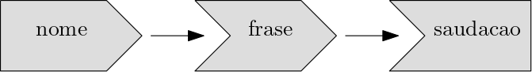
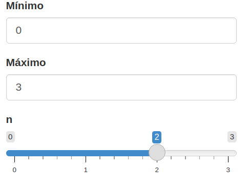
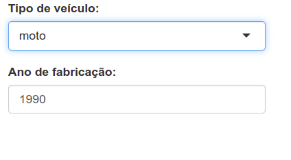
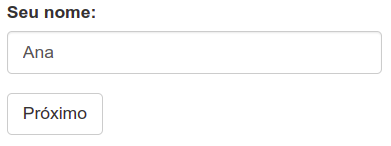
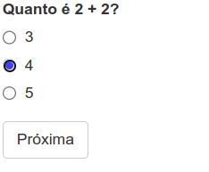
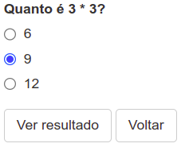
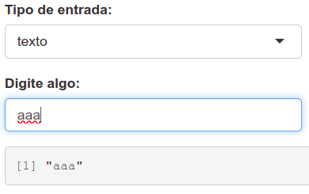
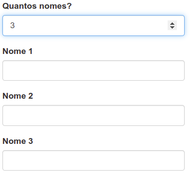

# Shiny


## Introdução ao Shiny

<div class="alert alert-info"> <strong>Definição:</strong> Shiny é um framework para R que permite criar aplicações web interativas diretamente a partir do código R, sem necessidade de conhecimentos em HTML, CSS ou JavaScript. </div>

Para começar a trabalhar com Shiny, primeiro instale o pacote:


``` r
# Instalação do pacote Shiny
# install.packages("shiny")
# Carregando o pacote
library(shiny)
```

Para criar um novo app, salvar um script com a extensão .R, exemplo **app.R**. A partir disso, pode adicionar rapidamente o modelo do aplicativo digitando "shinyapp" e pressionando Shift+Tab.


A estrutura de um App Shiny, é composta de:

**1. Interface do Usuário (UI):** A UI define a aparência do aplicativo - o que o usuário vê e com o que interage.

**2. Servidor (Server):** O servidor contém a lógica do aplicativo - como ele responde às interações do usuário.

**3. Função que combina ambos UI e Server:** Para criar o aplicativo, combinamos a UI e o servidor com a função `shinyApp(ui = ui, server = server)`

- RunApp: executa o aplicativo

- Stop (no RStudio) ou fechar a janela do app: encerra o aplicativo

### Adicionando controles de UI

```r
library(shiny)

ui <- fluidPage(
  selectInput("dataset", label = "Conjunto de Dados", 
  choices = ls("package:datasets")),
  verbatimTextOutput("resumo"),
  tableOutput("tabela")
)

server <- function(input, output, session) {

}

shinyApp(ui, server)
```

  - `fluidPage()`: função de layout que define a estrutura visual básica da página.
  - `selectInput()`: controle de entrada que permite ao usuário interagir com o aplicativo fornecendo um valor. Neste caso, é uma caixa de seleção com o rótulo "Conjunto de Dados" e permite escolher um dos conjuntos de dados que vêm com o R.
  - `verbatimTextOutput()` e `tableOutput()`: controles de saída que informam ao Shiny onde colocar a saída renderizada. `verbatimTextOutput()` exibe código e `tableOutput()` tabelas.
  - Vemos apenas a entrada, não as duas saídas, porque ainda não informamos ao Shiny como a entrada e as saídas estão relacionadas.


### Adicionando comportamento ao Server


```r
library(shiny)

ui <- fluidPage(
  selectInput("dataset", label = "Conjunto de Dados", 
  choices = ls("package:datasets")),
  verbatimTextOutput("resumo"),
  tableOutput("tabela")
)

server <- function(input, output, session) {
  output$resumo <- renderPrint({
    dataset <- get(input$dataset, "package:datasets")
    summary(dataset)
  })
  
  output$tabela <- renderTable({
    dataset <- get(input$dataset, "package:datasets")
    dataset
  })
}

shinyApp(ui, server)
```

- Cada input e output na UI tem identificarodes (IDs). Chamando `input$ID` e `output$ID` no servidor é a forma de identificar no shiny uma entrada e uma saída específica, com base no seu ID.
- `output$ID`: indica que você está fornecendo a receita para a saída do Shiny com esse ID.
- Funções de renderização (**render{Type}**): encapsulam o código fornecido e conectam inputs e outputs.
- Cada função **render{Type}** é projetada para produzir um tipo específico de saída (texto, tabelas e gráficos) e geralmente é pareada com uma função **{type}Output**. Exemplo, `renderPrint()` é pareado com `verbatimTextOutput()` e `renderTable()` é pareado com `tableOutput()`.


**Observações:**

- O resumo e a tabela são atualizados sempre que você altera o conjunto de dados de entrada. 
- Essa dependência é criada implicitamente, pois utilizamos `input$dataset` nas funções de saída. 
- `input$dataset` é preenchido com o valor atual do componente de interface do usuário com id `dataset` e fará com que as saídas sejam atualizadas automaticamente sempre que esse valor for alterado.
- Essa é a essência da reatividade: as saídas reagem (recalculam) automaticamente quando suas entradas são alteradas.

### Expressões Reativas

São usadas para evitar códigos duplicados. No exemplo anterior, o código a seguir é repetido 2 vezes.

```r
dataset <- get(input$dataset, "package:datasets")
```

Para criar uma expressão reativa:
```r
expressao_reativa <- reactive({...})
```

Para chamar o seu valor, usamos: `expressao_reativa()`.

A expressão reativa só é executada na primeira vez que é chamada e, em seguida, armazena o resultado em cache até que ele precise ser atualizado, deixando o código mais eficiente.

Atualizando o app com a expressão reativa:

```r
library(shiny)

ui <- fluidPage(
  selectInput("dataset", label = "Conjunto de Dados", 
  choices = ls("package:datasets")),
  verbatimTextOutput("resumo"),
  tableOutput("tabela")
)

server <- function(input, output, session) {
  # Criando uma expressão reativa
  dataset <- reactive({
    get(input$dataset, "package:datasets")
  })

  output$resumo <- renderPrint({
    # Chamando-a como uma função
    summary(dataset())
  })
  
  output$tabela <- renderTable({
    dataset()
  })
}

shinyApp(ui, server)
```

O aplicativo se comporta de forma idêntica, mas funciona um pouco mais eficientemente, pois só precisa recuperar o conjunto de dados uma vez, e não duas.


### Exercícios - Seção 8.1 {-}

**1.** Crie um aplicativo que cumprimente o usuário pelo nome. Considerando as funções abaixo, organize e identifique quais delas serão necessárias para esta finalidade.

```r
tableOutput("hipoteca")
output$saudacao <- renderText({
  paste0("Olá ", input$nome)
})
numericInput("idade", "Quantos anos você tem?", value = NA)
textInput("nome", "Qual é o seu nome?")
textOutput("saudacao")
output$histogram <- renderPlot({
  hist(rnorm(1000))
}, res = 96)
```

**2.** Suponha que seu amigo queira criar um aplicativo que permita ao usuário definir um número (x) entre 1 e 50 e exiba o resultado da multiplicação desse número por 5. Esta é a primeira tentativa dele:


``` r
library(shiny)

ui <- fluidPage(
  sliderInput("x", label = "Se x é", min = 1, max = 50, value = 30),
  "então x vezes 5 é",
  textOutput("produto")
)

server <- function(input, output, session) {
  output$produto <- renderText({ 
    x * 5
  })
}

shinyApp(ui, server)
```

Mas infelizmente tem um erro. Você pode ajudá-lo a encontrar e corrigir o erro?

**3.** Expanda o aplicativo do exercício anterior para permitir que o usuário defina o valor do multiplicador, y, para que o aplicativo produza o valor de x * y. O resultado final deve ser semelhante a este:

<!-- <p align="center"> -->
<!--    -->
<!-- </p> -->


**4.** Considere o aplicativo a seguir, que adiciona algumas funcionalidades adicionais ao aplicativo descrito no exercício anterior. O que há de novo? Como você poderia reduzir a quantidade de código duplicado no aplicativo usando uma expressão reativa?

```r
library(shiny)

ui <- fluidPage(
  sliderInput("x", "Se x é", min = 1, max = 50, value = 30),
  sliderInput("y", "e y é", min = 1, max = 50, value = 5),
  "então, (x * y) é", textOutput("produto"),
  "e, (x * y) + 5 é", textOutput("produto_mais5"),
  "e (x * y) + 10 é", textOutput("produto_mais10")
)

server <- function(input, output, session) {
  output$produto <- renderText({ 
    prod <- input$x * input$y
    prod
  })
  output$produto_mais5 <- renderText({ 
    prod <- input$x * input$y
    prod + 5
  })
  output$produto_mais10 <- renderText({ 
    prod <- input$x * input$y
    prod + 10
  })
}

shinyApp(ui, server)
```

**5.** No aplicativo a seguir, você seleciona um conjunto de dados de um pacote (usando o pacote ggplot2) e o aplicativo imprime um resumo e um gráfico dos dados. Ele também segue boas práticas e utiliza expressões reativas para evitar redundância de código. No entanto, há três bugs no código fornecido abaixo. Você consegue encontrá-los e corrigi-los?

```r
library(shiny)
library(ggplot2)

datasets <- c("economics", "faithfuld", "seals")
ui <- fluidPage(
  selectInput("dataset", "Conjunto de dados:", choices = datasets),
  verbatimTextOutput("resumo"),
  tableOutput("plot")
)

server <- function(input, output, session) {
  dataset <- reactive({
    get(input$dataset, "package:ggplot2")
  })
  output$resummo <- renderPrint({
    summary(dataset())
  })
  output$plot <- renderPlot({
    plot(dataset)
  }, res = 96)
}

shinyApp(ui, server)
```


<div id="protectedContent1" style="display:none;">

### Respostas {-}


``` r
## 1.
library(shiny)
ui <- fluidPage(
  textInput("nome", "Qual é o seu nome?"),
  textOutput("saudacao")
)
server <- function(input, output, session) {
  output$saudacao <- renderText({
    paste0("Olá ", input$nome)
  })
}
shinyApp(ui, server)
## 2.
O erro aqui surge porque, no lado do servidor, precisamos escrever 
input$x em vez de x.
## 3.
Vamos adicionar outro sliderInput com ID y e usar ambos input$x e input$y para calcular output$product.
library(shiny)
ui <- fluidPage(
  sliderInput("x", label = "Se x é", min = 1, max = 50, value = 30),
  sliderInput("y", label = "e y é", min = 1, max = 50, value = 30),
  "então x multiplicado por y é",
  textOutput("produto")
)
server <- function(input, output, session) {
  output$produto <- renderText({ 
    input$x * input$y
  })
}
shinyApp(ui, server)
## 4.
# A novidade é o cálculo adicional em que 5 e 10 foram adicionados ao produto. 
# Reduzindo códido com expressão reativa:
library(shiny)
ui <- fluidPage(
  sliderInput("x", "Se x é", min = 1, max = 50, value = 30),
  sliderInput("y", "e y é", min = 1, max = 50, value = 5),
  "então, (x * y) é", textOutput("produto"),
  "e, (x * y) + 5 é", textOutput("produto_mais5"),
  "e (x * y) + 10 é", textOutput("produto_mais10")
)
server <- function(input, output, session) {
    # Expressão reativa
    prod <- reactive({
        input$x * input$y
    })
    output$produto <- renderText({ 
        prod()
    })
    output$produto_mais5 <- renderText({ 
        prod() + 5
    })
    output$produto_mais10 <- renderText({ 
        prod() + 10
    })
}
shinyApp(ui, server)
## 5.
# Erros:
# 1º erro:
# trocar tableOutput("plot") por plotOutput("plot") -> renderPlot
# 2º erro:
# resumo esta escrito errado em output$resummo
# 3º erro:
# trocar plot(dataset) por plot(dataset()) para usar a expressão reativa
```

</div>

<input type="password" id="passwordInput1" placeholder="Digite a senha">
<button id="submitButton1">Acesso Professor</button>


<script>

document.getElementById("submitButton1").addEventListener("click", function()
{
  var password = document.getElementById("passwordInput1").value;
  var correctPassword = "09878";

  if (password === correctPassword)
  {
    document.getElementById("protectedContent1").style.display = "block";
  }else
  {
    alert("Senha incorreta! Tente novamente.");
  }
});
</script>


## UI básica

A estrutura do UI (front-end) do shiny possibilita diferentes tipos de funções de entrada e saída que permitem capturar diversos tipos de dados e exibir diversos tipos de saída em R. 

### Entradas

Argumentos das funções de entrada:

- `inputId` (primeiro argumento presente em todas as funções): Este é o identificador usado para conectar o front-end com o back-end. Se sua interface de usuário tiver uma entrada com ID "name", a função do servidor a acessará com `input$name`. O `inputId` tem duas restrições:
  - Deve ser uma string simples contendo apenas letras, números e sublinhados. Deve ser nomeada como uma variável em R.
  - Deve ser único. 

- `label` (segundo argumento presente na maioria das funções): usado para criar um rótulo legível para o controle.

- `value` (terceiro argumento): quando pesente, permite definir o valor padrão. 

#### Principais funções de entrada do Shiny {-}

**1. Texto livre** 

Permite coletar pequenas quantidades de texto com `textInput()`, senhas com `passwordInput()` e parágrafos de texto com `textAreaInput()`.

```r
ui <- fluidPage(
  textInput("nome", "Qual é o seu nome?"),
  passwordInput("senha", "Qual é a sua senha?"),
  textAreaInput("historia", "Fale sobre você", rows = 3)
)
```


**2. Entradas numéricas** 

Para valores numéricos: caixa de texto restrita com `numericInput()` ou um controle deslizante com `sliderInput()`.

```r
ui <- fluidPage(
  numericInput("num", "Número um", value = 0, min = 0, max = 100),
  sliderInput("num2", "Número dois", value = 50, min = 0, max = 100),
  sliderInput("inter", "Intervalo", value = c(10, 20), min = 0, max = 100)
)
```


**3. Datas** 

Para coletar um único dia: `dateInput()`; ou um intervalo de dias: `dateRangeInput()`.

```r
ui <- fluidPage(
  dateInput("nascimento", "Quando você nasceu?"),
  dateRangeInput("ferias", 
  "Quando você quer tirar as próximas férias?")
)
```


**4. Escolhas limitadas**

Existem duas abordagens diferentes para permitir que o usuário escolha entre um conjunto pré-especificado de opções: `selectInput()` e `radioButtons()`.

```r
animais <- c("cachorro", "gato", "rato", "pássaro", "outro", "nenhum")
estados <- c("PR", "SC", "SP", "RJ")

ui <- fluidPage(
  selectInput("estado", "Qual é o seu estado favorito?",
  estados),
  radioButtons("animal", "Qual é o seu animal favorito?", animais)
)
```


- Os botões de opção (`radioButtons()`) têm dois recursos interessantes: eles mostram todas as opções possíveis, tornando-os adequados para listas curtas.

- Os menus suspensos (`selectInput()`) ocupam a mesma quantidade de espaço, independentemente do número de opções, tornando-os mais adequados para opções mais longas.

Você também pode configurar `multiple = TRUE`para permitir que o usuário selecione vários elementos.

```r
ui <- fluidPage(
  selectInput("estado", "Qual é o seu estado favorito?",
  estados,
              multiple = TRUE)
)
```


**5. Botões de ação**

Para executar ações: `actionButton()` ou `actionLink()`.

```r
ui <- fluidPage(
  actionButton("clique", "Clique aqui!"),
  actionButton("beba", "Beba-me!", icon = icon("cocktail"))
)
```


- Links e botões de ação são mais naturalmente pareados com `observeEvent()` ou `eventReactive()` na sua função de servidor. 

- Você pode personalizar a aparência usando o argumento `class` "btn-primary", "btn-success", "btn-info", "btn-warning", ou "btn-danger". 

- Você também pode alterar o tamanho com "btn-lg", "btn-sm", "btn-xs".

- Por fim, você pode fazer com que os botões ocupem toda a largura do elemento em que estão incorporados usando "btn-block".

```r
ui <- fluidPage(
  fluidRow(
    actionButton("clique", "Clique aqui!", class = "btn-danger"),
    actionButton("beba", "Beba-me!", class = "btn-lg btn-success")
  ),
  fluidRow(
    actionButton("resp", "Respostas!", class = "btn-block")
  )
)
```


### Exercícios - Seção 8.2.1 {-}


**1.** Quando o espaço é limitado, é útil rotular as caixas de texto com um espaço reservado que aparece dentro da área de entrada de texto. Como você chamaria a função `textInput()` para gerar a IU abaixo?
<div>
  <input type="text" placeholder="Seu nome" style="padding: 8px; width: 200px;">
</div>

**2.** Leia atentamente a documentação de `sliderInput()` e tente descobrir como criar um controle deslizante de data, conforme mostrado abaixo.


**3.** No seu aplicativo Shiny, crie um controle deslizante que permita ao usuário escolher um número entre 0 e 100, variando de 5 em 5. Em seguida, adicione uma funcionalidade de animação, de forma que, ao clicar em um botão de "play", o controle avance automaticamente pelos valores disponíveis, como se estivesse passando por eles em sequência. **Dica:** existe um argumento do controle deslizante que permite ativar esse tipo de animação automaticamente.

**4.** Quando uma lista de opções em um menu suspenso (`selectInput()`) é muito longa, pode ser útil organizá-la em grupos com rótulos — como se fossem seções ou categorias dentro da lista. Explore como criar esse tipo de organização usando `selectInput()` no Shiny. Crie um exemplo com pelo menos dois grupos e algumas opções dentro de cada grupo (como o exemplo a seguir).


<div id="protectedContent2" style="display:none;">

### Respostas {-}


``` r
##1
textInput(inputId = "texto", label = "", placeholder = "Seu nome")
##2
# ?sliderInput -> ?Date -> as.Date
sliderInput(
  "datas",
  "Quando devemos entregar?",
  min = as.Date("2025-03-10"),
  max = as.Date("2025-03-20"),
  value = as.Date("2025-03-12")
)
##3
sliderInput("num", "Selecione um número:",
              min = 0, max = 100, value = 0, 
              step = 5, animate = TRUE)
##4
selectInput(
  "raca",
  "Selecione sua raça animal favorita:",
  choices =
    list("Cães" = list('Pastor Alemão', 'Bulldog', 'Labrador Retriever'),
         "Gatos" = list('Gato Persa', 'Gato de Bengala', 'Gato Siamês'))
)
```


</div>

<input type="password" id="passwordInput2" placeholder="Digite a senha">
<button id="submitButton2">Acesso Professor</button>


<script>

document.getElementById("submitButton2").addEventListener("click", function()
{
  var password = document.getElementById("passwordInput2").value;
  var correctPassword = "09878";

  if (password === correctPassword)
  {
    document.getElementById("protectedContent2").style.display = "block";
  }else
  {
    alert("Senha incorreta! Tente novamente.");
  }
});
</script>


### Saídas

- As saídas na UI criam espaços reservados que são posteriormente preenchidos pela função do servidor. 

- Assim como as entradas, as saídas recebem um ID exclusivo como primeiro argumento. Se a sua especificação de UI criar uma saída com ID "plot", você a acessará na função do servidor com `output$plot.`

- Cada função de output no front-end (UI) é acoplada a uma função de renderização no back-end (server).

**1. Texto**

Produza texto com `textOutput()` e código fixo com `verbatimTextOutput()`.

```r
library(shiny)

ui <- fluidPage(
  textOutput("texto"),
  verbatimTextOutput("codigo")
)
server <- function(input, output, session) {
  output$texto <- renderText({ 
    "Olá, bem vindo! A seguir um resumo de dados:" 
  })
  output$codigo <- renderPrint({ 
    summary(1:10) 
  })
}

shinyApp(ui, server)
```


Observe que há duas funções de renderização que se comportam de maneira ligeiramente diferente:

- `renderText()` combina o resultado em uma única string e geralmente é emparelhado com `textOutput()`.
- `renderPrint()` imprime o resultado, como se você estivesse em um console R, e geralmente é pareado com `verbatimTextOutput()`.


```r
ui <- fluidPage(
  textOutput("texto"),
  verbatimTextOutput("imprime")
)
server <- function(input, output, session) {
  output$texto <- renderText("Texto com renderText.")
  output$imprime <- renderPrint(cat("Texto com renderPrint."))
}
```

**2. Tabelas**

Há duas opções para exibir quadros de dados em tabelas:

- `tableOutput()` e `renderTable()` renderizam uma tabela estática de dados, mostrando todos os dados de uma só vez. Útil para resumos pequenos e fixos.

- `dataTableOutput()` e `renderDataTable()` renderizam uma tabela dinâmica. É mais apropriado se você deseja expor um quadro de dados completo ao usuário. 

```r
ui <- fluidPage(
  tableOutput("estatica"),
  dataTableOutput("dinamica")
)

server <- function(input, output, session) {
  output$estatica <- renderTable(head(mtcars))
  output$dinamica <- renderDataTable(mtcars, 
        options = list(pageLength = 5))
}
```

Versões mais recentes sugerem usar `DTOutput` e `renderDT` do pacote `DT` para tabelas dinâmicas.

```r
library(shiny)
library(DT)

ui <- fluidPage(
  tableOutput("estatica"),
  DTOutput("dinamica")
)

server <- function(input, output, session) {
  output$estatica <- renderTable(head(mtcars))
  output$dinamica <- renderDT(mtcars, 
         options = list(pageLength = 5))
}
shinyApp(ui, server)
```


**3. Gráficos**

Você pode exibir qualquer tipo de gráfico R (basico, ggplot2, etc) com `plotOutput()` e `renderPlot()`.
```r
ui <- fluidPage(
  plotOutput("plot", width = "400px")
)
server <- function(input, output, session) {
  output$plot <- renderPlot(plot(1:5), res = 96)
}
```
 
- Por padrão, `plotOutput()` ocupará toda a largura do contêiner e terá 400 pixels de altura. Você pode substituir esses padrões com os argumentos height e width.

- Recomenda-se sempre definir `res = 96`, pois isso fará com que seus gráficos correspondam o máximo possível ao que você vê no RStudio.

- Os gráficos são especiais porque são saídas que também podem atuar como entradas. `plotOutput()` possui vários argumentos como `click`, `dblclick` e `hover`. Se passar uma string para eles, como `click = "plot_click"`, eles criarão uma entrada reativa (`input$plot_click`) que você pode usar para manipular a interação do usuário no gráfico, por exemplo, clicando no gráfico. 


### Exercícios - Seção 8.2.2 {-}

**1.** As funções `textOutput()` e `verbatimTextOutput()` devem ser pareadas com qual(is) função(ões) de renderização abaixo:

a. `renderPrint(summary(mtcars))`
b. `renderText("Bom dia!")`
c. `renderPrint(t.test(1:5, 2:6))`

**2.** Recrie o aplicativo a seguir, definindo a altura como 300px e a largura como 700px.
```r
library(shiny)
ui <- fluidPage(
  plotOutput("plot", width = "400px")
)
server <- function(input, output, session) {
  output$plot <- renderPlot(plot(1:5), res = 96)
}
shinyApp(ui, server)
```

**3.** Atualize o código abaixo para que a tabela exiba apenas os dados e o controle de paginação, removendo os controles de busca e ordenação por colunas. Para isso, use os argumentos adequados para `options` da função `renderDataTable()`. Consulte a ajuda da função renderDataTable (?renderDataTable) e a documentação oficial do DataTables para entender como desativar esses controles:
https://datatables.net/reference/option/

```r
ui <- fluidPage(
  dataTableOutput("tabela")
)
server <- function(input, output, session) {
  output$tabela <- renderDataTable(mtcars, 
                  options = list(pageLength = 5))
}
```

<div id="protectedContent3" style="display:none;">

### Respostas {-}

``` r
## 1.
# a. 
renderPrint(summary(mtcars)) -> verbatimTextOutput (console)
# b. 
renderText("Good morning!") -> textOutput
# c. 
renderPrint(t.test(1:5, 2:6)) -> verbatimTextOutput (console)
## 2.
library(shiny)
ui <- fluidPage(
    plotOutput("plot", width = "700px", height = "300px")
)
server <- function(input, output, session) {
    output$plot <- renderPlot(plot(1:5), res = 96)
}
shinyApp(ui, server)
## 3.
library(shiny)
ui <- fluidPage(
  dataTableOutput("tabela")
)
server <- function(input, output, session) {
  output$tabela <- renderDataTable(mtcars, 
                  options = list(ordering = FALSE, 
                                 searching = FALSE))
}
shinyApp(ui, server)
```

</div>

<input type="password" id="passwordInput3" placeholder="Digite a senha">
<button id="submitButton3">Acesso Professor</button>


<script>

document.getElementById("submitButton3").addEventListener("click", function()
{
  var password = document.getElementById("passwordInput3").value;
  var correctPassword = "09878";

  if (password === correctPassword)
  {
    document.getElementById("protectedContent3").style.display = "block";
  }else
  {
    alert("Senha incorreta! Tente novamente.");
  }
});
</script>


## Reatividade básica

### A função do servidor

As funções de servidor recebem três parâmetros: `input`, `output` e `session.` Como você nunca chama a função de servidor, nunca criará esses objetos. Em vez disso, eles são criados pelo Shiny quando a sessão inicia, conectando-se a uma sessão específica. Vamos ver algumas formas de evitar erros envolvendo inputs e outputs.

#### Entradas (input) {-}

O input é um objeto em forma de lista que contém todos os dados de entrada enviados pelo navegador, nomeados de acordo com o ID de entrada. Por exemplo, se sua interface contiver um controle de entrada numérico com um ID `contagem`, então você pode acessar o valor dessa entrada com `input$contagem`.

```r
ui <- fluidPage(
  numericInput("contagem", label = "Number of values",
  value = 100)
)
```
Inicialmente, ele conterá o valor 100 e será atualizado automaticamente conforme o usuário altera o valor no navegador.

Ao contrário de uma lista típica, objetos de input são somente leitura. Se você tentar modificar uma entrada dentro da função do servidor, receberá um erro:
```r
server <- function(input, output, session) {
  input$contagem <- 10
}
shinyApp(ui, server)
#> Error: Can't modify read-only reactive value 'contagem'
```


Este erro ocorre porque o input reflete o que está acontecendo no navegador, e o navegador é a "única fonte de verdade" do Shiny.

Além disso, para ler um input no servidor é necessário estar em um contexto reativo criado por uma função como `renderText()` ou `reactive()`. Isso permite que as saídas sejam atualizadas automaticamente quando uma entrada muda. Este código ilustra o erro que você verá se cometer este erro:

```r
server <- function(input, output, session) {
  message("O valor de input$contagem é", input$contagem)
}
shinyApp(ui, server)
#> Error: Can't access reactive value 'contagem' outside of reactive consumer.
#> ℹ Do you need to wrap inside reactive() or observer()?
```

#### Saídas (output) {-}

A saída (`output`) também é um objeto do tipo lista, nomeado de acordo com o ID de saída. A principal diferença é que você o usa para enviar saída em vez de receber entrada. Você sempre usa o objeto `output` em conjunto com uma função `render.`

```r
ui <- fluidPage(
  textOutput("saudacao")
)

server <- function(input, output, session) {
  output$saudacao <- renderText("Olá humano!")
}
```

Assim como o `input`, o `output` é exigente quanto à forma como você o utiliza. Você receberá um erro se:

- Esquecer a função `render`.
```r
server <- function(input, output, session) {
  output$saudacao <- "Olá humano!"
}
shinyApp(ui, server)
#> Error: Unexpected character object for output$saudacao
#> ℹ Did you forget to use a render function?
```

- Tentar ler uma saída.

```r
server <- function(input, output, session) {
  message("A saudação é ", output$saudacao)
}
shinyApp(ui, server)
#> Error: Reading from shinyoutput object is not allowed.
```


### Programação reativa

Um aplicativo será bem chato se tiver apenas entradas ou apenas saídas. A verdadeira magia do Shiny acontece quando você tem um aplicativo com ambos.

```r
library(shiny)
ui <- fluidPage(
  textInput("nome", "Qual é o seu nome?"),
  textOutput("saudacao")
)

server <- function(input, output, session) {
  output$saudacao <- renderText({
    paste0("Olá ", input$nome, "!")
  })
}
shinyApp(ui, server)
```

Se você executar o aplicativo verá que a saudação é atualizada automaticamente conforme você digita. Esta é a grande ideia do Shiny: você não precisa informar a saída quando atualizar, porque o Shiny descobre isso automaticamente para você. 

Um dos pontos fortes da programação em Shiny é que ela permite que os aplicativos sejam extremamente preguiçosos. Um aplicativo Shiny só fará o mínimo de trabalho necessário para atualizar os controles de saída. Essa preguiça, no entanto, tem uma desvantagem importante. O que há de errado com o código abaixo?

```r
library(shiny)
ui <- fluidPage(
  textInput("nome", "Qual é o seu nome?"),
  textOutput("saudacao")
)
server <- function(input, output, session) {
  output$saudacaoo <- renderText({
    paste0("Olá ", input$nome, "!")
  })
}
shinyApp(ui, server)
```

<br> 

Se você observar atentamente, poderá notar que está escrito `saudacaoo` em vez de `saudacao`. Isso não gerará um erro no Shiny, mas não fará o que você deseja. A saída `saudacaoo` não existe, então o código em `renderText()` nunca será executado.

**Importante:** Verificar se sua interface de usuário e funções de servidor estão usando os mesmos nomes de identificadores.


#### O Gráfico Reativo {-}

O gráfico reativo é uma representação gráfica que descreve como as entradas e saídas estão conectadas. Ele define a ordem de execução do aplicativo.

Para o exemplo:
```r
library(shiny)
ui <- fluidPage(
  textInput("nome", "Qual é o seu nome?"),
  textOutput("saudacao")
)
server <- function(input, output, session) {
  output$saudacao <- renderText({
    paste0("Olá ", input$nome, "!")
  })
}
shinyApp(ui, server)
```
O gráfico reativo fica:


O gráfico reativo contém um símbolo para cada entrada e saída, e conectamos uma entrada a uma saída sempre que a saída acessa a entrada. Este gráfico informa que `saudacao` precisará ser recomputado sempre que `nome` for alterado. Frequentemente descreveremos essa relação como `saudacao` tendo uma dependência reativa em `nome`.


O gráfico reativo é uma ferramenta poderosa para entender como seu aplicativo funciona. À medida que seu aplicativo se torna mais complexo, muitas vezes é útil fazer um esboço rápido e detalhado do gráfico reativo para lembrar como todas as peças se encaixam. 

No caso do código envolver expressões reativas, esta informação também deve ser adicionada ao gráfico reativo.

Exemplo:
```r
library(shiny)
ui <- fluidPage(
  textInput("nome", "Qual é o seu nome?"),
  textOutput("saudacao")
)
server <- function(input, output, session) {
  frase <- reactive(paste0("Olá ", input$nome, "!"))
  output$saudacao <- renderText(frase())
}
shinyApp(ui, server)
```

Neste caso, o gráfico reativo fica:




Uma expressão reativa é desenhada com ângulos em ambos os lados porque conecta entradas a saídas.

### Exercícios - Seção 8.3.2 {-}

**1.** Dada esta UI:
```r
ui <- fluidPage(
  textInput("nome", "Qual é o seu nome?"),
  textOutput("saudacao")
)
```
Corrija os erros encontrados em cada uma das três funções de servidor abaixo. Primeiro, tente identificar o problema apenas lendo o código; depois, execute o código para garantir que o corrigiu.
```r
server1 <- function(input, output, server) {
  input$saudacao <- renderText(paste0("Olá ", nome))
}

server2 <- function(input, output, server) {
  saudacao <- paste0("Olá ", input$nome)
  output$saudacao <- renderText(saudacao)
}

server3 <- function(input, output, server) {
  output$saudacaoo <- paste0("Olá", input$nome)
}
```

**2.** Desenhe o gráfico reativo para cada função de servidor a seguir:
```r
server1 <- function(input, output, session) {
  c <- reactive(input$a + input$b)
  e <- reactive(c() + input$d)
  output$f <- renderText(e())
}
server2 <- function(input, output, session) {
  x <- reactive(input$x1 + input$x2 + input$x3)
  y <- reactive(input$y1 + input$y2)
  output$z <- renderText(x() / y())
}
server3 <- function(input, output, session) {
  d <- reactive(c() ^ input$d)
  a <- reactive(input$a * 10)
  c <- reactive(b() / input$c)
  b <- reactive(a() + input$b)
}
```

**3.** Por que esse código falhará? 
```r
library(shiny)

df <- mtcars
ui <- fluidPage(
  selectInput("var", NULL, choices = colnames(df)),
  verbatimTextOutput("debug")
)
server <- function(input, output, session) {
  var <- reactive(df[[input$var]])
  range <- reactive(range(var(), na.rm = TRUE))
  output$debug <- renderPrint({ range() })
}
shinyApp(ui = ui, server = server)
```
Por que `range()` e `var()` são nomes ruins para reativos? Apresente o código corrigido.


<div id="protectedContent4" style="display:none;">
  
### Respostas {-}

**1.**
```r
# Servidor 1:
- input$saudacao –> output$saudacao
- Dentro renderText, nome –> input$nome
Código corrigido:
server1 <- function(input, output, server) {
  output$saudacao <- renderText(paste0("Olá ", input$nome))
}
# Servidor 2:
- Faça saudacao um reativo: 
saudacao <- reactive(paste0("Olá ", input$nome))
- Como saudacao agora é reativo, adicione parênteses ao redor dele:
output$saudacao <- renderText(saudacao())
Código corrigido:
server2 <- function(input, output, server) {
  saudacao <- reactive(paste0("Olá ", input$nome))
  output$saudacao <- renderText(saudacao())
}
# Servidor 3:
- Erro de ortografia: 
output$saudacaoo –> output$saudacao
- renderText() ausente.
Código corrigido:
server3 <- function(input, output, server) {
  output$saudacao <- renderText(paste0("Olá ", input$nome))
}
```

**2.**
Para criar o grafico reativo, precisamos considerar as entradas, expressões reativas e saídas.

- Server1:

  - entradas: `input$a`, `input$b` e `input$d`
  - reativos: `c()` e `e()`
  - saídas: `output$f`


- Server2:

  - entradas: `input$x1`, `input$x2`, `input$x3`, `input$y1`, `input$y2`
  - reativos: `y()` e `x()`
  - saídas: `output$z`


- Server3

  - entradas: `input$a`, `input$b`, `input$c`, `input$d`
  - reativos: `a()`, `b()`, `c()`, `d()`


**3.**
Este código não funciona porque chamamos nosso reativo de `range`, então, quando chamamos a função `range`, estamos, na verdade, chamando nosso novo reativo. Se mudarmos o nome do reativo de `range` para `col_range`, o código funcionará. Da mesma forma, `var()` não é um bom nome para um reativo porque já é uma função para calcular a variância de x!
Código corrigido:
```r
library(shiny)
df <- mtcars
ui <- fluidPage(
  selectInput("var", NULL, choices = colnames(df)),
  verbatimTextOutput("debug")
)
server <- function(input, output, session) {
  col_var <- reactive(df[[input$var]])
  col_range <- reactive({ range(col_var(), na.rm = TRUE ) })
  output$debug <- renderPrint({ col_range() })
}
shinyApp(ui = ui, server = server)
```
</div>
  
<input type="password" id="passwordInput4" placeholder="Digite a senha">
<button id="submitButton4">Acesso Professor</button>
  
  
<script>

document.getElementById("submitButton4").addEventListener("click", function() 
{
  var password = document.getElementById("passwordInput4").value;
  var correctPassword = "09878";
  
  if (password === correctPassword) 
  {
    document.getElementById("protectedContent4").style.display = "block";
  }else 
  {
    alert("Senha incorreta! Tente novamente.");
  }
});
</script>


### observeEvent() e eventReactive()

No Shiny, `observeEvent()` e `eventReactive()` são funções essenciais para controlar a reatividade com base em eventos específicos (como cliques em botões, mudanças em inputs, etc.). Elas têm finalidades diferentes, embora ambas respondam a eventos.

- `observeEvent()`: Executa código sem retorno de valor reativo e é útil para efeitos colaterais (ex: atualizar valores, mostrar mensagens, salvar arquivos).

**Sintaxe:**
```r
observeEvent(evento, {
  # código que será executado quando 'evento' mudar
})
```
**Exemplo:**

```r
library(shiny)
ui <- fluidPage(
  actionButton("meu_botao", "Clique aqui")
)
server <- function(input, output, session) {
  observeEvent(input$meu_botao, {
    print("O botão foi clicado!")
  })
}
shinyApp(ui, server)
```

- `eventReactive()`: Cria um objeto reativo que só é atualizado quando um evento ocorre. Ideal para realizar cálculos pesados ou demorados apenas quando necessário (como ao clicar num botão).

**Sintaxe:**
```r
reactivo <- eventReactive(evento, {
  # código que gera e retorna o valor
})
```

**Exemplo:**
```r
library(shiny)
ui <- fluidPage(
  numericInput("n", "Número:", value = 5),
  actionButton("calc", "Calcular quadrado"),
  verbatimTextOutput("resultado")
)
server <- function(input, output, session) {
  quadrado <- eventReactive(input$calc, {
    input$n^2
  })
  output$resultado <- renderText({
    paste("Resultado:", quadrado())
  })
}
shinyApp(ui, server)
```


### Exercícios - Seções 8.1 a 8.3{-}


**1.** Encontre e corrija o(s) erro(s) dos códigos a seguir:

**a.**
```r
library(shiny)
ui <- fluidPage(
  textInput("nome", "Seu nome:"),
  textOutput("mensagem") 
)
server <- function(input, output, session) {
  output$frase <- renderText({  
    paste("Olá", input$nome)
  })
}
shinyApp(ui, server)
```

**b.**
```r
library(shiny)
ui <- fluidPage(
  numericInput("x", "Número:", value = 1),
  textOutput("mensagem")
)
server <- function(input, output, session) {
  output$mensagem <- renderPlot({
    paste("O valor é", input$x)
  })
}
shinyApp(ui, server)
```

**c.**
```r
library(shiny)
ui <- fluidPage(
  numericInput("x", "Número:", value = 5)
)
server <- function(input, output, session) {
  output$resultado <- renderText({
    paste("Dobro:", 2 * input$x)
  })
}
shinyApp(ui, server)
```


**d.**
```r
library(shiny)
ui <- fluidPage(
  numericInput("a", "Número A", value = 0),
  numericInput("b", "Número B", value = 0),
  textOutput("soma")
)
server <- function(input, output, session) {
  soma <- reactive({
    input$a + input$b
  })
  output$soma <- renderText({
    paste("A soma é:", soma)
  })
}
shinyApp(ui, server)
```

**e.**
```r
library(shiny)
ui <- fluidPage(
  numericInput("a", "Número A", value = 0),
  numericInput("b", "Número B", value = 0),
  textOutput("soma")
)
server <- function(input, output, session) {
  soma <- reactive({
    input$a + input$b
  })
  renderText({
    paste("A soma é:", soma())
  })
}
shinyApp(ui, server)
```

**2.** Crie um app com:

- `textInput()` para um nome,
- `selectInput()` para escolher uma comida favorita,
- Um `textOutput()` que exibe algo como: "Olá [nome], sua comida favorita é [comida]."


**3.** Crie um app com:

- Dois `numericInput()` (números a e b),
- Um botão (`actionButton`("calcular")),
- Um `textOutput()` com a soma de a + b, somente após clicar.

**Dica:** Use `eventReactive()`.


**4.** Crie um app com:

- Um `sliderInput()` para escolher o número de bins (ex: de 5 a 50),
- Um `plotOutput()` com um histograma da distribuição `rnorm(100)`,
- O gráfico deve atualizar automaticamente conforme o slider muda.

**Dica:** Use `renderPlot()`.


**5.** Crie um app com:

- Um botão `(actionButton())` para gerar, quando clicado, 100 números aleatórios `(rnorm(100))`,
- Um `plotOutput()` com o histograma desses números,
- O gráfico só deve mudar quando o botão for clicado.

**Dica:** Use `eventReactive()`.


<div id="protectedContent5" style="display:none;">
  
### Respostas {-}


```r
## 1.
# a.
 output$frase <- renderText({  # ID do output diferente na UI
    paste("Olá", input$nome)
  })
# b.
# renderPlot() está sendo usado para gerar texto (erro de função)
# c.
# faltando textOutput() no UI!
# d.
# paste("A soma é:", soma)  # BUG AQUI: está faltando ()
# e.
# BUG: renderText() está sendo chamado sem ser atrtribuído a output$soma

## 2.
library(shiny)
ui <- fluidPage(
  textInput("nome", "Seu nome:"),
  selectInput("comida", "Escolha sua comida favorita:",
              choices = c("Pizza", "Sushi", "Lasanha", "Hambúrguer")),
  textOutput("mensagem")
)
server <- function(input, output, session) {
  output$mensagem <- renderText({
    paste("Olá ", input$nome, ", sua comida favorita é", input$comida)
  })
}
shinyApp(ui, server)

## 3.
library(shiny)
ui <- fluidPage(
  numericInput("a", "Número A:", value = 0),
  numericInput("b", "Número B:", value = 0),
  actionButton("calcular", "Calcular soma"),
  textOutput("resultado")
)
server <- function(input, output, session) {
  soma <- eventReactive(input$calcular, {
    input$a + input$b
  })
  output$resultado <- renderText({
    paste("Resultado da soma:", soma())
  })
}
shinyApp(ui, server)

## 4.
library(shiny)
ui <- fluidPage(
  sliderInput("bins", "Número de bins:", min = 5, max = 50, value = 10),
  plotOutput("histograma")
)
server <- function(input, output, session) {
  output$histograma <- renderPlot({
    x <- rnorm(100)
    hist(x, breaks = input$bins, col = "steelblue", border = "white")
  })
}
shinyApp(ui, server)

## 5. 
library(shiny)
ui <- fluidPage(
  actionButton("gerar", "Gerar histograma"),
  plotOutput("histograma")
)
server <- function(input, output, session) {
  dados <- eventReactive(input$gerar, {
    rnorm(100)
  })
  output$histograma <- renderPlot({
    hist(dados(), col = "darkgreen")
  })
}
shinyApp(ui, server)
```

</div>
  
  <input type="password" id="passwordInput5" placeholder="Digite a senha">
  <button id="submitButton5">Acesso Professor</button>
  
  
<script>

document.getElementById("submitButton5").addEventListener("click", function() 
{
  var password = document.getElementById("passwordInput5").value;
  var correctPassword = "09878";
  
  if (password === correctPassword) 
  {
    document.getElementById("protectedContent5").style.display = "block";
  }else 
  {
    alert("Senha incorreta! Tente novamente.");
  }
});
</script>


## Layout, temas, HTML

O Shiny fornece diversas funções para organizar a aparência dos aplicativos.

### Layouts 


##### Funções de página {-}

- O `fluidPage()` configura todo o HTML, CSS e JavaScript que o Shiny precisa.
- Além de `fluidPage()`, o Shiny oferece outras funções de página que podem ser úteis em situações mais especializadas: `fixedPage()` e `fillPage()`.
- `fixedPage()` funciona como fluidPage(), mas tem uma largura máxima fixa, o que impede que seus aplicativos fiquem excessivamente largos em telas maiores.
- `fillPage()` Preenche toda a altura do navegador e é útil se você quiser criar um gráfico que ocupe a tela inteira.

#### 1. Layouts de página única {-}

##### Página com barra lateral {-}

- Para criar layouts mais complexos, você precisará chamar funções de layout dentro de `fluidPage()`
- Para criar um layout de duas colunas com entradas à esquerda e saídas à direita, você pode usar `sidebarLayout()` junto com `titlePanel()`, `sidebarPanel()` e `mainPanel()`.
```r
ui <- fluidPage(
  titlePanel(
    # Titulo do app
  ),
  sidebarLayout(
    sidebarPanel(
      # inputs
    ),
    mainPanel(
      # outputs
    )
  )
)
```


**Exemplo: Teorema do Limite Central**

```r
ui <- fluidPage(
  titlePanel("Teorema do Limite Central"),
  sidebarLayout(
    sidebarPanel(
      numericInput("m", "Número de amostras:", 2, min = 1, max = 100)
    ),
    mainPanel(
      plotOutput("hist")
    )
  )
)
server <- function(input, output, session) {
  output$hist <- renderPlot({
    means <- replicate(1e4, mean(runif(input$m)))
    hist(means, breaks = 20)
  }, res = 96)
}
```


##### Multi-linhas {-}

Podemos adicionar linhas ou colunas ao aplicativo com `fluidRow()` e `column()`.

```r
ui <- fluidPage(
  fluidRow(
    column(4, 
      ...
    ),
    column(8, 
      ...
    )
  ),
  fluidRow(
    column(6, 
      ...
    ),
    column(6, 
      ...
    )
  )
)
```

Cada linha é composta por 12 colunas e o primeiro argumento de `column()` indica quantas dessas colunas ocupar. 


### Exercícios {-}

**1.** Leia a documentação de `sidebarLayout()` e identifique os valores padrão da largura (em colunas) da barra lateral (sidebarPanel) e do painel principal (mainPanel). Recrie a aparência do aplicativo Teorema do Limite Central usando `fluidRow()` e `column()`? 

**2.** Modifique o aplicativo Teorema do Limite Central (usando `sidebarLayout()`) para colocar a barra lateral à direita em vez de à esquerda.

**3.** Para  conjunto de dados `mtcars` e usando as funções `fluidRow()` e `column()`, construa um app Shiny que mostre:

- Titulo do Aplicativo
- Na primeira linha: Dois botões de seleção (selectInput) para escolher duas variáveis numéricas (em colunas lado a lado).
- Na segunda linha: Dois gráficos correspondentes - um histograma da primeira variável e um boxplot da segunda variável, exibidos lado a lado.


<div id="protectedContent6" style="display:none;">
  
### Respostas {-}

**1.** Por padrão, a barra lateral ocupa 1/3 da largura (width = 4), e o painel principal, 2/3 (width = 8).

```r
# É possivel recriar, embora o layout fique um pouco diferente
# Recriando sidebarLayout()
fluidRow(
  # sidebar (4 columns)
  column(4, 
         ...
  ),
  # # main panel (8 columns)
  column(8, 
         ...
  )
)
# Para o exemplo anterior:
library(shiny)
ui <- fluidPage(
  titlePanel("Teorema do Limite Central"),
  # sidebar (4 columns)
    fluidRow(
      column(4, 
             numericInput("m", "Número de amostras:", 2, 
             min = 1, max = 100)
    ),
    # main panel (8 columns)
    column(8, 
             plotOutput("hist")
    )
  )
)
server <- function(input, output, session) {
  output$hist <- renderPlot({
    means <- replicate(1e4, mean(runif(input$m)))
    hist(means, breaks = 20)
  }, res = 96)
}
shinyApp(ui = ui, server = server)
```
**2.**

```r
library(shiny)
ui <- fluidPage(
  titlePanel("Teorema do Limite Central"),
  sidebarLayout(
    sidebarPanel(
      numericInput("m", "Número de amostras:", 2, min = 1, max = 100)
    ),
    mainPanel(
      plotOutput("hist")
    ),
    # Modificado para colocar a posição da barra lateral à direita
    position = "right"
  )
)
server <- function(input, output, session) {
  output$hist <- renderPlot({
    means <- replicate(1e4, mean(runif(input$m)))
    hist(means, breaks = 20)
  }, res = 96)
}
shinyApp(ui, server)
```

**3.**
```r
library(shiny)

<!-- # Selecionando numericas (se necessário) -->
<!-- library(dplyr) -->
<!-- numeric_vars <- mtcars %>% -->
<!--   select(where(is.numeric)) %>% -->
<!--   names() -->

ui <- fluidPage(
  titlePanel("Histograma e Boxplot"),
  
  # Linha de seleção das variáveis
  fluidRow(
    column(6,
           selectInput("var1", "Variável para histograma:",
                       choices = names(mtcars), selected = "mpg")
    ),
    column(6,
           selectInput("var2", "Variável para boxplot:",
                       choices = names(mtcars), selected = "hp")
    )
  ),
  
  # Linha com os dois gráficos lado a lado
  fluidRow(
    column(6,
           plotOutput("histPlot")
    ),
    column(6,
           plotOutput("boxPlot")
    )
  )
)

server <- function(input, output, session) {
  
  output$histPlot <- renderPlot({
    var <- mtcars[[input$var1]]
    hist(var,
         main = paste("Histograma de", input$var1),
         xlab = input$var1,
         col = "skyblue")
  })
  
  output$boxPlot <- renderPlot({
    var <- mtcars[[input$var2]]
    boxplot(var,
            main = paste("Boxplot de", input$var2),
            ylab = input$var2,
            col = "orange")
  })
}

shinyApp(ui, server)
```

</div>
  
  <input type="password" id="passwordInput6" placeholder="Digite a senha">
  <button id="submitButton6">Acesso Professor</button>
  
  
<script>

document.getElementById("submitButton6").addEventListener("click", function() 
{
  var password = document.getElementById("passwordInput6").value;
  var correctPassword = "09878";
  
  if (password === correctPassword) 
  {
    document.getElementById("protectedContent6").style.display = "block";
  }else 
  {
    alert("Senha incorreta! Tente novamente.");
  }
});
</script>


#### 2. Layouts de várias páginas {-}

##### Conjuntos de guias {-}

- A maneira mais simples de dividir uma página em partes é usar `tabsetPanel()` junto com `tabPanel()`.
- `tabsetPanel()` cria um contêiner para qualquer número de `tabPanels()`, que por sua vez pode conter quaisquer outros componentes.

**Exemplo:**

```r
ui <- fluidPage(
  tabsetPanel(
    tabPanel(title = "Importar dados", 
             fileInput("file", "Dados", buttonLabel = "Upload..."),
             textInput("delim", "Delimitador", ""),
             numericInput("skip", "Linhas para pular", 0, min = 0),
             numericInput("rows", "Linhas para visualizar", 10, min = 1)
    ),
    tabPanel("Conjunto de parâmetros"),
    tabPanel("Resultados")
  )
)
```


Se quiser saber qual aba um usuário selecionou, você pode fornecer o argumento id para `tabsetPanel()` e ele se tornará uma entrada.

- Argumento `ID`: se fornecido, você pode usar `input$id` na lógica do seu servidor para determinar qual das abas atuais está ativa. O valor de `input$id` corresponderá ao argumento `value` passado para `tabPanel()`.

```r
library(shiny)
ui <- fluidPage(
  sidebarLayout(
    sidebarPanel(
      textOutput("painel")
    ),
    mainPanel(
      tabsetPanel(
        id = "painel_ativo",
        tabPanel(title = "Aba 1", value = "aba1", "Conteúdo da Aba 1"),
        tabPanel(title = "Aba 2", value = "aba2", "Conteúdo da Aba 2")
      )
    )
  )
)
server <- function(input, output, session) {
  output$painel <- renderText({
    paste("A aba atual é:", input$painel_ativo)
  })
}
shinyApp(ui, server)
```


Se `value` for omitido e `tabsetPanel` tiver um ID, o título será usado.

##### Listas e barras de navegação {-}


A estrutura de abas com `tabsetPanel` (que tem exibição horizontal), dificulta representar titulos longos. Deste modo, `navlistPanel()`, `navbarPage()` e `navbarMenu()` possibilitam layouts alternativos que permitem que você use abas com títulos mais longos.

- `navlistPanel()` é semelhante a `tabsetPanel()`, mas em vez de exibir os títulos das guias horizontalmente, ele os exibe verticalmente em uma barra lateral. 

```r
ui <- fluidPage(
  navlistPanel(
    id = "tabset",
    "Título 1",
    tabPanel("Painel 1", "Conteúdos do painel 1..."),
    "Título 2",
    tabPanel("Painel 2", "Conteúdos do painel 2..."),
    tabPanel("Painel 3", "Conteúdos do painel 3...")
  )
)
```


- `navbarPage()`: exibe os títulos das abas horizontalmente, mas você pode usar `navbarMenu()` para adicionar menus suspensos com um nível adicional de hierarquia.

```r
ui <- navbarPage(
  "Titulo",   
  tabPanel("Painel 1", "Conteúdos do painel 1..."),
  tabPanel("Painel 2", "Conteúdos do painel 2..."),
  navbarMenu("Sub-Painéis", 
             tabPanel("Painel 4a", "Conteúdos do painel 4-a..."),
             tabPanel("Painel 4b", "Conteúdos do painel 4-b...")
  )
)
```


### Exercícios {-}

**1.** Crie um app usando `tabsetPanel()` com 2 abas para os dados `mtcars`:

- Aba 1: Gráfico boxplot para a variável `mpg`
- Aba 2: Gráfico de barras para a variável `cyl`.

**2.** Crie um app com uma barra de navegação lateral (`navlistPanel()`) com 2 abas, para os dados `mtcars`:

- Aba 1: contendo um controle (por exemplo, `selectInput()`) para escolher uma variável e um gráfico para esta variável.
- Aba 2: contendo a tabela de dados `mtcars`.

**3.** Considerando o conjunto de dados `iris`, crie um app com menu de navegação usando `navbarPage()` e `navbarMenu()`, contendo 2 abas:

- Aba 1: um resumo (summary) dos dados (use `verbatimTextOutput()`).
- Aba 2: contendo 2 sub-abas com: (1) um gráfico de dispersão entre Sepal.Length e Petal.Length e (2) um histograma para Sepal.Width. 


<div id="protectedContent7" style="display:none;">
  
### Respostas {-}

```r
## 1.
library(shiny)
ui <- fluidPage(
  titlePanel("Visualização dos dados mtcars"),
  tabsetPanel(
    tabPanel("Boxplot de mpg",
             plotOutput("boxplot_mpg")
    ),
    tabPanel("Barras de cyl",
             plotOutput("barras_cyl")
    )
  )
)
server <- function(input, output, session) {
  output$boxplot_mpg <- renderPlot({
    boxplot(mtcars$mpg,
            main = "Boxplot de mpg",
            ylab = "Milhas por galão (mpg)",
            col = "skyblue")
  })
  output$barras_cyl <- renderPlot({
    barplot(table(mtcars$cyl),
            main = "Frequência de cilindros (cyl)",
            xlab = "Número de cilindros",
            ylab = "Frequência",
            col = "orange")
  })
}
shinyApp(ui, server)
## 2.
library(shiny)
ui <- fluidPage(
  titlePanel("Análise dos dados mtcars"),
  navlistPanel(
    "Menu",
    tabPanel("Gráfico de variável",
             selectInput(inputId = "variavel",
                         label = "Escolha uma variável numérica:",
                         choices = names(mtcars),
                         selected = "mpg"
             ),
             plotOutput("grafico")
    ),
    tabPanel("Tabela de dados",
             tableOutput("tabela")
    )
  )
)
server <- function(input, output, session) {
  output$grafico <- renderPlot({
    hist(mtcars[[input$variavel]],
         main = paste("Histograma de", input$variavel),
         xlab = input$variavel,
         col = "steelblue")
  })
  output$tabela <- renderTable({
    mtcars
  })
}
shinyApp(ui, server)
## 3.
library(shiny)
ui <- navbarPage("Análise do dataset iris",
     tabPanel("Resumo dos dados",
              verbatimTextOutput("resumo")
     ),
     navbarMenu("Gráficos",
                tabPanel("Dispersão: Sepal vs Petal",
                         plotOutput("dispersao")
                ),
                tabPanel("Histograma: Sepal.Width",
                         plotOutput("histograma")
                )
     )
)
server <- function(input, output, session) {
  output$resumo <- renderPrint({
    summary(iris)
  })
  output$dispersao <- renderPlot({
    plot(iris$Sepal.Length, iris$Petal.Length,
         main = "Dispersão: Sepal.Length vs Petal.Length",
         xlab = "Sepal.Length", ylab = "Petal.Length",
         pch = 19, col = iris$Species)
  })
  output$histograma <- renderPlot({
    hist(iris$Sepal.Width,
         main = "Histograma de Sepal.Width",
         xlab = "Sepal.Width",
         col = "lightgreen", border = "white")
  })
}
shinyApp(ui, server)
```


</div>
  
  <input type="password" id="passwordInput7" placeholder="Digite a senha">
  <button id="submitButton7">Acesso Professor</button>
  
  
<script>

document.getElementById("submitButton7").addEventListener("click", function() 
{
  var password = document.getElementById("passwordInput7").value;
  var correctPassword = "09878";
  
  if (password === correctPassword) 
  {
    document.getElementById("protectedContent7").style.display = "block";
  }else 
  {
    alert("Senha incorreta! Tente novamente.");
  }
});
</script>


### Temas

Principais abordagens para aplicar temas em Shiny.

#### Temas básicos com shinythemes {-}

```r
library(shiny)
library(shinythemes)

ui <- fluidPage(
  theme = shinytheme("cerulean"),  # Exemplo de tema
  titlePanel("App com tema 'cerulean'"),
  sidebarLayout(
    sidebarPanel(
      sliderInput("num", "Escolha um número", 1, 100, 50)
    ),
    mainPanel(
      textOutput("res")
    )
  )
)

server <- function(input, output) {
  output$res <- renderText({ paste("Você escolheu", input$num) })
}

shinyApp(ui = ui, server = server)
```
 
Outros temas disponíveis: cosmo, cyborg, darkly, flatly, journal, lumen, paper, readable

#### Customização avançada com bslib (Bootstrap themes) {-}

```r
library(shiny)
library(bslib)

ui <- fluidPage(
  theme = bslib::bs_theme(
    bg = "#0b3d91", 
    fg = "white", 
    base_font = "Source Sans Pro"
  ),
  titlePanel("App com bslib e tema 'minty'"),
  sidebarLayout(
    sidebarPanel(
      numericInput("n", "Número", 1)
    ),
    mainPanel(
      verbatimTextOutput("result")
    )
  )
)

server <- function(input, output) {
  output$result <- renderPrint({ input$n^2 })
}

shinyApp(ui, server)
```

- bg: Cores para o fundo.
- fg: Cores para o primeiro plano.
- base_font: A fonte padrão.

Para visualizar o exemplo de um tema específico:
```r
theme <- bslib::bs_theme(
    bg = "#0b3d91", 
    fg = "white", 
    base_font = "Source Sans Pro"
  )
bslib::bs_theme_preview(theme)
```

Para personalizar os gráficos de acordo com o tema do app, usar `thematic_shiny()` do pacote `thematic`.
```r
library(shiny)
library(thematic)

thematic_shiny()  # aplica automaticamente o tema

ui <- fluidPage(
  theme = bslib::bs_theme(
    bg = "#0b3d91", 
    fg = "white", 
    base_font = "Source Sans Pro"
  ),
  titlePanel("App com thematic"),
  plotOutput("plot")
)

server <- function(input, output) {
  output$plot <- renderPlot({
    plot(rnorm(100))
  })
}

shinyApp(ui, server)
```

Observações: 

- Para criar as cores você pode consultar `colors()`, ou consultar os códigos em https://r-charts.com/colors/. 
- Para fontes, você pode usar o suporte do Google Fonts via a função `font_google()` do próprio `bslib`, com diferentes opções em https://fonts.google.com/.


### HTML

O Shiny foi projetado para que, como usuário de R, você não precise aprender os detalhes de HTML. No entanto, se você tiver algum conhecimento de HTML e CSS, é possível personalizá-lo ainda mais.

Todas as funções de entrada, saída e layout do shiny: apenas geram HTML. Você pode ver esse HTML executando funções de interface do usuário diretamente no console:

```r
# Código no console
fluidPage(
  textInput("nome", "Qual é o seu nome?")
)
# Saída
<div class="container-fluid">
  <div class="form-group shiny-input-container">
    <label class="control-label" id="nome-label"
    for="nome">Qual é o seu nome?</label>
    <input id="nome" type="text" 
    class="shiny-input-text form-control" value=""/>
  </div>
</div>
```

É possível adicionar seu próprio HTML ao ui. Uma maneira de fazer isso é incluir HTML literal com a função `HTML()`, juntamente com a "constante de caractere bruto", `r"()"`, para facilitar a inclusão de aspas na string:
```r
ui <- fluidPage(
  HTML(r"(
    <h1>Este é um título</h1>
    <p>Este é um texto!</p>
    <ul>
      <li>Primeiro item</li>
      <li>Segundo item</li>
    </ul>
  )")
)
```

Outra opção é usar o auxiliar HTML fornecido pelo Shiny. Existem funções regulares para os elementos mais importantes, como `h1()` e `p()`, e outros podem ser acessados por meio de tags auxiliares. Recriando o HTML acima:

```r
                    ui <- fluidPage(
  h1("Este é um título"),
  p("Este é um texto!", class = "minha-classe"),
  tags$ul(
    tags$li("Primeiro item"),
    tags$li("Segundo item")
  )
)
```

O livro [Outstanding User Interfaces with Shiny](https://unleash-shiny.rinterface.com/index.html), de David Granjon, pode ser consultado para mais detalhes sobre como usar HTML, CSS e JavaScript para criar interfaces de usuário mais atraentes.


### Exercícios {-}

**1.** Crie um aplicativo Shiny simples com um tema usando `bslib` com as seguintes características:

- Cor de fundo (bg) para um tom de azul claro: #e6f2ff.
- Cor do texto (fg) para um cinza escuro: #2c3e50.
- Fonte base como "Lato" (Google Fonts). Dica: Você pode usar a função `font_google("Lato")` para aplicar a fonte.

**2.** Use `bslib::bs_theme_preview()` para criar o tema mais feio possível.


<div id="protectedContent8" style="display:none;">
  
### Respostas {-}

```r
## 1.
library(shiny)
library(thematic)
thematic_shiny()  # aplica automaticamente o tema

ui <- fluidPage(
  theme = bslib::bs_theme(
    bg = "#e6f2ff", 
    fg = "#2c3e50", 
    base_font = font_google("Lato")
  ),
  titlePanel("App com thematic"),
  plotOutput("plot")
)
server <- function(input, output) {
  output$plot <- renderPlot({
    plot(rnorm(100))
  })
}
shinyApp(ui, server)
## 2.
tema <- bslib::bs_theme(
    bg = "#ff00ff",      # Rosa neon de fundo
    fg = "#00ff00",      # Verde neon para texto
    base_font = font_google("Comic Neue"),  # Fonte bizarra
    heading_font = font_google("Creepster"), 
    # Título ainda mais estranho
    code_font = "Courier New"
  )
bslib::bs_theme_preview(tema)
```


</div>
  
  <input type="password" id="passwordInput8" placeholder="Digite a senha">
  <button id="submitButton8">Acesso Professor</button>
  
  
<script>

document.getElementById("submitButton8").addEventListener("click", function() 
{
  var password = document.getElementById("passwordInput8").value;
  var correctPassword = "09878";
  
  if (password === correctPassword) 
  {
    document.getElementById("protectedContent8").style.display = "block";
  }else 
  {
    alert("Senha incorreta! Tente novamente.");
  }
});
</script>

<!-- ## Gráficos -->

<!-- ## Comentários do usuário -->

## UI dinâmica

O shiny disponibiliza alguns recursos para criar interfaces de usuário dinâmicas, alterando a UI usando código executado na função do servidor.

Existem três técnicas principais para criar interfaces de usuário dinâmicas:

- Usando a familia de funções `update` para modificar parâmetros de controles de entrada.

- Usando `tabsetPanel()` com `updateTabsetPanel()` para mostrar e ocultar condicionalmente partes da interface do usuário.

- Usando `uiOutput()` e `renderUI()` gerando partes selecionadas da interface do usuário com código.


### Usando a familia de funções update

Cada controle de entrada, por exemplo `textInput()`, é pareado com uma função de atualização, por exemplo `updateTextInput()`, que permite modificar o controle após sua criação.

#### Exemplos {-}

**1. Atualizando parâmetros de slider**

No exemplo a seguir, o aplicativo possui duas entradas que controlam o min e max de outra entrada, um controle deslizante. A ideia principal é usar `observeEvent()` para disparar `updateSliderInput()` sempre que as entradas min ou max mudarem.

```r
ui <- fluidPage(
  numericInput("min", "Mínimo", 0),
  numericInput("max", "Máximo", 3),
  sliderInput("n", "n", min = 0, max = 3, value = 1)
)
server <- function(input, output, session) {
  observeEvent(input$min, {
    updateSliderInput(inputId = "n", min = input$min)
  })
  observeEvent(input$max, {
    updateSliderInput(inputId = "n", max = input$max)
  })
}
```




As funções de atualização recebem o nome do input como o argumento inputId. Os argumentos restantes correspondem aos argumentos para construir o input que podem ser modificados após a criação.

**2. Resetar controles**

O app a seguir ilustra como redefinir os parâmetros dos controles para seus valores iniciais.


```r
ui <- fluidPage(
  sliderInput("x1", "x1", 0, min = -10, max = 10),
  sliderInput("x2", "x2", 0, min = -10, max = 10),
  sliderInput("x3", "x3", 0, min = -10, max = 10),
  actionButton("reset", "Resetar")
)

server <- function(input, output, session) {
  observeEvent(input$reset, {
    updateSliderInput(inputId = "x1", value = 0)
    updateSliderInput(inputId = "x2", value = 0)
    updateSliderInput(inputId = "x3", value = 0)
  })
}
```

**3. Atualizar texto de um botão de ação**

```r
ui <- fluidPage(
  numericInput("n", "Simulações", 10),
  actionButton("simula", "Simular")
)

server <- function(input, output, session) {
  observeEvent(input$n, {
    texto_botao <- paste0("Simular ", input$n, " vezes")
    updateActionButton(inputId = "simula",
    label = texto_botao)
  })
}
```

**4. Caixas de seleção hierárquicas**

Uma aplicação particularmente importante é facilitar a seleção em uma longa lista de opções possíveis, por meio da filtragem passo a passo.

Considere o conjunto de dados simulado a seguir:


``` r
dados <- data.frame(
  Cidade = c("Curitiba", "Curitiba", "Curitiba",
             "Londrina", "Londrina", "Londrina",
             "Maringá", "Maringá"),
  Escola = c("GP", "GP", "CM",
             "RM", "RM", "MA",
             "BJ", "BJ"),
  Turma = as.integer(c(2, 3, 2,
            1, 2, 3,
            1, 2))
)
```

Aplicando alguns filtros a estes dados:


``` r
# library(dplyr)
# Filtando a Cidade de Curitiba
cidade_curi <- filter(dados, Cidade == "Curitiba")
cidade_curi
```

```
##     Cidade Escola Turma
## 1 Curitiba     GP     2
## 2 Curitiba     GP     3
## 3 Curitiba     CM     2
```

``` r
# Escolas de Curitiba
unique(cidade_curi$Escola)
```

```
## [1] "GP" "CM"
```

``` r
# Filtrando uma escola para Curitiba
escola_curi <- filter(cidade_curi, Escola == "GP")
escola_curi
```

```
##     Cidade Escola Turma
## 1 Curitiba     GP     2
## 2 Curitiba     GP     3
```

Neste caso, os dados tem uma hierarquia natural:

- Cada **Cidade** contém **Escolas**.
- Cada **Escola** contém **Turmas**

Vamos criar uma interface de usuário onde você possa:

- Selecionar um **Cidade** para ver todas as **Escolas**.
- Selecionar uma **Escola** para ver todas as **Turmas**.

A essência da UI é simples: duas caixas de seleção e uma tabela de saída. As opções para a caixa de seleção `Escola` serão geradas dinamicamente, então usamos `choices = NULL`.

Na função de servidor:

- É criado um reativo, `cidade()`, que contém as linhas das escolas e turmas que correspondem à cidade selecionada. 
- Sempre que `cidade()` muda, a lista `choices` na caixa de seleção `input$escola` é atualizada.
- É criado outro reativo, `escola()`, que contém as linhas de `cidade()` que correspondem à escola selecionada.
- Os dados contendo a Cidade e Escola selecionados são exibidos em `output$dados_filtrados`.

Neste caso, o `cidade` e `escola` foram considerados reativos, por terem sido utilizados em mais de um lugar. Em casos mais simples, isso não seria necessário.

```r
library(shiny)

# Interface do usuário
ui <- fluidPage(
  # Menu suspenso para selecionar o Cidade
  # (usa os valores únicos da coluna Cidade)
  selectInput("cidade", "Escolha uma Cidade:", 
              choices = unique(dados$Cidade)),
  # Menu suspenso para selecionar a Escola 
  # (inicialmente vazio, será preenchido dinamicamente)
  selectInput("escola", "Escolha uma Escola:", 
              choices = NULL),
  # Local onde será exibida a tabela com os dados filtrados
  tableOutput("dados_filtrados")
)

# Lógica do servidor
server <- function(input, output, session) {
  # Expressão reativa que filtra os dados 
  # com base na Cidade selecionada
  cidade <- reactive({
    filter(dados, Cidade == input$cidade)
  })
  # Quando a cidade mudar, 
  # atualiza a lista de escolas disponíveis
  observeEvent(cidade(), {
    # escolas únicas da Cidade filtrada
    choices <- unique(cidade()$Escola)  
    # atualiza o selectInput de escola
    updateSelectInput(inputId = "escola", choices = choices)  
  })
  # Expressão reativa que filtra os dados 
  # com base na escola selecionada
  escola <- reactive({
    req(input$escola)  # garante que a escola foi selecionada
    filter(cidade(), Escola == input$escola)
  })
  # Renderiza a tabela com os dados filtrados
  output$dados_filtrados <- renderTable({
    escola() %>%
      # seleciona as colunas a serem exibidas
      select(Cidade, Escola, Turma)  
  })
}

shinyApp(ui, server)
```


<!-- Este aplicativo está disponível em: https://hadley.shinyapps.io/ms-update-nested/ -->


<!-- - Congelamento de entradas reativas -->
<!-- - Referências circulares -->
<!-- - Entradas inter-relacionadas -->


### Exercícios {-}

**1.** Crie um aplicativo com um `sliderInput` que possibilite ao usuário selecionar um número e um botão de ação que, ao clicado, atualize o label desse slider para o número atual selecionado.

**2.** Crie um aplicativo com um botão de ação nomeado "trocar" e um `selectInput` com 3 letras do alfabeto. O objetivo é que ao clicar no botão "trocar" as opções de letras do alfabeto sejam atualizadas para outras letras aleatórias.

**3.** Crie um aplicativo com 2 inputs numéricos e um slider cujo valor seja atualizado com a média destes inputs, conforme eles forem modificados.

**4.** Complete a interface de usuário abaixo com uma função de servidor que atualiza as opções de `input$county` com base em `input$state`.
```r
library(openintro, warn.conflicts = FALSE)

states <- unique(county$state)

ui <- fluidPage(
  selectInput("state", "State", choices = states),
  selectInput("county", "County", choices = NULL)
)
```

**5.** Complete a interface de usuário abaixo com uma função de servidor que atualiza as opções de `input$country` com base em `input$continent`. Use `output$data` para exibir todas as linhas correspondentes.

```r
library(gapminder)
continents <- unique(gapminder$continent)

ui <- fluidPage(
  selectInput("continent", "Continent", choices = continents),
  selectInput("country", "Country", choices = NULL),
  tableOutput("data")
)
```

<div id="protectedContent9" style="display:none;">
  
### Respostas {-}
```r
## 1.
ui <- fluidPage(
  sliderInput("nota", "Nota", min = 0, max = 10, value = 5),
  actionButton("atualizar", "Atualizar rótulo")
)
server <- function(input, output, session) {
  observeEvent(input$atualizar, {
    updateSliderInput(inputId = "nota", 
                      label = paste("Nota:", input$nota))
  })
}
## 2.
ui <- fluidPage(
  actionButton("trocar", "Trocar opções"),
  selectInput("escolha", "Escolha uma opção:", choices = c("A", "B", "C"))
)
server <- function(input, output, session) {
  observeEvent(input$trocar, {
    novas_opcoes <- sample(LETTERS[1:6], size = 3)
    updateSelectInput(inputId = "escolha", choices = novas_opcoes)
  })
}
## 3.
ui <- fluidPage(
  numericInput("a", "Valor A", value = 10),
  numericInput("b", "Valor B", value = 30),
  sliderInput("media", "Média", min = 0, max = 100, value = 20)
)
server <- function(input, output, session) {
  observeEvent(c(input$a, input$b), {
    media_valor <- mean(c(input$a, input$b))
    updateSliderInput(inputId = "media", value = media_valor)
  })
}
## 4.
library(shiny)
library(openintro, warn.conflicts = FALSE)

# Lista única de estados disponíveis no dataset 'county'
states <- unique(county$state)
# Interface do usuário
ui <- fluidPage(
  selectInput("state", "State", choices = states),# Seletor de estado
  selectInput("county", "County", choices = NULL) 
  # Seletor de condado (atualizado dinamicamente)
)
# Função do servidor
server <- function(input, output, session) {
  # Observa mudanças no estado selecionado
  observeEvent(input$state, {
    # Filtra os condados correspondentes ao estado selecionado
    counties <- unique(county$name[county$state == input$state])
    # Atualiza o seletor de condados
    updateSelectInput(inputId = "county", choices = counties)
  })
}
## ou (solução livro)
server <- function(input, output, session) {
  observeEvent(input$state, {
    req(input$state)
    # pull out county names
    choices <- county %>% 
      filter(state == input$state) %>%
      pull(name) %>% 
      unique()
    
    updateSelectInput(inputId = "county", choices = choices)
  })
}
# Executa o aplicativo
shinyApp(ui, server)

## 5.
library(shiny)
library(gapminder)
continents <- unique(gapminder$continent)

ui <- fluidPage(
  # add "(All)" to the list of choices
  selectInput("continent", "Continent", choices = continents), 
  selectInput("country", "Country", choices = NULL),
  tableOutput("data")
)
# Função do servidor (usando base R)
server <- function(input, output, session) {
  # Observa mudanças no estado selecionado
  observeEvent(input$continent, {
    choices <- unique(gapminder$country[gapminder$continent == input$continent])
    # Atualiza o seletor de condados
    updateSelectInput(inputId = "country", choices = choices)
  })
  
  output$data <- renderTable({
    req(input$country)
    gapminder[gapminder$continent == input$continent &
              gapminder$country == input$country, ]
  })
}
# Função do servidor (usando dplyr)
server <- function(input, output, session) {
  observeEvent(input$continent, {
    req(input$continent)
    # pull out country names
    choices <- gapminder %>% 
      filter(continent == input$continent) %>%
      pull(country) %>% 
      unique()
    
    updateSelectInput(inputId = "country", choices = choices)
  })
  
  output$data <- renderTable({
    gapminder %>% 
      filter(continent == input$continent,
             country == input$country)
  })
}
shinyApp(ui, server)
```


</div>
  
  <input type="password" id="passwordInput9" placeholder="Digite a senha">
  <button id="submitButton9">Acesso Professor</button>
  
  
<script>

document.getElementById("submitButton9").addEventListener("click", function() 
{
  var password = document.getElementById("passwordInput9").value;
  var correctPassword = "09878";
  
  if (password === correctPassword) 
  {
    document.getElementById("protectedContent9").style.display = "block";
  }else 
  {
    alert("Senha incorreta! Tente novamente.");
  }
});
</script>


### Usando tabsetPanel() com updateTabsetPanel()

#### Exemplos {-}

**1. Guias condicionais**

Imagine que você queira um aplicativo que permita ao usuário simular distribuições normal, uniforme e exponencial. Cada distribuição tem parâmetros diferentes, então precisaremos de uma maneira de mostrar controles diferentes para cada distribuição. Cada distribuição terá sua interface de usuário exclusiva com `tabPanel()` e, em seguida, serão oranizadas em guias de um arquivo `tabsetPanel()`.

Em seguida, isso será incorporado na interface de usuário que permite ao usuário escolher o número de amostras e mostra um histograma dos resultados.

```r
# Define um conjunto de abas ocultas, onde cada aba contém os
# parâmetros para uma distribuição específica
parameter_tabs <- tabsetPanel(
  id = "params",   # ID do tabset usado para controle via server
  type = "hidden", # Oculta as abas 
  # (elas são trocadas programaticamente, não clicáveis)
  # Aba para distribuição normal: precisa de média e desvio padrão
  tabPanel("normal",
    numericInput("mean", "mean", value = 1), # Input para média
    numericInput("sd", "standard deviation", 
    min = 0, value = 1)  # Input para desvio padrão
  ),
  # Aba para distribuição uniforme: precisa de mínimo e máximo
  tabPanel("uniform",
    numericInput("min", "min", value = 0),  # Limite inferior
    numericInput("max", "max", value = 1)   # Limite superior
  ),
  # Aba para distribuição exponencial: precisa da taxa
  tabPanel("exponential",
    numericInput("rate", "rate", value = 1, min = 0)  
    # Parâmetro de taxa (lambda)
  )
)

# Interface do usuário
ui <- fluidPage(
  sidebarLayout(
    sidebarPanel(
      selectInput("dist", 
      "Distribution", # Menu suspenso para escolher a distribuição
        choices = c("normal", "uniform", "exponential")
      ),
      numericInput("n", "Number of samples",
      value = 100), # Quantidade de amostras
      parameter_tabs # Os inputs de parâmetros definidos acima
    ),
    mainPanel(
      plotOutput("hist")  # Área para exibir o histograma
    )
  )
)

# Função do servidor
server <- function(input, output, session) {
  
  # Observa a escolha da distribuição e atualiza o tabsetPanel correspondente
  observeEvent(input$dist, {
    updateTabsetPanel(inputId = "params", 
    selected = input$dist)  # Ativa a aba correspondente à distribuição
  })

  # Gera a amostra com base na distribuição e nos parâmetros escolhidos
  sample <- reactive({
    switch(input$dist,
      normal = rnorm(input$n, input$mean, input$sd),   
      # Gera amostra normal
      uniform = runif(input$n, input$min, input$max), 
      # Gera amostra uniforme
      exponential = rexp(input$n, input$rate)                 
      # Gera amostra exponencial
    )
  })

  # Desenha o histograma da amostra gerada
  output$hist <- renderPlot(hist(sample()), res = 96)     
  # res = 96 define resolução para melhor visualização
}
```

O resultado pode ser visualizado em: https://hadley.shinyapps.io/ms-dynamic-conditional/

**2. Guias sequenciais**

A mesma ideia pode ser usada para criar um "assistente", um tipo de interface que facilita a coleta de um conjunto de informações, distribuindo-as por várias páginas. Neste exemplo, cada "página" têm botões de ação, facilitando o avanço e o retrocesso.


```r
# Interface do usuário
ui <- fluidPage(
  tabsetPanel(
  # ID do tabset, usado para controlar qual aba está ativa
  id = "wizard",      
  # Esconde as abas (mostra apenas o conteúdo)
  type = "hidden",    

  # Primeira "página"
  tabPanel("page_1", "Bem-vindo!",     
    actionButton("page_12", "next") 
    # Botão para ir para a próxima página
  ),

  # Segunda página
  tabPanel("page_2", "Falta só uma página",       
    actionButton("page_21", "prev"), 
    # Botão para voltar para a página 1
    actionButton("page_23", "next") 
    # Botão para ir para a página 3
  ),

  # Terceira (última) página
  tabPanel("page_3", "Pronto!",
    actionButton("page_32", "prev") 
    # Botão para voltar para a página 2
  )
  )
)

# Função do servidor
server <- function(input, output, session) {
  
  # Função auxiliar que recebe um número e ativa a aba correspondente
  switch_page <- function(i) {
    updateTabsetPanel(inputId = "wizard", 
    selected = paste0("page_", i))
  }

  # Observadores: quando um botão é clicado, chama a função switch_page()
  observeEvent(input$page_12, switch_page(2))  # Página 1 → 2
  observeEvent(input$page_21, switch_page(1))  # Página 2 → 1
  observeEvent(input$page_23, switch_page(3))  # Página 2 → 3
  observeEvent(input$page_32, switch_page(2))  # Página 3 → 2
}
```

- Esse app simula um "wizard" (um fluxo de páginas passo-a-passo), muito comum em formulários ou tutoriais.
- O `tabsetPanel(type = "hidden")` permite criar várias telas (abas), mas sem mostrar as guias.
- Cada página é representada por um `tabPanel()`, e os botões de navegação chamam `updateTabsetPanel()` para mudar de página.
- A função `switch_page(i)` constrói o nome da aba a ativar com `paste0("page_", i)`, por exemplo "page_2".


O resultado pode ser visualizado em: https://hadley.shinyapps.io/ms-wizard


### Exercícios {-}


**1.** Crie uma UI em que o usuário escolha uma categoria (por ex., "Carro", "Moto", "Bicicleta"), e o app mostre campos específicos para essa categoria, usando abas escondidas.

- Um `selectInput("veiculo", "Tipo de veículo", choices = ...)`
- Um `tabsetPanel(type = "hidden")` com uma aba para cada tipo de veículo.
- No servidor, troque para a aba correspondente com `updateTabsetPanel()`.

<div style="display: flex; justify-content: center;">
  
  
  
</div>


**2.** Crie um formulário multi-etapas para coletar o nome e a idade do usuário em duas páginas separadas.

- Página 1: `textInput("name", "Seu nome:")` + botão "Próximo"
- Página 2: `numericInput("age", "Sua idade:", value = NA)` + botões "Voltar" e "Próximo"
- Página 3: Exiba um texto com `paste("Olá", input$name, "de", input$age, "anos!")` + botão "Reiniciar" que volta para página 1.


<div style="display: flex; justify-content: center;">
  
  
  
</div>

**3.** Crie um mini-quiz com duas perguntas de múltipla escolha.

- Página 1: Pergunta 1 (radioButtons) + botão "Próximo"
- Página 2: Pergunta 2 (radioButtons) + botão "Ver Resultado"
- Página 3: Mostrar pontuação com `renderText()` com base nas respostas corretas e um botão "Tentar novamente" que reinicia o quiz na página 1.


<div style="display: flex; justify-content: center;">
  
  
  
</div>


<div id="protectedContent10" style="display:none;">
  
### Respostas {-}
```r
## 1.
ui <- fluidPage(
  selectInput("veiculo", "Tipo de veículo:",
              choices = c("carro", "moto", "bicicleta")),
        tabsetPanel(
          id = "veiculo_tabs",
          type = "hidden",
          tabPanel("carro",
                  numericInput("portas", "Número de portas:", 
                  value = 4)
          ),
          tabPanel("moto",
                  numericInput("ano", "Ano de fabricação:", 
                  value = 1990)
          ),
          tabPanel("bicicleta",
                  selectInput("tipo_bike", "Tipo:",
                  choices = c("urbana", "mountain bike", "estrada"))
          )
        )
)

server <- function(input, output, session) {
  observeEvent(input$veiculo, {
    updateTabsetPanel(inputId = "veiculo_tabs", 
    selected = input$veiculo)
  })
}

## 2.
ui <- fluidPage(
  tabsetPanel(
    id = "wizard",
    type = "hidden",
    tabPanel("page_1",
             textInput("name", "Seu nome:"),
             actionButton("to2", "Próximo")
    ),
    tabPanel("page_2",
             numericInput("age", "Sua idade:", value = NA),
             actionButton("back1", "Voltar"),
             actionButton("to3", "Próximo")
    ),
    tabPanel("page_3",
             textOutput("summary"),
             actionButton("restart", "Reiniciar")
    )
  )
)
server <- function(input, output, session) {
  switch_page <- function(i) {
    updateTabsetPanel(inputId = "wizard", 
    selected = paste0("page_", i))
  }
  observeEvent(input$to2, {
               req(input$name)
               switch_page(2)})
  observeEvent(input$back1, switch_page(1))
  observeEvent(input$to3, {
               req(input$age)
               switch_page(3)})
  observeEvent(input$restart, switch_page(1))
  output$summary <- renderText({
    paste("Olá", input$name, "de", input$age, "anos!")
  })
}

## 3.
ui <- fluidPage(
  tabsetPanel(
    id = "wizard",
    type = "hidden",
    tabPanel("page_1",
             radioButtons("q1", "Quanto é 2 + 2?", 
                          choices = c("3", "4", "5")),
             actionButton("nextq1", "Próxima")
    ),
    tabPanel("page_2",
             radioButtons("q2", "Quanto é 3 * 3?",
                          choices = c("6", "9", "12")),
             actionButton("result", "Ver resultado"),
             actionButton("backq1", "Voltar")
    ),
    tabPanel("page_3",
             textOutput("score"),
             actionButton("retry", "Tentar novamente")
    )
  )
)

server <- function(input, output, session) {
  updateTabsetPanel(inputId = "wizard", selected = "page_1")
  
  observeEvent(input$nextq1, {
    req(input$q1)
    updateTabsetPanel(inputId = "wizard", selected = "page_2")
  })
  
  observeEvent(input$backq1, {
    updateTabsetPanel(inputId = "wizard", selected = "page_1")
  })
  
  observeEvent(input$result, {
    req(input$q2)
    updateTabsetPanel(inputId = "wizard", selected = "page_3")
  })
  
  observeEvent(input$retry, {
    updateTabsetPanel(inputId = "wizard", selected = "page_1")
  })
  
  output$score <- renderText({
    score <- 0
    if (input$q1 == "4") score <- score + 1
    if (input$q2 == "9") score <- score + 1
    paste("Você acertou", score, "de 2 perguntas.")
  })
}
```


</div>
  
  <input type="password" id="passwordInput10" placeholder="Digite a senha">
  <button id="submitButton10">Acesso Professor</button>
  
  
<script>

document.getElementById("submitButton10").addEventListener("click", function() 
{
  var password = document.getElementById("passwordInput10").value;
  var correctPassword = "09878";
  
  if (password === correctPassword) 
  {
    document.getElementById("protectedContent10").style.display = "block";
  }else 
  {
    alert("Senha incorreta! Tente novamente.");
  }
});
</script>


### Usando `uiOutput()` e `renderUI()`

Essa técnica permite criar e modificar a interface de usuário enquanto o aplicativo está em execução. Essa solução tem duas partes:

- `uiOutput()`: insere um espaço reservado no seu ui. Isso deixa um "buraco" que o código do seu servidor pode preencher posteriormente.
- `renderUI()` é chamado `server()` para preencher o espaço reservado com a interface do usuário gerada dinamicamente.


##### Exemplo: Criando dinamicamente um controle de entrada {-}

```r
ui <- fluidPage(
  textInput("label", "Rótulo"),
  selectInput("type", "Tipo", c("slider", "numerico")),
  uiOutput("controle")
)
server <- function(input, output, session) {
  output$controle <- renderUI({
    if (input$type == "slider") {
      sliderInput("dynamic", input$label, value = 0, min = 0, 
      max = 10)
    } else {
      numericInput("dynamic", input$label, value = 0, min = 0, 
      max = 10)
    }
  })
}
```

Embora mais personalizável, uma das desvantagens de `renderUI()` é que ele pode deixar o aplicativo mais lento. Assim, recomenda-se manter a maior parte possível da interface do usuário fixa, usando as técnicas descritas anteriormente.


### Exercícios {-}

**1.** Usando `uiOutput()` e `renderUI()`

a. Crie um app que mostre um tipo diferente de controle de entrada (`textInput`, `numericInput` ou `sliderInput`) dependendo da opção escolhida pelo usuário.


<div style="display: flex; justify-content: center;">
  
  
  
</div>

b. Crie um app que pergunte ao usuário quantos nomes deseja informar (de 1 a 5) e mostre dinamicamente esse número de caixas de texto para preencher os nomes.

<div style="display: flex; justify-content: center;">
  
  
  
</div>


<div id="protectedContent11" style="display:none;">
  
### Respostas {-}

```r
## a.
ui <- fluidPage(
  selectInput("tipo", "Tipo de entrada:",
              choices = c("texto", "número", "slider")),
  uiOutput("entrada"),
  verbatimTextOutput("resposta")
)

server <- function(input, output, session) {
  
  output$entrada <- renderUI({
    if (input$tipo == "texto") {
      textInput("valor", "Digite algo:")
    } else if (input$tipo == "número") {
      numericInput("valor", "Informe um número:", value = 0)
    } else if (input$tipo == "slider") {
      sliderInput("valor", "Escolha um valor:", min = 0, max = 100,
      value = 50)
    }
  })
  
  output$resposta <- renderPrint({
    input$valor
  })
}
## ou 
server <- function(input, output, session) {
  output$entrada <- renderUI({
    switch(input$tipo,
           "texto" = textInput("valor", "Digite algo:"),
           "número" = numericInput("valor", "Informe um número:", 
           value = 0),
           "slider" = sliderInput("valor", "Escolha um valor:", 
           min = 0, max = 100, value = 50)
    )
  })
  output$resposta <- renderPrint({
    input$valor
  })
}

## b.
ui <- fluidPage(
  numericInput("n", "Quantos nomes?", value = 1, min = 1, max = 5),
  uiOutput("nomes")
)

server <- function(input, output, session) {
  output$nomes <- renderUI({
    req(input$n)
    lapply(1:input$n, function(i) {
      textInput(inputId = paste0("nome", i), label = paste("Nome", i))
    })
  })
# função lapply: aplica uma função a cada elemento de uma lista, 
# ou de vetor, retornando lista.
lapply(list(1,2,3), function(i) i^2)
# ou
lapply(1:3, function(i) i^2)
```


</div>
  
  <input type="password" id="passwordInput11" placeholder="Digite a senha">
  <button id="submitButton11">Acesso Professor</button>
  
  
<script>

document.getElementById("submitButton11").addEventListener("click", function() 
{
  var password = document.getElementById("passwordInput11").value;
  var correctPassword = "09878";
  
  if (password === correctPassword) 
  {
    document.getElementById("protectedContent11").style.display = "block";
  }else 
  {
    alert("Senha incorreta! Tente novamente.");
  }
});
</script>


## Publicando aplicativo em shinyapps.io

#### 1. Instalar o pacote `rsconnect` no R {-}

Abra o R ou RStudio e execute:

```r
install.packages("rsconnect")
```

#### 2. Criar uma conta no shinyapps.io {-}

1. Acesse: https://www.shinyapps.io
2. Crie uma conta gratuira e faça login
3. Após o login, vá até a aba **Account > Tokens > Show > Show secret > Copy**
5. Copiar o código


#### 3. Configurar sua conta e Publicar o App{-}

1. Abra o seu aplicativo no R
2. Clique no ícone azul: "Publish the application"
3. Clique em Conectar conta com shinyapps.io
4. Cole o código copiado no campo especificado
5. Selecione os arquivos da pasta que serão enviados para o app.
6. Dê um nome para o app em "Title"
7. Clique em "Publish"
8. Se tudo estiver ok, o RStudio vai abrir o link do app na web, uma URL como:

```
https://seu-usuario.shinyapps.io/nome-do-app/
```

Esse é o link público do seu app!

#### 4. Compartilhando o app {-}

Copie o link gerado e envie para quem quiser acessar — não é necessário instalar nada!


#### 5. Atualizações do app {-}

Sempre que fizer alterações no código, basta clucar no simbolo azul de publicação e fazer o envio novamente na conta conectada. O app será sobrescrito com a nova versão.


**Observações:**

- Certifique-se de que seu app está salvo em uma pasta, contendo: Um único arquivo chamado `app.R` **ou** dois arquivos: `ui.R` e `server.R`  
- Todos os arquivos adicionais (por exemplo, imagens, CSVs) também devem estar nessa mesma pasta.
- Para deletar o app ne sua conta acessar o app em shinyapps.io, arquivar e depois deletar.


### Exercício: {-}

Crie uma conta no shinyapps.io e publique o aplicativo a seguir:

```r
library(shiny)

ui <- fluidPage(
  titlePanel("Meu Primeiro App"),
  sidebarLayout(
    sidebarPanel(
      selectInput("var", "Variável:", 
      choices = names(mtcars))
    ),
    mainPanel(
      plotOutput("grafico")
    )
  )
)

server <- function(input, output, session) {
  output$grafico <- renderPlot({
    hist(mtcars[[input$var]], main = input$var)
  })
}

shinyApp(ui, server)
```


## Exercícios do Capítulo 8 <span style="color:red">(Entregar na lista 2)</span>  

**1.** Pesquise a definição das funções `req()` e `isolate()` e dê exemplos simples da utilização de cada uma delas.

**2.** Crie uma UI em que o usuário escolha uma categoria (por ex., “Carro”, “Moto”, “Bicicleta”), e o app mostre campos específicos para essa categoria, usando abas escondidas. Além disso, que o app exiba no painel principal um resumo com o tipo e a informação específica do veículo (nº de portas, ano, tipo de bicicleta).

- Um selectInput("veiculo", "Tipo de veículo", choices = ...)
- Um tabsetPanel(type = "hidden") com uma aba para cada tipo de veículo.
- No servidor, troque para a aba correspondente com updateTabsetPanel().


**3.** Crie um aplicativo que plote, `ggplot(diamonds, aes(carat))` mas permita que o usuário escolha qual geom usar: `geom_histogram()`, `geom_freqpoly()`, ou `geom_density()`. Use um conjunto de guias oculto para permitir que o usuário selecione argumentos diferentes dependendo do geom: `geom_histogram()` e `geom_freqpoly()` tenha um argumento binwidth; `geom_density()` tenha um argumento bw.

**4.** Construa um app Shiny que:

- Permita ao usuário escolher um conjunto de dados entre `mtcars`, `iris` e `ToothGrowth.`
- Mostre uma tabela com os dados e um resumo estatístico.
- Permita ao usuário selecionar uma variável quantitativa para plotar um histograma.
- O número de classes (bins) do histograma deve ser ajustável por um sliderInput().
- Ao escolher um dataset, os inputs de escolha de variável devem ser atualizados dinamicamente por meio da família update*() de funções.
- O layout deve ser organizado com fluidRow() e column().


**5** Publique pelo menos um dos aplicativos criados nesta seção no `shinyapps.io` usando sua conta (plano gratuito) e encaminhe o link da URL do app publicado.

