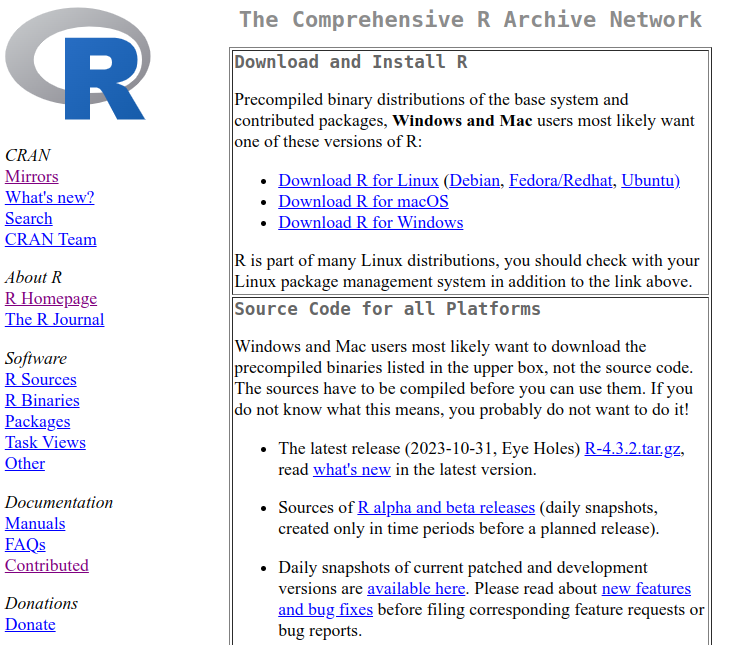
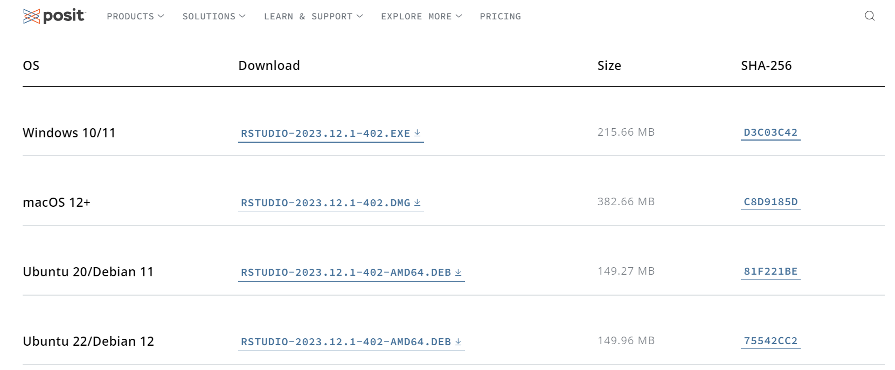
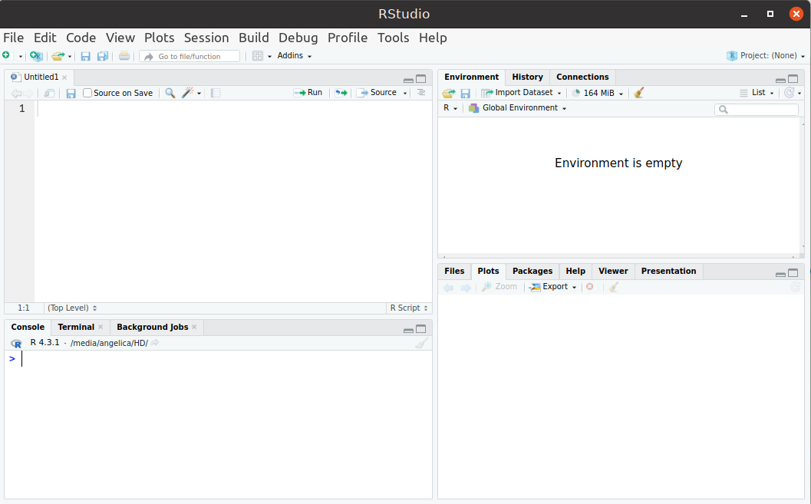
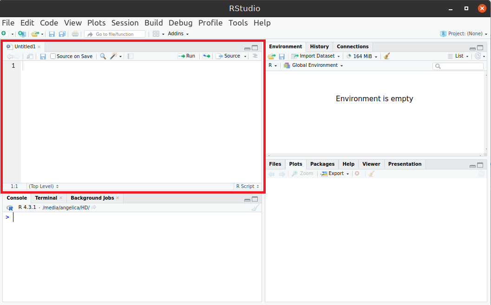
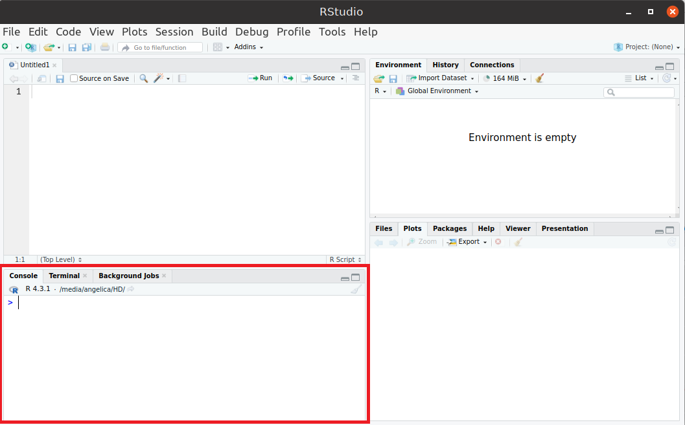
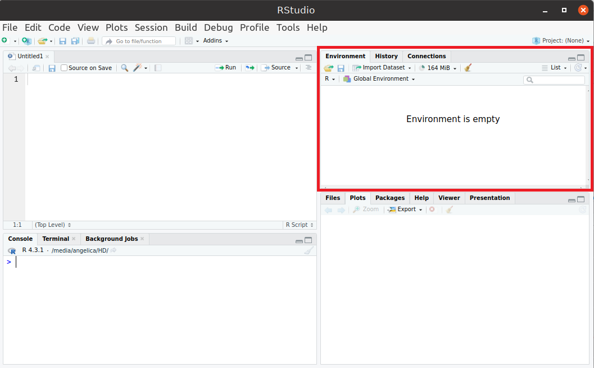
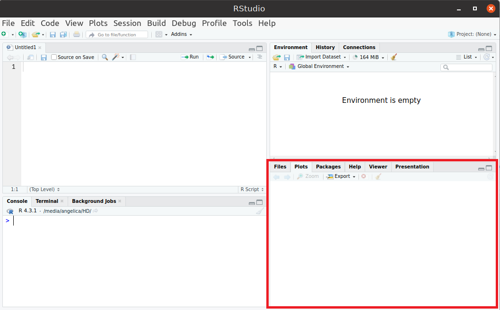
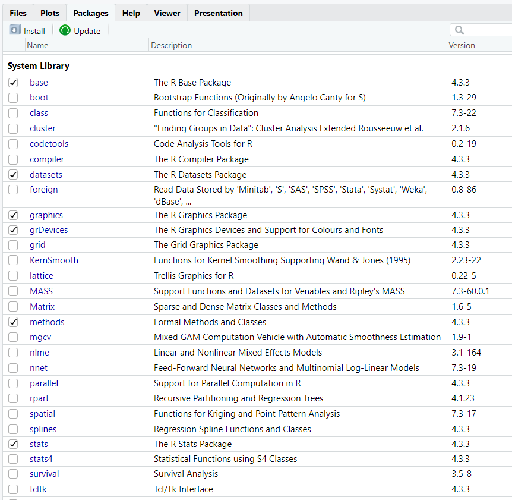

--- 
title: "Introdução ao R e RMarkdown"
author: "Profª. Angélica Maria T. Ribeiro"
date: "2025-01-05"
output:
  pdf_document: default
  html_document:
    df_print: paged
documentclass: book
bibliography: book.bib
link-citations: yes
github-repo: "rstudio/bookdown-demo"
site: bookdown::bookdown_site
---


# Introdução 

## Sobre o R e RStudio
O R é uma poderosa linguagem de programação e um software voltado para análises estatísticas de dados. É de código aberto, sendo gratuito e de livre distribuição, e amplamente utilizado por pesquisadores, professores e estudantes. Disponível para diferentes sistemas operacionais, conta com inumeros pacotes que disponibilizam funções e dados estatisticos que podem ser utilizados e manipulados. Junto ao R o RStudio é utilizado como ambiente de desenvolvimento integrado, permitindo uma abordagem mais flexível na utilização da linguagem R.

## Referências/Fontes de ajuda

#### Livros {-}
- [Livro: R Cookbook](https://rc2e.com/) [@Teetor2011]
- [Livro: R for Data Science](https://r4ds.had.co.nz/) [@Wickham2017]
- [Livro: The Book of R: A First Course in Programming and Statistics](https://web.itu.edu.tr/~tokerem/The_Book_of_R.pdf) [@Davies2016]
- [Livro: Hands-On Programming with R: Write Your Own Functions and Simulations](https://rstudio-education.github.io/hopr/) [@Grolemund2015]
- [Livro: Learning R: A Step-by-Step Function Guide to Data Analysis](https://duhi23.github.io/Analisis-de-datos/Cotton.pdf) [@Cotton2013]

#### Materiais em português {-}
- [Estatística Computacional com R (LEG/UFPR)](http://cursos.leg.ufpr.br/ecr/)
- [Ciência de Dados em R](https://livro.curso-r.com/index.html)
- [Introdução ao Software R](https://www.est.ufmg.br/~marcosop/est008/aulas/Intro_R.pdf)
- [Introdução ao R](https://www.lampada.uerj.br/arquivosdb/_book2/introducao.html#o-que-%C3%A9-o-r)
- [Introdução ao R: Curso Básico de Linguagem R](https://bookdown.org/wevsena/curso_r_tce/curso_r_tce.html#o-que-e-r)
- [Introdução ao R (Vinícius A., Tania M. e Davi W.)](https://nedurcode.com/r/Intro-R.html#4_Passos_iniciais)
<br>

#### Páginas de ajuda {-}
- [StackOverflow](https://stackoverflow.com/)
- [R-bloggers](https://www.r-bloggers.com/)

Outros materiais podem ser encontrados em: [R Contributed Documentation](https://cran.r-project.org/other-docs.html).


## Instalação do R

Disponivel para Windows, macOS e Linux a instalação do R é simples basta seguir o seguinte passo-a-passo. 

- Visitar o site do R: [https://cran.r-project.org/](https://cran.r-project.org/)
- Clicar no link referente ao sistema operacional correspondente
- Fazer a instalação de acordo com as instruções 

<div style="display: flex; justify-content: center; align-items: center;">

</div>


## Instalação do RStudio

<!--  -->
Após a instalação do R seguir o seguinte passo-a-passo para a instalação do Rstudio.

- Visitar a [página do RStudio](https://posit.co/download/rstudio-desktop/).
- Fazer o download do arquivo referente ao sistema operacional correspondente.
- Fazer a instalação de acordo com as instruções. 

<div style="display: flex; justify-content: center; align-items: center;">

</div>

<!-- Pacotes, manual e demonstrações -->

## Estrutura básica 

<!-- interface, personalização, etc -->
Após a instalação do Rstudio é necessário se familiarizar com o ambiente que ele apresenta. Inicianmente o Rstudio é dividido em quatro janelas.

<div style="display: flex; justify-content: center; align-items: center;">

</div>

A janela no canto superior esquerdo são onde se encontram os arquivos, scripts e documentos que estão sendo utilizados.

<div style="display: flex; justify-content: center; align-items: center;">

</div>

A janela inferior esquerda é a janela de comandos, chamada **Console**,  talvez a janela que mais será utilizada pelo usuário. Nesta janela é possível executar operações básicas de aritmetica, executar funções e comandos, definir variáveis, executar scripts entre outras possibilidades. 

<div style="display: flex; justify-content: center; align-items: center;">

</div>

A janela superior direta é utilizada principalmente para visualizar as variáveis, na aba **Environment**, que já forma definidas e estão sendo utilizadas no momento. É possível visualizar também o histórico de comandos que foram executados na aba **History**.

<div style="display: flex; justify-content: center; align-items: center;">

</div>

Por último, a janela inferior esquerda possui varias abas importantes. Na aba **Files** é possível visualizar o seu diretorio de trabalho que são os arquivos que ficam slavos no seu computador e podem ser acessados no Rstudio. A aba **Plots** disponibiliza os gráficos e plotagens que foram feitos durante a execução do programa. Na aba **Packages** é possivel visualizar todos os pacotes disponiveis no Rstudios. Caso precise de ajuda para entender um comando, função ou pacote específico a aba **Help** pode ser usada, nesta aba será disponibilizado informações sobre a função, comando ou pacote desejado.

<div style="display: flex; justify-content: center; align-items: center;">

</div>

Para utilizar alguns comandos em R talves seja necessario instalar um pacote específico. A aba **Packages** apresenta uma lista de todos os pacotes disponiveis junto com uma frase resumindo sua utilidade. 

<div style="display: flex; justify-content: center; align-items: center;">

</div>

Para instalar um pacote é necessário utilizar o comando ``library(nome do pacote)`` na janela de comando. Caso queira mais informações sobre um pacote utilize o comando ``help("nome do pacote")`` e ?nome  e mais informações irão aparecer na aba **Help**.


## Introdução à linguagem R

<!-- R como calculadora. Operadores básicos (soma, sub, multi, log, etc). -->
<!-- Operadores lógicos. -->

Para executar operações aritméticas básicas basta utilizar os operadores: (+) soma, (-) subtração, (*) multiplicação, (/) divisão e (%%) resto da divisão. Isso permite que o R se comporte como uma calculadora, por exemplo a expressão a seguir  


``` r
3*9+4/2-58%%4
```

```
## [1] 27
```
irá resultar no valor 27.

Também é possível realizar operações lógicas utilizando os operadores: (==) igualdade, (!=) diferença, (>) menor, (<) maior, (>=) menor igual, (<=) maior igual. O resultado dessa operação é valor booleano TRUE ou FALSE. Por exemplo a comparação

```
a <- 3*9+4/2-58%%4
a%%3 == 0 

```
resulta em TRUE pois o resto da divisão de 27 por 3 é zero. 

Perceba que no exemplo o valor da expressão foi armazenado na variável ``a``, e essa variável foi usada para realizar a operação de comparação. Em R é possível utilizar o operador ``<-`` para armazenar um valor em uma variável e utilizar essas variáveis para realizar operações durante a execução dos códigos. 

```
a <- 3
b <- 2

c <- a-b

```
A variável ``c`` irá receber o valor de ``a-b = 1``, caso ``a`` ou ``b`` sejam alterados o valor de ``c`` também se altera. 


<!-- **** Capítulo 2 -->
# Estruturas de Dados

## Vetores 
## Matrizes e data frames
## Operações com vetores e matrizes
## Listas 

<!-- **** Capítulo 3 -->
# Importação e Manipulação de dados 


<!-- <!-- **** Capítulo 4 (opcional??? )-->  
<!-- # Funções e Estruturas de controle -->
<!-- ## Construção de funções -->
<!-- ## Loops e condições -->
<!-- <!-- if, else, for, while. --> 
<!-- ## Funções apply, lapply, etc -->


# References {-}


<!-- Para compilar o livro em pdf, fazer no console do R: -->
<!-- bookdown::render_book('index.Rmd', 'bookdown::pdf_book') -->
<!-- ou em html: -->
<!-- bookdown::render_book('index.Rmd', 'bookdown::html_book') -->
<!-- Obs: estava dando erro, pois eu estava colocando uma frase comentada antes de introdução -->
