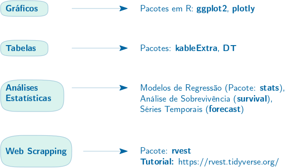
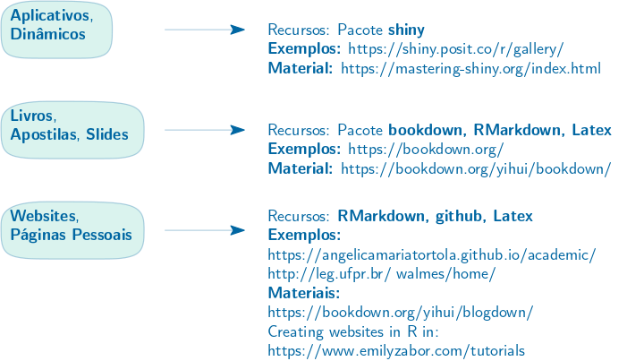
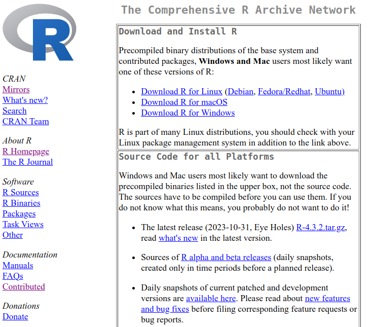
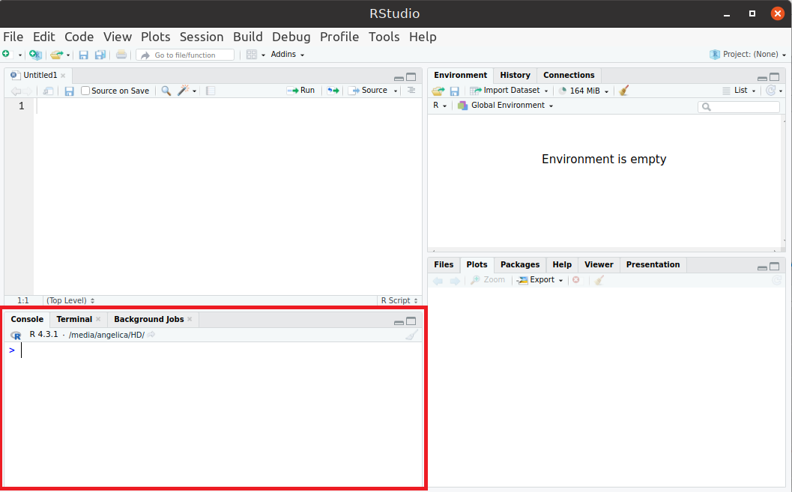
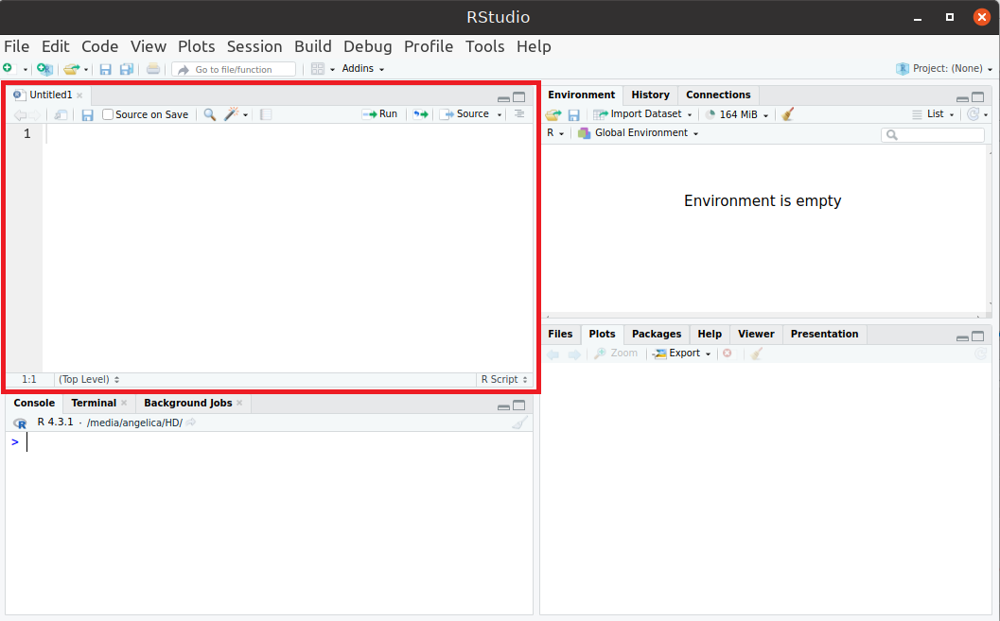
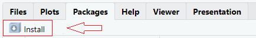

---
output:
  pdf_document: default
  html_document: default
---
# Conceitos Básicos

## Sobre o R e RStudio

- O R é uma linguagem de programação para análises estatísticas de dados
- É de código aberto, sendo gratuito e de livre distribuição;
- Amplamente utilizado por pesquisadores, professores e estudantes
- Disponível para diferentes sistemas operacionais;
- Conta com inumeros pacotes que disponibilizam funções e dados estatisticos
- Junto ao R, o RStudio é utilizado como ambiente de desenvolvimento integrado


### Algumas aplicações de R: {-}

<!-- # ```{r fig1, echo=FALSE, out.width="70%", fig.align="center"} -->
<!-- #  -->
<!-- # ``` -->
<!-- #  -->
<!-- # ```{r fig2, echo=FALSE, out.width="70%", fig.align="center"} -->
<!-- #  -->
<!-- # ``` -->

- Construção de Livros:
  - [Livro: R Cookbook](https://rc2e.com/)
  - [Livro: Mastering Shiny](https://mastering-shiny.org/)
  - [Galeria do Bookdown](https://bookdown.org/)
  
- Sites/páginas pessoais:
  - [Minha Página Pessoal](https://angelicamariatortola.github.io/academic/index.html)
  - [Galeria do Blogdown](https://pkgs.rstudio.com/blogdown/articles/examples.html)
  
- Aplicativos dinâmicos:
  - [Aplicativos LEG (UFPR)](http://shiny.leg.ufpr.br/)
  - [Projeto de Extensão: EducaShiny](https://educashiny.shinyapps.io/Plataforma/)
  - [Galeria do Shiny](https://shiny.posit.co/r/gallery/)


### Referências/Fontes de ajuda {-}

#### Livros {.unnumbered}

-   [R Cookbook](https://rc2e.com/) 
-   [R for Data Science](https://r4ds.had.co.nz/)
-   [The Book of R: A First Course in Programming and Statistics](https://web.itu.edu.tr/~tokerem/The_Book_of_R.pdf) 
-   [Hands-On Programming with R: Write Your Own Functions and Simulations](https://rstudio-education.github.io/hopr/)
-   [Learning R: A Step-by-Step Function Guide to Data Analysis](https://duhi23.github.io/Analisis-de-datos/Cotton.pdf)

#### Materiais em português {.unnumbered}

-   [Estatística Computacional com R (LEG/UFPR)](http://cursos.leg.ufpr.br/ecr/)
-   [Ciência de Dados em R](https://livro.curso-r.com/index.html)
-   [Introdução ao Software R](https://www.est.ufmg.br/~marcosop/est008/aulas/Intro_R.pdf)
-   [Introdução ao R](https://www.lampada.uerj.br/arquivosdb/_book2/introducao.html#o-que-%C3%A9-o-r)
-   [Introdução ao R: Curso Básico de Linguagem R](https://bookdown.org/wevsena/curso_r_tce/curso_r_tce.html#o-que-e-r)
-   [Introdução ao R (Vinícius A., Tania M. e Davi W.)](https://nedurcode.com/r/Intro-R.html#4_Passos_iniciais) <br>

#### Páginas de ajuda {.unnumbered}

-   [StackOverflow](https://stackoverflow.com/)
-   [R-bloggers](https://www.r-bloggers.com/)


---

## Instalação do R e do RStudio

Disponivel para Windows, macOS e Linux a instalação do **R** é simples basta seguir o passo-a-passo:

-   Visitar o site do **R**: <https://cran.r-project.org/>
-   Clicar no link referente ao sistema operacional correspondente
-   Fazer a instalação de acordo com as instruções

```{r fig3, echo=FALSE, out.width="60%", fig.align="center"}

```


Após a instalação do **R** seguir o passo-a-passo para a instalação do **Rstudio**:

-   Visitar a [página do RStudio](https://posit.co/download/rstudio-desktop/)
-   Fazer o download do arquivo referente ao sistema operacional correspondente
-   Fazer a instalação de acordo com as instruções

```{r fig4, echo=FALSE, out.width="50%", fig.align="center"}

```


<!-- ## Falar um pouco da página do cran : manuais, etc -->

<!-- Pacotes, manual e demonstrações -->

---

## Estrutura do RStudio 

<!-- interface, personalização, etc -->
O Rstudio é dividido em quatro janelas principais:

**1. Console** (Janela Inferior Esquerda): 

- Permite executar comandos R diretamente.
- Exibe resultados e mensagens (saídas de funções, erros, avisos).

```{r fig5, echo=FALSE, out.width="70%", fig.align="center"}

```

Dicas:

- Para rodar um código, digite e pressione **Enter**.
- Use as setas ↑ e ↓ para acessar comandos anteriores.
- O atalho **Ctrl + L** (Windows/Linux) ou **Cmd + L** (Mac) limpa o console.

**Exemplo** Digite os códigos abaixo no *Console*. Use as setas ↑ e ↓ para acessar comandos anteriores. Limpe o console.

```{r ex1, eval=FALSE}
x <- 3 # pressione Enter
y <- 2 # pressione Enter
print(x) # pressione Enter
print(y) # pressione Enter
```

**2. Editor de Scripts** (Janela Superior Esquerda): 

- Editor de arquivos R (.R), RMarkdown (.Rmd), Shiny Apps, entre outros. 
- Permite escrever e salvar códigos para execução posterior.

```{r fig6, echo=FALSE, out.width="70%", fig.align="center"}

```

Dicas:

- **Ctrl + Enter** → Executa a linha atual.
- **Ctrl + Shift + Enter** ou **Ctrl + A** e **Ctrl + Enter** → Executa o script inteiro.
- **Ctrl + S** → Salva o arquivo.
- Para criar um novo script: **File → New File → R Script**.

**Exemplo** Digite os códigos abaixo no *Editor de Scripts*. Utilize **Ctrl + Enter** para compilar cada linha separadamente. Utilize **Ctrl + Shift + Enter** (ou **Ctrl + A** e **Ctrl + Enter**) para compilar todo o script. Salve o arquivo em algum repositório.

```{r ex2, eval=FALSE}
a <- -1
b <- 5 
a 
b
```

**3. Ambiente e Histórico** (Janela Superior Direita):

- **Environment:** Mostra objetos carregados na sessão (data frames, variáveis, funções).
- **History:** Lista de comandos executados no console.
- **Connections:** Permite conectar-se a bancos de dados.

```{r fig7, echo=FALSE, out.width="70%", fig.align="center"}
knitr::include_graphics("figs/ambiente.png")
```

Dicas:

- Use `ls()` no console para listar os objetos carregados.
- Para limpar o ambiente:  `rm(list = ls())`

**Exemplo** Consulte as abas *Ambiente e Histórico*. Visualize as variáveis criadas e funções utilizadas. Utilize `rm(list = ls())` para limpar o ambiente.


**4. Janela de Arquivos, Plots, Pacotes e Ajuda** (Janela Inferior Direita): 

- **Files:** Gerenciador de arquivos do diretório de trabalho.
- **Plots:** Exibe gráficos gerados pelo R.
- **Packages:** Lista pacotes instalados e permite carregar ou instalar novos.
- **Help:** Ajuda e documentação de funções do R.
- **Viewer:** Exibe documentos HTML, visualizações interativas (como Shiny).
- **Presentation:** Permite criar apresentações de slides (RMarkdown).


```{r fig8, echo=FALSE, out.width="70%", fig.align="center"}
knitr::include_graphics("figs/arquivos.png")
```

Dicas:

- Instalar um pacote: `install.packages("nome_do_pacote")` ou clicar no botão `Install` na aba *Packages*.
- Carregar um pacote: `library("nome_do_pacote")` ou "marcar" o pacote na aba *Packages*.
- Visualizar ajuda de uma função (ou pacote): `?nome_da_função` ou `help(nome_da_função)`.
- Listar pacotes carregados: `search()`

```{r fig10, echo=FALSE, out.width="50%", fig.align="center"}

```

```{r fig11, echo=FALSE, out.width="60%", fig.align="center"}
knitr::include_graphics("figs/install2.png")
```

**Exemplo**

- Copie e cole o código `plot(1:10)`. Visualize o resultado na aba *Plots*. Exporte o gráfico.
- Instale e carregue o pacote `ggplot2`. Encontre a documentação do pacote no cran do R.
- Consulte na aba *help* a documentação da função `mean()`. Qual argumento permite ignorar valores `NA` nos cálculos de média?


### 1.3 Exercícios da Sessão {-}

**1.** No **Console**, execute os seguintes comandos e observe os resultados:
```{r ex3, eval=FALSE}
x <- 10
y <- 5
soma <- x + y
soma
```
Qual foi o valor impresso no console? Use o comando `ls()` no console, o que ele faz?
<!-- Objetivo: Aprender a rodar comandos e visualizar resultados no console. -->

**2.** No **Editor de Scripts**, crie um novo arquivo R: `File → New File → R Script`. Copie e cole o seguinte código no script:
```{r ex4, eval=FALSE}
# Criando um vetor
numeros <- c(1, 2, 3, 4, 5)
# Calculando a média
media <- mean(numeros)
# Mostrando o resultado
print(media)
```

- Salve o script como meuscript.R
- Execute o script inteiro usando **Ctrl + A** e **Ctrl + Enter**.
- O que foi impresso no console?

<!-- Objetivo: Praticar a criação e execução de scripts no RStudio. -->

**3.** No **Editor de Scripts** cole este código e execute:
```{r ex5, eval=FALSE}
x <- seq(-10, 10, 0.1)
y <- sin(x)
plot(x, y, type = "l", col = "blue", main = "Gráfico de Seno")
```

- Vá até a aba Plots e veja o gráfico gerado.
- Clique em `Export` para salvar o gráfico.

<!-- Objetivo: Gerar gráficos e explorar a aba de Plots. -->

**4.** Na aba *Packages*, instale e carregue o pacote de manipulação de dados `dplyr`. Encontre a documentação do pacote no *Cran* do R.

**5.** No *Console* do RStudio, consulte a documentação das seguintes funções:
```{r ex6, eval=FALSE}
?mean
?sd
?sum
?seq
?sample
```

- Descreva resumidamente o que faz cada função.
- Anote os principais **argumentos** de cada função.

---

## Operações Básicas em R


<!-- R como calculadora. Operadores básicos (soma, sub, multi, log, etc). -->
  
<!-- Operadores lógicos. -->

### Operações Aritméticas 
  
R funciona como uma calculadora, permitindo operações básicas com números e variáveis.

**Exemplo**

```{r, eval=FALSE}
# Soma
2 + 3  
# Subtração
10 - 4  
# Multiplicação
5 * 2  
# Divisão
9 / 3  
# Exponenciação
2^3  
# Raiz quadrada
sqrt(16)
# Resto da divisão 
10 %% 3 
# Parte inteira da divisão
10 %/% 3  
```

<!-- Para estilizar caixas de texto: -->
<div style="background-color: #e6f2ff; border: 1px solid #007acc; padding: 10px; border-radius: 10px;">
##### Ordem de Prioridade dos Operadores Aritméticos {-}

- Parênteses `()` – maior prioridade
- Exponenciação `^`
- Multiplicação e Divisão `*`, `/`
- Soma e Subtração `+`, `-`
</div>


**Exemplo**
```{r ex7.1, eval=FALSE}
2 + 3 * 4    
(2 + 3) * 4  
2 * 5 ^ 2    
(2 * 5) ^ 2  
5 * 3 / 2    
5 + 3 - 2    
```

### Criando Variáveis (objetos) 


Para criar uma variável ou objeto, usamos o simbolo de atribuição `<-`

```{r ex8.3, eval=FALSE}
## Atribuindo um número a um objeto:
x <- 5; y <- 3  
``` 

Operações entre objetos numéricos:

```{r, eval=FALSE}
x+y # soma
x-y # subtração
x*y # produto
x/y # quociente
``` 


<div style="background-color: #e6f2ff; border: 1px solid #007acc; padding: 10px; border-radius: 5px;">
<details>
  <summary><strong> Restrições nos nomes das variáveis (objetos) </strong></summary>
  
**1. Começo do Nome:** Não pode começar com número ou caracteres especiais. Deve começar com uma letra (A-Z ou a-z).
    
```{r ex8.6, eval=FALSE}
nome_valido <- 5  # Correto
1nome_invalido <- 15  # Erro: nome não pode começar com número
@nome_invalido <- 15  # Erro: nome não pode começar com caracteres especiais
```

**2. Espaços e Caracteres:** O nome não deve conter espaços nem caracteres especiais como @, #, -, $, etc. O underline (_) é um caractere permitido no meio do nome.
```{r ex12, eval=FALSE}
variavel_valida_1 <- 20  # Correto
variavel#invalida <- 40  # Erro: caractere inválido (#)
variavel@invalida <- 40  # Erro: caractere inválido (@)
```

**3. Diferenciação de Maiúsculas e Minúsculas:** O R diferencia maiúsculas de minúsculas. Assim, `var`, `Var` e `VAR` são considerados nomes diferentes.
```{r ex13, eval=FALSE}
var <- 100
Var <- 200
print(var)  # 100
print(Var)  # 200
```

**4. Palavras Reservadas:** Não é permitido usar palavras reservadas do R (como `if`, `else`, `for`, `TRUE`, `FALSE`, etc.). Essas palavras têm significados específicos e não podem ser sobrescritas.
```{r ex14, eval=FALSE}
for <- 10  # Erro: 'for' é uma palavra reservada
if <- 20   # Erro: 'if' é uma palavra reservada
```

**5. Pontos e Nomes de funções preexistentes:** Não é recomendado utilizar pontos. Também evitar usar nomes que conflitem com funções **preexistentes** do R.
```{r ex15, eval=FALSE}
## Evitar
nome.com.ponto <- 100  # Correto, mas pode ser confuso
mean <- 2
mean(mean)
```
</div>
</p>
</details>


<div style="background-color: #e6f2ff; border: 1px solid #007acc; padding: 10px; border-radius: 5px;">
<details open>
  <summary><strong> Dicas para os nomes das variáveis (objetos) </strong></summary>

- A convenção em R é usar underline (_) para nomes de objetos (exceto no inicio).
- Evitar nomes ambíguos e usar nomes descritivos que deixem claro o que o objeto representa.
<!-- - Nomear funções com verbos para indicar ação, como `calcular_media`, `plotar_grafico`, etc. -->

```{r ex16, eval=FALSE}
## Exemplos de Nomes Válidos
x_1 <- 5
minha_variavel <- 10
temperatura_curitiba <- 20
altura_estudantes <- 160
```
</div>
</p>
</details>


#### Exercícios {-}

**1.** Realize as seguintes operações no R:

a. Soma de 45 e 23.
b. Subtração de 78 por 35.
c. Multiplicação de 12 e 9.
d. Divisão de 100 por 4.
e. Calcule 5 elevado à potência 3.
f. Calcule a raiz quadrada de 64.

**2.** Atribua os valores 10 e 5 a duas variáveis chamadas `a` e `b`, respectivamente. Em seguida, calcule:

a. A soma de `a` e `b`.
b. O produto de `a` e `b`.
c. A diferença entre `a` e `b`.
d. O quociente de `a` dividido por `b`.

**3.** Algumas regras devem ser seguidas ao nomear variáveis em R. Analise os seguintes nomes e indique quais são válidos e quais causarão erro. Justifique a sua resposta.

```{r ex16.1, eval=FALSE}
1numero <- 100
meu_numero <- 25
data <- "2025-03-15"
for <- "teste"
x@y <- 50 
x_y <- 5
```

<div id="protectedContent1" style="display:none;">

### Respostas {-}

**3.**
```{r ex16.2, eval=FALSE}
1numero <- 100   # Inválido: não pode começar com número
meu_numero <- 25 # Válido
data <- "2025-03-15" #  Válido, mas desaconselhado (conflito com função data())
for <- "teste"  # Inválido: "for" é palavra reservada
x@y <- 50  # Inválido:  caractere inválido (@)
x_y <- 5  # Válido
```

</div>

<input type="password" id="passwordInput1" placeholder="Digite a senha">
<button id="submitButton1">Acesso Professor</button>


```{r, results='asis', echo=FALSE}
cat('<script>

document.getElementById("submitButton1").addEventListener("click", function() 
{
  var password = document.getElementById("passwordInput1").value;
  var correctPassword = "0987";
  
  if (password === correctPassword) 
  {
    document.getElementById("protectedContent1").style.display = "block";
  }else 
  {
    alert("Senha incorreta! Tente novamente.");
  }
});
</script>')
```


### Operações Lógicas e Comparações 

Os operadores lógicos em R são usados para avaliar expressões booleanas (VERDADEIRO ou FALSO) e criar condições. Eles operam em vetores, valores lógicos (`TRUE`, `FALSE`) e numéricos e são muito usados em estruturas condicionais e filtros de dados.


#### 1. Operadores de Comparação  {-}

Estes operadores retornam `TRUE` ou `FALSE`, dependendo do resultado da comparação.  

| Operador | Descrição      | Exemplo     | Resultado |
|----------|----------------|-------------|-----------|
| `==`     |  Igualdade     |  `10 == 10` | `TRUE`    |
| `!=`     |  Diferente     |  `10 != 5`  | `TRUE`    |
| `>`      | Maior que      |  `10 > 5`   | `TRUE`    |
| `<`      | Menor que      |  `10 < 5`   | `FALSE`   |
| `>=`     | Maior ou igual |  `10 >= 10` | `TRUE`    |
| `<=`     | Menor ou igual |  `10 <= 5`  | `FALSE`   |

**Obs.:** Para consultar o *help* destas funções usar `?Comparison` ou `help("operador")`, para algum operador específico.


#### 2. Operadores Lógicos  {-}

| Operador | Descrição       | Exemplo         | Resultado |
|----------|-----------------|-----------------|---------|
| `!`      | Negação lógica  | `!TRUE`         | `FALSE`   |
| `&`      | E lógico        |`(TRUE & FALSE)` | `FALSE`   |
| `|`      | OU lógico       |`(TRUE | FALSE)` | `TRUE`    |
| `&&`     | E lógico        |`(TRUE && FALSE)`| `FALSE`   |
| `||`     | OU lógico       |`(TRUE || FALSE)`| `TRUE`    |

**Obs.:** Para consultar o *help* destas funções usar `?Logic` ou `help("operador")`, para algum operador específico.

<!-- Para estilizar caixas de texto: -->
<div style="background-color: #e6f2ff; border: 1px solid #007acc; padding: 10px; border-radius: 10px;">
##### Diferença entre `&` e `&&`, `|` e `||` {-}

- As formas mais curtas (`&` e `|`) realizam comparações elemento a elemento. 
- As formas mais longas (`&&` e `||`) avaliam da esquerda para a direita, prosseguindo apenas até que o resultado seja determinado (em geral, mais eficiente computacionalmente).
</div>


**Exemplos**
```r
## Operadores de Comparação
5 > 3
5 != 3
## Operadores Lógicos
TRUE & TRUE   # ambos são verdadeiros? Sim -> TRUE, Não -> FALSE
TRUE | FALSE  # pelo menos um deles é verdadeiro? Sim -> TRUE, Não -> FALSE
## Operadores de Comparação e Lógicos
(5>3) & (4>6) # FALSE
(2<3) | (4<6) # TRUE
```

<!-- ## Comparando & e && -->
<!-- print(1) & print(2) & FALSE & print(3) & print(4) # printa todos os elementos -->
<!-- print(1) && print(2) && FALSE && print(3) && print(4) # para a execução quando encontra o FALSE -->


#### Exercícios {-}

**1.** Considere os seguintes números: `a <- 7`, `b <- 3`. No R, verifique as condições:

- Se `a` é maior que `b`
- Se `a` é divisível por 2
- Se `a` é maior que `b` E (lógico) se `a` é divisível por 2, usando o operador lógico `&&`

**2.** Identifique, primeiramente **sem o uso do R**, o que retornará as relações a seguir (`TRUE` ou `FALSE`). Na sequência, confira os resultados usando o R.

- 10 > 5  
- 5 == 5  
- 5 != 3 
- (3 + 2) >= 5
- 10 / 2 < 6  
- (4 > 2) & (10 <= 20) 
- (7 < 3) | (8 == 8) 
- !TRUE 
- !(5 > 3)  


<div id="protectedContent2" style="display:none;">

### Respostas {-}
**1.**
```r
a <- 7
b <- 3
- a>b
- (a%%2==0)
- a>b && (a%%2==0)
```

**2.**
```{r}
10 > 5  
5 == 5  
5 != 3 
(3 + 2) >= 5
10 / 2 < 6  
(4 > 2) & (10 <= 20) 
(7 < 3) | (8 == 8) 
!TRUE 
!(5 > 3)  
```

</div>

<input type="password" id="passwordInput2" placeholder="Digite a senha">
<button id="submitButton2">Acesso Professor</button>


```{r, results='asis', echo=FALSE}
cat('<script>

document.getElementById("submitButton2").addEventListener("click", function() 
{
  var password = document.getElementById("passwordInput2").value;
  var correctPassword = "0987";
  
  if (password === correctPassword) 
  {
    document.getElementById("protectedContent2").style.display = "block";
  }else 
  {
    alert("Senha incorreta! Tente novamente.");
  }
});
</script>')
```

### 1.4 Exercícios da Sessão {-}

**1.** Resolva as expressões abaixo (primeiramente sem o R) e explique o resultado com base na ordem de prioridade dos operadores. Na sequência, confira os resultados usando o R.
```r
# a)
resultado1 <- 5 + 3 * 2
# b) 
resultado2 <- (5 + 3) * 2
# c) 
resultado3 <- 10 / 2 + 3
# d) 
resultado4 <- 10 / (2 + 3)
# e) 
resultado5 <- 4^2 / 2
```

**2.** Dados os valores:
```{r}
x <- 15; y <- 10; z <- 20
```

Quais das relações a seguir serão `TRUE` e quais serão `FALSE`:
```r
# a)
x > y & y < z  
# b) 
x == 15 | y > z  
# c) 
!(x < z)  
# d) 
(x >= y) & (y != 10)  
# e) 
(x < y) | (z > x)  
```


<div id="protectedContent3" style="display:none;">
  
### Respostas {-}
**1.**
```{r}
# a)
(resultado1 <- 5 + 3 * 2)
# b) 
(resultado2 <- (5 + 3) * 2)
# c) 
(resultado3 <- 10 / 2 + 3)
# d) 
(resultado4 <- 10 / (2 + 3))
# e) 
(resultado5 <- 4^2 / 2)
```

**2.**
```{r}
x <- 15
y <- 10
z <- 20
# a)
x > y & y < z  
# b) 
x == 15 | y > z  
# c) 
!(x < z)  
# d) 
(x >= y) & (y != 10)  
# e) 
(x < y) | (z > x)  
```

</div>
  <input type="password" id="passwordInput3" placeholder="Digite a senha">
  <button id="submitButton3">Acesso Professor</button>
  
```{r, results='asis', echo=FALSE}
cat('<script>

document.getElementById("submitButton3").addEventListener("click", function() 
{
  var password = document.getElementById("passwordInput3").value;
  var correctPassword = "0987";
  
  if (password === correctPassword) 
  {
    document.getElementById("protectedContent3").style.display = "block";
  }else 
  {
    alert("Senha incorreta! Tente novamente.");
  }
});
</script>')
```